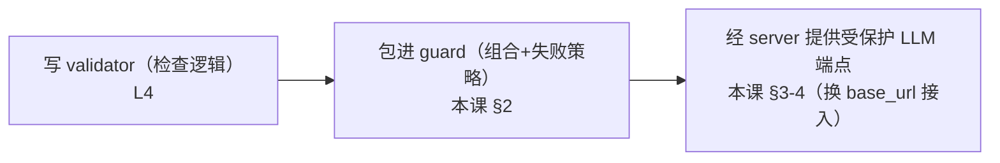

# L5 · 把幻觉 Validator 包进 Guard 上线拦截（裸用 vs Guard 的取舍）

> 课程：Safe and reliable AI via guardrails（DeepLearning.AI × GuardrailsAI）
> 本课任务：L4 造好了基于 NLI 的幻觉检测 validator（还是个裸类）；本课把它**包进 Guard、挂上 Guardrails Server、接回披萨店 chatbot**，让 L1 那个编造配方的 prompt 在真实应用链路里被当场拦截——顺带回答"什么时候裸用 validator、什么时候必须上 guard"。

## 0. 衔接与准备

L4 用 NLI 模型检查 LLM 输出是否 grounded 在可信文档里。本课 notebook 开头只做了一件事：把 L4 的 imports 和写好的 validator **原样拷贝过来**——接下来把这个 guardrail 装进 guard，先在老例子上试跑，再用它缓解 intro 课里见过的幻觉。

## 1. 取舍：裸用 Validator vs 包进 Guard

两种用法都见过了（L4 结尾直接实例化 validator 测试；L3 用过 guard），什么时候用哪个？

| 用法 | 适用场景 |
|---|---|
| **直接用 guardrail（裸 validator）** | ① 测试验证逻辑是否 work as expected（L4 结尾干的就是这个）；② 想**不隔任何抽象层**直接拿到 guardrail 的输出——都是调试用途 |
| **包进 Guard** | 生产接入，换来下面四项福利 |

Guard 的四项福利：

1. **多 guardrail 单步执行**：一个应用通常不会只要一个护栏——既要不幻觉、又要没脏话，guard 把多个 guardrail 组合在一个执行步骤里；
2. **Streaming 支持**：LLM 流式输出时，**按 chunk 实时校验**——用户拿到又快又被保护过的流式结果；
3. **OpenAI 兼容 LLM 端点**：从直连 OpenAI/LLM 换成受保护端点，**只改一行代码**；
4. **开箱即用的日志与错误处理**：每次 guard 执行都被记录，事后可分析应用整体表现。

> **架构师视角**：这四项就是"检查逻辑"到"生产组件"之间差的那层**基础设施税**——编排（多检查器合一）、延迟工程（流式分块校验，缓解同步拦截的固有延迟成本）、接入成本（协议兼容）、可观测（日志）。自己手搓 validator 很容易，容易让人低估的正是这四件事的工程量；评估护栏框架时，比"内置多少检查器"更该看的就是这层壳的质量。

> **对比 7-safety-guardrails.md / 5-observability-eval.md**：福利④是"拦截 ≠ 判好坏"分界线上一个有趣的骑墙点——guard 本职是**运行时同步拦截**，但它顺手产出的执行日志（每次 pass/fail、失败原因）恰是**离线 eval 侧**最贵的原料：真实流量上的标注数据。生产系统两侧都要，而护栏日志是两侧之间免费的桥。

## 2. 初始化 Guard 并在 toy 例子上试跑

老套路 `Guard().use(...)`，传 L4 的两个模型依赖，失败策略配成抛异常：

```python
guard = Guard().use(
    HallucinationValidation,                       # L4 写的幻觉 validator 类
    embedding_model="all-MiniLM-L6-v2",            # 与 L4 相同的默认 embedding 模型
    entailment_model="GuardrailsAI/finetuned_nli_provenance",  # GuardrailsAI 微调 NLI 模型
    sources=[...],                                  # toy 来源:太阳东升西落、太阳很热
    on_fail=OnFailAction.EXCEPTION,                 # 检出幻觉 → 抛异常
)
```

在 L4 的太阳 toy 例子上验证两个方向：

| 待验证句子 | 结果 | 原因 |
|---|---|---|
| The sun rises in the east. | **通过**，不抛错 | 与来源不矛盾，被蕴含 |
| The sun is a star. | **验证失败**："this sentence is hallucinated" | 来源只有"东升西落 + 太阳很热"——句子**是事实，但不被给定来源支持** |

第二个例子是本课最有嚼头的一幕：**factual but not grounded**——句子为真，但按 L4 的 groundedness 定义（忠于来源，而非泛泛的真假）依然判幻觉。

> **架构师视角**："太阳是恒星被拦"不是 bug，是**设计立场的代价具象化**：L4 把 neutral 判负（宁可误杀不可漏放），换来的就是"正确但超出来源"的回答也会被挡。上线前要跟业务方对齐这一刀——客服场景通常可接受（答案本就该出自知识库），开放问答场景就要重新权衡阈值或改 on_fail 策略。护栏的误杀率不是纯技术指标，是业务决策。

## 3. 挂上 Guardrails Server，换一行 base_url

本课学习环境已预先配好 guardrails server 跑这个 validator。要在**自己的** server 上用，需把刚写的 validator 加进 server 的**配置文件**（步骤见 L3）。接入方式与 L3 完全一致——把裸 client 换成 guarded client：

```python
guarded_client = OpenAI(
    base_url=".../guards/hallucination_guard/openai/v1/",
)   # 唯一变化:base_url 指向 server 上的幻觉 guard,当前只挂了这一个 guardrail
```

## 4. 全链路实测：拦下 L1 的配方幻觉

重复前几课的组装：vector database + system message + guarded 版 chatbot，然后**喂 L1 里那条曾经生成幻觉配方的同一个 prompt**：

```
ValidationError: 详细的失败信息——"如何自制披萨"的句子、制作步骤等
均为幻觉（不被 shared data 里的来源蕴含），validation failed
```

这次 LLM 的编造在到达用户之前被 output guard 当场拦截。讲师提醒：生产里不必把默认的 validation failure 消息直接给用户——**catch 这个异常**（就像课里演示的那样），换成更优雅的错误提示，并用它控制应用的逻辑流。

## 5. 沉淀下来的模式

至此走完一个可复用的三步模式，后面每类失效模式都会重演：



## 6. 本课总结

| 要点 | 一句话 |
|---|---|
| 裸用 vs Guard | 裸 validator 用于测试/调试（无抽象层直取输出）；生产必上 guard |
| Guard 四福利 | 多 guardrail 单步执行、流式分块校验、OpenAI 兼容端点一行接入、开箱日志 |
| factual ≠ grounded | "太阳是恒星"为真仍被拦——groundedness 护栏只认来源，不认世界知识 |
| 自部署要点 | 自己的 server 要把 validator 写进配置文件（做法见 L3） |
| 全链路验证 | L1 的配方幻觉 prompt 被 output guard 拦截；catch 异常做优雅降级 |

> **记忆点（引出 L6）**：幻觉这条失效模式已经从检测（L4）走到上线拦截（本课），四大失效模式解决其一。L6 转向下一类——**跑题（off-topic）**：还记得 L1 里替用户免费科普福特皮卡的披萨客服吗？下一课用**零样本分类器（BART zero-shot，同样是 NLI 的特化）**构建话题护栏，把 chatbot 摁回自己的业务话题上。

## 与我的资产映射

- 护栏层选型：`agent/skills/agent-selection/7-safety-guardrails.md`（②输出护栏卡点的完整上线形态；guard 日志横跨"拦截/判好坏"分界线）
- 观测评估层：`agent/skills/agent-selection/5-observability-eval.md`（护栏执行日志 = 在线免费产出的 eval 原料）
- 基础设施化打法对照：`agent/courses/Building Coding Agents with Tool Execution/notes/L4-用E2B沙箱在云端运行Agent代码.md`（与 L3/本课同款"换端点不换代码"接入）
- 面试包：`agent/interview/jd-senior-agent-engineer/07-safety-guardrails.md`（"裸 validator vs guard""factual but not grounded 误杀"是护栏落地题的高频考点）
- [[project_selection_matrix]]
