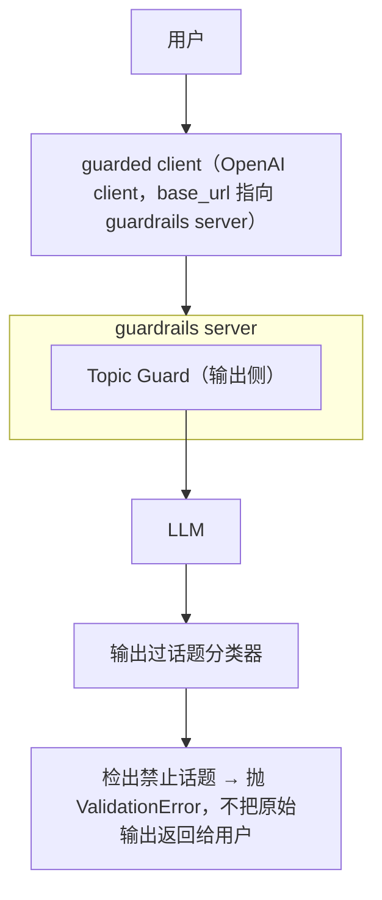

# L6 · 用零样本分类器构建话题护栏（BART zero-shot + Topic Guard）

> 课程：Safe and Reliable AI via Guardrails（DeepLearning.AI × GuardrailsAI）
> 本课任务：L5 已把幻觉护栏包进 guard 并上了 guardrails server；本课处理下一类失败模式——**跑题（off-topic）**：构建一个话题护栏，确保聊天机器人只讨论与业务相关的话题，防止用户把你的 chatbot 白嫖去干别的事。

## 0. 衔接与失败复现：披萨店 chatbot 聊起了福特皮卡

沿用前几课完全相同的组件：unguarded client + vector database + system message，搭出同一个 RAG 应用。然后诱导它跑题：

```python
# 让披萨店 chatbot 对比两款皮卡
chat("Ford F-150 和 Ford Ranger 有什么区别？")
# → 它认真输出了一份"多功能性、便利性"详尽对比清单
```

一个披萨店客服 chatbot 详细科普福特皮卡——这正是 L1 intro 里演示过的滥用场景：**每一次跑题回答都是你在替别人付推理账单，还可能带来内容风险**。

## 1. 底层模型：BART 零样本话题分类（NLI 的一种特化）

话题护栏的核心是一个 **zero-shot topic classification 模型**——Meta 的 **BART**（`facebook/bart-large-mnli`）。它的工作原理与 L4 幻觉检测用的 **NLI（Natural Language Inference）模型**非常相似，只是换了一种 NLI 的表述方式：

| NLI 要素 | L4 幻觉检测 | 本课话题分类 |
|---|---|---|
| premise（前提） | 检索到的可信文档 | **输入文本本身** |
| hypothesis（假设） | LLM 输出的句子 | "这段文本讨论了话题 X" |
| 判定 | entail → 有依据；contradict → 幻觉 | entail/contradict 的程度 → 该话题属于此文本的可能性分数 |

```python
from transformers import pipeline

classifier = pipeline("zero-shot-classification",
                      model="facebook/bart-large-mnli")

# hypothesis 模板：话题逐个填进去做 NLI 判定
# "This sentence above contains discussions of the following topics: {}"
classifier("Chick-fil-A is closed on Sundays",
           candidate_labels=["food", "business", "politics"])
```

玩具例子的输出符合直觉：**food 0.672、business 0.179、politics 0.027**——"Chick-fil-A 周日不营业"主要是食品话题，略带商业，与政治无关。这个分类器就是话题护栏的核心。

## 2. 关键对比：零样本小模型 vs 用 LLM 做分类

上护栏之前，先回答一个选型问题：分类这活儿 LLM 也能干，为什么要用专用小模型？课程用同一个句子跑了 10 次实验：

| 维度 | LLM 分类（GPT-4o-mini） | 零样本小模型（BART） |
|---|---|---|
| 一致性 | **随机**：10 次里 9 次答 food、1 次答 business | **每次结果完全相同**，可靠性可预期 |
| 细粒度分数 | 拿不到详细 likelihood 分数 | 每个话题都有分数，可调阈值 |
| 延迟 | 10 次请求约 30s，且随流量波动 | 学习环境纯 CPU 约 5 分钟，但 **M1 MacBook 几秒跑完**（生产配 GPU 更快） |
| 依赖 | 受第三方托管服务的 rate limit、uptime、条款变更约束 | 可部署在**自己的服务器/私有环境** |
| 数据 | 用户消息必须发给第三方 | **数据不出自己环境** |
| 适用阶段 | POC 阶段是不错的选项（取决于模型与推理服务） | 生产阶段的正解 |

> **架构师视角**：这张表是"护栏组件选型"的通用模板，不只适用于话题分类。护栏是**每次请求都要过的热路径**，它对确定性、延迟、成本的要求比主 LLM 调用更苛刻——用 LLM 当护栏等于给每次调用再加一次 LLM 的延迟、成本和随机性。专用小模型（NLI/分类器）在热路径上，LLM-as-judge 放在离线 eval 里，这是两条不同的赛道。

> **对比课程 21 的 eval**：课程 21 里 LLM-as-a-judge 用于**离线实验评估**（Phoenix experiments），跑得慢、带随机性都可以容忍，因为它不在请求路径上；本课的 guardrail 是**在线运行时拦截**，同一套"判定质量"的活，部署位置不同，选型结论就完全相反——这正是 5-observability-eval.md 里"offline eval vs online guardrail"分界线的实例。

## 3. 实现话题护栏：detect_topics 函数 + ConstrainTopic validator

老套路两步走。第一步，把分类器包成话题检测函数：

```python
def detect_topics(text: str, topics: list[str], threshold: float) -> list[str]:
    result = classifier(text, topics)
    # 只返回分数超过阈值的话题
    return [topic for topic, score in zip(result["labels"], result["scores"])
            if score > threshold]
```

第二步，实现 validator（与前几课同样的模式：`@register_validator` + `validate` 方法）：

```python
@register_validator(name="constrain_topic", data_type="string")
class ConstrainTopic(Validator):
    def __init__(self, banned_topics: list[str], threshold: float = 0.8, **kwargs):
        self.banned_topics = banned_topics   # 禁止话题清单
        self.threshold = threshold
        super().__init__(**kwargs)

    def validate(self, value, metadata={}) -> ValidationResult:
        detected = detect_topics(value, self.banned_topics, self.threshold)
        if detected:                          # 检出任意禁止话题 → 失败
            return FailResult(error_message=f"检测到禁止话题: {detected}")
        return PassResult()
```

用它初始化一个 guard，在一句明显政治性的语句上测试：guard 如期失败——**politics (政治) 和 automobiles(汽车) 都被检出**。

## 4. 上生产：Guardrails Hub 的 SOTA 话题分类器 + server

自己写的 validator 用于理解原理；生产用 **Guardrails Hub 上的 state-of-the-art topic classifier**（需先从 hub 下载安装到本地环境，学习环境已预装）。部署方式与 L5 完全一致：



用同一个福特皮卡 prompt 打新的 guarded RAG chatbot：输出谈到 Ford F-150（禁止话题）→ **抛出 validation error 而不是把原始输出回给用户**。和前几课一样，你不必用默认报错文案——catch 这个 exception，换成优雅的提示告诉用户"本 chatbot 不讨论这些话题"。

## 5. 本课总结

| 要点 | 一句话 |
|---|---|
| 失败模式 | RAG chatbot 被诱导跑题（披萨店聊皮卡），业务被滥用 |
| 核心模型 | BART zero-shot 分类 = NLI 特化：premise 是输入文本、hypothesis 是"文本讨论话题 X" |
| 小模型 vs LLM | 护栏热路径要确定性/低延迟/数据不出域 → 专用小模型；LLM 分类适合 POC |
| validator 模式 | detect_topics（阈值过滤）→ ConstrainTopic（禁止话题清单）→ guard 拦截 |
| 生产部署 | Hub 的 SOTA 分类器跑在 guardrails server，client 只换 base_url |

> **记忆点（引出 L7）**：话题护栏管的是"聊什么"；下一类失败模式管的是"聊天里带了什么"——**PII（个人可识别信息）的泄露与不当处理**。L7 用 Microsoft Presidio 在输入侧拦住用户的敏感信息（防止发给第三方 LLM），并在输出侧实时脱敏。

## 与我的资产映射

- 安全层选型：`agent/skills/agent-selection/7-safety-guardrails.md`（护栏组件选型：专用小模型 vs LLM-as-judge 的热路径/冷路径分界）
- 观测评估层：`agent/skills/agent-selection/5-observability-eval.md`（online guardrail 与 offline eval 的职责切分）
- 面试包：`agent/interview/jd-senior-agent-engineer/07-safety-guardrails`（话题护栏 = zero-shot NLI 的工程化实例）
- [[project_selection_matrix]]
