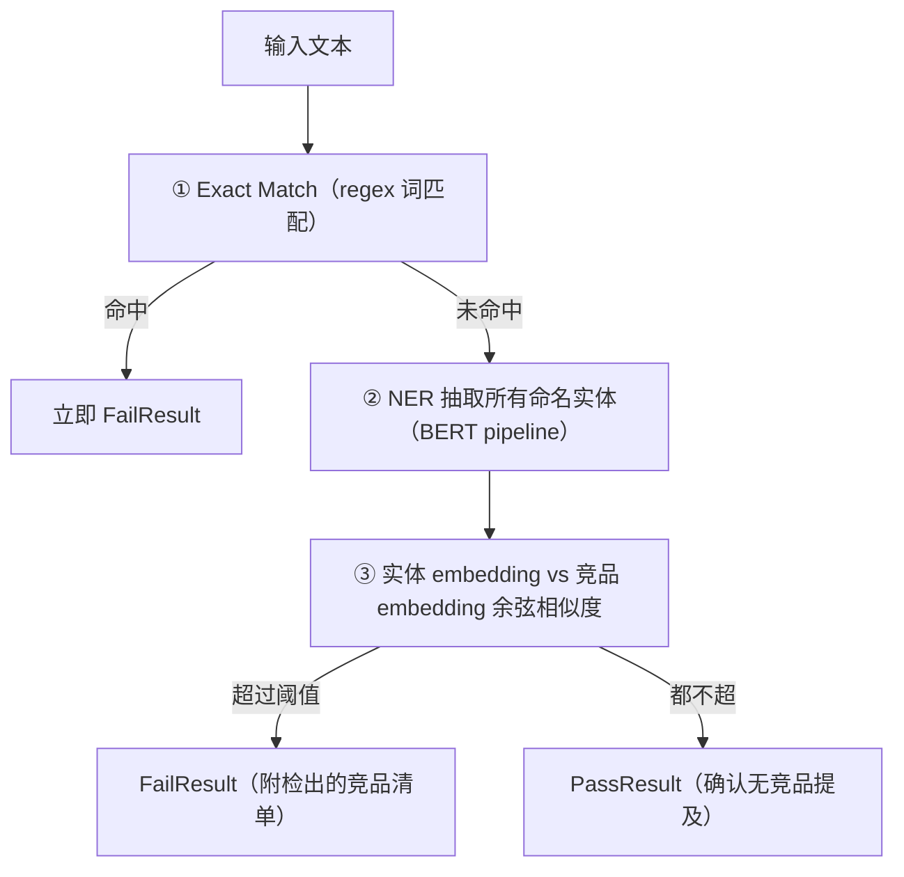

# L8 · 三级级联竞品护栏与全课收官（Exact Match → NER → 向量相似度）

> 课程：Safe and Reliable AI via Guardrails（DeepLearning.AI × GuardrailsAI）
> 本课任务：最后一类失败模式——**声誉风险**：构建一个护栏阻止 chatbot 提及任何竞争对手（customer-facing 应用的关键关切），在 Alfredo's Pizza chatbot 上配置屏蔽主要竞品 "Pizza by Alfredo"；随后并入课程 Conclusion，全课收官。

## 0. 失败复现：chatbot 亲自替你对比竞品

同一套 unguarded chatbot。扮演一个想下大额披萨订单的潜在客户：

```
"我该从 Alfredo's Pizzeria 买，还是从 Pizza by Alfredo 买？为什么？"
```

chatbot 认真给出了"选 Alfredo's Pizza Cafe 而非 Pizza by Alfredo 的几点理由"——**指名道姓地讨论竞品**。理想世界里，客服 chatbot 根本不该按名字回应任何竞争对手：你无法控制它说什么，一句失言就是公关事故，说好话则是免费带货。

## 1. 为什么简单词匹配不够：公司有 N 个名字

第一反应是做词表匹配，但**很多公司有多个常用称呼**——课程举例 JPMorgan 也被叫作 JPMC（还有 GMC 这类形近缩写的干扰）。要穷举一个竞品所有可能的叫法几乎不可能。于是采用**级联（cascading）检测**：便宜的手段先跑、贵的手段兜底：



②+③ 的直觉：`JPMC` 的 embedding 与 `JPMorgan` 非常接近——词形不同、语义同指，向量空间能补上词表穷举不了的别名。

## 2. 实现 CompetitorCheck validator（增量式搭建）

技术栈：Transformers、Sentence Transformers、sklearn（metrics）、numpy——分别用于 NER 抽取和向量相似度计算。NER 用简单的 **BERT base tokenizer + model** 搭 pipeline。

```python
@register_validator(name="competitor_check", data_type="string")
class CompetitorCheck(Validator):
    def __init__(self, competitors: list[str], **kwargs):
        self.competitors = [c.lower() for c in competitors]  # 竞品清单，统一小写
        self.ner_model = ner_pipeline                        # BERT NER pipeline
        self.embed_model = sentence_transformer              # embedding 模型
        # 预计算竞品名 embedding，避免每次 validate 重复编码
        self.competitor_embeddings = self.embed_model.encode(self.competitors)
        super().__init__(**kwargs)

    def exact_match(self, text: str) -> list[str]:
        # 级联第①级：简单 regex，看竞品词是否直接出现在文本里
        return [c for c in self.competitors if re.search(rf"\b{c}\b", text.lower())]

    def extract_entities(self, text: str) -> list[str]:
        # 级联第②级：NER 抽取命名实体
        entities = []
        for r in self.ner_model(text):
            if r["entity"].startswith(("B-", "I-")):  # B-/I- 标记实体的位置边界
                entities.append(r["word"])
        return [clean(e) for e in entities]           # 去除包围空格等杂字符

    def vector_similarity_match(self, entities, threshold=0.5) -> list[str]:
        # 级联第③级：实体 embedding 与竞品 embedding 的相似度超阈值即命中
        matches = []
        for ent in entities:
            sims = cosine_similarity(self.embed_model.encode([ent]),
                                     self.competitor_embeddings)
            if sims.max() > threshold:
                matches.append(ent)
        return matches

    def validate(self, value, metadata={}) -> ValidationResult:
        exact = self.exact_match(value)
        if exact:                       # ① 精确命中 → 直接失败
            return FailResult(error_message=f"检出竞品: {exact}")
        entities = self.extract_entities(value)          # ② NER
        matches = self.vector_similarity_match(entities) # ③ 相似度
        if matches:
            return FailResult(error_message=f"检出竞品: {matches}")
        return PassResult()             # 三级都未命中才放行
```

实现细节两则：NER 模型本身会把实体分类为 person / location / organization 等，**但这里不用它的分类**——反正后面统一做相似度匹配，类别无关紧要；竞品 embedding **预计算存成类变量**，不必每次校验重复编码。

## 3. 上生产：Hub 版 CompetitorCheck + guardrails server

照例换 SOTA：从 **Guardrails Hub 下载 competitor check validator 的 state-of-the-art 版本**，跑在 guardrails server 的 guard endpoint 上；把 vanilla OpenAI client 换成 base_url 指向 server 的 guarded client，再建一版用它的 RAG chatbot。

用开头同一个"大订单对比"prompt 打过去：**validation failed——输出中检出竞品 Pizza by Alfredo**，原始输出被拦下。和前几课一样，可以 catch 这个 exception，用更优雅的文案告诉用户"这个问题我不回应"。

> **架构师视角**：级联检测是护栏工程的经典成本结构——**regex 零成本挡住 90% 的直白提及，NER+embedding 只为剩下的别名/变体买单**。它与 L6 单模型分类、L7 单引擎检测不同：这是课程里第一个"组合多种技术"的 validator，说明护栏复杂度应该和**失败模式的对抗性**成正比——竞品名会被换着花样写，才值得上三级；禁词只会原样出现，一级 regex 就够（L3）。

> **对比 7-safety-guardrails.md 的分层防御**：选型笔记里把护栏分为"规则层（词表/regex）→ 小模型层（分类器/NER）→ LLM 层（judge）"三档，各档在延迟、召回、成本上取舍不同。本课的级联 validator 是把前两档**串联进同一个 validator 内部**的实例——分层防御不一定是多个 guard 叠加，也可以是单个 guard 内的 short-circuit 级联，后者省掉了多次 guard 调度的开销。

## 4. 全课收官

### 4.1 Conclusion 要点

- **GenAI 是一种根本上非确定性（non-deterministic）的编程范式**。RAG、chatbot、agent……要把这些应用带到生产，必须让它们达到我们对**确定性软件**习以为常的可靠性水平。
- Guardrails 是达成这一点的重要工具：既处理复杂 genAI workflow 的**平均情况（average case）**，也兜住**最坏情况（worst case）**。
- 全课的通用方法论三步：**识别问题（identify problems）→ 构建 validator 检测问题何时发生 → 采取纠正动作（corrective actions）缓解问题**。
- 始终在 LLM 调用外围使用护栏；课程覆盖的失败案例之外，野外还有多得多的失败等着你。去 **Guardrails Hub** 探索现成 validator，也考虑自建护栏回馈开源社区。

### 4.2 L1–L8 全课回顾

| 课 | 主题 | 失败模式 | 核心技术 |
|---|---|---|---|
| L0/L1 | 失败模式全景 | 披萨店 RAG chatbot 五花八门翻车：POC 易、生产难 | 用 unguarded chatbot 逐一复现 |
| L2 | 什么是 guardrails | — | 二次校验：对 LLM 调用的输入/输出做 secondary check |
| L3 | 第一个护栏 | 提及内部机密项目（禁词） | 最简 validator + guard：字符串规则匹配 |
| L4 | 幻觉检测 validator | 回答未 grounded 于可信文档 | NLI 模型（premise=文档，hypothesis=输出句） |
| L5 | guard 与 server 化 | 同 L4，工程化落地 | guard 组合多护栏/流式/OpenAI 兼容端点/日志；"factual 但不 grounded 也算幻觉" |
| L6 | 话题护栏 | 披萨店 chatbot 聊福特皮卡（跑题滥用） | BART zero-shot 分类（NLI 特化）；小模型 vs LLM 分类对比 |
| L7 | PII 护栏 | 用户/检索内容中的 PII 泄露与落库 | Presidio analyzer+anonymizer；输入侧拦截 + 输出侧流式脱敏 |
| L8 | 竞品提及护栏 | chatbot 指名道姓评价竞品（声誉风险） | 三级级联：exact match → NER → 向量相似度 |

> **架构师的裁决**：护栏部署位置与代价的决策树——**① 什么风险必须上专用护栏框架**：合规红线（PII 出域、行业监管）、对抗性输入（用户会绕着写：竞品别名、越狱变体）、以及"错一次就重伤"的声誉/安全场景——这些需要独立于 LLM 的确定性检测器（NLI/分类器/NER），因为你不能用一个会被骗的模型去看守另一个会被骗的模型。**② 什么风险 prompt + 结构化输出就够**：格式合规、字段约束、语气风格这类"LLM 自己就想做对"的非对抗性要求，schema 校验（Pydantic）+ system prompt 的边际成本近零，先用它。**③ 延迟与误杀率的取舍**：护栏在热路径上串行执行，每加一级就加一份延迟——输入侧护栏最便宜（请求还没发就拦下，如 L7），输出侧靠流式逐 chunk 验证摊薄延迟（L5/L7）；阈值调低误杀（false positive）就升，把合法用户挡在门外的成本与漏放一条坏输出的成本，必须按业务分别标价——银行把阈值拧紧、披萨店放松，没有全局最优解。

## 5. 本课总结

| 要点 | 一句话 |
|---|---|
| 失败模式 | customer-facing chatbot 指名道姓讨论竞品，声誉风险 |
| 词匹配的局限 | 公司别名无法穷举（JPMorgan/JPMC），需要语义层兜底 |
| 级联检测 | exact match 先跑（便宜、短路）→ NER 抽实体 → embedding 相似度补别名 |
| 工程细节 | NER 类别不用管；竞品 embedding 预计算缓存 |
| 生产部署 | Hub 版 CompetitorCheck 上 guardrails server，client 换 base_url 一行接入 |
| 全课方法论 | 识别问题 → validator 检测 → 纠正动作；护栏兜住非确定性范式的 average + worst case |

## 与我的资产映射

- 安全层选型：`agent/skills/agent-selection/7-safety-guardrails.md`（三层防御档位、级联 short-circuit 模式、误杀率/延迟取舍——本课回顾表可直接并入）
- 观测评估层：`agent/skills/agent-selection/5-observability-eval.md`（guard 执行日志是护栏阈值调优的数据来源）
- 面试包：`agent/interview/jd-senior-agent-engineer/07-safety-guardrails`（级联竞品检测 + "架构师的裁决"决策树是面试叙事主线）
- [[project_selection_matrix]]
