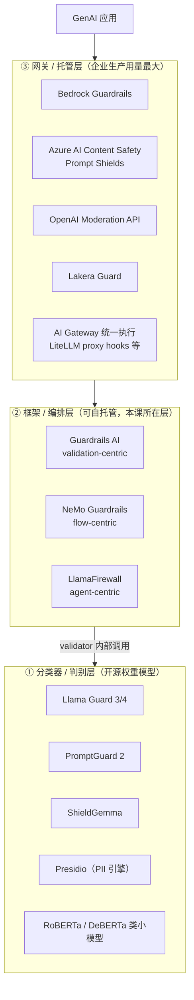

# 附录 A · 护栏生态全景（框架层 / 分类器层 / 网关层）

> 课程：Safe and Reliable AI via Guardrails（DeepLearning.AI × GuardrailsAI）
> **本篇非课程内容**：课程只讲了 Guardrails AI 一家的 validator/guard 模型。本附录把视野扩到整个运行时护栏生态，回答两个课程回避的问题——**除了 Guardrails AI 还有谁**，以及**生产环境实际在用什么**（往往不是纯框架）。
> 数据核实日期：**2026-07-10**。star 数与项目存续状态易变，引用前请重新核实。

## 0. 先纠一个流行的错误论断

网上常见的说法是"护栏赛道开源项目 star 普遍不高（3–5k），远不如 LangChain 数万级，说明纯框架只是胶水层"。**前半句的数据是错的**，后半句的结论另有更好的论据。

2026-07-10 实测（GitHub API）：

| 项目 | 仓库 | star | 协议 | 状态 |
|---|---|---|---|---|
| **Presidio** | `data-privacy-stack/presidio` | 9,932 | MIT | 活跃 |
| **Guardrails AI** | `guardrails-ai/guardrails` | 7,122 | Apache-2.0 | 活跃 |
| **NeMo Guardrails** | `NVIDIA-NeMo/Guardrails` | 6,655 | NOASSERTION | 活跃 |
| **PurpleLlama**（含 LlamaFirewall） | `meta-llama/PurpleLlama` | 4,266 | NOASSERTION | 活跃 |
| **LLM Guard** | `protectai/llm-guard` | 3,162 | MIT | ⚠️ **已归档** |

两点：

1. **3.1k 的 LLM Guard 是异常值，不是常态**——因为它已经死了（见 §2.3）。活着的项目在 6.6k–9.9k 量级。
2. **两个仓库换了组织**，老链接会 302：`NVIDIA/NeMo-Guardrails` → `NVIDIA-NeMo/Guardrails`；`microsoft/presidio` → `data-privacy-stack/presidio`（2026-06-28 的 v2.2.363 完成迁移，`mcr.microsoft.com/presidio-*` 镜像不再更新）。**L7 笔记里"微软开源的 Presidio"这个说法从 2026-06 起已经不准确**。

"价值向两端迁移"的判断仍然成立，但**论据不是 star 数，而是生产部署形态**——见 §1。

## 1. 三层结构：框架是编排层，不是判别层

护栏生态真正的分层是这样的：

关键认知：**框架层的 validator 内部调用的就是分类器层**。Guardrails AI 的 PII validator 底层是 Presidio；LLM Guard 的多数 scanner 底层是 RoBERTa/DeBERTa 类小模型。框架提供的是"什么时候调、失败了怎么办（reask / fix / 阻断）"，判别能力本身来自下面那层。

而向上，企业生产里用量最大的其实是托管服务。**2026 年的明显趋势是护栏下沉到 AI gateway 层统一执行**——每个服务各自实现 guardrail 会导致策略执行不一致，网关层做统一卡点是自然收敛（LiteLLM proxy 的 guardrails hooks 是同一模式）。

所以"纯框架是中间的胶水层"这个判断是对的，**理由是它上下都被更专业的层挤压**，而不是因为 star 少。

## 2. 框架层：三个流派 + 一个墓碑

### 2.1 Guardrails AI —— validation-centric

本课主角。Pydantic 风格的 validator 组合，失败后有 **reask / fix / filter / refrain** 等修复语义。定位偏"**输出校验**"而非"安全检测"：它关心的是"输出符不符合我声明的预期"，天然适合格式、schema、幻觉、竞品提及这类**非对抗或弱对抗**的场景。

### 2.2 NeMo Guardrails —— flow-centric

NVIDIA 出品。用 **Colang DSL** 定义对话"轨道"，能编排**对话级**护栏（不只是单次调用的输入输出，而是多轮对话该往哪走）。功能最全但学习曲线陡，小项目上它是过度设计。

### 2.3 LLM Guard —— ⚠️ 已归档，不要再选型

Protect AI 出品的 security-centric scanner 集合，MIT。架构是纯扫描器管道，完全离线运行，不回调任何厂商 API。和 Guardrails AI 的本质区别：**它没有 reask/fix 这类修复语义，更像挡在应用前面的 WAF**——只做拦截判定，不做修复。

**但它已经归档。** 仓库 README 顶部原文：

> **THIS PROJECT HAS BEEN ARCHIVED.** This project and its associated models on Hugging Face are no longer under active development or maintained.

Protect AI 于 2025-07 被 Palo Alto Networks 收购，产品线并入 Prisma AIRS。归档动作很新（`updated_at` = 2026-07-09）。**连它在 Hugging Face 上的配套模型也一并停止维护**——这意味着即使 fork 代码，模型权重也是无人维护状态。

> 记这条不是为了用它，而是为了**在面试里答对**：如果对方问起 LLM Guard，说得出"它是 security-scanner 流派的代表，但 2026 年已随 Protect AI 被收购而归档"，比背出它有多少个 scanner 更能体现你在跟踪生态。

### 2.4 LlamaFirewall —— agent-centric（Agent 时代最值得讲的一个）

Meta 出品，在 `meta-llama/PurpleLlama` 仓库内。**它是这几个里唯一明确面向 agentic 风险设计的**，定位是"AI Agent 的最后一道防线"，三个组件：

| 组件 | 做什么 | 对应的护栏卡点 |
|---|---|---|
| **PromptGuard 2** | 越狱 / 注入检测的轻量分类器 | 输入护栏（① 卡点） |
| **Agent Alignment Checks** | 审计 agent 的推理链（CoT auditor），检测 goal hijacking | 全 trace 级，前四课都没有对应物 |
| **CodeShield** | 对 LLM 生成的代码做在线静态分析 | 工具/沙箱边界（③④ 卡点） |

**AlignmentCheck 是重点**：它对整个执行 trace 做推理审计，而不是逐条消息独立检查。这正对应 Agent 场景下的范式转变——

> **guardrail 失败在 chatbot 里是"一条坏回复"，在 agent 里是"一个坏动作"。**

课程 L1–L8 全部在 chatbot 语境下展开：每个 validator 看的都是**单次调用的输入或输出**（一段文本）。但 agent 会连续调用工具、修改状态、产生副作用。一个被间接注入劫持了目标的 agent，**它的每一条单独输出都可能是无害的**——坏的是这些步骤连起来朝向的目标。逐条检查在原理上就抓不到 goal hijacking，必须审计 trace。

这是可以和 LangGraph 结合讲的点：StateGraph 天然持有跨节点的 `messages` / `plans` / `artifacts`，正是 AlignmentCheck 需要的那个 trace。

## 3. 分类器 / 判别层：面试官常和框架混着问

不是框架，而是框架里 validator 实际调用的**判别模型**。开源权重、可自托管：

| 模型 | 出品 | 管什么 |
|---|---|---|
| **Llama Guard 3 / 4** | Meta | 内容安全分类（按危害类别，MLCommons 体系），输入输出都能过 |
| **PromptGuard 2** | Meta | 越狱 / 提示注入检测，轻量 |
| **ShieldGemma** | Google | 内容安全分类 |
| **Nemoguard 8B** | NVIDIA | 内容安全分类 |
| **Presidio** | 原 Microsoft，现 data-privacy-stack | PII 检测 / 脱敏引擎（**L7 主角**） |

**Presidio 值得单独记**：Guardrails AI 和 LLM Guard 的 PII validator 底层都是它，生产里也常被单独拿出来做数据脱敏层，不挂任何护栏框架。这是"框架是编排层、分类器是判别层"最直白的证据——L7 学的其实是判别层的东西，只是被 Guardrails AI 的 validator 壳包了一层。

## 4. 网关 / 托管层：企业生产的实际大头

| 服务 | 厂商 | 特点 |
|---|---|---|
| **Bedrock Guardrails** | AWS | 与 Bedrock 模型调用同侧，配置即生效 |
| **Azure AI Content Safety / Prompt Shields** | Microsoft | Prompt Shields 专攻注入 / 越狱 |
| **OpenAI Moderation API** | OpenAI | 免费，内容安全分类 |
| **Lakera Guard** | Lakera | 主打注入 / 越狱检测，低延迟 API（商业，数据过第三方） |
| **AI Gateway 层统一执行** | 多家 | 2026 趋势：护栏下沉到网关，避免各服务策略不一致 |

选它们的理由和选框架完全不同：**不是因为能力更强，而是因为"策略执行的一致性"和"不用自己运维模型"**。一个组织里十个服务各自 pip install 一个护栏库，等于有十套会漂移的策略；网关层一个卡点，策略只有一份。

## 5. 架构师视角

> **这一层的价值正在向两端迁移，纯框架是被挤压的中间层。**
>
> **向下**沉到分类器模型（Llama Guard 系、Presidio）——因为判别能力是模型能力，不是框架能力。框架换掉很容易，判别模型的召回率换不掉。
>
> **向上**沉到网关 / 云服务——因为护栏的核心诉求是**策略执行的一致性**，而一致性是组织问题不是代码问题，只能在收敛的卡点上解决。
>
> 纯框架剩下的价值是**编排语义**：失败了要 reask 还是阻断（Guardrails AI）、对话该往哪条轨道走（NeMo）、要不要审计整条 trace（LlamaFirewall）。这些确实是框架层独有的，但它比"提供检测能力"要小得多。
>
> **对选型的直接影响**：如果你只需要"检测 PII"，直接上 Presidio，不要为了一个 validator 引入 Guardrails AI；如果你需要"检测到 PII 之后自动脱敏并让 LLM 重答"，那才值得引入框架的 reask 语义。**先问要不要修复语义，再决定要不要框架。**

## 6. 面试组合建议

框架层记三个流派就够，各自一个词定位：

- **Guardrails AI** —— validation-centric（有 reask/fix 修复语义）
- **NeMo Guardrails** —— flow-centric（Colang 定义对话轨道）
- **LlamaFirewall** —— agent-centric（trace 级 CoT 审计，加分项）

再加两条纵深，体现你看得到框架之外：

- **判别层**：Llama Guard / PromptGuard / Presidio —— "框架里的 validator 底层调的就是这些"
- **网关层**：Bedrock Guardrails / Azure Prompt Shields / gateway hooks —— "企业生产的实际大头"

如果被问到"为什么这个赛道的开源框架看起来不温不火"，**不要用 star 数论证**（数据不支持，Presidio 近 10k）。用价值迁移论证：向下是模型能力、向上是组织一致性，框架只剩编排语义。这个判断本身就能体现对生态的理解。

## 7. 本篇总结

| 要点 | 一句话 |
|---|---|
| 三层结构 | 网关/托管层（执行一致性）→ 框架/编排层（修复语义）→ 分类器/判别层（检测能力） |
| 框架三流派 | Guardrails AI = validation-centric；NeMo = flow-centric；LlamaFirewall = agent-centric |
| LLM Guard | security-scanner 流派（WAF 式，无修复语义），⚠️ **2026 已归档**，含 HF 上的配套模型 |
| Agent 范式转变 | chatbot 的护栏失败是"坏回复"，agent 的护栏失败是"坏动作"——逐条检查抓不到 goal hijacking，必须审计 trace |
| Presidio | PII 判别引擎，多个框架的 PII validator 底层，2026-06 已迁出 Microsoft 组织 |
| 选型判据 | 先问"要不要修复语义"，不需要就直接用判别层，别为一个 validator 引入框架 |

## 8. 未核实清单（引用前现查）

以下数字来自二手材料，**本篇未独立核实**，写进简历或面试话术前请回原始来源确认：

- LLM Guard：「15 个输入扫描器 + 20 个输出扫描器」「下载量超 250 万次」「CPU 推理比 GPU 低 5 倍开销」——项目已归档，这些数字也已冻结
- LlamaFirewall：「在 AgentDojo 基准上将攻击成功率降低超过 90%」「在 Meta 内部生产环境使用」——应回 LlamaFirewall 论文核对基准设置
- 「Bifrost 等多 provider 网关」——趋势判断可信，具体产品未验证活跃度

已核实（2026-07-10，GitHub API + 官方 README）：五个仓库的 star / 协议 / 归档状态、两处组织迁移、LLM Guard 归档声明原文、Presidio v2.2.363 迁移说明。

## 与我的资产映射

- 护栏层选型：`agent/skills/agent-selection/7-safety-guardrails.md`（§四 A 组候选表**需要更新**：LLM Guard 未收录是对的；但 NeMo 仓库地址、Presidio 归属需订正，LlamaFirewall 建议新增为 agent 专用档）
- 课程正文：`L2-护栏的定义位置与实现技术.md`（本篇的三层结构 = L2「三类实现技术」的生态版展开）、`L7-用Presidio构建PII护栏.md`（**Presidio 已迁出 Microsoft 组织，L7 表述待订正**）
- 攻击视角镜像：`agent/courses/Red Teaming LLM Applications/`（PromptGuard 2 是红队课注入攻击的防守镜像）
- 面试包：`agent/interview/jd-senior-agent-engineer/07-safety-guardrails.md`（§6 面试组合建议 + §5「价值向两端迁移」是回答"护栏生态怎么看"的标准结构）
- [[project_selection_matrix]]
