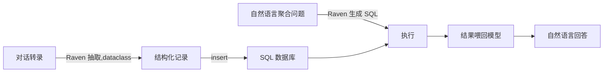

# L6 课程项目:客服对话处理系统(把前面全串起来)

## 项目目标

把前面所有能力组合成一个端到端系统:**客服对话转录(非结构化) → 结构化抽取 → 存进数据库 → 用自然语言做聚合分析**。

## 数据

一批客服代表与客户的对话转录。每段对话里散落着:客服姓名、产品/订单号、客户邮箱/电话、客户情绪等信息。目标是把这些抽成结构化记录存库,之后能做聚合查询(比如"某个客服让多少客户满意了")。

## 三个阶段(每个阶段复用前面某一课的能力)

**① 结构化抽取(用 L4 的 dataclass 方法)**
定义一个 dataclass,字段包括 agent_name / customer_email / customer_order / customer_phone / customer_sentiment。因为抽取任务复杂,用 dataclass 而不是平行 list。把每段对话喂给 Raven,抽出一条结构化记录。

**② 存库(用 L5 的数据库工具)**
建 `customer_information` 表,写 `update_knowledge(records)` 工具把抽出的记录逐条插入。

**③ 聚合查询(用 L5 的 SQL 生成)**
存好后,用自然语言提问("有多少满意的客户""列出所有沮丧客户的姓名电话和订单号"),模型生成对应 SQL、执行、返回结果。

## 完整流水线

## 这个项目为什么值得记

它是一个**完整的"非结构化 → 结构化 → 可查询"数据管道**,而且每一环都是 LLM 驱动的。这类"把杂乱文本/对话/文档变成结构化可分析数据"的需求在真实业务里极其常见(客服、合同、病历、会议纪要……),是 function calling / 结构化抽取最有商业价值的落地形态之一。

放到你的目标里看:这正是一个可以**拿来当作品集 / 面试项目**的模板——如果把课程里的 Raven 换成今天的原生 tool calling、把 dataclass 换成 Pydantic、把 raw SQL 换成 L5 讲的白名单函数(更安全),就是一个现代、能讲出取舍的端到端 demo。比"我学过 function calling"有说服力得多。
