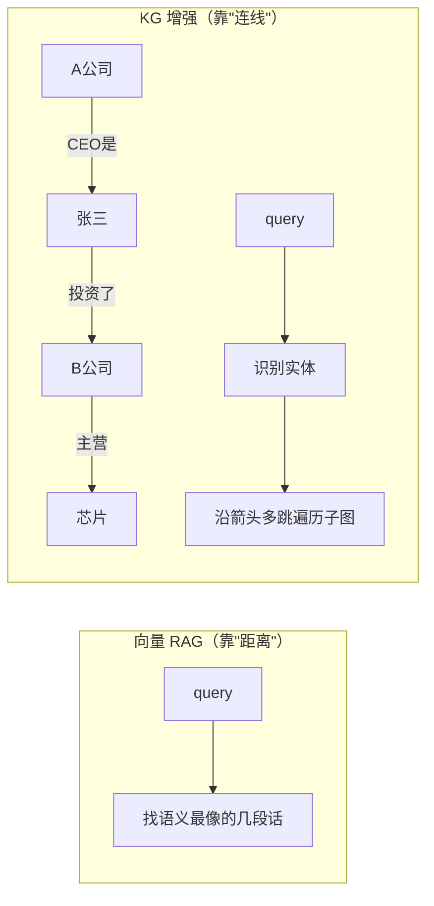
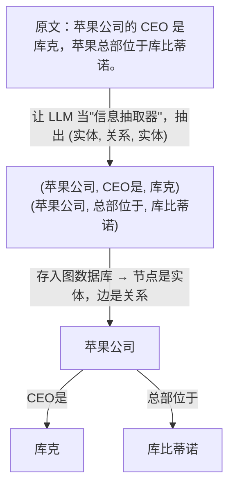
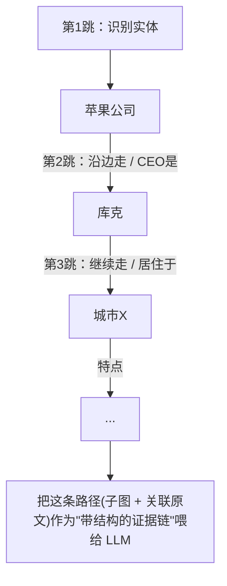

# 知识图谱增强检索：GraphRAG / KG-RAG

> 场景：RAG 里普通向量检索答不好「多跳推理」和「全局归纳」问题时，把文档抽成**实体-关系网络**再检索。
> 核心区别只有一个问题：**检索的单位是"相似的文本块"，还是"相关的关系子图"？**

---

## 〇、一句话定位

向量 RAG 检索**孤立文本块**(靠语义相似度找"长得像"的)；KG 增强先把文档抽成**实体-关系图**(谁和谁有什么关系)，检索时沿**关系链路**游走、聚合，从而回答需要**多跳推理 / 全局归纳**的问题。



---

## 一、它专治向量 RAG 的两个结构性短板

1. **多跳问题**：答案分散在多个文档块里，需把关系一环扣一环串起来。
   例："A 公司 CEO 投资的另一家公司主营什么？" → 向量检索只找字面最像的块，串不起 A→CEO→投资→公司→业务 这条链。
2. **全局/归纳问题**：答案不在任何单一块里，要汇总全局。
   例："这份 200 页报告的核心主题有哪些？" → 向量 top-k 只取局部片段，天然丢全局视野。

---

## 二、原理：建库阶段——把文档变成一张图

普通 RAG 建库只做"切块 + 向量化"；KG 增强多一步**用 LLM 抽取三元组**：



整个文档库最终拼成一张大图。**关键机制 = 把散文里隐含的关系显式结构化**。
> ⚠️ 这一步很贵：每个文本块都要调一次 LLM 抽取 —— 这是 KG 增强成本高、慢、难增量更新的根源。

---

## 三、原理：查询阶段——沿关系链路"走路"

这是与向量 RAG 最本质的区别。看一个多跳问题：

> 问："苹果公司 CEO 所在的城市有什么特点？"

- **向量 RAG 失败**："CEO"和"城市特点"分散在不同文档，找不到能同时命中的块。
- **KG 增强**：在图上多跳遍历，把**路径上的子图 + 各节点关联的原文**一起喂给 LLM。



检索单位从"几段相似文本"变成"**一条推理路径 / 一个子图**"。常配 **Text2Cypher**：LLM 把自然语言翻成图查询语言(Cypher/SPARQL)直接查图。

---

## 四、微软 GraphRAG 的额外机制：社区检测 + 分层摘要

上面解决"多跳"。微软 GraphRAG(2024) 再加一招解决"**全局归纳**"：

```
建库时多做两步：
  ① 用社区检测算法(Leiden) 把图聚成若干"社区" = 主题簇
  ② 让 LLM 给每个社区预先写一份"社区摘要"(community summary)

查询时分两种模式：
  Local Search (局部)：围绕具体实体查邻域      → 答细节/多跳问题
  Global Search(全局)：汇总各社区摘要再合成     → 答"主题有哪些"这类归纳问题
```

> 直觉：把"通读全文做归纳"这件昂贵的事**前置到建库阶段**做好，查询时直接取预生成摘要来拼答案 —— 用更贵的索引换查询时的全局推理能力。

---

## 五、现成框架 / SDK(按定位分层)

### 端到端 GraphRAG 方案(主打全局归纳)
| 框架 | 出品 | 特点 |
|---|---|---|
| **Microsoft GraphRAG** | 微软 | 最经典原型，社区检测+全局/局部，论文级；**重、贵** |
| **nano-graphrag** | 社区 | 微软方案的精简实现，**学原理/二次开发首选** |
| **LightRAG** | 港大 | 增量更新 + 低成本，生产更友好，近期很火 |
| **fast-graphrag** | Circlemind | 用 PageRank 做图检索，主打速度与可解释 |

### 嵌进现有 RAG 栈的模块
| 框架 | 模块 |
|---|---|
| **LlamaIndex** | `PropertyGraphIndex`(schema 抽取 + 图检索 + Text2Cypher，灵活) |
| **LangChain** | `LLMGraphTransformer` + GraphQA 链 |

### 图数据库 + 官方 SDK(生产存储层)
| 数据库 | 配套 SDK | 说明 |
|---|---|---|
| **Neo4j** | `neo4j-graphrag` | 工业界最主流，**生产首选** |
| **FalkorDB** | GraphRAG-SDK | Redis 内核，低延迟 |
| **NebulaGraph** | 社区集成 | 国产、分布式、超大规模 |

### 偏 Agent 记忆 / 自动建图方向
| 工具 | 特点 |
|---|---|
| **Graphiti** (Zep) | **时序知识图谱**，专为 Agent 记忆，支持关系随时间演化 |
| **Cognee / Mem0** | 自动建图 + Agent 长期记忆 |

---

## 六、架构师视角的取舍(重点)

KG 增强**不是"更高级所以更好"**，代价很实在：

| 维度 | 向量 RAG | 知识图谱增强 |
|---|---|---|
| 索引成本 | 低(embedding 一次) | **高**(LLM 抽三元组 + 社区摘要，烧大量 token) |
| 查询延迟 | 低 | 较高(图遍历 + 多次 LLM 调用) |
| 维护 | 简单 | 复杂(图 schema、增量更新难) |
| 擅长 | 语义相似、单点事实 | **多跳推理、全局归纳、关系密集领域** |

- **何时值得上**：领域关系密集(医疗/金融/法律/供应链/科研文献) + 问题多是多跳或全局 + 数据相对稳定。
- **何时别上**：简单 FAQ、单点事实、数据频繁变动 → 向量 RAG + 好的 reranker 性价比高得多。
- **选框架的真实分水岭**：差异 80% 在"**怎么建图、建图多贵、能否增量更新**"，而非检索算法本身。微软 GraphRAG 名气最大但建库成本吓人；LightRAG/fast-graphrag 走红正是因为**把建图成本打下来了**。先问"数据多大、多久变一次"，再看检索效果。

> 一个工程现实：很多团队上了 GraphRAG 后发现，**80% 的提升其实来自抽取阶段被迫做的"数据清洗和结构化"**，而非图结构本身。所以先问"我的问题真的是多跳/全局的吗"，再决定是否付这笔成本。

---

## 一句话总结

- **向量 RAG 找"相似的话"(靠距离)，知识图谱增强找"相关的关系"(靠连线)。**
- 原理两步：建库时 LLM 抽三元组成图(贵)，查询时沿关系多跳遍历子图(准)。
- 微软 GraphRAG 额外用"社区检测+预摘要"换全局归纳能力。
- 上不上看**问题是否多跳/全局 + 数据是否关系密集且稳定**，否则向量 RAG + reranker 更划算。
