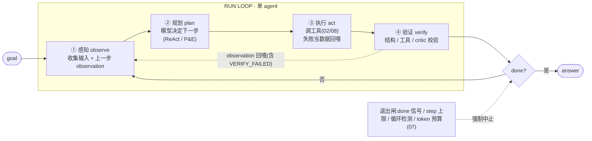
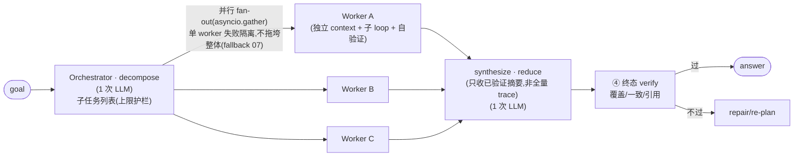
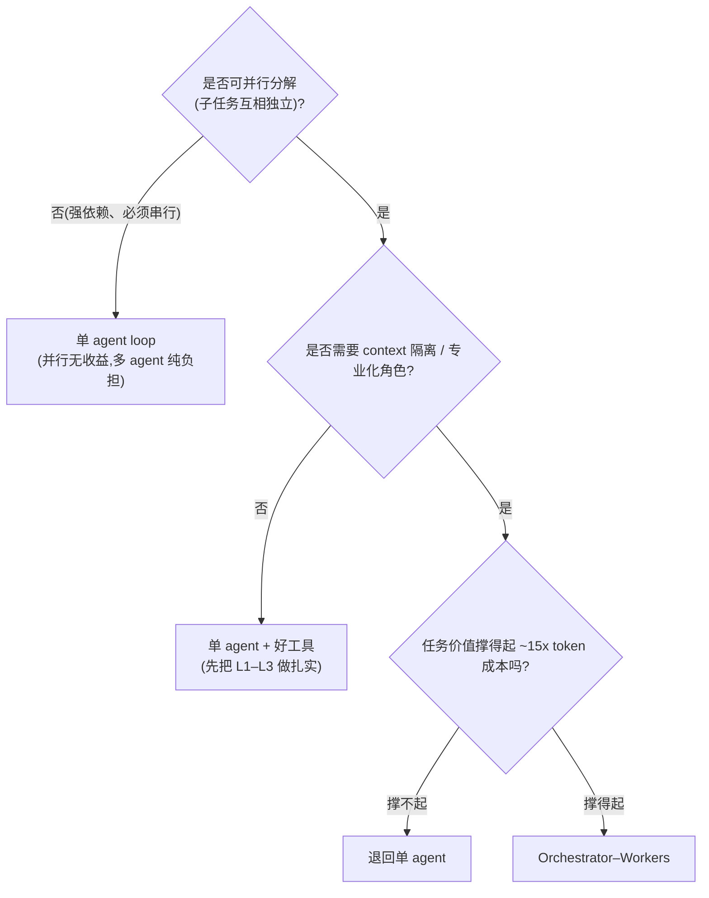

# 01 · Agent Run Loop(感知→规划→执行→验证)与多 Agent 编排(Orchestrator–Workers)

> 定位:Agent 的「主循环骨架」与「多 agent 拓扑」——一个 agent 怎么一步步把任务跑完、跑不动时怎么拆给多个 agent 协作。对应 **JD 职责 1**(实现 Run Loop 与 Orchestrator–Workers)。
> 边界:**工具调用细节**(契约/网关/MCP)交给 02、08;**护栏**(重试/fallback/token 预算/越权拦截/人审)交给 07;**全链路 trace** 交给 06。本章只讲 **loop 与编排的控制流骨架**,其余交叉引用。
> 心智坐标:这是五层模型里的 **L2 核心机制(规划/状态机)** 与 **L4 多 Agent**,见 `../1.md` «L2 核心机制» «L4 多 Agent 协作»。

---

## 1. 技术原理(它到底怎么工作)

### 1.1 Run Loop 的本质:一个被驯服的 while 循环

Agent 的"自主性"在机制层就是一句话:**模型产出动作 → 环境返回观察 → 模型基于观察决定下一个动作 → 直到满足终止条件**。它不是魔法,是一个 `while not done` 循环,每一圈做四件事(四相):



为什么必须是"被驯服"的循环,而不是放任 agent 自己跑到 done:**无界 ReAct 循环会绕圈、会爆成本、没法 debug**。生产共识是"显式状态机 + 有界路径"(见 `../1.md` «L2 状态机/控制流»)。所以四相之外,退出闸(termination)和这个循环本身一样重要。

### 1.2 四相逐相讲透

**① 感知 observe — 把对的 token 喂进这一圈的决策。**
感知不是"读用户输入"这么简单,它是**每一圈的 context 装配**:system prompt + 任务目标 + 历史轨迹 + **上一步的 observation**(工具结果 / 检索片段 / 人审输入 / 验证失败信息)。机制要点:模型只能基于喂进窗口的东西做决策,**上一步动作的结果就是这一步决策的条件**。这一相的工程难点是"放多少历史"——全量喂会随步数线性膨胀、触发 lost-in-the-middle;只喂摘要会丢 grounding。这是 context 工程的落点(L3,交叉引用,不在本章展开)。

**② 规划 plan — 决定"下一个动作"或"整条路径"。这是本层最核心的取舍轴。**

| 范式 | 机制 | LLM 调用形态 | 何时用 |
|---|---|---|---|
| **ReAct**(逐步决策)| `thought → action → observation` 交错;计划是**隐式、局部**的,每步重新决定 | 每步一次调用,**带全量 history 重新决策**;调用数随步数线性增长、每次 prompt 更长 | 需要"边做边看"、中途会变的工具型主循环(默认起点)|
| **Plan-and-Execute**(先规划再执行)| 先一次性产出**显式步骤列表**,再逐步执行;规划集中一次,执行步可用更小/更便宜模型 | 规划 1 次(贵)+ 执行 N 次(可廉价/可并行)。注意:总请求数 ≈ N+1,**不比 ReAct 少**;省的是「每步重做规划 + 每步带全量 history 重推理」的**贵 token**,不是请求条数 | 步骤可预先枚举、依赖清晰、想压 token 成本与延迟 |
| **Reflexion**(反思重试)| 执行**失败**后自我批判,把"教训"写进 episodic memory,带着反思重试 | 在 ReAct/P&E 之上叠加:失败 → critic 调用 → 重试 | 有**可验证的失败信号**且允许重试(coding、可跑测试的任务)|

> 关键机制区分:**ReAct 的"规划"是隐式的**(它不产出完整计划,只决定眼前一步);**Plan-and-Execute 的"规划"是显式产物**(一个可被读取、可被人审、可被 re-plan 的步骤列表)。生产里最常用的是**混合体**:先出计划,执行中偏离预期就 re-plan——既有 P&E 的可控,又保留 ReAct 的适应性。

**③ 执行 act — 把动作打到环境上。**
本章只讲骨架:dispatch 工具调用 → 拿结果 → 回喂。两个跨章但必须知道的原则(细节见 02/08):(a)**错误当数据,不当异常**——工具失败要返回模型能读懂的错误信息让它自己 recover,而不是抛异常中断循环;(b)**副作用要可重入**——写库/扣费这类副作用要考虑"这一步可能被重跑"(尤其叠加 HITL 时节点会从头重跑,见 `../1.md` HITL 坑)。

**④ 验证 verify — 最多人漏掉、也是 agent 可靠性的命门。**
为什么必须有这一相:**L0 是概率底座、天生不可靠**,如果"执行完就当成功"往下走,错误会静默地向上级联(L1 错 → L2 路由错 → … → L5 才发现却分不清哪层的锅)。verify 相就是在每一圈把"驯服 L0"这件事做实。手段按"确定性优先"排序:

| 验证手段 | 机制 | 成本 | 可靠性 |
|---|---|---|---|
| **结构校验** | Pydantic / JSON Schema 校验输出形状 | 极低、确定性 | 高(但只管"形状对",不管"值对")|
| **工具 / 环境校验** | 跑测试、编译、type-check、回查 DB 确认写入、调第二个工具交叉核对 | 中、确定性 | **最高(拿到 ground truth)** |
| **业务规则校验** | assert 不变量(金额非负、ID 存在、引用可达)| 低 | 高(覆盖到的范围内)|
| **LLM critic / self-check** | 另一次 LLM 调用对产物打分/挑错(Reflexion 的"批判者")| 高、**且自身是概率性的** | 中(有偏置,需校准)|

> 架构师口径:**能用确定性手段验证的,绝不先上 LLM critic**。"语法合法 ≠ 语义正确":约束解码能保证 JSON 合法、Pydantic 能保证字段齐,但"值本身对不对"只能靠工具/规则/critic。verify 失败时,把失败原因当 observation 回喂(Reflexion 式),让模型在下一圈自我修正——这正是 verify 相和 plan 相形成闭环的地方。

### 1.3 退出闸:终止条件 / step 上限 / 循环检测

单 agent loop 的"什么时候停",有四道独立的闸,缺一道都可能让 agent 失控:

- **终止条件(done 信号)**:模型显式产出"最终答案 / 不再调工具 / 任务完成标记"。⚠️ **final answer 也要过 verify** —— 模型说"我做完了"不等于真做完了。
- **step 上限(max steps / recursion limit)**:硬上限,防 runaway。LangGraph 有 `recursion_limit`(默认值现查官网,⚠️ 易变)。触顶时**别假装成功**,要返回 `budget_exhausted` 状态交给上层降级。
- **循环检测(防打转)**:agent 反复执行同一个调用、或观察反复相同却没进展。机制:对 `(action, args)` 做规范化哈希,命中重复即判定打转;或追踪"进度信号"(检索命中数、已完成子目标数),N 步无增长即判停。⚠️ 只检测"完全相同 action"会漏掉**语义打转**(换了参数措辞但本质重复),进阶要看"是否朝目标推进"。
- **token / 成本预算硬限**:把延迟与成本预算前置成设计约束而非事后观测(属护栏,详见 07)。

---

## 2. 应用场景(必须用 vs 过度工程)

### 单 agent loop(带完整四相)—— 甜区

- 工具型助手、Agentic RAG、自动化诊断/运维、单代码库 SWE agent。
- 共同特征:**任务可由一条主循环 + 一组工具完成,子步骤之间强依赖、需要顺序推进**。
- 这是 **80% 场景的正确答案**:"单 agent + 好工具 + 扎实的 verify"通常该是第一选择(见 `../1.md` «L4:加 Agent 不是默认解»)。

### Orchestrator–Workers(多 agent)—— 必须用的甜区

只有当下面**至少一条**真实成立,才值得上多 agent:

- **可并行分解**:任务能切成**互相独立**的子任务(典型:广度优先研究——"分别调研 5 家竞品",彼此不依赖)。这是 Orchestrator–Workers 最正当的理由,因为并行真能压低墙钟延迟。
- **context 隔离需求**:每个子任务自带大量上下文,塞进同一窗口会互相污染/稀释注意力——拆开让每个 worker 聚焦自己那一片。
- **真专业化**:不同子任务需要**不同 system prompt / 不同工具集 / 不同模型档**(便宜模型干粗活、旗舰干汇总)。

### 过度工程的信号(该退回单 agent)

- 子任务**强依赖、必须串行**(后一步要前一步结果)→ 并行收益为零,多 agent 只剩协调开销。
- 工具少、流程线性 → 单次 LLM + 几个工具足够。
- **用拓扑复杂度掩盖 prompt/工具没做好** —— 这是最常见的滥用。

> **隐藏成本(必须背)**:Anthropic 的多 agent research 经验,orchestrator–worker 并行子 agent 的 **token 成本约为普通 chat 交互的 ~15 倍**(✅ 量级稳定经验,精确倍数现查 Anthropic 原文)。**注意基线**:原文里 15x 比的是「chat 交互」,而单 agent 工具循环本身就已是 chat 的 ~4x;所以多 agent 相对**单 agent 循环**只是约 3–4x,相对**裸 chat**才是 15x——被追问「15x 比的是什么」别答成「比单 agent 循环 15x」。再叠加协调开销、错误跨 agent 传播、调试更难、汇总质量风险——**只在任务价值撑得起这个量级时才上**。

---

## 3. 具体实现方案(最轻起步 → 升级)

### 3.1 最轻起步:单 agent ReAct loop(四相 + 退出闸,Python 裸 SDK)

不引框架,先把"四相 + 终止 + 循环检测 + verify"手写清楚——这段代码是面试白板题的标准答案。

```python
from dataclasses import dataclass, field
from typing import Any
import hashlib, json

@dataclass
class Step:
    thought: str | None
    action: str | None              # 工具名;None = 模型给出最终答案
    args: dict[str, Any]
    observation: Any = None         # ③执行结果 或 ④验证结论(失败原因)
    verified: bool | None = None

@dataclass
class RunState:
    goal: str
    history: list[Step] = field(default_factory=list)
    budget_steps: int = 12          # step 上限(退出闸之一;成本/token 硬限见 07)
    seen: set[str] = field(default_factory=set)   # 循环检测指纹
    answer: Any = None

def _sig(action: str, args: dict) -> str:         # (action,args) 规范化指纹
    return hashlib.sha1(f"{action}:{json.dumps(args, sort_keys=True)}".encode()).hexdigest()

def agent_loop(state: RunState, llm, tools, verify) -> RunState:
    for _ in range(state.budget_steps):
        # ① 感知:把 goal + 历史(含上一步 observation)装配成 prompt
        prompt = build_prompt(state)
        # ② 规划:模型决定下一步(ReAct:thought + 一个 action 或 final)
        d = llm.decide(prompt, tool_schemas=tools.schemas)   # 字段名 tool_use/tool_calls 现查官网

        if d.is_final:
            # ④' 终态也要验证:final answer 不是"模型说完了"就算数
            ok, why = verify.final(state.goal, d.answer)
            if ok:
                state.answer = d.answer
                return state
            # 验证不过 → 失败原因当 observation 回喂(Reflexion 式),继续循环
            state.history.append(Step(d.thought, None, {}, f"VERIFY_FAILED: {why}", False))
            continue

        # 循环检测:同一调用反复出现 = 打转,注入提示逼模型换策略
        sig = _sig(d.action, d.args)
        if sig in state.seen:
            state.history.append(Step(d.thought, d.action, d.args,
                                      "LOOP_DETECTED: 已执行过相同调用,换策略或终止", None))
            continue
        state.seen.add(sig)

        # ③ 执行:调工具(细节见 02/08)。错误当数据回喂,不抛异常中断循环
        try:
            result = tools.run(d.action, d.args)
        except ToolError as e:
            result = {"error": str(e)}

        # ④ 验证:对工具结果做 结构/环境/业务 校验(确定性优先,LLM critic 兜底)
        ok, checked = verify.step(d.action, d.args, result)
        state.history.append(Step(d.thought, d.action, d.args, checked, ok))

    # 退出闸触顶:别假装成功,交给上层降级(fallback 见 07)
    state.answer = {"status": "budget_exhausted",
                    "partial": state.history[-1].observation if state.history else None}
    return state
```

要点回看:四相齐全、**final 也过 verify**、循环检测、预算触顶不伪装成功、错误当数据。这就是"被驯服的 while 循环"。

> **升级触发器**:当(a)单 loop 步数爆炸、(b)子任务可并行、(c)需要 context 隔离/专业化——才从单 agent 升到下面的 Orchestrator–Workers。**别一上来就画多 agent 图。**

### 3.2 升级:Orchestrator–Workers(分解 → 并行 → 验证 → 汇总)



```python
import asyncio
from dataclasses import dataclass
from pydantic import BaseModel

class Subtask(BaseModel):
    id: str
    instruction: str
    context_slice: dict          # 只给 worker"它需要的那一片",不是全量(防污染)

class Plan(BaseModel):
    subtasks: list[Subtask]

@dataclass
class WorkerResult:
    id: str
    summary: str                 # worker 的"结论/摘要",喂给 reducer 的就是它
    ok: bool

async def orchestrator_workers(goal, llm, worker_runner, verify, max_workers=5):
    # 1) 分解:orchestrator 一次 LLM 调用产出子任务列表(结构化输出 → Pydantic 校验)
    plan: Plan = await llm.decompose(goal)
    subtasks = plan.subtasks[:max_workers]        # 任务数硬上限:防分解爆炸(护栏,07)

    # 2) 扇出 fan-out:并行跑 worker;每个 worker 是 §3.1 那种独立 context 的子 loop
    async def run_one(st: Subtask) -> WorkerResult:
        raw = await worker_runner(st.instruction, st.context_slice)   # 子 loop,含自己的四相
        ok, checked = verify.worker(st, raw)      # 每个 worker 产物先各自验证(局部 verify)
        return WorkerResult(st.id, summary=checked, ok=ok)

    results = await asyncio.gather(*(run_one(st) for st in subtasks),
                                   return_exceptions=True)            # 单个崩了不抛全局

    # 失败隔离:崩掉/未通过验证的 worker 不进汇总(重试/fallback 见 07)
    good = [r for r in results if isinstance(r, WorkerResult) and r.ok]
    if not good:
        return {"status": "all_workers_failed"}                      # 降级,别硬合成

    # 3) 归约 reduce:orchestrator 把"已验证摘要"合成最终答案
    #    关键:喂给 reducer 的是 summary,不是全量 worker trace(否则爆 context)
    draft = await llm.synthesize(goal, [r.summary for r in good])

    # 4) 终态验证:合成结果再过一次端到端 verify(覆盖率/内部一致性/引用可达)
    ok, why = await verify.final(goal, draft, evidence=good)
    return draft if ok else await llm.repair(draft, why, good)        # 不过 → 修复/re-plan
```

这段把本章五个要点全落地了:**分解(结构化 + 上限护栏)→ 并行 worker(独立 context + 失败隔离)→ 每个 worker 自验证 → reduce 只收摘要 → 终态再验证 → 不过则修复**。

> **数据结构设计的两个命门**:① `context_slice` —— worker 只拿它需要的那片 context(传太多=噪声、传太少=缺 grounding,这是多 agent 的核心难点);② reduce 阶段喂 `summary` 而非全量 trace —— 否则 orchestrator 的窗口会被 N 个 worker 的原始轨迹撑爆,这是多 agent "汇总"最常翻车的地方。

---

## 4. 架构师取舍判断(主选 / 备选 / 代价)

### 4.1 规划范式选型轴

| 选型轴(问什么) | 偏向 |
|---|---|
| 任务步骤能否**预先枚举**、依赖是否清晰 | 能 → Plan-and-Execute;不能/中途多变 → ReAct |
| 是否有**可验证的失败信号**、是否允许重试 | 有且允许 → 叠加 Reflexion |
| **token 成本/延迟**敏感吗 | 敏感 → P&E(规划集中一次、执行用小模型/并行,省的是贵 token 与墙钟,不是请求条数);不敏感 → ReAct 更省心 |
| 中途**会不会偏离计划** | 会 → 混合体(先 plan,偏离即 re-plan)= 生产默认 |

- **主选**:ReAct 起步(适应性强、最直观),成本/可控性扛不住再升 Plan-and-Execute。
- **代价**:ReAct 调用数随步数线性增长、每步 prompt 更长、可能跑偏;P&E 对中途变化僵硬,必须配 re-plan 才生产可用。

### 4.2 单 agent vs 多 agent 选型轴



### 4.3 多 agent 拓扑对比(选错拓扑的代价)

| 拓扑 | 形态 | 主选场景 | 代价 / 别用的信号 |
|---|---|---|---|
| **Orchestrator–Workers**(supervisor)| 中央编排器拆任务派发、再汇总 | **不知道选哪个就先用它**;子任务可并行/需隔离 | 中心是瓶颈;reduce 难;15x 成本 |
| **Sequential / pipeline** | 固定阶段交接链 | 阶段固定、无需回头(抽取→改写→校对)| 任一段失败全链断;无并行收益 |
| **Hierarchical** | supervisor 的 supervisor | 子任务还能再往下分解时 | 层级越深越难调试、延迟叠加 |
| **Group-chat / 辩论** | 多 agent 共享对话、互相批评 | 需要多视角对抗(方案评审、红蓝队)| token 爆炸、易发散、难收敛 |
| **Handoff / swarm** | 动态交接,agent 自己决定下一棒 | 下一棒由内容动态决定 | 控制流不可预测、需清晰交接协议 |

> 主选缺省值:**Orchestrator–Workers**(最常用、最可控,中央编排器是天然的审计/汇总/护栏挂载点)。只有当"阶段天然固定"才退到 pipeline,"需要多视角对抗"才上 group-chat,其余慎用——越灵活的拓扑越难控、越难 trace。

### 4.4 多 agent 通信机制选型(拓扑之下的另一根轴)

拓扑(4.3)回答"谁指挥谁",通信机制回答"信息怎么在 agent 间流动"——面试常把两者混问,主动拆开讲是加分点。四类介质:

| 通信介质 | 典型实现 | 主选场景 | 代价 / 别用的信号 |
|---|---|---|---|
| **共享状态**(框架托管)| LangGraph 共享 graph state + `Command(goto=...)` 交接 | 同进程编排;要确定性、全局可观测 | 单进程内有效,跨服务失效 |
| **显式消息传递**(对话/信箱)| AutoGen GroupChat、crewAI delegation、Letta 跨 agent `send_message`(异步信箱)| agent 各有独立 context、需异步协作 | 多跳失真;**传什么决定对方能干什么**(context engineering 问题) |
| **共享记忆/存储**(黑板模式)| 共享向量库/数据库,一个写结论、另一个检索 | 长时程、彻底解耦、支持"晚到的 agent" | 无实时性;要设计 namespace 与读写约定 |
| **跨系统协议** | A2A(Agent Card + task 生命周期)、或土办法:HTTP/消息队列把 agent 当微服务 | 跨组织/跨厂商互操作 | 协议尚新;多数场景 HTTP+队列复用成熟基建更实惠 |

> 选型一句话:**同进程编排用共享状态,异步协作用消息信箱,长时程解耦用共享存储,跨组织才上协议**。注意 MCP 是 agent↔工具/资源协议,不是 agent 间协议——面试被混问时主动区分。

---

## 5. 面试高频问答(背诵主战场)

**Q1. Run Loop 的四相是什么?为什么"验证相"最容易被漏、又是可靠性的关键?**
- 四相:感知(装配 context + 上一步 observation)→ 规划(决定下一动作)→ 执行(调工具)→ 验证(校验结果)。
- 漏的原因:demo 里"执行完看着对"就往下走了,验证相没有立竿见影的功能价值,容易被砍。
- 它是命门:**L0 是概率底座、天生不可靠**,不验证就让错误静默地向上级联(L1→L5),最后在顶层炸、却分不清哪层的锅。验证相就是每一圈"驯服 L0"。
- 手段按确定性优先排:结构校验(Pydantic)→ 环境校验(跑测试/回查 DB,拿 ground truth)→ 业务规则 → 最后才 LLM critic(贵且自身概率性)。
- > 面试官可能追问:**"final answer 要不要验证?"** 答:要。模型说"我做完了"只是一个 token,不是事实;终态必须过一次端到端 verify(覆盖率/一致性/引用可达),不过就把失败原因回喂、Reflexion 式重来,而不是直接返回给用户。

**Q2. ReAct、Plan-and-Execute、Reflexion 怎么选?给点数字感。**
- ReAct:每步一次 LLM 调用、**带全量 history 重新决策**,调用数随步数线性增长、prompt 越来越长;适应性强但成本高、可能跑偏。
- Plan-and-Execute:规划集中 1 次(贵),执行 N 步可用小模型/可并行;**压的是 token 成本与延迟,不是请求条数**(总请求 ≈ N+1,省在执行步不必重推理全量 history、不必每步重规划),但对中途变化僵硬。
- Reflexion:不是第三选项而是**叠加层**——在有"可验证失败信号"时,失败后自我批判、把教训写进 episodic、带反思重试。
- 生产默认是**混合体**:先出 plan,偏离预期就 re-plan,兼得可控与适应。
- > 面试官可能追问:**"Reflexion 的反思存哪、怎么避免每次都从零踩坑?"** 答:存进 **episodic memory**(带场景的成功/失败轨迹),下次遇到相似任务把它作为 few-shot 召回——召回时只对"触发场景"做向量匹配,别把复盘文字一起 embed 污染检索(见 `../1.md` «episodic 写入策略»)。

**Q3. 单 agent loop 怎么防止无限循环 / 打转?终止条件有哪些?**
- 四道独立的闸:① done 信号(且 final 也过 verify);② step 上限(LangGraph 的 `recursion_limit`,默认值现查官网);③ 循环检测(对 `(action,args)` 哈希判重复 / 追踪进度信号判"无进展");④ token/成本预算硬限(护栏,07)。
- 触顶时**别假装成功**:返回 `budget_exhausted` + partial,交上层降级。
- 进阶:只检测"完全相同 action"会漏掉**语义打转**(换了措辞但本质重复),要看"是否朝目标推进"。

**Q4. 什么时候单 agent 够,什么时候才上多 agent?**
- 默认单 agent:"单 agent + 好工具 + 扎实 verify"是 80% 场景的正确答案。
- 上多 agent 的三个真实理由:**可并行分解**(独立子任务,真能降墙钟延迟)、**context 隔离**(子任务上下文大、会互相污染)、**真专业化**(不同 prompt/工具/模型档)。
- 硬性代价:Anthropic 经验 **多 agent ≈ 普通 chat 的 ~15x token 成本**(量级,现查原文)+ 协调开销 + 错误跨 agent 传播 + 调试更难。只在价值撑得起时上。
- > 面试官可能追问:**"15x 是比谁?"** 答:原文基线是 **chat 交互**;同源数据里单 agent 工具循环本身已 ~4x chat,所以多 agent 相对**单 agent 循环**约 3–4x、相对**裸 chat**才 ~15x。把基线说清,别让人以为"多 agent 比单 agent 循环贵 15 倍"。
- 反问自己:这是真实的并行/隔离需求,还是在用拓扑复杂度掩盖 prompt/工具没做好?

**Q5. Orchestrator–Workers 的"汇总(reduce)"难在哪?context 怎么传?**
- reduce 难点:N 个 worker 各产出一坨结果,orchestrator 要在**不丢信号、不爆 context**的前提下合成。喂全量 worker trace 会瞬间撑爆窗口——所以喂 **summary 而非原始轨迹**。
- context 传递难点:给 worker 的 `context_slice` 传太多 = 噪声、传太少 = 缺 grounding,这是多 agent 的核心张力(见 `../1.md` «context 传递问题»)。
- 工程做法:① 每个 worker 先**局部自验证**,只让通过的进汇总;② orchestrator 收"已验证摘要";③ 合成后**再过一次终态 verify**(覆盖率/一致性/引用),不过则 repair/re-plan。

**Q6. 并行 worker 里一个挂了怎么办?**
- **失败隔离**:`asyncio.gather(..., return_exceptions=True)`,单个 worker 异常不抛成全局失败;崩掉/未过验证的不进汇总。
- 决策:看这个子任务是不是关键路径——非关键就带"部分结果"降级合成;关键就走重试/fallback(指数退避、换模型档),全挂则返回明确失败而不是硬合成一个幻觉答案。
- (重试/fallback/越权拦截/人审闸口的具体实现属护栏,详见 07。)

**Q7. 你怎么验证一个 agent"跑得对",而不只是"答案看着对"?**
- 多步轨迹**没有单一 ground truth**,要分层评:组件级(工具选择准确率、检索质量)+ 端到端(任务成功率)+ **轨迹评测**(路径走得好不好,不只看终点)。
- 方法:程序化检查(确定性、首选)> LLM-as-judge(有偏置需校准)> 人工。
- 这块属横切带"度量·观测",落库与 trace 接 06,eval 框架(Promptfoo/DeepEval)是 JD 加分项。

**Q8. 为什么生产用状态图/状态机,而不是裸 `while True` 的 agent 循环?**
- 三个词:**确定性、可调试、可恢复**。裸无界循环会绕圈、爆成本、没法 debug;显式图(node/edge/conditional edge/state)把自主性关进**有界路径**,该自由的节点自由、该确定的地方确定。
- 附带红利:每个 super-step 落 checkpoint → 崩溃/暂停可恢复(直接接 HITL 的 `interrupt + Command(resume)`,见 `../1.md` «HITL 恢复»)。

**Q9. 多 agent 之间如何通信?(2026-07 真实被问)**
- 骨架先行(30 秒):按介质分四类——**共享状态**(LangGraph graph state + Command 交接,同进程)、**显式消息传递**(AutoGen 对话式 / Letta 异步信箱)、**共享记忆/存储**(黑板模式:共享向量库/DB,写入即广播)、**跨系统协议**(A2A;或 HTTP/消息队列把 agent 当微服务)。细节见 4.4 表。
- 再给选型判断:同进程用共享状态,异步协作用信箱,长时程解耦用共享存储,跨组织才上协议;并主动区分 **MCP 是 agent↔工具协议,A2A 才是 agent↔agent**。
- 然后升维:多数"多 agent 通信"问题应先反问**要不要多 agent**——通信失真与调试成本是真实代价(接 Q4 的 15x 论据)。
- 实战弹药(Letta 12b L6 实测,面试官很少听过的细节):消息传递系统里**"信封"与"信"同样影响行为**——① 跨 agent 来信被系统包装语劫持("make sure to use send_message"),收信 agent 只回话不干活,persona 怎么写都掰不过来;② `run_first`(InitToolRule)只在直连消息路径生效,跨 agent 投递不触发;③ 事件与来信同轮到达会被混合处理。结论:选信箱式通信时,要审计框架注入的包装语/元数据,并把"转发"与"执行"拆成两步保确定性。
- 收尾回到自己的实践:LangGraph 侧用过 supervisor 中转 + store 按 user_id 隔离(共享状态+共享存储组合);12a 里 SQL 表+向量表就是黑板模式,`summary_id` 双向链接就是通信 schema 设计。

---

## 6. 踩坑 / 反模式

| 反模式(选错信号) | 后果 | 治法 |
|---|---|---|
| **无界 ReAct 循环跑到 done**(没有 step 上限)| 绕圈、爆 token、没法 debug | 加 step 上限 + 循环检测 + 预算硬限;升级为显式状态图 |
| **漏掉 verify 相**("执行完就当成功")| 错误静默向上级联,顶层炸却定位不到 | 每圈加确定性校验,final answer 也验;失败回喂 Reflexion 重试 |
| **默认上多 agent**(用拓扑掩盖 prompt/工具没做好)| 15x 成本 + 调试地狱 + 错误跨 agent 传播 | 先把单 agent + 工具 + verify 做扎实;真有并行/隔离需求才上 |
| **reduce 时把全量 worker trace 喂 orchestrator** | 窗口爆掉、信噪比崩 | worker 只回 summary;orchestrator 收"已验证摘要"而非原始轨迹 |
| **worker 拿全量 context** | 子任务互相污染、注意力稀释 | 精确切 `context_slice`,只给 worker 需要的那片 |
| **Plan-and-Execute 当成死计划**(从不 re-plan)| 中途一变就全盘失败 | 用混合体:先 plan,偏离即 re-plan |
| **循环检测只比"完全相同 action"** | 语义打转漏判(换措辞重复)| 叠加"进度信号无增长"判停 |
| **副作用放在可能被重跑的位置** | 重复扣费/重复写库(尤其叠 HITL 节点重跑)| 副作用幂等化 + 放在 `interrupt()` 之后(见 `../1.md` HITL 坑)|
| **预算触顶伪装成功** | 把半成品当完成交付,下游误信 | 触顶返回 `budget_exhausted` + partial,交上层降级 |

> 一句话反模式总纲:**新手把"自主性"当卖点放任无界循环;成熟做法是用状态机把自主性关进有界笼子,并在每一圈用 verify 驯服概率底座。**

---

## 7. 回链已有资产 / 课程

- **心智模型(权威源)**:`../1.md`
  - «L2 核心机制·规划/状态机»(ReAct/Plan-and-Execute/Reflexion/LATS 范式表、无界循环→有界图的演进)——本章是它在"Run Loop 实现"维度的展开。
  - «L4 多 Agent 协作»(拓扑表、通信模式、context 传递问题、15x 成本)——本章 §4 拓扑对比与之对齐。
  - «HITL 恢复 / interrupt»(节点从头重跑、副作用位置)——本章 §6 副作用坑回链于此。
- **动作范式(上游前置)**:`../../skills/agent-selection/0-action-paradigm.md` —— Run Loop 的"执行相"用哪档动作原语(function-calling / CodeAct / computer-use)由它先定,会反向约束 loop 形态与沙箱。
- **框架决策树**:`../../skills/agent-selection/2-framework/01-decision-tree.md` —— Q0「系统形状」C 项(多角色协作)与 Q1(状态控制)对应本章单 agent vs 多 agent 的落地选型;多 agent 框架(crewAI / MAF / LangGraph 多 agent 图)在此选。
- **场景速查**:`../../skills/agent-selection/2-framework/04-scenario-playbook.md` —— 场景 4(多角色协作)、场景 2(诊断/运维循环 + HITL)、场景 8(SWE 长时 loop)是本章 loop/编排的具体落地映射。
- **跨章交叉引用(本 JD 系列)**:工具调用网关/契约/MCP → 02、08;全链路 trace 落库 → 06;失败重试/fallback/token 预算/越权拦截/人审闸口 → 07;评测驱动(Promptfoo/DeepEval)→ 见 06 与加分项章节。

> 最后核对:2026-06。⚠️ 易变项(LangGraph `recursion_limit` 默认值、`tool_use`/`tool_calls` 字段名、Anthropic 15x 精确倍数、各多 agent 框架维护状态)请就近现查官网/原文,本章给的是**机制与选型方法**,不固化快照。
