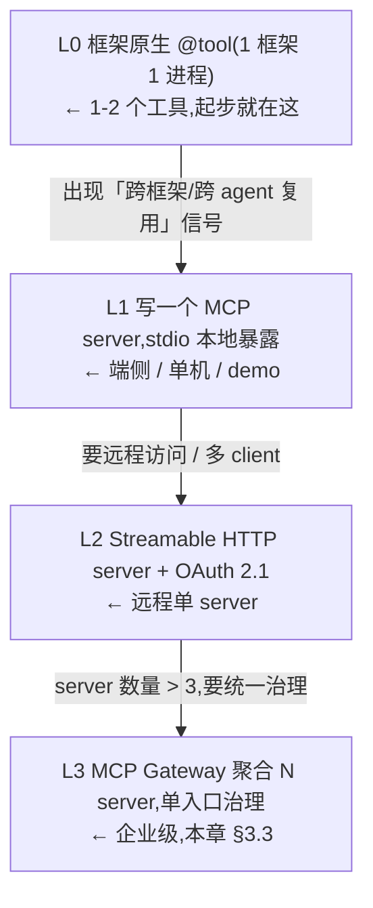
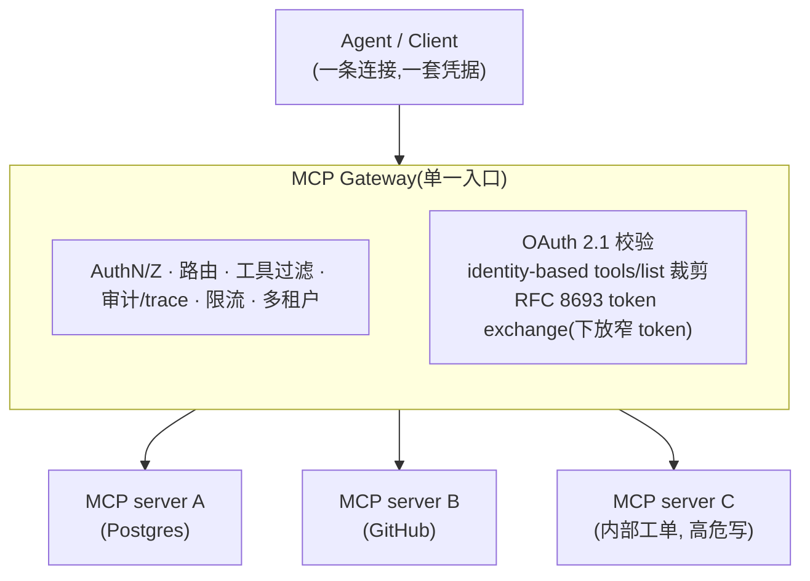
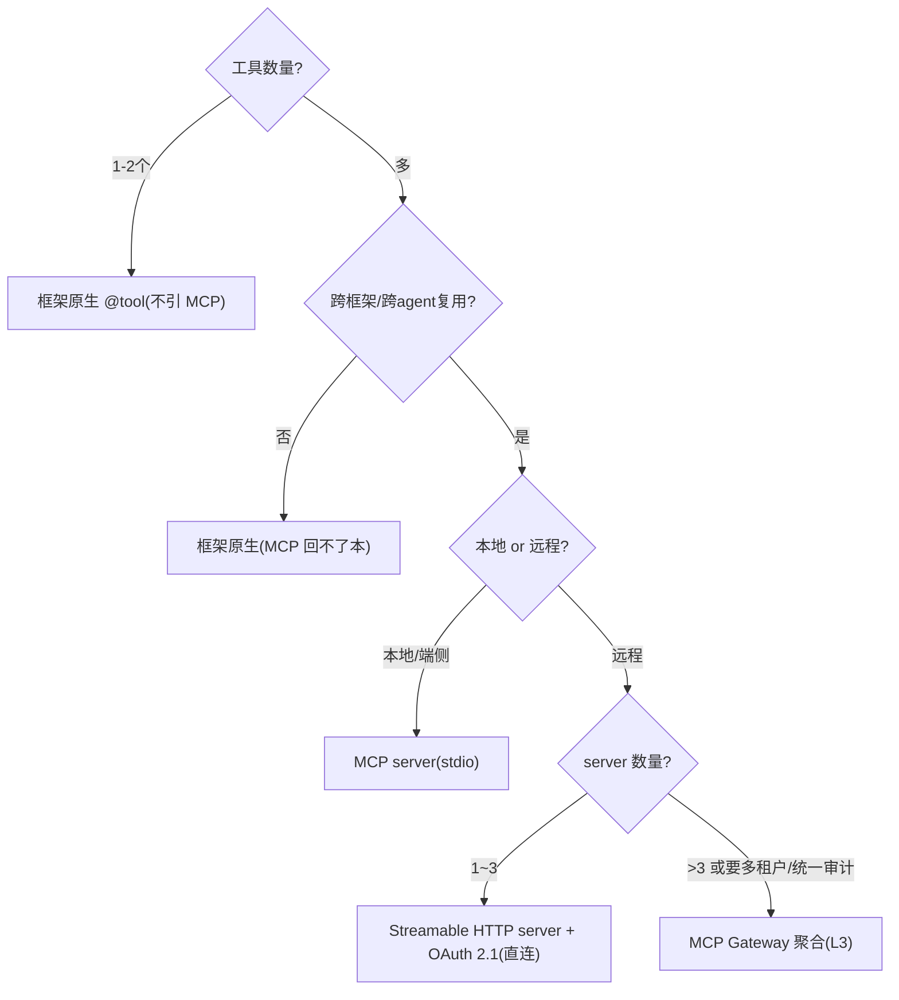

# 03 · MCP Gateway 与协议(MCP server/client 开发)

> **一句话定位**:MCP 是把「工具 / 资源 / 提示」标准化接入 agent 的 **client–server 协议**,让工具一次暴露、跨框架跨 agent 复用;**MCP Gateway** 是把 N 个 MCP server 聚合到单一入口、统一做鉴权/路由/治理/审计/多租户的**治理层**。
> **对应 JD**:职责 2「开发……MCP Gateway,打通端云协同接口」+ 加分项「MCP server / client 开发经验」。
> **边界**:通用工具契约 / 鉴权机制的设计归本系列同目录 **02 章(工具调用网关与契约)**;本章只讲 **MCP 协议本身** 与 **Gateway 聚合治理**。
> **最后核对:2026-06**。⚠️ MCP 规范版本、传输层、OAuth 细节、Gateway 产品归属变动极快,本章给**机制与判据**,具体版本号/字段名/RFC 一律以官网为准 → **现查 `modelcontextprotocol.io`**。

---

## 1. 技术原理(它到底怎么工作)

### 1.1 一句话机制:把 N×M 集成降成 N+M 的 JSON-RPC 协议

MCP(Model Context Protocol,Anthropic 2024-11 发起)的本质,是在 **LLM 应用(Host/Client)** 与 **能力提供方(Server)** 之间定义一套 **JSON-RPC 2.0** 的请求/响应/通知报文。✅ 没有 MCP 时,每接一个新工具/数据源就要写一份定制连接器,N 个 agent × M 个工具 = N×M 份胶水;有了 MCP,每个 agent 实现一次 client、每个工具实现一次 server,降成 **N+M**。这是它唯一真正解决的问题:**复用与互操作**——不是「能不能跑通」(裸 function calling 也能跑通)。

> 核心心智(与 `../../roadmap/agent-selection/2-framework/06-protocols.md` 一致):**MCP 是接入协议,不是编排框架**,与 LangGraph / 裸 SDK / 任意框架**正交可叠加**。选完框架后再决定「工具要不要用 MCP 暴露」。

### 1.2 三个角色,别混

| 角色 | 是什么 | 例子 |
|---|---|---|
| **Host** | 跑 LLM、持有对话、做最终决策的应用 | Claude Desktop、你的 agent 进程、IDE |
| **Client** | Host 内部、与某个 server 维持 **1:1 会话**的连接器 | SDK 里的 `ClientSession` |
| **Server** | 暴露能力的独立进程/服务 | 你写的 invoice-tools server |

一个 Host 可以开 N 个 Client,各连一个 Server(1 client ↔ 1 server)。

### 1.3 三类服务端原语(server 暴露给 client)

这是面试必背的 MCP「三原语」,关键区分在**谁控制调用**:

| 原语 | 是什么 | 控制方 | 类比 |
|---|---|---|---|
| **Tools** | 可被模型调用的**带副作用的动作**(查库、下单、发邮件) | **Model-controlled**(模型决定何时调) | POST / RPC |
| **Resources** | 可被读取的**上下文数据**(文件、表行、文档),有 URI | **App-controlled**(宿主决定塞哪些进 context) | GET / 文件 |
| **Prompts** | 预置的**提示模板 / 工作流**,可带参数 | **User-controlled**(用户显式触发,如 slash command) | 模板 / 宏 |

> ⚠️ 易错点:很多人以为 MCP 只有 tools。**resources 是「数据」、prompts 是「用户触发的模板」**,三者控制方不同——这是面试区分「读过 spec」和「只用过」的分水岭。

补充:除三类服务端原语外,spec 还定义了 **客户端原语**(由 server 反向调用 client,体现协议的**双向性**)——`sampling`(server 请求 client 侧 LLM 补全,成本/模型/安全由 client 掌控)、`roots`(client 告诉 server 可访问的文件系统边界)、`elicitation`(server 在执行中向用户追加索要缺失输入,返回 accept/decline/cancel)。⚠️ 这几个较新、客户端支持参差不齐(**现查**),但能说出来是加分。

### 1.4 传输层(transport)——2026-06 快照

MCP 把「报文语义」和「怎么传」解耦,当前两种官方传输:

| 传输 | 机制 | 适用 | 状态 |
|---|---|---|---|
| **stdio** | client 把 server 当**子进程**拉起,JSON-RPC 走 stdin/stdout | 本地工具、端侧、CLI、桌面 | 稳定 |
| **Streamable HTTP** | 单个 HTTP endpoint:client `POST` 发请求;server 可选用 **SSE** 流式回推 | 远程 server、云端、多租户 | 2025-03 引入,**当前推荐** |

> ⚠️ **2026-06 快照,务必现查**:早期(2024-11 spec)的「HTTP + 独立 SSE 双端点」传输**已被废弃**,被 2025-03-26 引入的 **Streamable HTTP**(单端点 + 可选 SSE 升级)取代。再往后,Transport WG 正推进面向企业规模的下一代传输(SEP 计划 2026 Q1 定稿),**别把传输层写死**。
> 记忆口诀:**本地走 stdio,远程走 Streamable HTTP(内部按需用 SSE 流式)**。

### 1.5 初始化握手与能力协商(最该讲透的机制)

连接建立后第一件事是 **`initialize` 握手 + capability negotiation**——这是面试官最爱追的「机制层」。三步:

```jsonc
// 1) client → server: 报版本 + 自己支持的能力
{"jsonrpc":"2.0","id":1,"method":"initialize","params":{
  "protocolVersion":"2025-06-18",                 // 现查最新 revision
  "capabilities":{"roots":{"listChanged":true},"sampling":{},"elicitation":{}},
  "clientInfo":{"name":"my-agent","version":"0.1.0"}}}

// 2) server → client: 回自己的版本 + 自己暴露的能力
{"jsonrpc":"2.0","id":1,"result":{
  "protocolVersion":"2025-06-18",
  "capabilities":{"tools":{"listChanged":true},"resources":{"subscribe":true},"prompts":{}},
  "serverInfo":{"name":"invoice-tools","version":"1.0.0"},
  "instructions":"How to use this server..."}}

// 3) client → server: 通知「握手完成」,此后才能发业务请求
{"jsonrpc":"2.0","method":"notifications/initialized"}
```

机制要点(可背):
- **版本协商**:双方报 `protocolVersion`,不兼容则连接失败——这让协议能向后演进而不静默崩。
- **能力协商**:`capabilities` 决定**这条连接上哪些方法可用**。server 没声明 `prompts`,client 就不会发 `prompts/list`;声明了 `listChanged` 才允许后续推「列表变了」的通知;声明 `subscribe` 才允许订阅某个 resource 的更新。**能力是按连接动态裁剪的,不是全量假定**。
- **发现(discovery)**:握手后 client 调 `tools/list` / `resources/list` / `prompts/list` 拿清单,再 `tools/call` / `resources/read` / `prompts/get` 执行。所以 MCP 是**运行时动态发现**,不是编译期写死——这正是「换框架工具不重写」的根。

---

## 2. 应用场景(何时必须用 / 何时是过度工程)

### 2.1 甜区(✅ 该上 MCP)
- **工具/数据要跨多个框架或多个 agent 复用**:今天 LangGraph、明天换裸 SDK,工具资产不想重写。
- **端云协同**(JD 原话):端侧用 stdio 把本地能力(文件、设备、本地模型)暴露给云端 agent,云端用 Streamable HTTP 接远程 server——MCP 给端、云**同一套契约**。
- **多人/多团队**:需要统一的工具接入治理(注册表、版本、鉴权),而不是各写各的连接器。
- **想接生态现成 server**:GitHub、Slack、Postgres、Filesystem 等官方/社区 server 拿来即用。

### 2.2 反模式(⚠️ 过度工程)
- **单 agent + 一两个工具 + 单框架** → 直接用框架原生 `@tool` / function 定义。**别为两个工具立一个 server**:多一个进程要部署、鉴权、监控,还新增攻击面,回不了本。
- **纯进程内调用** → 函数直接调,套 JSON-RPC 纯增延迟(每次调用多一次序列化 + IPC/网络往返)。
- **把 MCP 当编排框架** → 概念错位,MCP 不管「规划/循环/多 agent」,那是框架层的事。

> 判据(同 06-protocols §七):**MCP 的回本点是「复用 + 跨边界」**;达不到就是纯增复杂度。默认从「框架原生 tool」起步,出现跨边界复用的真实信号再上 MCP。

---

## 3. 具体实现方案(最轻起步 → 升级路径)

### 3.0 升级路径总览



### 3.1 写一个 MCP Server(Python,FastMCP)

> SDK:官方 Python SDK 包名 `mcp`,内含 `FastMCP` 高层封装(装饰器声明,自动从类型注解 + docstring 生成 JSON Schema)。⚠️ API 细节**现查** `github.com/modelcontextprotocol/python-sdk`。

```python
from mcp.server.fastmcp import FastMCP

mcp = FastMCP("invoice-tools")

# —— Tool:模型可调的带副作用动作。docstring 与类型注解 = 工具契约 ——
@mcp.tool()
def issue_refund(order_id: str, amount_cents: int) -> dict:
    """Issue a refund for an order.

    amount_cents: refund amount in cents (must be <= original charge).
    Returns {"refund_id", "status"}.
    """
    # 真实实现:校验金额、查订单、调支付网关、写审计
    refund_id = payments.refund(order_id, amount_cents)
    return {"refund_id": refund_id, "status": "ok"}

# —— Resource:可读上下文数据,带 URI 模板,App 决定塞不塞进 context ——
@mcp.resource("invoice://{order_id}")
def invoice(order_id: str) -> str:
    """Return the raw invoice document for an order."""
    return billing.load_invoice_text(order_id)

# —— Prompt:用户触发的模板/工作流 ——
@mcp.prompt()
def dispute_triage(order_id: str) -> str:
    return f"You are a billing agent. Triage the dispute for order {order_id}. " \
           f"First read invoice://{order_id}, then decide if a refund is warranted."

if __name__ == "__main__":
    mcp.run(transport="stdio")          # 本地:L1
    # mcp.run(transport="streamable-http")  # 远程:L2(配 ASGI/uvicorn + OAuth)
```

要点:工具的 **docstring + 类型注解就是契约**(自动转 JSON Schema 给模型看)。写得越准,模型选错率越低——契约质量是 MCP server 的核心工程量,详细契约设计归 **02 章**。

### 3.2 写一个 MCP Client(Python,发现并调用)

```python
from mcp import ClientSession, StdioServerParameters
from mcp.client.stdio import stdio_client

async def run():
    params = StdioServerParameters(command="python", args=["server.py"])
    async with stdio_client(params) as (read, write):
        async with ClientSession(read, write) as session:
            await session.initialize()                 # 1) 握手 + 能力协商(§1.5)
            tools = await session.list_tools()          # 2) 发现:拿工具清单 + JSON Schema
            #    把 tools 转成你框架/LLM 的 tool 定义,交给模型选
            result = await session.call_tool(           # 3) 执行
                "issue_refund",
                {"order_id": "A-1001", "amount_cents": 500},
            )
            print(result.content)        # 结果是 content blocks(text/image/...)

# 远程:把 stdio_client 换成 streamablehttp_client(url, auth=...)
# from mcp.client.streamable_http import streamablehttp_client
```

> 工程上你几乎不会裸写 client:LangGraph(`langchain-mcp-adapters`)、各官方 Agent SDK 都有 MCP 适配器,**一行把 server 的 tools 注入 agent**。⚠️ 适配器包名/接口**现查**。

### 3.3 TypeScript Server 骨架(JD 要求 TS,给一份对照)

```typescript
import { McpServer } from "@modelcontextprotocol/sdk/server/mcp.js";
import { StdioServerTransport } from "@modelcontextprotocol/sdk/server/stdio.js";
import { z } from "zod";   // schema 即契约

const server = new McpServer({ name: "invoice-tools", version: "1.0.0" });

server.tool(
  "issue_refund",
  { order_id: z.string(), amount_cents: z.number().int() },
  async ({ order_id, amount_cents }) => ({
    content: [{ type: "text", text: JSON.stringify(await issueRefund(order_id, amount_cents)) }],
  }),
);

await server.connect(new StdioServerTransport());
// 远程:换 StreamableHTTPServerTransport,挂在 Express/Hono + OAuth 中间件后
```

> SDK:`@modelcontextprotocol/sdk`,⚠️ 导入路径/签名**现查** npm。

### 3.4 MCP Gateway 架构(L3:聚合多 server)



**Gateway 必须做的事**(把直连 N server 的痛点逐条收编):

| 治理面 | 直连 N server 的痛 | Gateway 的解 |
|---|---|---|
| **鉴权** | client 要管 N 套凭据;广权 token 直传后端,任一 server 被攻破就能冒充 agent | 单点 OAuth 2.1 校验;**RFC 8693 token exchange** 把广 token 换成 per-server 窄 token |
| **路由/聚合** | client 要发现/维护 N 个 endpoint | 一个 endpoint,Gateway 内部路由;聚合后的 `tools/list` |
| **工具治理** | 全量工具一次塞 context,工具一多(经验 ~10–20)选择错误率飙升 | **identity-based tool filtering**:按调用方身份裁剪 `tools/list`;叠 RAG-over-tools(见 `../../roadmap/agent-selection/4-tools.md`) |
| **审计/可观测** | 调用散落各 server,无全链路 trace | 统一 span 落库(对接职责 3 的全链路 trace) |
| **多租户/限流** | 各 server 各自为政 | 集中配额、租户隔离、熔断 |
| **供应链管控** | 接第三方 server = 直接信任其工具描述 | 集中审计/隔离/pin 版本,拦 tool poisoning |

> ⚠️ Gateway 产品(2026-06,**现查归属/成熟度**):IBM **ContextForge MCP Gateway**(开源)、**Docker MCP Gateway**、Envoy 系网关、各云厂 API Gateway 的 MCP 能力等,均在快速迭代——选型别写死。最轻起步:**先用一份「server 清单」表 + 一个反代做集中鉴权**,server 数 >3 或要多租户再上正式 Gateway。

---

## 4. 架构师取舍判断

### 4.1 接入方式选型轴



### 4.2 主选 vs 备选 vs 代价

| 方案 | 主选场景 | 备选 | 代价 |
|---|---|---|---|
| **框架原生 tool** | 单框架、工具少、不复用 | — | 换框架要重写;不可跨 agent 复用 |
| **MCP server 直连(stdio)** | 端侧/本地、单机 | 框架原生 | 多一个进程;远程访问要自己搞 |
| **MCP server 直连(HTTP)** | 远程单 server | Gateway | client 自管凭据;无集中治理 |
| **MCP Gateway** | server>3、多租户、要审计/治理 | 直连 + 各自治理 | 引入单点(要高可用);多一跳延迟;运维成本 |
| **自研私有协议** | 极端性能/特殊语义 | MCP | 失去生态与互操作,N×M 回潮 |

### 4.3 关键取舍口令
- **协议不投票选型**:MCP 是「这层能力要不要标准化暴露」的加分项,不和框架二选一。
- **Gateway 是治理层不是接入层**:没有「多 server + 多租户 + 要审计」的真实信号,别先上 Gateway(单点 + 一跳延迟的代价)。
- **延迟账**:MCP 比进程内函数调用多一次序列化 + 传输往返;stdio 量级 ~ms,远程 HTTP 量级 ~10–100ms+(**现查实测**,取决于网络/server)。高频内循环工具慎用远程 MCP。

---

## 5. 面试高频问答(重中之重)

**Q1:MCP 到底解决什么?和 function calling 是什么关系?**
A:function calling 是「模型如何表达要调一个工具」(模型层能力);MCP 是「工具如何被标准化暴露和发现」(接入层协议)。两者**正交、叠加**:MCP server 暴露的工具,最终还是通过 function calling 让模型来选。MCP 唯一解决的是 **N×M → N+M 的复用/互操作**——不是「能不能调通」。没有复用需求(单框架单 agent 少量工具),MCP 是过度工程。
> 面试官可能追问:**「那不用 MCP 就不能复用工具吗?」** 答:能,但要自己写适配层把工具在各框架间搬,MCP 把这层适配标准化了,且生态里现成 server 拿来即用;**省的是适配工时和生态接入,不是功能**。

**Q2:MCP 的三类原语是什么?区别在哪?**
A:**tools(模型控制的带副作用动作,~POST)**、**resources(应用控制的上下文数据,有 URI,~GET)**、**prompts(用户控制的模板/工作流,~slash command)**。区分关键是**控制方不同**:tools 由模型决定何时调,resources 由宿主决定塞不塞进 context,prompts 由用户显式触发。
> 面试官可能追问:**「server 能反过来调 client 吗?」** 答:能——这是协议的双向性。client 侧原语有 `sampling`(server 借 client 的 LLM 做补全,成本/模型/安全由 client 掌控)、`roots`(文件系统边界)、`elicitation`(运行中向用户索要缺失输入)。⚠️ 这几个较新、客户端支持参差(现查)。

**Q3:讲讲初始化握手和能力协商。**
A:连上后 client 先发 `initialize`(报 `protocolVersion` + 自己的 `capabilities` + `clientInfo`),server 回自己的版本和 capabilities,client 再发 `notifications/initialized` 才进入业务态。**能力协商**让每条连接动态裁剪可用方法:server 没声明 `prompts` 就不发 `prompts/list`;声明 `listChanged` 才允许推「列表变更」通知;声明 `subscribe` 才能订阅 resource 更新。版本协商保证协议能向后演进而不静默崩。底层全是 **JSON-RPC 2.0**。

**Q4:stdio 和 Streamable HTTP 怎么选?SSE 还在用吗?**
A:**本地/端侧用 stdio**(client 把 server 当子进程拉起,走 stdin/stdout,~ms 延迟);**远程用 Streamable HTTP**(单 endpoint,POST 发请求,server 按需用 SSE 流式回推)。⚠️ 早期那个「HTTP + 独立 SSE 双端点」传输已被废弃,SSE 现在只是 Streamable HTTP **内部**可选的服务端→客户端流式手段,不是独立传输。下一代企业级传输还在演进(现查)。

**Q5:企业为什么要 MCP Gateway,不直连 N 个 server?**
A:直连有四个痛:① client 要管 N 套凭据,且广权 token 直传后端(**token passthrough / 越权**——MCP spec 明令 server 不得接受非签发给自己的 token),任一 server 被攻破就能拿这个广 token 横扫其他后端;② 无统一审计,调用散落各 server;③ 全量工具塞 context,工具一多选择错误率飙升;④ 接第三方 server = 直接信任其工具描述(供应链)。Gateway 把这些收编到单入口:**OAuth 2.1 单点校验 + RFC 8693 token exchange 下放窄 token + identity-based 工具裁剪 + 统一 trace/限流/多租户**。代价是引入单点(要高可用)和一跳延迟。
> 面试官可能追问:**「Gateway 怎么防止广权 token 被下游 server 滥用?」** 答:**token exchange(RFC 8693)**——Gateway 拿 agent 的广 token,按目标 server 换成最小权限的窄 token 再转发;后端 server 永远拿不到能横扫所有工具的原始 token。再深一层:窄 token 靠 **audience / resource 绑定**让目标 server 能校验「这 token 是发给我的」并拒绝错配——MCP 2025-06-18 auth 把 server 定位成 OAuth **Resource Server**,引入 **RFC 8707 Resource Indicators**(client 声明目标资源)+ **RFC 9728 受保护资源元数据**(server 发布自己的鉴权要求);**RFC 编号现查**。不支持 OAuth 的老 server,从 Vault 取 PAT/API key 注入。

**Q6:MCP 的安全攻击面有哪些?怎么治?**
A:四类必答:① **tool poisoning**——恶意 server 在工具描述/元数据里埋 prompt 注入(模型会信任「像系统作者写的」文本,本质是对 context 的供应链攻击);② **rug pull**——工具安装时人畜无害,授权后**静默改写自己的定义**改道你的 key/数据;③ **confused deputy**——诱导 server 用它的高权限替攻击者办事;④ **工具结果即数据非指令**——经 MCP 流回的内容可能带注入。治法:最小权限暴露、按调用方鉴权、**高危工具走 HITL 审批闸门**、第三方 server 隔离/限流/**pin 工具定义并对变更告警**、把工具输出当数据处理。
> 面试官可能追问:**「rug pull 具体怎么防?」** 答:对工具定义做**哈希 pin + 变更检测**——多数 client 默认不检测 server 改 schema,要在 Gateway/client 侧缓存已批准的工具定义哈希,发现 server 偷改就拦截+告警+重新走审批,而不是静默接受。

**Q7:MCP 和 A2A 怎么分工?ACP 又是什么?**
A:记两层就够——**MCP 接工具/数据(agent↔工具,锚 L1)**,**A2A 接 agent(agent↔agent 发现+委派,锚 L4)**。多数单 agent 系统**只需要 MCP,不需要 A2A**(进程内多角色用框架 handoff 即可,跨进程/跨组织才上 A2A)。⚠️ **"ACP" 是两个无关协议的同名缩写**:IBM 的 Agent Communication Protocol(已 2025-08 并入 A2A,死了)和 Zed 的 Agent Client Protocol(编辑器↔编程 agent,≈LSP,活着)——看到先问是哪个。

**Q8:端云协同里 MCP 扮演什么角色?(JD 原话)**
A:MCP 给端、云**同一套工具契约**:端侧(本地文件/设备/本地模型/Rust 实时链路)用 **stdio** 暴露成 server,云端 agent 用 **Streamable HTTP** 接远程 server,二者对模型看是同构的工具。Gateway 坐在云侧做统一鉴权/路由,把端、云的 server 聚合成一个工具面。这样「能力在哪执行」和「模型怎么调」解耦——换执行位置不改 agent 逻辑。

---

## 6. 踩坑 / 反模式

| 反模式 | 选错的信号 | 治法 |
|---|---|---|
| **为 2 个工具立 server** | 单 agent 单框架,却多了个进程要部署/鉴权/监控 | 退回框架原生 `@tool`;MCP 等「跨边界复用」信号出现再上 |
| **把全部工具一次挂上** | server 暴露 50+ 工具,模型选错率高、token 爆、破坏 prompt cache | server 侧按任务只注册相关工具(defer loading)+ Gateway 按身份裁剪 + RAG-over-tools(`../../roadmap/agent-selection/4-tools.md`) |
| **广权 token 直传后端 server** | agent 的 OAuth token 带全量 scope,被原样转发给每个 server | Gateway 做 RFC 8693 token exchange,下放 per-server 窄 token |
| **信任第三方 server 的工具描述** | 直接 install 社区 server 就上生产 | 审计工具描述(查注入)、隔离/限流、pin 定义、对 schema 变更告警(防 rug pull) |
| **把工具输出当指令执行** | 工具/资源回包里的「请顺便删除…」被照做 | 工具结果一律当数据;高危动作过 HITL 闸门 |
| **把传输层/版本号写死在文档/代码** | 升级 spec 后连接静默失败 | 用 SDK 抽象传输;版本走握手协商;易变项标「现查」 |
| **把 MCP 当编排框架** | 期待 MCP 管规划/循环/多 agent | MCP 只接入,编排归框架层(LangGraph 等) |
| **Gateway 无高可用就上生产** | 单入口宕机=所有工具不可用 | Gateway 要多副本/熔断/降级;评估「单点」代价 |

> 选错的总信号:**用协议复杂度掩盖「prompt/工具没做好」**,或**为了架构看起来现代而引协议**。协议是为复用资产,不是为现代感。

---

## 7. 回链已有资产 / 课程

- **协议层集中决策页**(本章的选型矩阵落点,务必对齐):`../../roadmap/agent-selection/2-framework/06-protocols.md` — MCP/A2A/AG-UI 分工、两个 ACP 消歧、「协议是加分项不单列选型」、MCP server 四件治理事、攻击面清单。
- **工具检索 / RAG-over-tools**(与 MCP defer loading 同一问题):`../../roadmap/agent-selection/4-tools.md` — 工具规模 100+ 时的路由/检索方案(Tool2Vec / reranker / LLM-as-router)。
- **护栏 / 安全深入**(MCP 攻击面的护栏侧):`../../roadmap/agent-selection/7-safety-guardrails.md`。
- **五层心智模型**(协议正交横切带 A):`../1.md` «正交横切带 A · 协议»。
- **本系列同目录 02 章(工具调用网关与契约)**:通用工具契约设计、鉴权机制、token 预算/越权拦截——本章的 Gateway 鉴权/契约细节在那里展开,本章只讲 MCP 协议侧与聚合治理。
- **课程回溯**:`../../courses/10-MCP`、`../../courses/00-.../L13-跨Agent标准与ACP.md`(注:该 L13 的 "ACP" 指 Agent Client Protocol / Zed,非已并入 A2A 的 IBM ACP)。

> 最后核对:2026-06 · ⚠️ MCP spec revision(2025-11-25 为本快照下最新稳定版,前序 2025-06-18 / 2025-03-26 / 2024-11-05)、传输层、OAuth/RFC、Gateway 产品归属均**易变**,以官网 `modelcontextprotocol.io` 为准。
