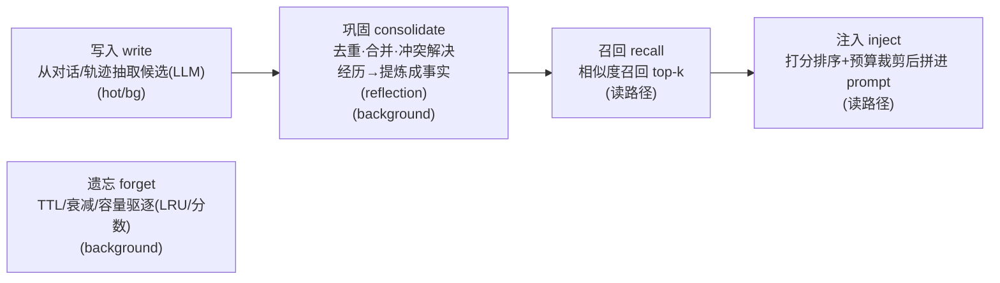
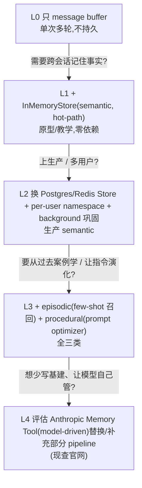
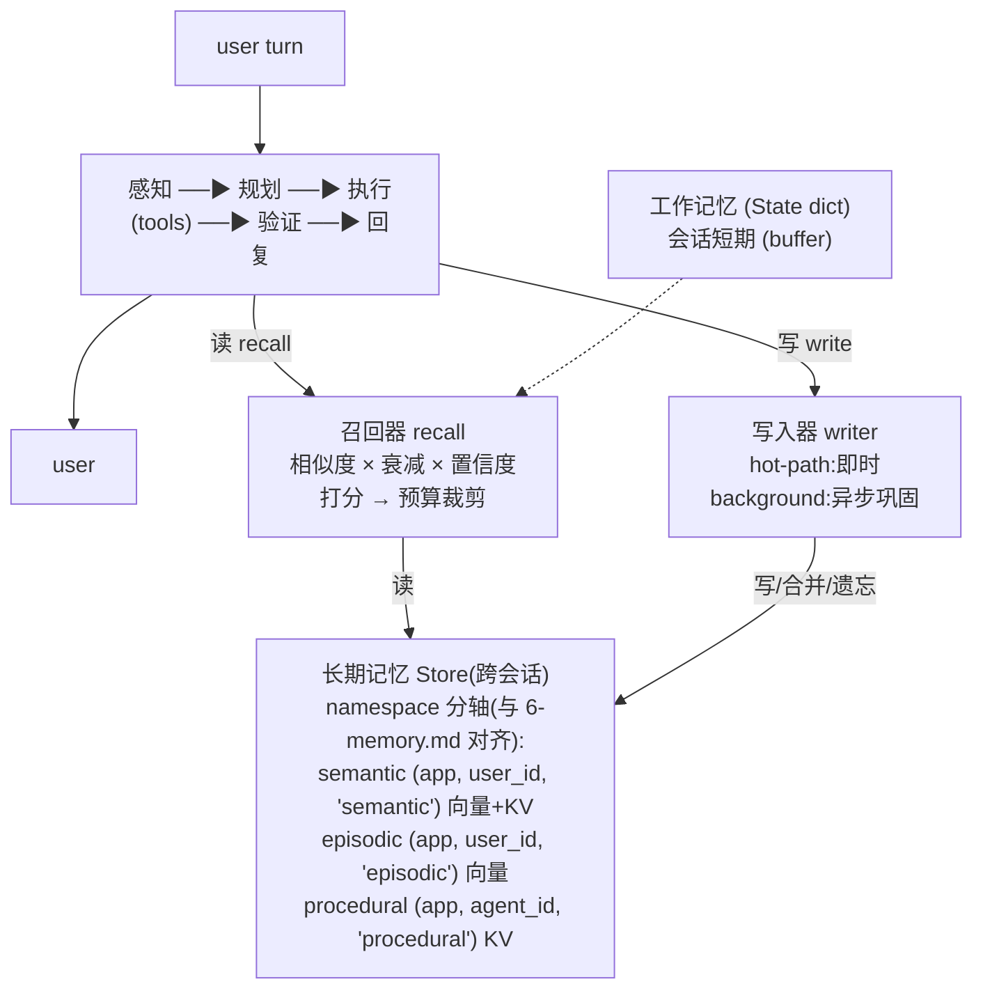
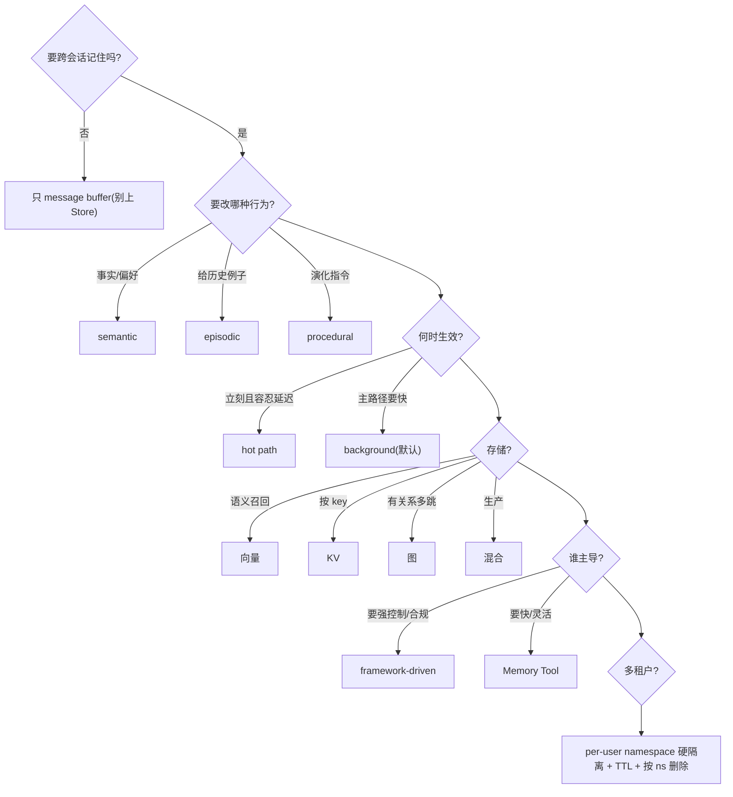

# 04 · 多层 Memory(短期/长期 · 语义/情景/程序 · Memory Tool)

> Agent 的「记忆」不是一个存储,而是**三条正交的轴**叠出来的能力层:作用域(工作/会话/跨会话)× 内容类型(semantic / episodic / procedural)× 更新时机(hot path / background)。讲透这层,核心是能把**写入→巩固→召回注入→遗忘**这条生命周期说清楚,并知道它和 RAG 在哪里重叠、在哪里分叉。
> 对应 JD:**职责 3(多层 Memory + Memory Tool)**。本章聚焦记忆的**分层 / 存储 / 更新 / 召回**;context 窗口管理与 Context Editing / Prompt Caching 降本归 **05**,这里只引用不展开。

---

## 1. 技术原理(它到底怎么工作)

### 1.1 先把「轴」分清:90% 的人把短期/长期和 semantic/episodic 混成一团

资深面试官最爱在这里设坑。**短期 vs 长期** 和 **semantic / episodic / procedural** 不是同一回事,它们是两条正交的轴,再叠上第三条「何时写」:

| 轴 | 取值 | 回答什么问题 | 落地组件 |
|---|---|---|---|
| **作用域 scope** | 工作记忆 / 会话短期 / 跨会话长期 | 这段记忆活多久、给谁看 | State(dict)/ checkpointer / Store |
| **内容类型 type** | semantic / episodic / procedural | 记的是事实 / 经历 / 技能 | 同一个 Store,靠 namespace 分轴 |
| **更新时机 timing** | hot path(即时)/ background(异步) | 什么时候把它写下来 | 主循环内写 / 异步 worker 写 |

一句话区分:**作用域决定「活多久」,内容类型决定「怎么改变 agent 行为」,更新时机决定「延迟 vs 反馈滞后」。** 三者可自由组合——比如「跨会话长期 × semantic × background」就是个人助理记用户偏好的标配。

> ✅ 标准答法:"短期/长期是**生命周期**问题,semantic/episodic/procedural 是**内容性质**问题。短期记忆里也可以有事实(刚抽到的实体放在 working memory),长期记忆里也分这三类。把它们当一条轴的人,通常会用一套 upsert 处理所有记忆,然后踩 episodic 被去重、procedural 没法回滚的坑。"

### 1.2 三个作用域:按访问模式选结构(承接 interview/3.md)

```
作用域           内容               访问模式              数据结构           持久化
─────────────────────────────────────────────────────────────────────────────
工作记忆         当前任务变量、      按 key 随机读写       dict / hash map    随 thread 在内存
(context 内)     已抽实体、计划进度                       (State 的 channel)  
─────────────────────────────────────────────────────────────────────────────
会话短期         本轮对话的          有序、尾部追加为主     list<message>      checkpointer
(thread 内)      message buffer                          + deque(滑窗)     → Redis/Postgres
─────────────────────────────────────────────────────────────────────────────
跨会话长期       事实/经历/规则      按相关性语义召回       向量库 + KV       Store
(跨 thread)                          / 按 key 取           (+ 图)            → Postgres/Redis
─────────────────────────────────────────────────────────────────────────────
```

- **工作记忆**就是 agent 的"草稿纸"——`{role,content}` 之外的结构化槽位。LangGraph 里它是 State 这个 `TypedDict` 的普通 channel(不是 `messages` 那个 append-only list)。它**不跨会话**,会话结束即弃。
- **会话短期 = message buffer**,顺序有语义,主操作是尾部追加 → list;超窗口时切 deque 做滑窗或"running summary + 近期 list"。靠 checkpointer 序列化实现多轮恢复(`thread_id` 是游标主键)。
- **跨会话长期 = Store**,本章重点。和短期在 LangGraph 里是 `compile()` 的**两个独立参数**:`checkpointer=`(thread 内)、`store=`(跨 thread)。

> 交叉引用:context 各层"为什么是 list / dict / deque / 向量库"的选型逻辑,见 `../3.md`(context 数据结构分层)。

### 1.3 三种内容类型:存储形态 + 召回方式 + 写策略各不相同

这是把"同一套 upsert"打散的关键。三类的差异不在概念,而在**写策略**:

| 类型 | 存什么 | 存储形态 | 召回方式 | 写策略(核心差异) |
|---|---|---|---|---|
| **Semantic** 语义 | 事实/偏好("用户在香港""偏好 LangGraph") | profile 文档 / (s,p,o) 三元组 | 语义相似度召回,或按 key 取 profile | **增删改 upsert**:矛盾事实必须主动删/覆盖,否则召回打架 |
| **Episodic** 情景 | 一次具体经历:(observation, trajectory, outcome) | 对话片段 / 任务轨迹三元组 | **只 embed `observation`(触发场景)**,拿当前任务去匹配"像的过去经历",few-shot 注入 | **纯追加**:发生过就是发生过,不改、不去重 |
| **Procedural** 程序 | 行为规则 / system prompt 片段 | 自然语言规则(Store 里的字符串) | **按固定 key 取**,不走语义召回(`index=False`),直接拼进 system prompt | **整体重写 + version bump**:规则演化要可回溯、可回滚 |

> ⚠️ 一个高区分度的细节:**episodic 只对 `observation` 做向量化,不整条 embed**。因为你要找的是"和现在这个任务像的过去经历",不是"措辞像的";整条 embed 会让 `reflection`/`outcome` 里的复盘文字污染匹配。procedural 干脆 `index=False`,它按 key 取。能讲到这一层,面试官会认为你真写过。

### 1.4 记忆生命周期:写入 → 巩固 → 召回注入 → 遗忘

这是本章的主干,也是和"纯 RAG"最大的区别——RAG 没有写入和遗忘:



- **写入(encode)**:从对话或工具轨迹里抽取候选记忆。通常一次 LLM 抽取调用。**时机选 hot path 还是 background,是延迟 vs 反馈滞后的取舍**(见 §4)。
- **巩固(consolidate)**:去重、合并、**冲突解决**(新旧矛盾),以及把多条 episodic 反思提炼成更稳定的 semantic("经历→知识")。这步几乎都放 background,因为它要再吃一次 LLM。
- **召回(recall)+ 注入(inject)**:把长期记忆按相关性塞进**有限 context**。机制 = 检索 + 打分 + 预算裁剪(见 §3 伪码)。这是 memory 和 RAG 机制上**重叠**的地方。
- **遗忘(forget)**:TTL 过期、时间衰减降权、容量上限驱逐。**没有遗忘的记忆系统迟早被陈旧/矛盾事实拖垮召回质量**——这是和 RAG 静态语料最不同的运维负担。

### 1.5 Memory 与 RAG:机制重叠,生命周期不同

面试高频。一句话切开:

| | RAG | Memory(尤其 semantic) |
|---|---|---|
| 内容来源 | 外部、策展好的**知识语料**(文档) | agent **自己积累**的、关于具体用户/自身的状态 |
| 读路径 | 向量检索 + 注入 | 向量检索 + 注入(**机制相同**) |
| 写路径 | 离线灌库,agent 视角**只读** | 写入-更新-遗忘是**一等公民**,在线变化 |
| 可变性 | 基本静态 | 高频变,且会自相矛盾(要冲突解决) |
| 隔离 | 通常全局共享 | 强 per-user / per-tenant 隔离 |

> ✅ 收口:"**semantic memory 的召回 = RAG 检索**,这部分代码几乎可以共用;区别全在写入侧——RAG 是只读知识库,memory 多了写入/更新/巩固/遗忘的生命周期,且内容是 agent 关于这个具体用户/自身积累的、会自相矛盾的状态。所以 memory 比 RAG 多一套'冲突解决 + 遗忘'的运维。" episodic 和 procedural 则离 RAG 更远——一个是 few-shot 示例检索,一个根本不走检索。

### 1.6 Anthropic Memory Tool:把"记什么/何时记"的决策权交给模型

前面 §1.1–1.5 是 **framework-driven memory**(你写抽取/召回 pipeline)。Anthropic 的 **Memory Tool** 代表另一条路线——**model-driven memory**:

**机制(稳定理解,具体字段/命令名/beta header 现查官网)**:
- 它是一个**客户端工具**(client-side / 你来托管存储后端):平台把一组"对一个记忆目录(如 `/memories`)做文件操作"的命令暴露给模型,命令形态与 text-editor 工具同源——`view` / `create` / `str_replace` / `insert` / `delete` / `rename`(命令集稳定;工具类型串/beta 状态随发布演进,**精确值现查官网**)。
- **模型自己决定**何时去翻记忆文件、何时写回。它在跨上下文/跨会话间用这些文件做持久化记忆——不再需要你写抽取/打分/注入的 pipeline。
- **存储后端是你的责任**:工具只是"接口契约",落到本地 FS、S3、DB 由你实现,因此**多租户隔离、加密、保留期、被遗忘权**也都在你这一侧治理(正好接 §1.7 隐私)。
- 常与 **Context Editing** 搭配(自动清理 context 里陈旧的 tool result 以降本)——但那归 **05**,这里不展开。

**它换走了什么:** 你少写一大堆 memory 基建代码;代价是**把写入质量/一致性的控制权让渡给模型**,且模型"翻文件"本身要烧 token(读写记忆文件都在消耗 context)。何时用哪条路线,见 §4。

### 1.7 一致性 · 隐私(PII)· 冲突解决

- **一致性**:同一事实多处冗余(profile + 三元组 + 某条 episodic 的复盘里都提到)易飘。治法:**semantic 作为单一事实源(SoT),其余引用不复制**;写入走部分更新(JSON-patch 式)而非"让 LLM 重吐整个 profile"(后者会丢字段)。
- **隐私(PII)**:记忆**跨会话持久化 PII**,风险面比单轮对话大得多。治法分层:写入侧做 PII 分类/脱敏(别把身份证、密钥写进记忆,尤其别写进**共享的 procedural**);存储侧静态加密 + **per-user namespace 硬隔离**(多租户);治理侧加 **TTL 保留期 + 按 namespace 一键删除**(被遗忘权 / GDPR delete)。
- **冲突解决(新旧矛盾)**:这是 semantic 独有的痛点(episodic 追加不冲突,procedural 靠 version 回滚)。策略谱系:
  - `last-write-wins`(最简,但旧值直接没了)
  - `recency-weighted`(新值覆盖,但旧值进 audit log 可追溯)✅ 默认推荐
  - `confidence / source-weighted`(带来源置信度,低置信不覆盖高置信)
  - `keep-both + timestamp`(都留着,召回时按时间衰减让新值赢)
  - `LLM-mediated merge`(让模型判断是"改变了"还是"补充了",贵但准)

---

## 2. 应用场景(甜区 vs 反模式 vs 隐藏成本)

**甜区(必须上多层记忆):**
- 个人助理 / 长期陪伴:跨会话记住用户事实与偏好 → semantic + 长期 Store。
- 客服 / 销售 agent 从优质对话学习:成功轨迹召回作 few-shot → episodic。
- 自我演化的 agent:指令随反馈改写、可回滚 → procedural。
- 多租户 SaaS:每个用户独立记忆,要硬隔离 → namespace 分轴 + per-user。

**反模式(过度工程信号):**
- **单次多轮对话**:会话结束就不需要记 → 一个 message buffer 足矣,别上 Store。
- **任务无状态**(纯函数式工具调用):没有"用户"概念,记忆无处依附。
- **把 RAG 当 memory**:你只是要检索一份静态文档库 → 那是 retrieval,不是 memory,别套写入/巩固/遗忘那一整套。
- **一上来就 episodic + procedural 全家桶**:大多数产品 80% 价值来自 semantic(记住偏好/事实)。先上 semantic,episodic/procedural 是后续拉开表现的抓手,不是起步标配。

**隐藏成本(选了之后才疼):**
- 每条记忆写入/巩固都是一次 **LLM 抽取调用** → token 成本随用户活跃度线性涨。
- 召回每轮都注入记忆 → **每轮 prompt 变长**,既费 token 又挤占 context(和 05 的 Context Editing 直接相关)。
- 记忆质量**随时间漂移**:陈旧事实、矛盾事实不清理,召回会越来越差 → 必须有遗忘/巩固的后台运维。
- 多租户下记忆是**合规资产**:一旦记 PII,删除/导出/审计都得跟上。

---

## 3. 具体实现方案(最轻起步 → 升级)

### 3.1 升级路径(别一步到位)



> 接口一致是关键:LangGraph `InMemoryStore(index={"embed": ...})` → 生产换 Postgres/Redis **只换实例**,namespace/读写代码不变。

### 3.2 架构(读写两条路 + 三轴 namespace)



> ⚠️ namespace 主轴:semantic/episodic 是 **per-user** → `(app, user_id, type)`;procedural 默认 **per-agent** → `(app, agent_id, 'procedural')`——"怎么做"是 agent 的能力、不随用户走,**仅当它编码用户专属偏好时才退化 per-user**。这条取舍轴与 `../1.md` §4、`6-memory.md` §4 一致。

### 3.3 数据结构(Pydantic;三类各自 schema)

```python
from datetime import datetime, timezone
from typing import Literal
from pydantic import BaseModel, Field

def _now() -> datetime:
    return datetime.now(timezone.utc)

class SemanticMemory(BaseModel):
    """事实/偏好。可增删改,矛盾必须解决。"""
    subject: str                 # "user"
    predicate: str               # "prefers_framework"
    object: str                  # "LangGraph"
    confidence: float = 1.0
    source_run_id: str | None = None      # provenance:可追溯/可撤销
    updated_at: datetime = Field(default_factory=_now)

class EpisodicMemory(BaseModel):
    """一次具体经历。纯追加,不改不去重。"""
    observation: str             # 触发场景 —— 只 embed 这个字段
    trajectory: list[dict]       # 工具调用序列 / 决策路径
    outcome: Literal["success", "failure"]
    reflection: str | None = None        # 复盘:不参与向量匹配
    created_at: datetime = Field(default_factory=_now)

class ProceduralMemory(BaseModel):
    """行为规则 / system prompt 片段。整体重写 + 版本号。"""
    rules: str
    version: int = 1
    derived_from_runs: list[str] = Field(default_factory=list)
```

### 3.4 写入 → 巩固 → 召回注入(核心伪码)

```python
HALF_LIFE_DAYS = 30          # 时间衰减半衰期
APP = "assistant"

# ---------- 写入(hot path 可调,默认放 background) ----------
def write_memories(store, user_id, recent_messages):
    candidates = llm_extract_semantic(recent_messages)   # 1 次 LLM 抽取
    for c in candidates:                                  # c: SemanticMemory
        upsert_semantic(store, user_id, c)               # 走冲突解决,见下

# ---------- 冲突解决(semantic 专属:新旧矛盾) ----------
def upsert_semantic(store, user_id, new: SemanticMemory):
    ns = (APP, user_id, "semantic")
    key = f"{new.subject}:{new.predicate}"               # 同主谓 = 潜在冲突
    old = store.get(ns, key)
    if old and old.object != new.object:
        # recency-weighted:新值覆盖,旧值进 audit log(可追溯/撤销)
        audit_log(user_id, old, new, reason="contradiction")
        if new.confidence < old.confidence - 0.2:        # 低置信不覆盖高置信
            return
    # 部分更新(JSON-patch 式),不让 LLM 重吐整个 profile → 避免字段丢失
    store.put(ns, key, new.model_dump())

# ---------- 巩固(background:经历→知识 + 遗忘) ----------
def consolidate(store, user_id):
    episodes = store.list((APP, user_id, "episodic"))
    facts = llm_distill(episodes)        # 多条经历反思,提炼稳定 semantic
    for f in facts:
        upsert_semantic(store, user_id, f)
    evict(store, user_id)                # 见下:TTL/容量驱逐

# ---------- 遗忘(TTL + 容量驱逐) ----------
def evict(store, user_id, cap=500):
    ns = (APP, user_id, "semantic")
    items = store.list(ns)
    items = [m for m in items if not expired(m)]         # TTL 过期先删
    if len(items) > cap:                                 # 容量上限:按分数驱逐
        items.sort(key=lambda m: m.confidence * recency(m.updated_at))
        for m in items[:len(items) - cap]:
            store.delete(ns, key_of(m))

# ---------- 召回 + 注入(读路径:检索 + 打分 + 预算裁剪) ----------
def recall_and_inject(store, user_id, agent_id, query, token_budget):
    facts    = store.search((APP, user_id,  "semantic"),  query=query, limit=10)
    episodes = store.search((APP, user_id,  "episodic"),  query=query, limit=3)
    rules    = store.get((APP, agent_id, "procedural"), key="active")  # 不走语义

    scored = []
    for m, sim in facts + episodes:
        score = sim * recency(m.updated_at) * getattr(m, "confidence", 1.0)
        scored.append((score, m))
    scored.sort(reverse=True)

    selected, used = [], 0                               # 贪心按分数塞,直到预算用尽
    for score, m in scored:
        cost = est_tokens(m)
        if used + cost > token_budget:
            break
        selected.append(m); used += cost
    return assemble_prompt(rules, selected)              # procedural 进 system,其余进 context

def recency(ts):                                         # 指数衰减
    age_days = (_now() - ts).days
    return 0.5 ** (age_days / HALF_LIFE_DAYS)
```

> 要点:召回**先检索后打分再裁剪**——打分 = `相似度 × 时间衰减 × 置信度`,裁剪是贪心填到 `token_budget` 为止。预算典型量级:给记忆注入留**约 1–2k token / top-k 3–8 条**(⚠️ 快照,按你模型窗口与 05 的 Context Editing 策略调)。

### 3.5 框架/工具(⚠️ 2026-06 快照,API 名易变,现查官网)

- LangGraph:`store=` / `checkpointer=` 是 `compile()` 两个独立参数;`Store.search/get/put`;`index={"embed": ...}` 配语义召回。
- LangMem:`create_manage_memory_tool` / `create_search_memory_tool` 把 semantic 暴露成 agent 可调工具;`create_multi_prompt_optimizer(kind="prompt_memory")` 吃轨迹+反馈输出改写后的 prompt(procedural)。底层 semantic 增量更新用 **trustcall 的 JSON-patch**,避免重吐整个 profile 丢字段。
- Anthropic Memory Tool:**client-side**、文件目录式、model-driven(§1.6)。命令集 `view`/`create`/`str_replace`/`insert`/`delete`/`rename`(对 `/memories` 操作);当前工具类型串约为 `memory_20250818`,多数 SDK 走非 beta 的 `messages.create`——**类型串/beta header 易随发布漂移,精确值现查官网**。

---

## 4. 架构师取舍判断

### 4.1 更新时机:hot path vs background

| | Hot Path(主循环内即时写) | Background(异步 worker 写) |
|---|---|---|
| 何时生效 | 立刻,本轮就能召回 | 下次会话/下一轮才生效 |
| 延迟代价 | **每写一次多一次 LLM 抽取(几百 ms~数秒),直接加到用户感知延迟** | 主路径干净、快 |
| 复杂度 | 简单(同步) | 需要队列/worker |
| 选择 | 偏好类必须立刻记住、可接受延迟 | **默认推荐**:主 agent 轻快,巩固/抽取丢后台 |

> 取舍轴:**延迟 vs 反馈滞后**。默认 background;只有"这一句必须当场记住并立刻影响后续回答"才上 hot path。

### 4.2 存储后端

| 后端 | 适合 | 代价 |
|---|---|---|
| **向量库** | semantic/episodic 的语义召回 | 写入要 embed;近似召回有误差 |
| **KV** | procedural(按 key 取)、profile 直取 | 不支持语义查询 |
| **文档库** | profile 整体读写、半结构化 | 大文档更新易丢字段(用 JSON-patch) |
| **图** | 记忆间**有关系**(实体 A 关联 B、依赖链)、多跳推理 | 重,运维成本高,多数场景过度 |
| **混合** ✅ | 生产常态:KV 存 profile/procedural + 向量索引 semantic/episodic | 两套一致性要维护 |

> ❓ 何时上图:仅当"召回需要沿关系多跳"(如"用户的同事的项目")。否则向量 + metadata filter 足够,别一上来就 knowledge graph。

### 4.3 路线:framework-driven(LangMem/裸 Store)vs model-driven(Memory Tool)

| | Framework-driven(你写 pipeline) | Model-driven(Anthropic Memory Tool) |
|---|---|---|
| 谁决定记什么/何时记 | 你的抽取/召回代码 | 模型自己 |
| 写入质量/一致性控制 | **强**(schema、冲突解决、遗忘都在你手里) | 弱(让渡给模型) |
| 基建代码量 | 大 | 小 |
| token 成本 | 抽取/注入可控 | 模型"翻文件"额外烧 token |
| 可移植/可审计 | 好(自有 schema 与 audit) | 取决于你托管的后端 |
| 甜区 | 强一致、强合规、多租户、要精细打分 | 想快速起步、记忆形态灵活、愿让模型主导 |

> ✅ 现实选择:**生产强一致/合规场景主选 framework-driven**(裸 Store 要细控制,LangMem 要快);Memory Tool 适合"少写基建、模型主导"的探索或补充。两者可并存——Memory Tool 管自由格式 scratch 记忆,framework 管结构化、需冲突解决的 semantic。

### 4.4 选型轴汇总



---

## 5. 面试高频问答

**Q1. 短期/长期记忆,和 semantic/episodic/procedural 是一回事吗?**
A:不是,两条**正交轴**。短期/长期是**生命周期**(活多久:工作记忆/会话/跨会话);semantic/episodic/procedural 是**内容性质**(记的是事实/经历/技能)。它们自由组合,比如"跨会话 × semantic × background"是记用户偏好的标配。再叠第三条轴:**更新时机**(hot path / background)。
> 面试官可能追问:**那短期记忆里能有 semantic 吗?** 答:能。刚从本轮对话抽到的实体放在 working memory(State 的 dict channel),它是 semantic 内容,但作用域是短期、会话结束即弃;只有写进 Store 才变成跨会话长期。把"内容类型"和"作用域"绑死是常见误区。

**Q2. memory 和 RAG 到底什么区别?什么时候算 memory、什么时候算 RAG?**
A:**读路径机制相同**(向量检索 + 注入),区别在写路径和归属:RAG 是只读的、外部策展的知识语料;memory 是 agent 自己积累的、关于具体用户/自身的状态,且**写入-更新-巩固-遗忘是一等公民**,会自相矛盾、要冲突解决、要 per-user 隔离。所以"semantic memory 的召回 ≈ RAG 检索,代码能共用;memory 多的是写入侧那一整套生命周期"。episodic(few-shot 召回)和 procedural(根本不走检索)离 RAG 更远。
> 面试官可能追问:**那我用同一个向量库存文档和用户事实,有问题吗?** 答:机制上可行,但要**namespace/collection 隔离**——否则用户 PII 和公共文档混在一个索引里,既污染召回又踩合规;而且文档不需要遗忘/冲突解决,用户事实需要,运维策略不同,别混。

**Q3. 长期记忆几百上千条,怎么塞进有限 context?**
A:**检索 + 打分 + 预算裁剪**三步:① 用当前 query 语义召回 top-k(semantic/episodic);procedural 按 key 直取不走检索。② 打分 = `相似度 × 时间衰减 × 置信度`,排序。③ 贪心按分数填到 token 预算上限(典型留约 1–2k token / 3–8 条,⚠️ 按窗口调)。procedural 进 system,其余进 context。**绝不全量注入**——既费 token 又挤占窗口,还稀释注意力。
> 面试官可能追问:**预算被记忆吃满了,正经对话历史放不下怎么办?** 答:这就是和 05 Context Editing 的接口——记忆注入有独立预算配额(如总窗口的 10–15%),超了就降 top-k 或提高相似度阈值;同时用 Context Editing 清理陈旧 tool result 腾空间。记忆和对话历史是**两个预算池**,不能互相挤爆。

**Q4. 用户上次说"我喜欢 X",这次说"我不喜欢 X 了",你怎么处理?**
A:这是 **semantic 冲突解决**(episodic 追加不冲突、procedural 靠 version)。同 `subject:predicate` 命中即潜在冲突,默认 **recency-weighted**:新值覆盖,旧值写 audit log 可追溯/撤销;叠 confidence/source 加权,低置信不覆盖高置信。复杂场景用 LLM 判断这是"改变了"还是"补充了"(贵但准)。关键是**别用纯 append**——否则两条矛盾事实都被召回,模型行为飘。
> 面试官可能追问:**你怎么知道是冲突而不是两个不同的偏好?** 答:靠 schema 把事实结构化成 (subject, predicate, object) 三元组,**同主谓不同宾即冲突**;只存自由文本就判不出冲突,这正是要结构化 schema 而非塞一坨字符串的原因。

**Q5. 为什么不能用一套 upsert 处理三类记忆?**
A:写策略本质不同:**semantic 增删改**(矛盾要主动删),**episodic 纯追加**(发生过不改、不去重),**procedural 整体重写 + version bump**(要可回滚)。一套 upsert 会:把 episodic 去重掉(丢失"那一次"的独立性)、让 procedural 没法回滚(规则改坏了退不回去)。这就是要三套独立 schema + 写路径的原因。

**Q6. Anthropic Memory Tool 和你自己用 LangMem 写那套,区别在哪?用哪个?**
A:**控制权归属**不同。Memory Tool 是 **model-driven**——把"记什么/何时记/何时召回"交给模型,工具只暴露对记忆目录的文件操作(命令名/字段现查官网),存储后端你托管;省基建,但让渡写入质量/一致性控制,且模型翻文件烧 token。LangMem/裸 Store 是 **framework-driven**——schema、冲突解决、遗忘、审计都在你手里,适合强一致/合规/多租户。**生产强一致主选 framework-driven;探索或自由格式记忆用 Memory Tool;可并存**。

**Q7. 多层记忆里的 PII / 隐私怎么治?多租户怎么隔离?**
A:记忆**跨会话持久化 PII**,风险比单轮大。三层治:**写入侧**做 PII 分类/脱敏,绝不把密钥/身份证写进记忆,尤其不写进**共享的 procedural**;**存储侧**静态加密 + `(app, user_id, type)` **per-user namespace 硬隔离**;**治理侧** TTL 保留期 + 按 namespace 一键删除(GDPR delete / 被遗忘权)+ audit log。procedural 默认 per-agent 不含用户数据,只有编码用户专属偏好时才退化 per-user。

**Q8.(深度)episodic 你 embed 哪个字段?为什么不整条 embed?**
A:**只 embed `observation`(触发场景)**。召回时拿当前任务去匹配——你要的是"和现在这个任务像的过去经历",不是"措辞像的"。整条 embed 会让 `reflection`/`outcome` 里的复盘文字污染匹配。procedural 干脆 `index=False` 按 key 取。这个取舍直接决定 episodic 召回准不准。

---

## 6. 踩坑 / 反模式

| 反模式 | 选错的典型信号 | 治法 |
|---|---|---|
| **一套 upsert 通吃三类** | episodic 被去重、procedural 改坏退不回 | 三套独立 schema + 写路径(增删改/追加/重写+version) |
| **只有 working memory + semantic 就叫"两层记忆"** | 缺成功轨迹召回、缺自我改写 | 补 episodic(few-shot)+ procedural(prompt optimizer),这俩才拉开表现 |
| **整条 embed episodic** | 召回总是"措辞像但任务不像" | 只 embed `observation`;reflection/outcome 不进索引 |
| **让 LLM 每次重吐整个 profile 做更新** | 字段莫名丢失、profile 越更新越残 | 部分更新 / JSON-patch(trustcall 那一套) |
| **没有遗忘机制** | 召回质量随时间下降、矛盾事实并存 | TTL + 时间衰减打分 + 容量驱逐;background 巩固 |
| **纯 append 存 semantic** | 矛盾事实都被召回、模型行为飘 | 同主谓冲突解决(recency/confidence 加权 + audit) |
| **把静态文档库套上记忆全家桶** | 给只读文档配了写入/巩固/遗忘 pipeline | 那是 RAG,只做检索注入,别上 memory 生命周期 |
| **hot path 写一切** | 用户每句都卡几百 ms~数秒 | 默认 background;只有"必须当场记住"才 hot path |
| **procedural 挂在 user_id 下** | 同一 agent 的"做事方式"被每个用户各存一份、改一处不生效 | procedural 默认 `(app, agent_id, 'procedural')` per-agent |
| **记忆注入无预算,全量塞** | 对话历史被挤爆、token 暴涨、注意力稀释 | 独立预算配额 + top-k + 相似度阈值,配合 05 Context Editing |
| **多租户记忆不隔离** | 一个用户召回到另一个用户的事实 | per-user namespace 硬隔离 + 删除/审计 |

---

## 7. 回链已有资产 / 课程

- 选型矩阵(记什么/存哪/何时更新,决策树 + Spec-Kit prompt 块):`../../roadmap/agent-selection/6-memory.md`
- 记忆类型心智模型(semantic/episodic/procedural × LangGraph BaseStore × namespace 取舍):`../1.md`(§2–§6)
- context 数据结构分层(顺序选 list / 随机 key 选 map / 滑窗选 deque / 语义检索选向量库 / 关系选图):`../3.md`
- 检索基础设施(semantic 记忆的向量召回 = RAG 检索,共用此层):`../../roadmap/agent-selection/3-retrieval.md`
- 编排框架(LangGraph 的 checkpointer/Store 是记忆基础设施):`../../roadmap/agent-selection/2-framework/`
- 课程回溯:`../../courses/12-Long-Term Agentic Memory With LangGraph/notes/00-总结回顾.md`(及 L2–L5 code)
- 邻章边界:context 窗口管理 / Context Editing / Prompt Caching 降本 → 本系列 **05**(本章只引用不展开)
