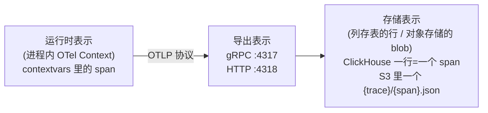
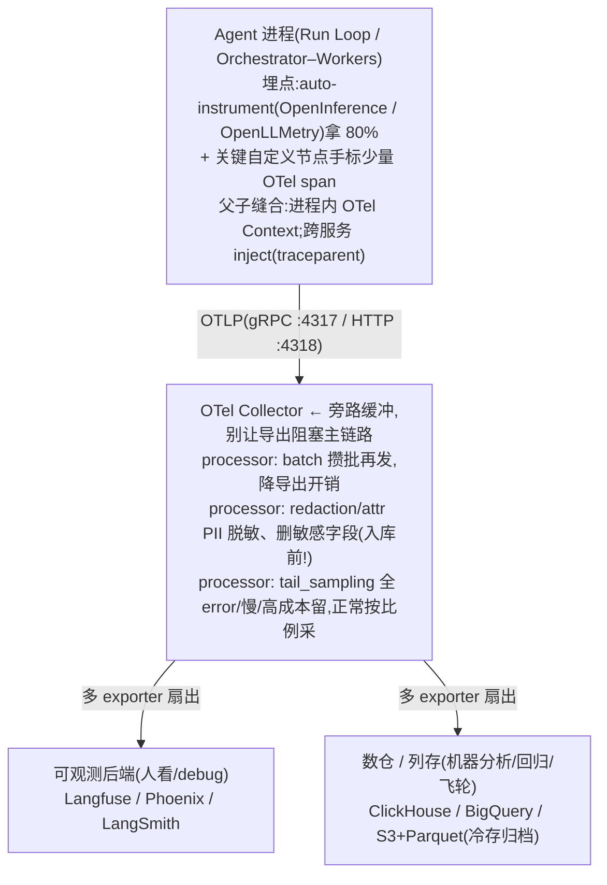
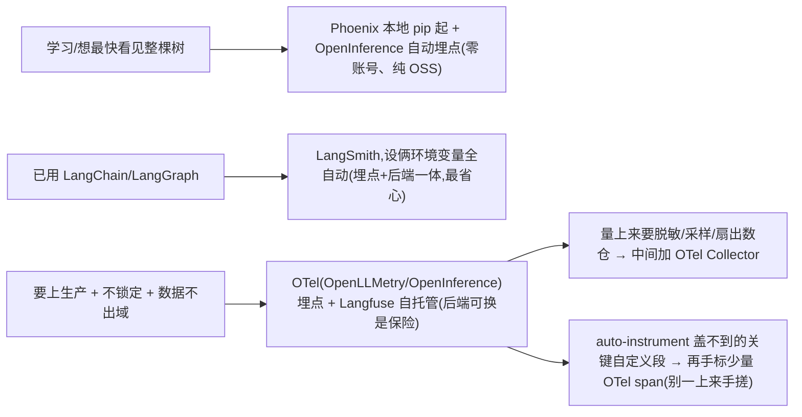
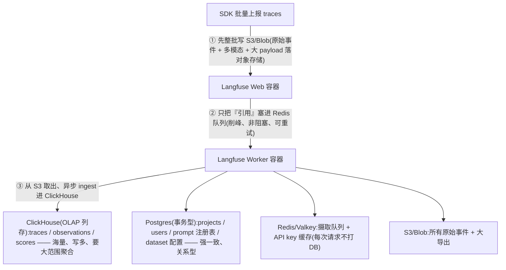
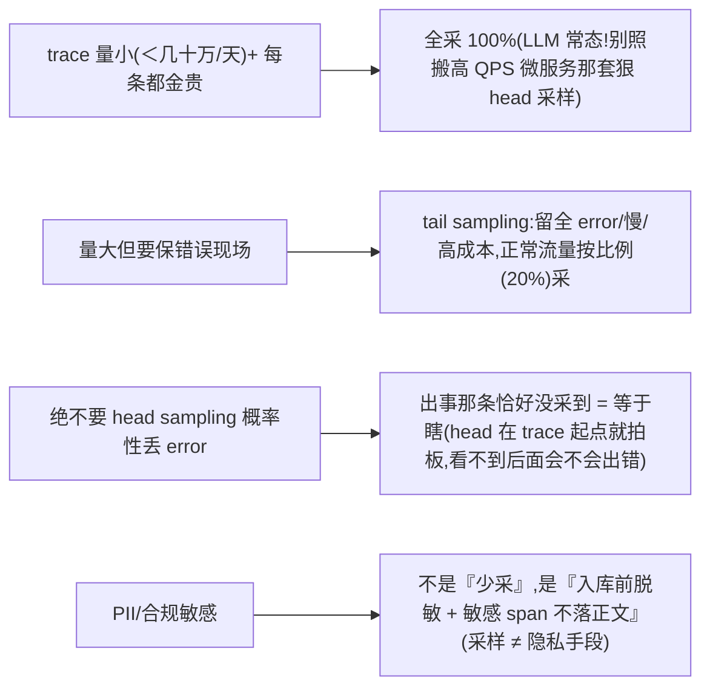

# 06 · 全链路 trace 落库与可观测

> 一次提问 = 一棵 span 树;trace 不只"看",还要**持久化进存储/数仓做分析、回归、数据飞轮**。对应 JD **职责 3(全链路 trace 落库)**;埋点标准与 OTel 经验同时回应 **加分项(MCP/A2A 跨服务链路)**。
>
> **边界**:eval 方法论(怎么判好坏、4 层评估、LLM-as-Judge)归 09;本章只聚焦三件事——**trace 怎么产生 → 怎么落库 → 怎么治理**。平台选型结论复用 `../../roadmap/agent-selection/5-observability-eval.md`「子决策 0/1」,本章补它较薄的**「落库/存储/采样/隐私」**那一块。
>
> 结论分级:✅ 稳定经验 / ⚠️ 2026-06 快照(易变)/ ❓ 待验证。易变的版本号/价格/字段名一律标「(现查官网)」。

---

## 1. 技术原理(它到底怎么工作)

### 1.1 trace 不是日志,是一棵 span 树

先把三个常被混为一谈的东西分清(资深面试官第一刀就砍这里):

| | 是什么 | 丢了什么 | agent 里够不够 |
|---|---|---|---|
| **log** | 离散事件点(一行一条) | 跨步骤的**因果父子链** | ❌ 拼不出"走了哪条路" |
| **metric** | 聚合数值(P95、QPS) | 单次请求的内部结构 | ❌ 知道慢,不知道哪一步慢 |
| **trace** | 带 `parent_span_id` 的 **span 树** | —— | ✅ 唯一能定位到"具体哪一步坏" |

一次用户提问 = **一条 trace(root span)**,链路每步是嵌套**子 span**(数据模型细节见 `5-observability-eval.md`「子决策 0·一」,这里不重画)。关键是**每个 span 至少记五样**:input / output / 耗时 / token·成本 / 状态(ok·error),LLM span 再加 **model id、推理参数、prompt 版本**。这棵树是 debug "RAG 答非所问 / agent 乱调工具" 时**唯一能定位到具体哪一步**的结构。

### 1.2 span 的物理结构:它凭什么能拼成树

一个 span 落到底层就是这么几个字段(OTel 模型,✅ 稳定):

```
span {
  trace_id        # 16 字节 / 32 hex —— 一棵树里所有 span 共享同一个
  span_id         # 8 字节 / 16 hex —— 本 span 唯一
  parent_span_id  # 指向父 span;为空 = root span
  name, kind      # "llm.plan" / LLM·TOOL·RETRIEVER·AGENT·GUARDRAIL·CHAIN
  start, end      # 纳秒级时间戳 → 算 duration
  status          # OK / ERROR(+ 给 HITL 留 PAUSED)
  attributes{}    # 键值对:model id、token、cost、prompt 版本、session_id…
  events[]        # 时间点事件(可放大 payload)
  links[]         # 跨 trace 的弱关联
}
```

**树是靠 `trace_id` 聚、靠 `parent_span_id` 连出来的**——不是靠时间排序猜的。理解这点,后面"跨服务怎么还是一棵树""HITL 怎么被切断"才讲得透。

### 1.3 父子缝合机制:进程内 vs 跨进程

这是面试最容易被追到底的机制点,务必能讲到 contextvars / header 这一层:

**① 进程内(同一个 Python/TS 进程)** —— 靠 **OTel Context 隐式传递**。Python 用 `contextvars` 存"当前 active span";`start_as_current_span()` 会自动把**当前 active span 当 parent**,于是你在 `llm.call` 里再开 `tool.weather` 就天然嵌套。这也是为什么 async/多线程里 context 串味是经典坑——`contextvars` 不会自动跨线程传。

**② 跨进程 / 跨服务 / 跨 agent(A2A)** —— 靠 **W3C Trace Context 标准 header**(✅ 稳定):

```
traceparent: 00-0af7651916cd43dd8448eb211c80319c-b7ad6b7169203331-01
             └┬┘ └──────────── trace_id(32 hex)────────────┘ └─ parent span_id ─┘ └┬┘
            version            (一棵树共享)                    (16 hex)            flags(采样位)
tracestate: 厂商私有 KV(可选,放各家自己的扩展)
```

上游 `inject(headers)` 把 traceparent 写进 HTTP/gRPC header,下游 `extract(headers)` 取出来当 parent context → **两个服务的 span 进同一个 `trace_id`**。Orchestrator 调 Worker、A2A 协议跨 agent、MCP Gateway 转发工具调用,全靠这一个 header 把链路缝成一棵树。**埋点标准换不换都行,traceparent 是 W3C 标准,跨厂商通用。**

### 1.4 从"产生 span"到"落库":三种表示 + 一条数据通路

一条 trace 在生命周期里有**三种表示**(对齐 `../1.md` 里"运行时/持久化/拼进 prompt 是三件事"的同款心智):



**「落库」的本质**:span 通过 **OTLP**(OpenTelemetry Protocol,默认端口 gRPC `4317` / HTTP `4318`,✅ 稳定)吐给后端,后端把它**写成可查询、可聚合、可长期留存的数据**——不是看完就丢的实时流。这一步决定了你能不能"按 prompt 版本 group by 算 P95 成本""把上周所有失败 trace 捞出来回流成 eval 样本"。**这正是本章相对 `5-observability-eval.md` 要补深的地方:它讲透了"span 怎么产生",但"span 落哪、怎么存得起、怎么查得动"较薄。**

---

## 2. 应用场景(什么时候必须用 / 什么时候过度工程)

**🎯 甜区(必须上全链路 trace 落库)**

- **多步 agent / 多 Agent 编排**:Orchestrator–Workers、Run Loop(感知→规划→执行→验证)路径非确定,组件级日志拼不出"它到底走了哪条路、为什么绕路"。
- **RAG 归因**:答非所问到底是检索召回烂、还是 LLM 没用上下文 → 只有 trace 能把 `retrieve` span 的 output 和 `llm` span 的 input 摆在一起看。
- **成本/延迟核算到节点级**:哪个工具最慢、哪步 token 最贵、Prompt Caching 命中没——要 group by `model_id`/`prompt_version` 出报表。
- **回归 + 数据飞轮**:prompt/模型一改怕回归,需要把历史 trace 当**数据资产**沉淀,失败 trace 回流成 eval 样本(数据通路在本章,eval 方法在 09)。
- **合规/审计**:谁在什么时候调了什么工具、人审闸口卡过哪条——要可追溯落库。

**🚫 反模式(别在这上面过度工程)**

- **单次无状态 LLM 调用 + 已有成熟 APM**:一个翻译接口,Datadog/现有 metric 够了,不必硬塞一套 trace 平台。
- **Demo/PoC 阶段就自建 Collector + ClickHouse 集群**:还没跑通业务先运维一套有状态数据栈,典型预支。先 Phoenix 本地 pip 起 / SaaS 免费档,**别一上来自托管**。
- **把 trace 当 print 用**:只在本地看、从不落库、从不回归——那只拿到了 20% 价值(看),丢了 80%(分析/回归/飞轮)。

**💰 隐藏成本(选型前必须算的账)**

- **存储体积**:带全量 prompt/completion 的 trace,单条常 **1~50 KB**(长 context、RAG 多文档会更大)。⚠️ 100 万 trace/天 × 10 KB ≈ 10 GB/天**原始**,文本列存压缩后约 1/5~1/10(量级感,具体看数据)。**长 context agent 的 trace 体积是真账单。**
- **导出对主链路的拖累**:同步直发 SaaS,网络抖动会**阻塞 agent 主链路**——必须异步/批量/旁路 Collector 缓冲。
- **隐私/合规**:原始 input/output 里大概率有 PII,落库即风险——脱敏成本必须前置进埋点,不是事后补。

---

## 3. 具体实现方案(最轻起步 → 升级)

### 3.1 架构图:埋点 → Collector → 双扇出(看 + 分析)



> ⚠️ Collector 不是必须的第一步——SDK 可直发后端。但**一旦上生产、要做脱敏/采样/多后端扇出/削峰**,Collector 这层旁路就值得加(它把"埋点"和"后端"彻底解耦)。

### 3.2 最轻起步 → 升级路径



### 3.3 关键代码 1:手标一个 LLM span(把归因字段钉进属性)

```python
from opentelemetry import trace
from opentelemetry.trace import SpanKind, Status, StatusCode

tracer = trace.get_tracer("agent.runloop")

def llm_plan(messages, *, model_id, prompt_version, thread_id):
    # 子 span 由 OTel Context 自动认 parent —— 不用手传 parent_span_id
    with tracer.start_as_current_span("llm.plan", kind=SpanKind.CLIENT) as span:
        # ── 配置即代码:把"回归归因"要的字段钉死进 span 属性 ──
        # gen_ai.* 字段名仍在演进(2026 仍 experimental),现查官网
        span.set_attribute("gen_ai.system", "anthropic")
        span.set_attribute("gen_ai.request.model", model_id)   # 钉具体 id,别记滚动 alias
        span.set_attribute("gen_ai.request.temperature", 0.0)
        span.set_attribute("app.prompt.version", prompt_version)  # 自定义命名空间用 app.*
        span.set_attribute("session.id", thread_id)              # 缝多轮:同 session 多棵树
        try:
            resp = client.messages.create(model=model_id, messages=messages)
            u = resp.usage
            # ⚠️ 计费坑:Anthropic 的 usage.input_tokens 是「未命中缓存的剩余」,
            # 不含 cache_read_input_tokens / cache_creation_input_tokens —— 三者相加才是总输入。
            # (OpenAI 相反:prompt_tokens 已含 cached_tokens。映射 OTel gen_ai.* 字段名现查官网)
            span.set_attribute("gen_ai.usage.input_tokens", u.input_tokens)
            span.set_attribute("gen_ai.usage.output_tokens", u.output_tokens)
            span.set_attribute("app.cache_read_tokens", u.cache_read_input_tokens)      # 单列:命中缓存的输入(~0.1x)
            span.set_attribute("app.cache_creation_tokens", u.cache_creation_input_tokens)  # 写缓存(~1.25x)
            # 成本要分别按 input / cache_read / cache_creation / output 的不同单价加总,别只乘 input_tokens
            span.set_attribute("app.cost_usd", estimate_cost(model_id, u))
            # 大 payload 走 event,且先脱敏再进;敏感正文别直接当属性
            span.add_event("gen_ai.completion", {"content": mask_pii(resp.text)})
            span.set_status(Status(StatusCode.OK))
            return resp
        except Exception as e:
            span.set_status(Status(StatusCode.ERROR, str(e)))
            span.record_exception(e)
            raise
```

要点:**不用手传 parent**(Context 自动缝);**model_id / prompt_version / session.id 是回归归因的底座**,埋点时不钉,事后指标一动就归因不到(对齐 `5-observability-eval.md`「子决策 3·配置即代码」)。

### 3.4 关键代码 2:A2A / 跨服务把 traceparent 传下去

```python
from opentelemetry.propagate import inject, extract

# ── Orchestrator(Agent A)调 Worker / 远端 Agent B ──
headers = {}
inject(headers)                       # 把当前 span 的 traceparent 写进 headers
resp = httpx.post(b_url, json=payload, headers=headers)

# ── Agent B 入口:取出上游 context,后续 span 自动挂到上游 trace 下 ──
ctx = extract(request.headers)
with tracer.start_as_current_span("agentB.handle", context=ctx):
    ...   # 这里产生的所有 span 与 A 共享 trace_id,UI 上是一棵连通的树
```

没有这一步,A 和 B 就是**两棵互不相干的树**,跨 agent 的链路在 UI 上断开——多 Agent 编排最常见的"trace 看着缺一半"就是漏了 inject/extract。

### 3.5 关键数据结构:span 落库的列存表(示意,非建表脚本)

```sql
-- 一行 = 一个 span;同 trace_id 的行聚成一棵树。引擎/语法按实际平台,这里示意
CREATE TABLE spans (
  trace_id        String,          -- 32 hex,一棵树共享
  span_id         String,          -- 16 hex
  parent_span_id  String,          -- 空 = root span
  session_id      String,          -- 缝多轮:一个会话多棵 trace
  name            String,
  kind            Enum8('LLM','TOOL','RETRIEVER','AGENT','GUARDRAIL','CHAIN'),
  start_time      DateTime64(6),
  duration_ms     UInt32,
  status          Enum8('OK','ERROR','PAUSED'),  -- PAUSED 留给 HITL,别把等人误标 ERROR
  model_id        LowCardinality(String),         -- 低基数列,压缩 + group by 快
  prompt_version  LowCardinality(String),
  input_tokens    UInt32,
  output_tokens   UInt32,
  cost_usd        Float64,
  io_ref          String,          -- 大文本/PII 不进热表:存指针,正文落对象存储且脱敏后
  attributes      Map(String,String)
) ENGINE = MergeTree
PARTITION BY toDate(start_time)     -- 按天分区,便于 TTL 过期/冷热分层
ORDER BY (session_id, trace_id, start_time)
TTL start_time + INTERVAL 90 DAY;   -- 热表保留期;过期转 rollup 聚合表 + 冷存归档
```

设计要点:① **大 payload 不进热表**(用 `io_ref` 指针,正文脱敏后落 S3);② **低基数列**(model_id/prompt_version)用列存天然适合 group by 聚合;③ **按天分区 + TTL** 实现保留期与冷热分层。

### 3.6 关键配置:Collector 做脱敏 + 尾采样(入库前治理)

```yaml
# 字段名/processor 名各版本有差异,现查官网;这里示意"治理在 Collector 层做"
receivers:
  otlp:
    protocols: { grpc: {endpoint: 0.0.0.0:4317}, http: {endpoint: 0.0.0.0:4318} }
processors:
  redaction:                 # 入库前脱敏:敏感字段值正则替换/丢弃
    blocked_values: ["\\b\\d{13,19}\\b"]   # 卡号样式
  tail_sampling:             # 等整棵 trace 攒齐再决定采不采(有状态,要 buffer)
    policies:
      - { name: keep-errors, type: status_code, status_code: {status_codes: [ERROR]} }
      - { name: keep-slow,   type: latency,     latency: {threshold_ms: 5000} }
      - { name: sample-rest, type: probabilistic, probabilistic: {sampling_percentage: 20} }
  batch: {}
exporters:
  otlphttp/langfuse: { endpoint: "http://langfuse:3000/api/public/otel" }  # 端点现查官网
service:
  pipelines:
    traces:
      receivers:  [otlp]
      processors: [redaction, tail_sampling, batch]   # 脱敏在前,别把 PII 采进去再说
      exporters:  [otlphttp/langfuse]
```

---

## 4. 架构师取舍判断

### 4.1 轴一:埋点标准(决定后端能不能换 = 软锁)

这条直接复用 `5-observability-eval.md`「子决策 0·二」的结论,本章不重写,只补一句**归属对照**(面试常被问 OpenInference 和 OpenLLMetry 谁是谁):

| 埋点方式 | 归属/原理 | 软锁程度 | 选它的判据 |
|---|---|---|---|
| **框架原生 callback** ⭐起步 | LangChain/LangGraph 等内置,设环境变量即出 span;认得 checkpoint/interrupt | **高**(与后端绑死,如 LangSmith) | 已用某框架 + 配它官方后端,要最省心 |
| **OpenInference** | **Arize 系**,Phoenix 配套;span kind 分 LLM/CHAIN/TOOL/RETRIEVER/RERANKER/AGENT | **低**(OTel 之上,后端可换) | 用 Phoenix / 要框架中立标准化 |
| **OpenLLMetry** | **Traceloop 系**,直接贴 OTel `gen_ai.*` 语义约定 | **低** | 想最贴 OTel 官方约定、多后端 |
| **手搓 OTel span** | 自己 `start_span` | 完全可控 | auto-instrument 盖不到的自定义段**少量补标**(别全靠手搓) |

> ✅ **架构师默认**:埋点走 OTel(OpenInference/OpenLLMetry)→「埋一次、后端任意换」,把这条软锁取舍写进 ADR。落地默认:**auto-instrument 拿 80%,关键节点手标 20%,别一上来手搓**(手搓最容易把一次人审切成两条断 trace,见 §6)。
> ⚠️ OTel GenAI 语义约定 2026 年仍是 **experimental**,字段名还在动(prompt_tokens→input_tokens 这类改名发生过),**具体字段名现查官网**。

### 4.2 轴二:后端存储选型(本章重点,补 5-obs 的薄弱面)

| 形态 | 代表 | 存储引擎 | 甜区 | 代价 |
|---|---|---|---|---|
| **SaaS 平台** | LangSmith / Langfuse Cloud | 厂商托管 | 零运维、trace+eval 开箱 | 数据出域、按量计费、锁定 |
| **自托管平台** ⭐ | Langfuse self-host / Phoenix | 见 §4.3 | 数据不出域、可控、OSS | 自己运维一套**有状态**系统 |
| **OTel → 数仓** | Collector→BigQuery/Snowflake/ClickHouse | 列存数仓 | 与公司现有数据栈合流、SQL 自由分析、复用数仓权限/治理 | 没现成 trace UI,看板自己建 |
| **对象存储 + 列存** | S3 + Parquet + DuckDB/Athena | 冷存 | 最便宜的**长期归档** | 查询慢,不适合实时 debug |

> ✅ **主选(生产、要数据不出域)**:OTel 埋点 + **Langfuse 自托管**(后端可换是保险)。**备选**:已深用 LangChain 系且不介意 SaaS → LangSmith 最顺;已有强数据团队 + 想 trace 进数仓统一分析 → OTel→数仓。**代价**:自托管 = 你要养一套 ClickHouse+Postgres+Redis+S3(见下),不是点一下就有。

### 4.3 落库实例:Langfuse v3 自托管为什么是"四件套"(✅ 架构事实,⚠️ 版本现查官网)

这是面试讲"落库"最能体现深度的具体案例——**为什么不是一个 Postgres 搞定**:



**为什么这么分(机制层回答)**:trace/observation/score 是**百万行级、写多读聚合**的负载——单 Postgres 在这个体量上做全表 group by 会被拖垮,所以迁到 **ClickHouse 列存**(压缩比高、聚合快);而 projects/prompt/dataset 是**事务性强一致**的关系数据,留在 **Postgres**;**Redis 队列**让 SDK 上报**非阻塞**(先落 S3 + 队列引用,Worker 异步消费),避免上报拖慢 agent 主链路。**Langfuse v2 是纯 Postgres,v3 才拆成这套**——这正是"trace 落库要按负载分库"的活教材(版本/容器名现查官网)。

### 4.4 轴三:采样策略(LLM 场景反直觉)



**head vs tail 机制差异**(必考):head 在 root span 创建时就随机决定整棵采不采(便宜、无状态,但看不到尾部 error);tail 等**整棵 trace 攒齐**再按规则决策(能"留全 error/慢",但 Collector 要 **buffer 全部 span 直到 trace 结束**,有状态、吃内存)。✅

---

## 5. 面试高频问答

**Q1:trace、log、metric 有什么本质区别?为什么 agent 必须上 trace?**
A:
- log 是离散事件点、metric 是聚合数值,两者都**丢了"一次请求内跨步骤的因果父子链"**。
- trace 是带 `parent_span_id` 的 **span 树**,能把"用户一句话 → 检索 → LLM 规划 → 工具 → 二次 LLM → 护栏"串成因果链。
- agent 是**多步、非确定、路径会变**的,定位"答非所问/乱调工具是哪一步坏"只有 trace 够用——组件级 log 拼不出走过的路径。

**Q2:一次提问怎么变成 span 树?跨服务/跨 agent 怎么保证还是一棵树?**
A:
- 进程内:靠 **OTel Context 隐式传递**(Python 是 `contextvars`),`start_as_current_span` 自动拿当前 active span 当 parent,所以嵌套天然成树。
- 跨进程:靠 **W3C `traceparent` header**,上游 `inject`、下游 `extract`,两边共享同一个 `trace_id` → A2A/Orchestrator-Worker/MCP Gateway 都靠它缝成一棵树。
- > **面试官可能追问:traceparent 具体长什么样?** 答:`version-traceid-spanid-traceflags` 四段,例 `00-<32hex trace_id>-<16hex parent span_id>-01`;trace_id 16 字节、span_id 8 字节,最后一段是采样标志位;厂商私有扩展放配套的 `tracestate` header。

**Q3:HITL 人审会把一条 trace 切成两段断裂 trace,怎么处理?**(对齐 `5-observability-eval.md` 子决策 1)
A:
- 根因:LangGraph `interrupt()` 靠抛 `GraphInterrupt` + **两次 invoke** 实现暂停,naive tracing 会 ① 切成两条断 trace;② 把含 `interrupt()` 的节点/工具**误标 ERROR**(其实只是在等人);③ 让人审耗时污染延迟、token/成本被劈成两半。
- 治法三连:① 两次 invoke 带**同一 `thread_id`/session**,用平台 thread/session 分组缝成一条逻辑 trace;② 把 `GraphInterrupt` 特判为 **`paused`** 而非 ERROR(所以 §3.5 schema 里 status 留了 PAUSED 枚举);③ 用**认得 checkpoint/interrupt 的框架原生 tracing**,别手搓 OTel span。
- > **面试官可能追问:为什么手搓 OTel span 反而更容易踩这个坑?** 答:手搓的人按"一次 invoke = 一条 trace"去 start/end span,而 interrupt 是**两次 invoke**,naive 写法自然切两条;框架原生集成认得 checkpoint 边界,会把同 thread 的两次 invoke 归一条。

**Q4:Langfuse 自托管为什么要 ClickHouse + Postgres + Redis + S3 四套?一个 Postgres 不行吗?**
A:
- 两类负载要分:trace/observation/score 是**百万行级、写多读聚合**(按 model/prompt 版本 group by 算 P95 延迟/成本)→ 列存 OLAP(ClickHouse)压缩高、聚合快;projects/users/**prompt 注册表**/dataset 是事务性强一致关系数据 → Postgres。
- Redis 做**摄取队列**(SDK 上报先落 S3 + 队列引用,Worker 异步消费,**非阻塞、削峰、可重试**)+ API key 缓存;S3 存原始事件/大 payload。
- 单 Postgres 在 trace 体量上做全表聚合会被拖垮——Langfuse v2 纯 Postgres,v3 才拆这套(版本现查官网)。
- > **面试官可能追问:为什么上报要走队列而不是直写 DB?** 答:解耦 + 非阻塞——别让 trace 上报拖慢 agent 主链路;队列能削峰、失败重试,Worker 侧批量写列存更高效。

**Q5:trace 里到底该记什么?PII 怎么治理、在哪一层脱敏?**
A:
- 记什么:每 span 至少 input/output/耗时/token·成本/状态;LLM span 加 **model id + 推理参数 + prompt 版本**(回归归因底座,没它指标一动归因不到)。
- > **面试官可能追问:开了 Prompt Caching,token·成本怎么记才不算错账?** 答:**别只记一个 input_tokens 乘单价**。Anthropic 的 `usage.input_tokens` 是「未命中缓存的剩余」,缓存命中/写入分别在 `cache_read_input_tokens`(~0.1x)、`cache_creation_input_tokens`(~1.25x),三者相加才是总输入;成本要四档(input/cache_read/cache_creation/output)分别按单价加总。**反方向坑**:OpenAI 的 `prompt_tokens` 已包含 `cached_tokens`,直接相加会重复计 —— 跨厂商埋点时这套字段语义不一致,所以缓存 token 要在 span 里单列、别提前合并(具体字段名映射 OTel `gen_ai.*` 现查官网)。
- PII 治理四点:① **优先在埋点/Collector 层脱敏**,别等落库;② 身份证/卡号/密钥等敏感字段**直接不入库**,正文走 `io_ref` 指针 + 脱敏后落对象存储;③ 用 SDK 的 mask 钩子或 Collector 的 redaction processor 正则替换;④ **采样不是隐私手段,脱敏才是**(少采只是少存,没采到的那条照样有 PII)。

**Q6:采样怎么选?head 和 tail 有什么区别,LLM 场景怎么定?**
A:
- head:trace 起点就随机拍板,便宜无状态,但**看不到尾部 error**;tail:等整棵 trace 攒齐再按"留 error/慢/高成本"决策,能保现场,但 Collector 要 buffer 全部 span、有状态吃内存。
- LLM 场景反直觉:**量通常不高、每条价值高 → 多数全采或 tail**,别照搬高 QPS 微服务的狠 head 采样;真要采,用 tail 把 error/慢/高成本全留下,只对正常流量按比例采。

**Q7:埋点标准怎么选才不被后端锁死?**
A:
- 心智:**埋点(怎么产生 span)和后端(span 落哪)是两层**。走 OTel(OpenInference=Arize/Phoenix 系,OpenLLMetry=Traceloop 系)auto-instrument → 埋一次、后端任意换(软锁最低);用某平台原生 callback 最省心但**埋点与后端绑死**。
- 落地默认:auto-instrument 拿 80%,关键自定义节点手标少量 OTel span,别一上来手搓;这是软锁取舍,写进 ADR。

**Q8:trace 落库之后,怎么驱动回归和数据飞轮?**(边界:eval 方法在 09,这里只讲数据通路)
A:
- 前提:埋点时把 **prompt 版本/model id/参数钉进 span 属性**(配置即代码)。
- 通路:失败/低分 trace 按版本筛出 → 回流成 **eval 数据集样本** → 配置变更对这个集跑回归 → 指标动了能 `group by` 版本**归因到具体改动** → 过回归才升 prod 标签。
- 没有"落库 + 钉版本"这两步,飞轮转不起来——这正是"trace 不只看、要落库分析"的价值落点。

---

## 6. 踩坑 / 反模式

| 反模式(选错信号) | 后果 | 治法 |
|---|---|---|
| **手搓 OTel span 包 HITL 节点** | 一次人审切成两条断 trace、节点误标 ERROR、成本被劈两半 | 用框架原生 tracing(认 checkpoint/interrupt);同 `thread_id` 缝;`GraphInterrupt` 判 `paused` |
| **全量原始 prompt/completion 不脱敏直接落库** | 存储爆 + PII 合规事故 | 大 payload 走 `io_ref` 指针、脱敏后落对象存储;Collector redaction 前置 |
| **head sampling 狠采** | 出事那条恰好没采到 = 排障时瞎 | LLM 场景全采或 tail;tail 保全 error/慢/高成本 |
| **不钉 model id(用滚动 alias)/不记 prompt 版本** | 指标一动归因不到、好结果复现不出、坏 prompt 回滚不掉 | 埋点钉具体 model id + prompt_version 进 span 属性(配置即代码) |
| **多轮/多次 invoke 散成 N 条 trace** | 会话看不全、HITL 断裂 | 全程带 `session_id`/`thread_id`,选后端看它 session/thread 分组支持 |
| **SDK 同步直发 SaaS、无 Collector 缓冲** | 网络抖动阻塞 agent 主链路、丢数据 | 异步/批量上报;上 Collector 旁路缓冲 + 队列削峰 |
| **没保留期/TTL,trace 表无限涨** | 存储成本失控、老 trace 拖慢查询 | 按天分区 + TTL;热表保 30~90 天,过期转 rollup 聚合 + S3 冷存归档 |
| **PoC 阶段就自建 ClickHouse 集群** | 还没业务先背运维 | 先 Phoenix 本地 / SaaS 免费档,量上来再自托管 |

---

## 7. 回链已有资产 / 课程

- **选型矩阵(本章主依据,务必对齐)**:`../../roadmap/agent-selection/5-observability-eval.md`
  - 「子决策 0」span 树数据模型 + 埋点层 vs 后端层 + 三个 agent 特有坑 + 最轻起步路径 —— 本章 §1/§4.1 直接复用,不重写。
  - 「子决策 1」可观测平台对比 + **HITL × `interrupt()` 的坑与三连治法** —— 本章 §5 Q3、§6 对齐。
  - 「子决策 3」配置即代码(prompt/model id/参数版本化) —— 本章 §3.3「归因字段钉进属性」、§5 Q8 是它在 trace 落库侧的落点。
  - 「§四 Eval 方法论 / 4 层评估 / LLM-as-Judge」**归 09 章**,本章只接"trace 回流成 eval 样本"的数据通路。
- **面试心智模型**:
  - `../1.md` —— Long-Term Memory(semantic/episodic/procedural)+ HITL `interrupt()`/`Command(resume=)` 暂停-恢复机制,与本章 §5 Q3 的 trace 断裂治法同源。
  - `../3.md` —— context 分层数据结构(运行时 list/dict、持久化 Redis/Postgres、拼进 prompt 是三件事),与本章 §1.4「trace 三种表示」同款分层心智。
- **同 JD 其它章**:工具调用网关/MCP Gateway 章(跨服务 traceparent 传播的产生方)、安全护栏章(失败重试/token 预算/人审闸口 → 都要落进 span 状态)、Eval 驱动开发(09,trace→eval 样本的下游)。
- **总览**:`../../roadmap/agent-selection/README.md`;ADR 沉淀:`../../skills/adr-writer`(埋点标准/后端存储的软锁取舍写进 ADR)。

> 最后核对:2026-06。结论分级:分层心智(trace=span 树、埋点/后端两层、三种表示)✅ 稳定;W3C traceparent / OTLP 端口 ✅ 稳定;Langfuse v3 四件套架构 ✅ 事实但⚠️版本现查;OTel GenAI 字段名 ⚠️ experimental 易变,**用前现查官网**。
