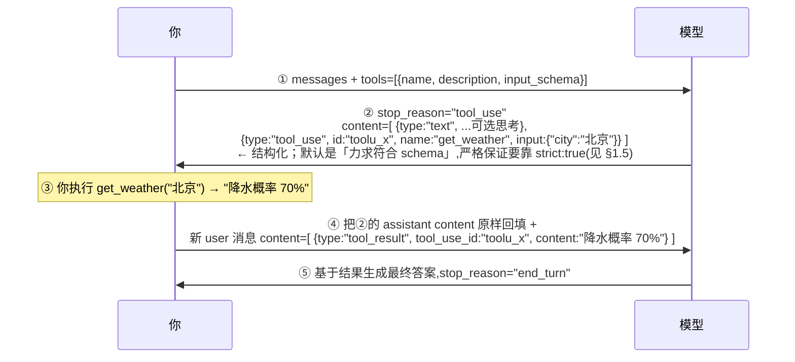
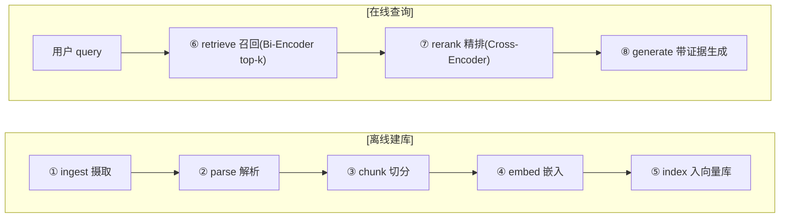
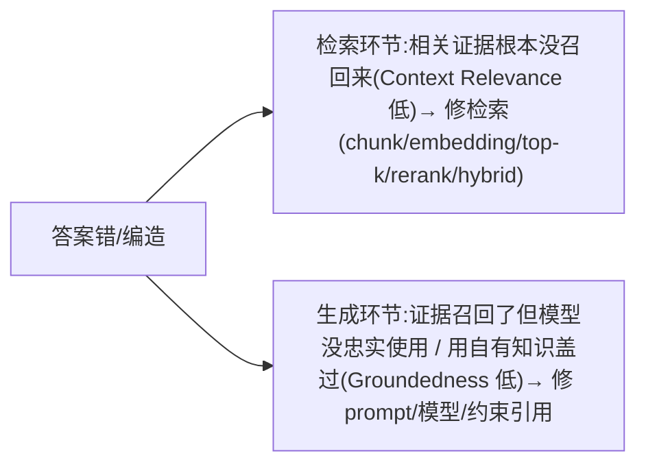
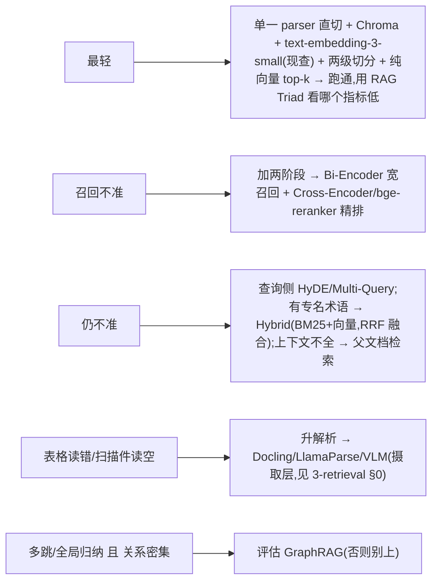
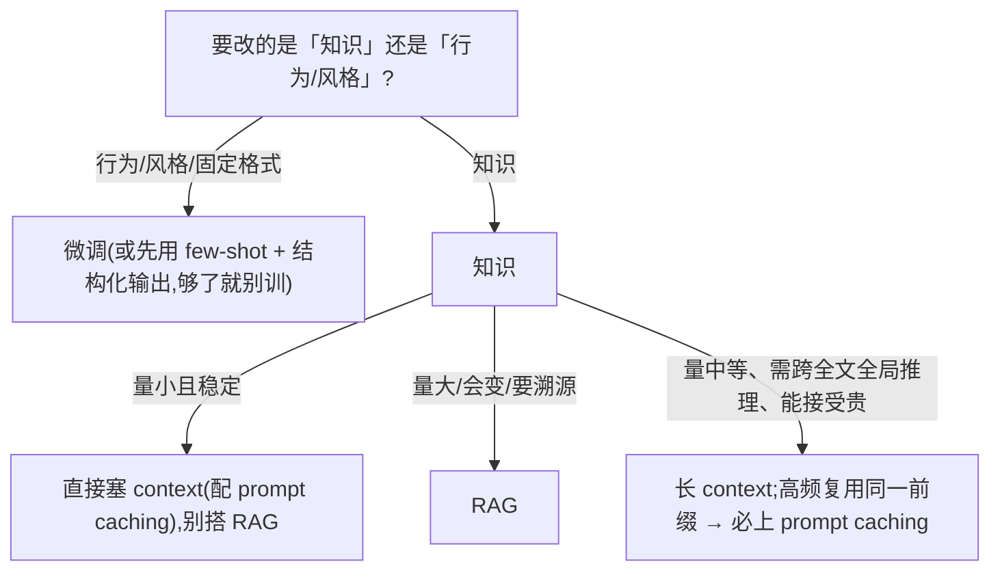
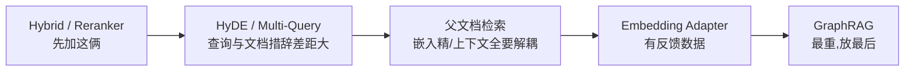

# 08 · 基本功:Function Calling / 工具调用 与 RAG

> Agent 的两条「腿」:**function calling**(让模型可靠地产出结构化动作)与 **RAG**(把外部知识喂进 context)。这是面试一定从这里开问的地基,讲不透机制就拿不到资深分。
> 对应 JD:**任职要求**(精通 Python/TS,做过 *function calling / 工具调用 / RAG / 多 Agent*);为 **职责 1**(Run Loop 的「执行」环)、**职责 2**(工具契约/MCP Gateway)、**职责 3**(Context Editing / Prompt Caching 降本)打地基。

> **最后核对:2026-06**。结论分级 ✅ 稳定经验 / ⚠️ 2026-06 快照(易变)/ ❓ 待验证。易变的字段名/价格/型号标「(现查官网)」。
> **边界**:记忆归 04,可观测 / eval 归 06 / 09,动作范式(function vs CodeAct vs GUI)的「选型」归选型矩阵 `0-action-paradigm`。本章是**基本功总览**,把机制讲透,深处交叉引用。

---

## 1. 技术原理(它到底怎么工作)

### 1.1 Function calling ≠ 模型替你执行函数

最常被面试官戳穿的误解:**模型从不执行你的代码**。function calling 的真相是一套「**模型产出结构化意图 → 你的代码执行 → 把结果回灌**」的协议。模型唯一做的事是:在该调工具时,不吐自然语言,而吐一个**符合你给的 JSON-Schema 的结构化调用**。执行、鉴权、重试、回灌全是你(harness)的活。

一轮完整的 tool_use 协议(以 Anthropic 的 `tool_use` / `tool_result` block 为例,字段名现查官网;OpenAI 是 `tool_calls` 数组 + `role:"tool"` 消息,机制相同):



**机制要点(经得起追问的细节):**

- **协议是无状态的、靠回填驱动的循环**。API 不记得上一轮,你每次把**完整历史**(含 assistant 的 tool_use block)发回去。漏回填 tool_use block,或 tool_result 的 `tool_use_id` 对不上,直接 400。✅
- **`stop_reason` 是循环的方向盘**:`tool_use`→执行后继续;`end_turn`→收尾跳出;`max_tokens`→被截断要加预算;`pause_turn`→服务端工具(web search 等)触达内置迭代上限,原样回填即可续跑。✅
- **`id` 是配对主键**。一轮可能有多个 tool_use block(并行),每个都必须有一条 `tool_use_id` 匹配的 tool_result,**一个都不能少、不能错位**。

### 1.2 并行工具调用(parallel tool use)

一条 assistant 消息里可以同时包含**多个 tool_use block**(默认开启)。正确姿势:**并发执行 → 所有 tool_result 放进同一条 user 消息回填**。

```
assistant: [tool_use A, tool_use B, tool_use C]   ← 模型一次要了三个
你:        并发跑 A/B/C
user:      [tool_result A, tool_result B, tool_result C]   ← 必须一条消息装齐
```

> ⚠️ **隐藏成本 / 反模式**:把三个 tool_result 拆成三条 user 消息回填——会**静默地把模型「训」得不再并行调用**(它从历史里学到「并行没好处」)。这是生产里 round-trip 莫名变多的隐蔽原因。✅
> 失败的工具也要回 `is_error:true` 的 tool_result,**不能直接丢**——丢了就是缺一条配对,400 或模型困惑。

强制串行:任何 `tool_choice` 加 `disable_parallel_tool_use:true`(字段名现查官网)。

### 1.3 强制 / 可选工具:tool_choice 四态

| tool_choice | 行为 | 用在哪 |
|---|---|---|
| `auto`(默认) | 模型自己决定调不调 | 通用 agent 主循环 |
| `any` | **必须**调某个工具(任意) | 「这一步一定是个动作」的强约束节点 |
| `{type:"tool", name}` | **必须**调指定工具 | 当成「带 schema 校验的结构化抽取器」用 |
| `none` | 禁止调工具 | 强制收尾、纯生成 |

> ⚠️ 强制具体工具(`any` / 指定 tool)时,部分实现会**自动关闭并行**;且强制工具常与 extended thinking / 程序化工具调用不兼容(现查官网)。把 function calling 当「结构化输出器」时这是甜区:`tool_choice` 锁定一个 schema,拿 `input` 当 JSON 结果。

### 1.4 JSON-Schema 设计要点(模型选不对工具,八成是 schema 写差了)

工具描述是模型唯一的「说明书」。设计准则:

- **`description` 要写「何时调用」,不只是「做什么」**。`"Get weather"` 远不如 `"当用户问到当前天气/未来降水时调用;历史气候问题不要调"`。✅ 近代模型(尤其 Opus 系)默认更**保守**地调工具,把触发条件写进描述能显著提升 should-call 命中率。
- **参数用 `enum` 收敛**,别让模型自由发挥字符串。
- **名字要语义化**:`token_price` vs `token_kline` 这种高度重叠的工具,描述里要把**区分点**写明(衍生品 vs K 线),否则纯靠模型猜。
- **工具别太多**:经验上 ~10–20 个工具后选择错误率上升;100+ 工具要上 **RAG-over-tools / Tool Search** 收窄候选(见选型矩阵 `4-tools`)。

### 1.5 结构化输出与校验 / 重试

两条路,别混:

| 手段 | 机制 | 保证 |
|---|---|---|
| **strict tool use** | 在**工具定义上**加 `strict:true`(配 `additionalProperties:false` + `required`) | `tool_use.input` 严格符合 schema |
| **结构化输出 / JSON mode** | `output_config.format` 给 `json_schema`(Anthropic);OpenAI 是 `response_format`(现查官网) | 最终文本是合法 JSON |

> ❗ `strict` 放在**工具定义**上,不是放在 `tool_choice` 上(放错没有任何效果)。
> ⚠️ **JSON-Schema 受限**:结构化输出常**不支持** `minimum/maximum`、`minLength/maxLength`、递归 schema、`additionalProperties` 设为非 `false`(现查官网)。这些约束要在**应用层**校验,别指望 schema 兜。

**校验—重试闭环**(即便 strict,也要兜业务级不变量,如「金额>0」「日期可解析」):

```python
from pydantic import BaseModel, ValidationError

class Booking(BaseModel):
    destination: str
    passengers: int          # 注:1..8 这种离散小集合其实能用 enum 枚举(strict 也能锁死);
                             # 真正 schema 兜不住的是「金额>0」「出发<返回日期」这类,才靠这层校验

def call_with_repair(client, messages, schema, max_retry=2):
    for attempt in range(max_retry + 1):
        resp = client.messages.create(model="claude-opus-4-8", max_tokens=1024,
                                      messages=messages,
                                      output_config={"format": {"type": "json_schema",
                                                                "schema": schema}})
        text = next(b.text for b in resp.content if b.type == "text")
        try:
            return Booking.model_validate_json(text)   # 通过即返回
        except ValidationError as e:
            # 把「错在哪」回灌给模型,让它自我修复——比盲目重试有效得多
            messages += [{"role": "assistant", "content": text},
                         {"role": "user", "content": f"上次输出校验失败:{e}。请只输出修正后的合法 JSON。"}]
    raise RuntimeError("structured output 修复重试耗尽")
```

> 关键:**把校验错误回灌**(self-repair)远胜于「同样的 prompt 再试一次」。Pydantic / Zod 当 schema 与校验层是 2026 的主流做法(PydanticAI / Instructor / `responses.parse`)。✅

### 1.6 Function calling vs CodeAct:范式差异

function calling 让模型吐**离散的、可枚举的**结构化调用;CodeAct 让模型**直接写并执行代码**当作一个动作(在代码里跑循环、条件、组合多工具)。

| 维度 | function calling | CodeAct |
|---|---|---|
| 一个动作长啥样 | `{name, args}` 离散调用 | 一段可执行代码 |
| 组合/控制流 | 多次 round-trip 串起来 | 代码里一次跑完,省 round-trip |
| 审计/重放 | **强**(每次调用结构化可记) | 弱(要记代码 + stdout) |
| 沙箱 | 一般不需要 | **必须**(执行任意代码) |
| 工具爆炸 | 上 RAG-over-tools 收窄 | `import` 即组合,弱化路由 |

> 一句话取舍:**默认 function calling(离散、可审计、不用沙箱)**;只有「工具多 + 要在动作里跑控制流 + round-trip 成本痛」时才升 CodeAct,并同步立沙箱。详见 `0-action-paradigm`。回链 → [`../../skills/agent-selection/0-action-paradigm.md`](../../skills/agent-selection/0-action-paradigm.md)。

---

### 1.7 RAG 全链路:八环,每环都能掉链子

RAG = 用检索把外部知识塞进 context 再生成。生产链路是八环管线,**离线建库**(① ~ ⑤)+ **在线查询**(⑥ ~ ⑧):



每环的机制 + 关键取舍:

| 环 | 在干什么 | 关键取舍 / 易踩点 |
|---|---|---|
| ① ingest | 接数据源 | 增量刷新:小/低频→**全量重建**最轻;量大→文档级 upsert + 内容哈希去重 + 删除传播 |
| ② parse | PDF/Word/扫描件→文本 | **生产里 RAG 质量的真正瓶颈**:解析丢了表格/版面,后面再强的 embedding 也救不回(见 `3-retrieval` §0) |
| ③ chunk | 切成块 | **chunk 大小是核心旋钮**:太大→召回稀释、噪声多;太小→语义断裂、指代丢失。先按语义边界切再用 token 上限兜底 |
| ④ embed | 块→向量 | **换 embedding 模型 = 必须重建全索引**(高成本变更,早定);多语种选 bge-m3 / Qwen3-Embedding(现查 MTEB) |
| ⑤ index | 建 ANN 索引 | 选向量库看规模/部署/过滤需求(Chroma→pgvector→Qdrant/Milvus) |
| ⑥ retrieve | 查 top-k | **top-k 是召回/噪声的权衡**:小→漏召回;大→噪声进 context、稀释注意力、涨成本 |
| ⑦ rerank | Cross-Encoder 精排 | Bi-Encoder 宽召回(top 50-200)→ Cross-Encoder 精排(top 8-12)是**生产标准两阶段** |
| ⑧ generate | 带证据生成 | prompt 要约束「只基于检索内容、给引用、不知道就说不知道」,否则模型用自有知识硬答 |

**两类编码器的机制差异**(必考):

- **Bi-Encoder(双塔)**:query 和 doc **各自独立**编码成向量,可离线建索引、在线只算相似度 → **快**(~5ms 量级),精度中。
- **Cross-Encoder**:query+doc **拼接**进同一次 attention 逐对打分,能看到二者交互 → **准**,但慢(~50–100ms 量级,数量级见 `4-tools`),且**无法预先索引**(每个 query 要对每个候选重算)。

所以两阶段:Bi-Encoder 先粗筛压候选,Cross-Encoder 再对少量候选精排。这就是「为什么 reranker 总在第二阶段」的根因。✅

### 1.8 幻觉来自哪:检索不全 vs 生成不忠实

RAG 的幻觉有两个互不相同的源头,**定位错了就修错地方**:



这正是下面 RAG Triad 要分别量化的两件事。

---

## 2. 应用场景(必须用 / 过度工程)

**Function calling — 甜区:**
- 要拿**确定性的结构化结果**(抽取、分类、填表单、查 API)。
- Agent 要**与外部世界交互**(查库、发消息、下单)——这是 Run Loop 的「执行」环。
- 要**可审计**:每个动作结构化落库,合规/回放友好。

**Function calling — 过度工程信号:**
- 任务**一步生成就够**(摘要、翻译、改写),硬塞工具只是增加 round-trip 和失败面。
- 把能用一个工具+循环搞定的,拆成几十个工具——选择准确率反而崩。

**RAG — 甜区:**
- 知识**会变 / 太多 / 私有**,塞不进 context 或要可溯源(引用)。
- 要**按需取**而非全量灌(成本、注意力)。

**RAG — 过度工程信号:**
- 知识量小且稳定 → 直接塞进 system prompt(配 prompt caching)比搭一整套检索栈划算得多。
- FAQ / 单点事实却上了 GraphRAG——重武器打蚊子(见 §4)。

---

## 3. 具体实现方案(最轻起步 → 升级)

### 3.1 Function calling:手写 agentic loop(Python / Anthropic)

```python
import anthropic
client = anthropic.Anthropic()

TOOLS = [{
    "name": "get_weather",
    "description": "查询某城市当前天气。当用户问当前天气/降水时调用;历史气候问题不要调。",
    "input_schema": {
        "type": "object",
        "properties": {"city": {"type": "string", "description": "城市名,如 北京"}},
        "required": ["city"],
        "additionalProperties": False,   # strict 的前提
    },
    "strict": True,                      # 注意:strict 在工具定义上,不在 tool_choice 上
}]

def run_agent(user_input, max_iters=8):
    messages = [{"role": "user", "content": user_input}]
    for _ in range(max_iters):                       # ← 循环必须有硬上限,防失控
        resp = client.messages.create(
            model="claude-opus-4-8", max_tokens=4096,
            tools=TOOLS, messages=messages)

        if resp.stop_reason == "end_turn":           # 模型收尾,跳出
            return next(b.text for b in resp.content if b.type == "text")

        messages.append({"role": "assistant", "content": resp.content})  # 原样回填(含 tool_use)

        tool_results = []
        for block in resp.content:                   # 并行:可能多个 tool_use
            if block.type == "tool_use":
                try:
                    out = dispatch(block.name, block.input)   # 你的鉴权/执行网关在这
                    tool_results.append({"type": "tool_result",
                                         "tool_use_id": block.id, "content": str(out)})
                except Exception as e:
                    tool_results.append({"type": "tool_result", "tool_use_id": block.id,
                                         "content": f"工具失败:{e}", "is_error": True})  # 失败也要回
        messages.append({"role": "user", "content": tool_results})       # 所有结果一条消息
    raise RuntimeError("达到最大迭代,可能陷入工具循环")
```

要点全在注释里:**循环硬上限、原样回填 tool_use、失败回 is_error、所有 tool_result 一条消息**。`dispatch` 就是 JD 里「带鉴权的工具调用网关」的落点——越权拦截、token 预算、人审闸门都挂这里(详见安全护栏章 / `7-safety-guardrails`)。

> **最轻起步 → 升级**:起步用 SDK 自带 **tool runner**(自动跑循环,省样板);需要拦截/审批/自定义日志/HITL 时,**降回手写 loop** 拿回控制权。两者不是优劣,是控制粒度的取舍。

### 3.2 RAG:最轻起步 → 升级路径



最小检索骨架(伪码,体现「召回→精排→带证据生成」三段):

```python
def rag_answer(query, k_recall=50, k_final=8):
    q_vec = embed(query)                                  # ④ 同一个 embedding 模型!查询和入库必须一致
    candidates = vector_store.search(q_vec, top_k=k_recall)   # ⑥ Bi-Encoder 宽召回
    ranked = cross_encoder.rerank(query, candidates)[:k_final] # ⑦ Cross-Encoder 精排
    context = "\n\n".join(f"[{i}] {c.text}" for i, c in enumerate(ranked))
    prompt = (f"只依据下面带编号的资料回答,引用用 [编号] 标注;"
              f"资料里没有就回答「资料中未提及」,不要用你自己的知识。\n\n{context}\n\n问题:{query}")
    return llm(prompt)                                    # ⑧ 带证据生成(prompt caching 缓存稳定前缀)
```

> ❗ 最隐蔽的 bug:**查询用的 embedding 模型 ≠ 入库用的**(或版本不一致)。向量空间对不上,召回全乱且无报错。换 embedding = 重建索引,这条要写进运维 SOP。✅

数据结构落点(对照面试章 [`../3.md`](../3.md)):chunk 入库是 `{id, text, embedding, metadata}`;metadata 装来源/时间/权限,**检索时按 metadata 过滤实现租户隔离/时效过滤**——这层常被忽略,却是企业 RAG 的命门。

---

## 4. 架构师取舍判断

### 4.1 RAG vs 长 context vs 微调(最高频的选型题)

| 维度 | RAG | 长 context(全塞窗口) | 微调 |
|---|---|---|---|
| 解决什么 | 知识**多/变/私有**,要溯源 | 知识量适中、要全局推理 | 改**行为/风格/格式**,非加知识 |
| 知识更新 | 改库即生效(快) | 改 prompt 即生效 | 要重训(慢) |
| 可溯源/引用 | ✅ 天然 | 弱 | ✗ |
| 成本结构 | 检索栈 + 每次少量 token | 每次**大量** input token(配 prompt caching 缓解) | 训练一次性贵,推理便宜 |
| 主要风险 | 召回不准 / 解析丢信息 | 注意力稀释("lost in the middle")、贵 | 灾难遗忘、数据准备贵、易过时 |

**决策树:**

> ✅ 实战结论:三者**常组合**——RAG 供知识 + 微调定格式 + prompt caching 降本。面试别答「二选一」,要答「按『改知识还是改行为』分流,再谈成本」。

### 4.2 进阶检索:加法优先级(性价比从高到低)



- **Hybrid(BM25 + 向量,RRF 融合)**:有专有名词/型号/代码符号时,纯向量会漏精确匹配,关键词召回补上。⭐ 性价比高。
- **Agentic RAG**:让 agent **自己决定查不查、查哪个库、查几次**(把 retrieve 包成一个工具,模型按需调用)——这正是 function calling × RAG 的合流。甜区:多源、需多跳、查询意图复杂;代价:延迟和 token 上去,且要防「该查不查 / 反复空查」。
- **GraphRAG(重武器,单列)**:文档抽成实体-关系图,沿关系多跳。**只在「领域关系密集(医疗/金融/法律)+ 问题多是多跳/全局归纳 + 数据稳定」时才值得**;FAQ/单点事实/数据频变 → 向量 RAG + reranker 性价比高得多。真正的分水岭是「**建图多贵、能否增量更新**」,不是检索算法。详见 `3-retrieval` §7。

### 4.3 工具规模选型

工具 ≤ ~20:全量塞进 tools 即可。100+:必须收窄——RAG-over-tools(Tool2Vec 粗筛 + cross-encoder 精排)或厂商的 Tool Search(`defer_loading` 按需加载)。⚠️ 据 `4-tools` 引述,Anthropic Tool Search/defer_loading 省约 85% token,并把 Opus 工具选择准确率从 49% 提到 74%(⚠️ 2026 快照,现查官网)。详见 [`../../skills/agent-selection/4-tools.md`](../../skills/agent-selection/4-tools.md)。

---

## 5. 面试高频问答

**Q1. function calling 时,模型到底执行了我的函数吗?**
A:**没有**。模型只产出一个符合 schema 的结构化调用(`tool_use` block:id/name/input),执行、鉴权、重试、回灌全是我的 harness 干。它本质是「模型吐结构化意图 + 我执行 + 把结果回填继续生成」的循环,靠 `stop_reason` 驱动,API 无状态、每轮发完整历史。
> 面试官可能追问:**那循环怎么知道什么时候停?** 答:看 `stop_reason`——`tool_use` 就执行后继续,`end_turn` 收尾跳出;另外自己一定要加**最大迭代数硬上限**,防止模型陷入工具循环烧 token。

**Q2. 并行工具调用怎么处理回填?有什么坑?**
A:一条 assistant 消息可含多个 tool_use block,我并发执行,然后把**所有 tool_result 放进同一条 user 消息**回填,每个 `tool_use_id` 精确配对。坑:① 拆成多条 user 消息回填会**静默地让模型不再并行调用**;② 失败的工具也得回 `is_error:true` 的 tool_result,不能丢,丢了就缺配对。

**Q3. 要保证模型输出严格的 JSON,你怎么做?strict 放哪?**
A:两条路——**strict tool use**(`strict:true` 放在**工具定义**上,配 `additionalProperties:false`+`required`,保证 `input` 符合 schema);或**结构化输出**(`output_config.format` 给 json_schema)。再叠 Pydantic/Zod 做**业务级**校验 + **把校验错误回灌让模型自修复**的重试。
> 面试官可能追问:**schema 能不能限制「金额必须 >0」或「字符串长度 ≤ 20」?** 答:先分清两种——**小而离散的集合可以用 `enum` 枚举**(如票数 1-8,strict 也能锁死);但**开区间数值**(`minimum/maximum`)、**字符串长度**(`minLength/maxLength`)、**递归 schema**,结构化输出通常**不支持**(现查官网)。后一类业务不变量要在**应用层**用 Pydantic 校验、失败回灌重试,而不是指望 schema。能把「enum 能管 / 数值区间不能管」这条线讲清,就比只背「schema 兜不住」高一档。

**Q4. RAG 的幻觉,是检索的锅还是生成的锅?怎么定位?**
A:用 **RAG Triad** 拆:**Context Relevance**(召回的相关吗)低 → 检索环节问题,修 chunk/embedding/top-k/加 reranker/hybrid;**Groundedness/faithfulness**(答案是否基于召回内容)低 → 生成环节,模型在用自有知识硬答,修 prompt(强制只用证据+引用)、换模型;**Answer Relevance**(答有没有回应问)低 → 端到端跑偏。三个指标分别对应「检索/生成/对齐」三处,不分清就修错地方。

**Q5. 为什么 reranker 总是放在召回之后的第二阶段,不能直接用它召回?**
A:reranker 是 **Cross-Encoder**,query 和 doc 拼接进同一次 attention 逐对打分,准但**无法预先索引**——每个 query 要对每篇候选重算,全库跑算不起(延迟 ~50-100ms × N)。所以先用 **Bi-Encoder**(双塔、可离线建索引、~5ms)宽召回压到几十上百候选,再让 cross-encoder 精排到 top 8-12。这是速度与精度的两阶段折中。
> 面试官可能追问:**那 top-k 怎么定?** 答:召回 k 给大(50-200)保证不漏,精排后 k 给小(8-12)控噪声和 token;召回 k 太小漏召回,精排后 k 太大噪声进 context 稀释注意力还涨成本。

**Q6. RAG、长 context、微调,什么时候用哪个?**
A:先分「改的是知识还是行为」——行为/风格/格式 → 微调(或先 few-shot);知识 → 看量和变化:小且稳定直接塞 context(配 prompt caching),大/变/要溯源 → RAG,量中等要全局推理且能接受贵 → 长 context。生产里常**组合**:RAG 供知识、微调定格式、caching 降本。绝不二选一。

**Q7. 换了 embedding 模型会发生什么?**
A:**必须重建整个索引**——新模型的向量空间和旧的不兼容,旧向量全作废。而且查询侧也要换成同一个模型,否则查询向量和库里向量不在一个空间,召回全乱且**无报错**。所以 embedding 选型是高成本、要早定的决策,和向量库选型一样写进 ADR。

**Q8. 100 个工具都塞进 tools 里有什么问题?怎么治?**
A:工具描述会吃掉大量 token(注意力稀释、破坏 prompt cache、选择准确率下降)。治法:**RAG-over-tools**——先用 embedding/Tool2Vec 粗筛 + cross-encoder 精排出 8-12 个候选再交给 LLM,或用厂商 Tool Search(`defer_loading` 按需加载)。经验上 ~10-20 工具就该开始考虑收窄。

**Q9. function calling 和 CodeAct 啥区别,你怎么选?**
A:function calling 吐离散结构化调用,可校验、可审计、不用沙箱;CodeAct 让模型直接写代码当一个动作,能在代码里组合多工具+控制流、省 round-trip,但**必须沙箱**、审计/调试更难。默认 function calling,只有「工具多+要在动作里跑控制流+round-trip 成本痛」时才升 CodeAct,且沙箱同步立起来,二者绑定。

---

## 6. 踩坑 / 反模式

| 反模式 / 选错信号 | 后果 | 治法 |
|---|---|---|
| 以为模型替你执行函数 | 安全模型全错(以为模型直连数据库) | 牢记:模型只吐意图,执行/鉴权全在 harness |
| 多个 tool_result 拆成多条 user 消息 | 模型**静默退化**为不再并行调用 | 所有 tool_result 一条 user 消息装齐 |
| 失败工具不回 tool_result | 缺配对 → 400 或模型困惑 | 回 `is_error:true` 的 tool_result |
| agentic loop 没有迭代上限 | 工具循环烧光预算/钱 | 硬 `max_iters` + token 预算护栏 |
| `strict` 放到 tool_choice 上 | 完全无效,以为有保障 | 放工具定义,配 `additionalProperties:false` |
| 指望 JSON-Schema 限制数值范围 | 约束被忽略,脏数据流下游 | 应用层 Pydantic/Zod 校验 + 回灌修复 |
| 查询/入库 embedding 不一致 | 召回全乱**且无报错** | 同一模型同一版本;换则重建索引 |
| RAG 召回差就先调 reranker | 治标不治本(锅常在解析/切分) | 先用 Triad 看 Context Relevance,八成是**解析丢了表格/版面** |
| FAQ/单点事实上 GraphRAG | 建图烧 token、增量难、延迟高 | 向量 RAG + reranker 足矣,GraphRAG 只给多跳/全局 |
| top-k 一律调大求「不漏」 | 噪声进 context、注意力稀释、涨成本 | 召回 k 大 + 精排后 k 小的两阶段 |
| 知识量小也搭整套检索栈 | 过度工程,运维负担 | 直接塞 system prompt + prompt caching |
| 工具描述只写「做什么」不写「何时调」 | 近代模型保守,该调不调 | 描述里写明触发条件 + 区分点 |

> **一句话给面试官的「成熟度信号」**:RAG 的质量瓶颈在生产里几乎都在**解析 / 切分 / 检索+重排 / 评估**这四处——恰恰是框架帮不上、要自己打磨的环节。所以成熟团队常最终走「裸向量库 + reranker + 自写 retrieval」摆脱抽象束缚。

---

## 7. 回链已有资产 / 课程

- **动作范式选型(function vs CodeAct vs GUI)**:[`../../skills/agent-selection/0-action-paradigm.md`](../../skills/agent-selection/0-action-paradigm.md) —— 本章 §1.6 是它在「基本功」视角的展开。
- **工具检索 / 100+ 工具路由**:[`../../skills/agent-selection/4-tools.md`](../../skills/agent-selection/4-tools.md) —— §1.4 / §4.3 的 RAG-over-tools、Tool Search 出处。
- **检索栈全链路选型(摄取/向量库/embedding/chunking/retriever/进阶/GraphRAG/RAG Triad)**:[`../../skills/agent-selection/3-retrieval.md`](../../skills/agent-selection/3-retrieval.md) —— §1.7 / §3.2 / §4.2 的母篇,RAG Triad 详表在其 §十。
- **可观测 / Eval(RAG Triad 的落地与埋点)**:[`../../skills/agent-selection/5-observability-eval.md`](../../skills/agent-selection/5-observability-eval.md) —— 评估深化归 06/09 章。
- **心智模型 · L1 底层契约 / Action 范式谱**:[`../1.md`](../1.md)。
- **context 分层与数据结构**:[`../3.md`](../3.md) —— §3 的 chunk metadata、租户隔离过滤对照。
- 课程回溯:`courses/RAG/04`(向量库/embedding)、`courses/RAG/05`(chunking/RAG Triad)、`courses/RAG/06`(reranker/Similarity≠Relevance)、`courses/RAG/18`、`courses/RAG/RAG.md`。

> **最后核对:2026-06**。字段名(`tool_use`/`input_schema`/`output_config`/`strict` 等)、价格、模型 id、reranker 型号、49%→74% 等具体数字均会变,**定方案前现查官网 / MTEB**。
