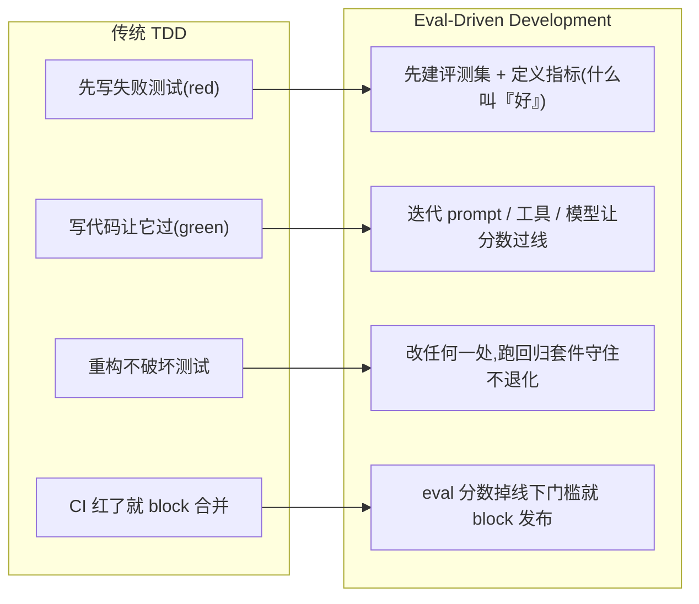
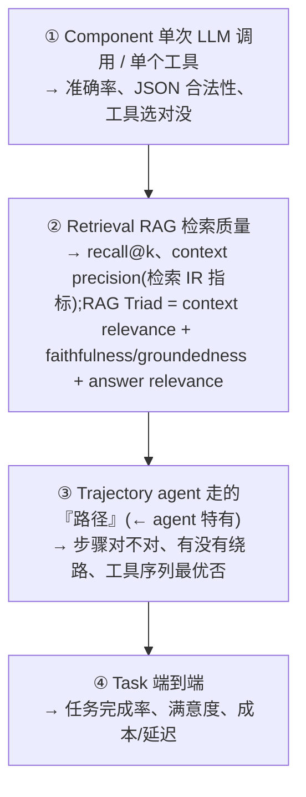
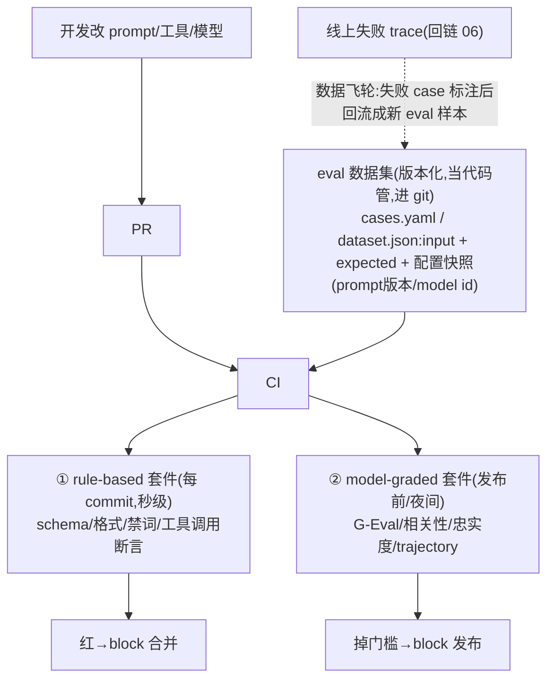
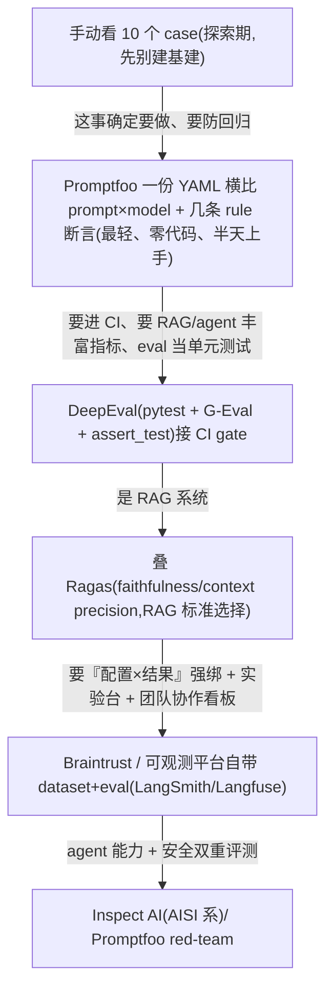
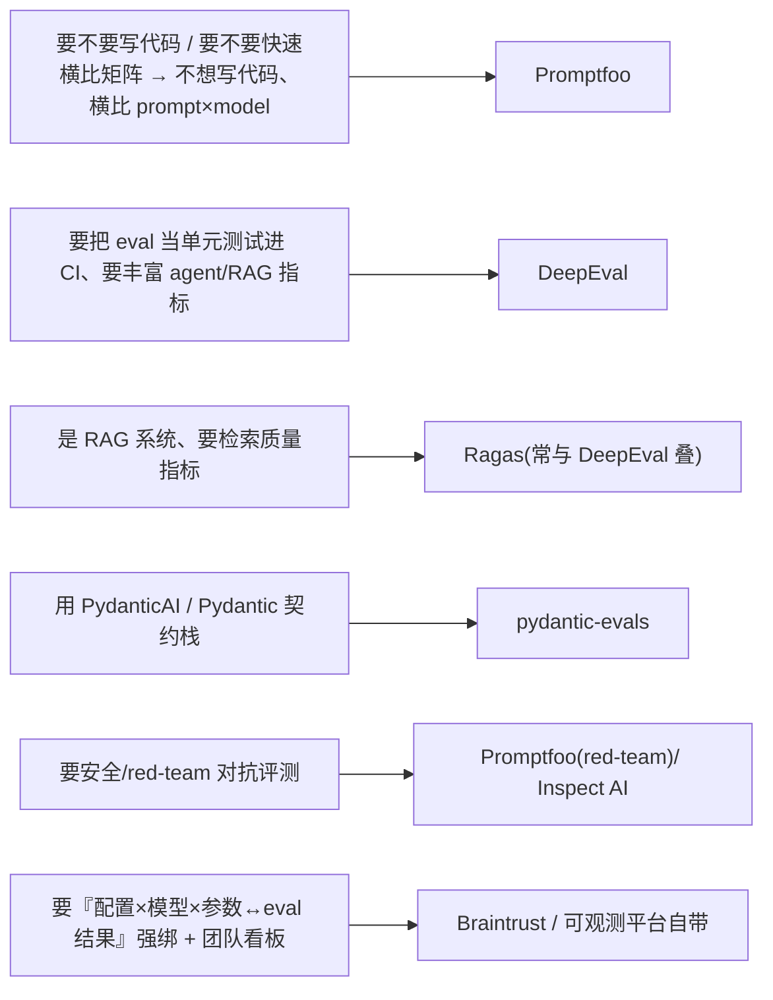

# 09 · 评测驱动开发(Eval-Driven Development / Promptfoo · DeepEval)

> 把 eval 当回归门控、像 TDD 一样**先定义"好"的可度量标准、再迭代 prompt/agent**——没有 eval 集就没有"改好了"的客观判据,所有优化都是凭感觉。对应 JD **加分项(评测驱动开发 Promptfoo / DeepEval)**;同时是 **职责 1(Run Loop 的"验证"环)** 与 **职责 4(安全护栏)** 上线前的回归底座。
>
> **边界**:trace 怎么产生 / 怎么落库 / 平台选型归 **06**;本章只聚焦两件事——**评测方法论(怎么系统化判好坏)** + **工具链与驱动开发流程(Promptfoo / DeepEval 怎么落到 CI)**。方法论结论复用 `../../skills/agent-selection/5-observability-eval.md`「§三/§四」,本章把那两节较薄的**工具用法**展开到可背诵。
>
> **最后核对:2026-06**。结论分级 ✅ 稳定经验 / ⚠️ 2026-06 快照(易变)/ ❓ 待验证。易变的 API 字段名 / 价格 / 版本号一律标「(现查官网)」,宁可标注也不写死。

---

## 1. 技术原理(它到底怎么工作)

### 1.1 核心心智:eval 是 LLM 时代的"测试金字塔"

传统软件:输入确定 → 输出确定 → `assert output == expected`。LLM 不成立——**同一输入,输出是分布**;换 prompt 一个字、换模型一个 minor 版本,行为就漂。所以 eval 不是"测对错",是**在一个分布上量化"好的比例"**,并把这个比例钉成回归门控。

EDD(eval-driven development)= 把 TDD 的"红→绿→重构"搬到 prompt/agent:



> ✅ **一句话**:**先定义"好"的可度量标准,再迭代**——次序反了(先调 prompt、上线后才想起补 eval)就是凭感觉,团队普遍**低估评测、高估模型**。

### 1.2 两种 eval 类型 × 两种节奏(这是判分轴,务必背熟)

| 类型 | 怎么判 | 速度/成本 | 确定性 | 跑的节奏 |
|---|---|---|---|---|
| **Rule-based(确定性)** | 正则 / 字符串 / JSON schema 校验 / 精确匹配 / 程序断言 | 快(ms 级)、几乎免费 | 可复现 | **每次 commit**(CI gate,秒级反馈) |
| **Model-graded(LLM-as-Judge)** | 另一个(更强的)LLM 按 rubric 打分 | 慢(秒级/条)、贵(每条一次 LLM 调用) | 有方差,需校准 | **发布前 / 夜间**(pre-release,跑全量集) |

> ✅ **配比经验**:能用 rule-based 判的绝不上 LLM judge——**确定性优先**(同 `../1.md` 横切关注点 8)。典型分层:格式/schema/禁词/工具是否被调用 → rule-based 每 commit;答案质量/相关性/忠实度/语气 → model-graded 发布前。一个 100 条的 model-graded 集,用便宜判官模型大约**几分钟、几美分到几十美分**量级(⚠️随模型单价,现查官网),所以不能每 commit 跑全量。

### 1.3 4 层评估:trajectory 是 agent 特有的那层

从小到大(`5-observability-eval.md`§四的展开):



> ⚠️ **资深面试官的分水岭就在 ③**:组件级全绿、最终答案也对,agent 仍可能"瞎走对"——绕了 8 步、调错 3 个工具、烧了 5x token 才蒙对。**trajectory eval 测的是过程不是终点**,需要 trace(回链 06)记下完整 span 树才测得了。绝大多数团队的 eval 停在 ①④,缺 ③——这正是 demo 能跑、生产不可控的根因。

### 1.4 LLM-as-Judge 的机制(经得起追问的那一层)

不是"让 GPT 给个分"这么简单,可靠的 judge 有四个工程要点:

1. **强评弱**:judge 用比被测系统**更强**的模型(或同级但带 rubric)。弱模型判强模型 = 噪声。
2. **pairwise 比绝对打分稳**:让 judge 选"A 和 B 哪个好"比让它打"7.5 分"方差小得多——LLM 对绝对分标度不稳定,对相对比较敏感。能用 A/B 就别用 1-10。
3. **带 CoT reason**:让 judge **先写判断理由、再给结论**(G-Eval 的核心就是 LLM + CoT 按自定义 criteria 评分),理由可审计、可 debug、还能反向校验打分。
4. **校准**:LLM judge 与人工标注约 **70~85% 一致**(⚠️随任务,`5-observability-eval.md`§四)——关键路径必须人工抽检,judge 自身的偏置(位置偏好、长度偏好、自我偏好)要用打乱顺序/去标识来压。

> **常见 judge 偏置(面试爱问)**:position bias(偏好靠前/靠后的)、verbosity bias(偏好长答案)、self-enhancement bias(偏好自己家模型的输出)、format bias。治法:pairwise 时**两个顺序各判一次取一致**、rubric 里明确"长度不是质量"、judge 与被测**换不同模型族**。

### 1.5 Promptfoo 怎么工作(声明式矩阵 + 断言 + red-team)

Promptfoo 的机制是 **"配置即实验"**:一份 YAML 声明 `prompts × providers(模型) × tests(用例)` 的**笛卡尔积矩阵**,CLI 跑出来给你一张对比表/网页视图。

```
        prompt_A    prompt_B
gpt-5     ▢▢▢         ▢▢▢      每格 = 一个 (prompt,model) 组合跑全部 test cases
claude    ▢▢▢         ▢▢▢      每个 ▢ 上挂 assert(断言)判通过率
```

- **assert(断言)** 是判分单元:既有 rule-based(`contains` / `equals` / `is-json` / `javascript` / `python`),也有 model-graded(`llm-rubric` / `similar` 语义相似 / `factuality`)——字段名 ⚠️ 现查官网。
- **red-team / 安全评测**:Promptfoo 的差异化强项,自动生成对抗用例(jailbreak、prompt injection、PII 泄露、越权)扫 agent——这也是 **2026-03 被 OpenAI 收购**(⚠️ 快照,保持开源)后并入 OpenAI Frontier 安全测试栈的能力(现查官网)。
- **CLI / CI 友好、零代码起步**:不写 Python 也能跑,`promptfoo eval` 出表、`promptfoo view` 看 diff。适合**快速横比多 prompt/多模型**。

### 1.6 DeepEval 怎么工作(pytest 风格 + 50+ 指标)

DeepEval 的机制是 **"eval 即单元测试"**:把每个用例建成 `LLMTestCase`,挂上 `metric`,用 `assert_test()` 在 **pytest** 里跑——红了就 fail,天然接 CI。

- **TestCase + Metric 解耦**:`LLMTestCase(input, actual_output, expected_output, retrieval_context, tools_called…)` 装数据;`Metric` 装判分逻辑(`GEval` 自定义 rubric、`AnswerRelevancyMetric`、`FaithfulnessMetric`、`HallucinationMetric`、`TaskCompletionMetric` 等,2026 已 **50+ 指标** ⚠️ 现查官网)。
- **G-Eval**:DeepEval 最通用的指标——你用自然语言写 `criteria`,它内部用 LLM+CoT 把 criteria 拆成 evaluation steps 再打分,带 `reason`。
- **`assert_test()` vs `evaluate()`**:CI 里用 `assert_test()`(在 pytest 测试函数内,不过就 fail);`evaluate()` 用于 notebook 批量看分(⚠️ 现查官网 API)。
- 适合**把 eval 当代码资产、进 CI、要丰富 RAG/agent 指标**的团队。

---

## 2. 应用场景(什么时候必须用 / 什么时候是过度工程)

### 甜区(必须用)

- ✅ **prompt / 模型一改就怕回归**:任何要持续迭代的 prompt,改一处就要有回归集守住别处别崩。
- ✅ **要换模型 / 做模型级联降本**:没有 eval 集就不敢把旗舰换中端——eval 是"换了掉多少分"的唯一客观判据。
- ✅ **agent 上生产前**:trajectory + task 级 eval 是"它到底能不能稳定完成任务"的验收线。
- ✅ **安全护栏验收(职责 4)**:越权拦截、注入防御、PII 不泄露——必须有对抗 eval(Promptfoo red-team)当回归,否则改一版 prompt 把护栏改漏了都不知道。
- ✅ **多人协作改 prompt**:eval gate 是防止"A 改好了 B 那边崩了"的唯一闸口。

### 反模式(过度工程)

- ⚠️ **一次性脚本 / PoC demo**:还在验证"这事 LLM 行不行"的探索阶段,先手动看 10 个 case,别先建 50 条评测集 + CI。
- ⚠️ **输出本就确定**:能用 schema 校验 + 单元测试覆盖的,别套 LLM-as-Judge(贵且引入方差)。
- ⚠️ **每 commit 跑全量 model-graded**:把发布前才该跑的贵 judge 塞进每次 commit,CI 几分钟 + 每天烧钱,还因 judge 方差导致**门控 flaky**。
- ⚠️ **评测集 5 条就上 CI gate**:样本太少,通过率统计噪声大,门控形同虚设(一条边界 case 翻转就从 80% 跳到 60%)。

> **判据**:**"这个 prompt/agent 还要不要继续迭代、要不要防回归"** —— 要,就值得建 eval;一次性用完就扔,不值得。

---

## 3. 具体实现方案(最轻起步 → 升级)

### 3.1 整体架构:eval 在开发流里的位置



### 3.2 最小可信例子 ①:Promptfoo 配置(YAML,零代码起步)

> ⚠️ 字段名/断言类型以官网为准(现查官网),下面体现**结构与要点**。

```yaml
# promptfooconfig.yaml —— 横比 2 个 prompt × 2 个模型,挂规则断言 + LLM rubric
prompts:
  - "把以下客服工单分类为 [billing/technical/other],只输出类别词:{{ticket}}"
  - file://prompts/classify_v2.txt              # prompt 也当代码资产,进 git

providers:                                       # 模型矩阵,钉具体 model id 别用滚动 alias
  - openai:gpt-5                                  # (现查官网型号)
  - anthropic:claude-sonnet                       # (现查官网型号)

defaultTest:
  assert:
    - type: is-json                              # rule-based:必须合法(秒级、免费)
    - type: latency
      threshold: 3000                            # 延迟预算门控(ms)

tests:
  - vars: { ticket: "我被重复扣费两次,要求退款" }
    assert:
      - type: equals                             # rule-based:精确匹配标准答案
        value: billing
  - vars: { ticket: "APP 登录就闪退" }
    assert:
      - type: equals
        value: technical
      - type: llm-rubric                          # model-graded:语气是否专业(发布前才该开)
        value: "回复不得包含内部系统名或调试信息"

# redteam:                                        # 安全/对抗评测(Promptfoo 强项)
#   plugins: [pii, prompt-injection, excessive-agency]   # (现查官网插件名)
```

```bash
promptfoo eval                # 跑矩阵,出通过率表;CI 里非零退出码 = block
promptfoo view               # 浏览器看 prompt×model 的 diff 对比
promptfoo redteam run        # 跑对抗套件(现查官网子命令)
```

### 3.3 最小可信例子 ②:DeepEval 测试(pytest 风格,进 CI)

> ⚠️ import 路径 / 指标类名以官网为准(现查官网),下面体现**结构与要点**。

```python
# test_agent_eval.py —— pytest 直接收集,assert_test 红了就 block
import pytest
from deepeval import assert_test
from deepeval.test_case import LLMTestCase
from deepeval.metrics import GEval, AnswerRelevancyMetric, FaithfulnessMetric
from deepeval.test_case import LLMTestCaseParams      # (现查官网)

from my_app import run_agent                          # 被测 agent

# 1) G-Eval:用自然语言写 rubric,内部 LLM+CoT 拆成 steps 打分,带 reason
correctness = GEval(
    name="Correctness",
    criteria="actual_output 是否准确回答了 input,且不与 expected_output 矛盾",
    evaluation_params=[                              # 告诉 judge 看哪几个字段
        LLMTestCaseParams.INPUT,
        LLMTestCaseParams.ACTUAL_OUTPUT,
        LLMTestCaseParams.EXPECTED_OUTPUT,
    ],
    model="gpt-5",                                  # judge 用更强模型(强评弱),现查官网
    threshold=0.7,                                  # 低于此分 → fail
)

# 2) 数据集当代码管:从版本化的 cases 文件加载(此处内联示意)
CASES = [
    {"q": "北京明天要带伞吗?", "expected": "结合降水概率给出带伞建议",
     "ctx": ["北京明日降水概率 70%"]},
]

@pytest.mark.parametrize("case", CASES)
def test_agent_quality(case):
    out = run_agent(case["q"])                       # 真实跑一遍 agent
    tc = LLMTestCase(
        input=case["q"],
        actual_output=out.answer,
        expected_output=case["expected"],
        retrieval_context=case["ctx"],               # 喂给 RAG 类指标
        # tools_called=out.tools,                     # trajectory:工具序列(现查官网字段)
    )
    # 一次断多个指标:相关性(LLM-judge,非规则)+ 忠实度(RAG)+ 正确性(G-Eval)
    assert_test(tc, [
        AnswerRelevancyMetric(threshold=0.7),
        FaithfulnessMetric(threshold=0.8),           # 答案是否被 retrieval_context 支撑(抗幻觉)
        correctness,
    ])
```

```bash
deepeval test run test_agent_eval.py   # 或直接 pytest;红了 CI block(现查官网命令)
```

### 3.4 数据结构:eval case 长什么样(版本化的核心资产)

```jsonc
// dataset/agent_eval.jsonl —— 一行一个 case,进 git,当代码 review
{
  "id": "billing-dup-charge-001",
  "input": "我被重复扣费两次,要求退款",
  "expected_output": "billing",          // 或一段参考答案(reference-based)
  "retrieval_context": ["退款政策第3条…"],  // RAG 类指标用
  "expected_tools": ["lookup_order", "issue_refund"],  // trajectory 用:期望工具序列
  "tags": ["billing", "regression", "from_prod_trace"],// 来源标签:线上回流的标记
  "config_snapshot": {                    // 配置即代码:绑定产生它的那版配置
    "prompt_version": "classify_v2",
    "model_id": "gpt-5-2026-xx",          // 钉具体版本,别用滚动 alias(现查官网)
    "temperature": 0
  }
}
```

> ✅ **关键**:每个 case 绑一份 `config_snapshot`,指标一动能 `group by` 版本**归因到具体改动**(`5-observability-eval.md`「子决策 3:配置即代码」)。`from_prod_trace` 标签让数据飞轮可追溯(§下文)。

### 3.5 最轻起步 → 升级路径



> ⚠️ **别一上来上重平台**:Promptfoo 一份 YAML 已拿到"横比 + 回归门控"80% 收益。先有**版本化的 eval 数据集**(进 git)才是真资产,工具只是跑它的引擎——工具可换,数据集不能丢。

---

## 4. 架构师取舍判断(主选 vs 备选 vs 代价)

### 4.1 工具横向对比

| 工具 | 形态/风格 | 强项 | 代价/弱项 | 甜区 |
|---|---|---|---|---|
| **Promptfoo** ⭐零代码起步 | YAML / CLI 声明式 | prompt×model 矩阵横比、**red-team/安全评测**最强、CI 友好、不写代码也能跑;2026-03 被 OpenAI 收购仍开源(⚠️现查) | 矩阵思路对"复杂 agent 多步轨迹"表达力弱;深度自定义逻辑不如代码灵活 | 快速横比 prompt/模型、安全/red-team 回归 |
| **DeepEval** ⭐进 CI | pytest 风格 / 代码 | **eval 即单元测试**、50+ 研究背书指标(G-Eval/RAG/agent)、`assert_test` 接 CI 顺 | 要写 Python;judge 类指标有方差/成本;指标多易选错 | 把 eval 当代码资产、要丰富指标 + CI gate |
| **Ragas** | RAG 专用 / 代码 | faithfulness / answer relevance / context precision(RAG Triad 标准) | 仅 RAG,不覆盖通用 agent 轨迹 | RAG 系统检索质量(② Retrieval 层) |
| **pydantic-evals** | 类型安全 / 代码 | PydanticAI 原生、结构化 case | 绑 Pydantic 栈 | 用 PydanticAI/Pydantic 契约栈 |
| **Inspect AI** | agent+安全 / 代码 | 英国 AISI,能力+安全评测,trajectory 友好 | 偏研究/评测,学习曲线 | agent 能力/安全的严肃评测 |
| **Braintrust** | eval-first SaaS | 实验台 + 版本控制 + CI 回归卡作 deploy gate、**配置↔结果强绑** | SaaS、锁定、付费 | 以 eval 为中心、要团队协作看板 |
| **OpenAI Evals** | rubric / 平台 | — | ⚠️ 平台弃用(转只读/下线,官方迁移指向 Datasets;现查官网) | 已不推荐新项目 |

### 4.2 选型轴(决策树)



> ✅ **不互斥,常组合**:典型生产栈 = **Promptfoo 跑 prompt 横比 + red-team**(发布前/选型期)+ **DeepEval/Ragas 进 CI 当回归 gate**(每 commit rule-based、夜间 model-graded)。JD 同列 Promptfoo / DeepEval 正是这个原因——一个偏"实验台与安全",一个偏"CI 单元测试"。

### 4.3 主选建议(给一句能背的结论)

- **快速验证一个 prompt 选哪个模型/哪版措辞** → 主选 **Promptfoo**(半天出对比表),代价是复杂 agent 轨迹表达力弱。
- **agent 要进 CI、防回归、指标丰富** → 主选 **DeepEval**(pytest 心智无缝),代价是要写代码 + judge 成本/方差。
- **RAG** → DeepEval/Promptfoo 之外**必叠 Ragas** 量检索质量。
- 三者之上,**数据集版本化进 git** 是不变的底座——工具是可替换的,数据集是护城河。

---

## 5. 面试高频问答(重中之重)

**Q1:什么是 eval-driven development?和 TDD 什么关系?**
A:
- 把 TDD 的"先写测试再写实现"搬到 prompt/agent:**先建评测集 + 定义"什么叫好"的可度量指标,再迭代 prompt/工具/模型**,改任何一处都跑回归套件守住不退化,分数掉线下门槛就 block 发布。
- 区别:LLM **输入定、输出是分布**,所以 eval 不是 `assert ==`,是**在样本集上量化"好的比例"**(通过率/平均分),门控用阈值而非全绿。
- 价值点:没有 eval 集就没有"改好了"的客观判据——团队通病是**低估评测、高估模型**,EDD 把"改好了"从凭感觉变成可度量。

**Q2:rule-based 和 model-graded(LLM-as-Judge)怎么分工?**
A:
- **rule-based**(正则/schema/精确匹配/工具是否被调):快、免费、可复现 → **每次 commit 跑**(CI gate,秒级反馈)。
- **model-graded**(LLM 按 rubric 评质量):慢、贵、有方差 → **发布前/夜间跑**全量集。
- 原则:**确定性优先**——能用规则判的绝不上 judge。典型:格式/禁词/越权用 rule-based 守 commit;答案质量/忠实度/语气用 judge 守 release。
- > **面试官可能追问:为什么不能每 commit 都跑 model-graded?** 答:① 成本——每条一次 LLM 调用,100 条集每天几十次 commit 烧钱;② 速度——CI 从秒级变几分钟,反馈环变长;③ flaky——judge 有方差,门控会随机翻红,失去信任。所以贵 judge 放发布前/夜间。

**Q3:agent 的 eval 和普通 LLM 应用的 eval 差在哪?**
A:
- 多了 **trajectory(轨迹)层**:不只测最终答案对不对,要测**走的路径**——工具选对没、有没有绕路、工具调用序列是否最优。
- 为什么重要:agent 可能"瞎走对"——绕 8 步、调错工具、烧 5x token 才蒙对答案,component/task 级全绿也测不出。
- 怎么测:需要 **trace(回链 06)** 记下完整 span 树,把实际工具序列 vs 期望序列比对(`expected_tools`),或用 judge 评"这条路径合理吗"。
- 4 层全景:component(单调用)→ retrieval(检索质量)→ **trajectory(路径)** → task(端到端完成率/成本/延迟)。

**Q4:LLM-as-Judge 怎么做才可靠?有哪些坑?**
A:
- 四要点:① **强评弱**(judge 用更强模型);② **pairwise 比绝对打分稳**(选 A/B 比打 7.5 分方差小);③ **带 CoT reason**(先说理由再下结论,可审计、可 debug,G-Eval 即此);④ **校准**(与人工约 70~85% 一致,关键路径人工抽检)。
- 偏置:position bias(偏靠前)、verbosity bias(偏长答案)、self-enhancement bias(偏自家模型)。
- > **面试官可能追问:judge 和被测用同一个模型行不行?** 答:不推荐——会触发 self-enhancement bias(模型偏好自己风格的输出),且弱评弱等于放大噪声。最好 judge 换**不同模型族**且更强;pairwise 时**两个顺序各判一次取一致**压 position bias。

**Q5:讲讲 Promptfoo 和 DeepEval 的差异,你会怎么选/怎么组合?**
A:
- **Promptfoo**:YAML 声明 `prompt×model×test` 矩阵,CLI 一跑出对比表,**零代码、red-team/安全评测强**;适合快速横比选型、安全回归。⚠️ 2026-03 被 OpenAI 收购但保持开源(现查)。
- **DeepEval**:pytest 风格,`LLMTestCase` + `Metric`(G-Eval/RAG/agent,50+),`assert_test` 进 CI;适合**把 eval 当单元测试**、指标丰富、防回归。
- 组合:**Promptfoo 做实验台 + 安全 red-team(发布前),DeepEval 进 CI 当回归 gate(每 commit）** ——JD 同列二者正是一个偏实验/安全、一个偏 CI 单测。
- 不变底座:**eval 数据集版本化进 git**,工具可换、数据集是护城河。

**Q6:eval 数据集从哪来?怎么持续长大?(数据飞轮)**
A:
- 冷启动:种子集来自① 人工写典型 case;② 产品/真实用户高频问;③ 已知 bug 复现成 case(回归 case)。
- **数据飞轮(核心)**:**线上失败/低分 trace(回链 06)→ 人工标注 → 回流成新 eval 样本**(打 `from_prod_trace` 标签)→ 配置变更对扩充后的集跑回归。失败 case 进集后,下一版 prompt 必须把它修好且不退化别处。
- 前提:埋点时把 **prompt 版本/model id/参数钉进 trace 属性**(配置即代码),失败 case 才能绑定"是哪版配置坏的"、回流后才可归因。
- > **面试官可能追问:eval 集会不会过拟合?** 答:会——只对着固定集调 prompt 等于"背答案"。治法:① **留 held-out 集**(改 prompt 时不可见,只发布前验);② 持续从线上回流**新分布**的 case 稀释;③ 定期人工抽检线上真实流量,别只信 eval 分。

**Q7:eval 分数是 82%,怎么判断"能不能发布"?门槛怎么定?**
A:
- 单看 82% 没意义,要分层看:**哪一层、哪类 case 在掉**——rule-based(格式/越权)应近 100%,掉了直接 block;model-graded 质量分看**相对上一版有没有退化**(回归视角)比看绝对值更重要。
- 门槛定法:① 安全/越权/格式类 = **硬门槛**(必须 100%/接近);② 质量类 = **不退化门槛**(新版 ≥ 上版,或在置信区间内);③ 关注**分布而非均值**——P10 那批最差 case 是不是更差了(均值会骗人)。
- 配合**配置快照归因**:掉分时 `group by` prompt 版本/model id 定位是哪个改动引入的。

**Q8:eval 太慢/太贵,CI 卡几分钟,怎么治?**
A:
- 分层节奏:rule-based 每 commit(秒级)、model-graded 夜间/发布前(全量)。
- 抽样:PR 阶段跑**小 smoke 子集**(20~30 条代表性 case),合并到 release 分支才跑全量。
- judge 降本:judge 用**便宜模型**跑初筛、只对边界 case 升级强 judge;能 rule 判的迁回 rule。
- 缓存:相同 `(prompt,model,input)` 结果缓存,prompt 没变的 case 不重跑(Promptfoo/部分平台自带缓存)。

---

## 6. 踩坑 / 反模式

| 反模式(选错信号) | 后果 | 治法 |
|---|---|---|
| **上线后才补 eval**("先调通再说") | 没有"改好了"的判据,优化全凭感觉、回归靠运气 | EDD:先建集再迭代;评测应是第一个搭的,不是最后补 |
| **每 commit 跑全量 model-graded** | CI 几分钟 + 烧钱 + judge 方差导致门控 flaky | rule-based 守 commit、model-graded 守 release;PR 跑 smoke 子集 |
| **只测最终答案,缺 trajectory 层** | agent"瞎走对"——绕路/调错工具/烧 5x token 也判 pass | 加轨迹评估:期望工具序列比对 / judge 评路径合理性(需 trace,回链 06) |
| **judge 与被测同模型 / judge 比被测弱** | self-enhancement + 噪声,分数不可信 | judge 用更强、不同模型族;pairwise 两序各判取一致 |
| **绝对打分(1-10)当门控** | LLM 标度不稳,分数抖、门控不可靠 | 改 pairwise 或带 reason 的 rubric;关注退化而非绝对值 |
| **eval 集 5~10 条就当 CI gate** | 统计噪声大,一条翻转分数跳 20 点,门控形同虚设 | 扩到几十~上百条覆盖典型分布;持续从线上回流 |
| **只对固定集调 prompt** | 过拟合"背答案",线上新分布照崩 | 留 held-out 集;持续回流新 case;抽检真实流量 |
| **eval 数据集不进 git / 不绑配置快照** | 指标一动归因不到、好结果复现不出、坏改动回滚不掉 | 数据集当代码管;每 case 绑 `config_snapshot`(prompt 版本/model id/参数) |
| **PoC 探索期就建 50 条集 + CI** | 还没验证方向就背 eval 基建,拖慢探索 | 探索期手动看 10 个 case;确定要做、要防回归再上工具 |
| **judge 偏置不处理**(位置/长度/自家) | 系统性偏向长答案/靠前选项,分数有方向性偏差 | rubric 明确"长度≠质量";打乱顺序;去标识;人工抽检校准 |

---

## 7. 回链已有资产 / 课程

- **选型矩阵(本章主依据,务必对齐)**:`../../skills/agent-selection/5-observability-eval.md`
  - 「§三 Eval 框架/库」对比表(Ragas/DeepEval/pydantic-evals/Promptfoo/Inspect AI/OpenAI Evals/TruLens)——本章 §4.1 直接复用并展开工具用法。
  - 「§四 Eval 方法论」两种类型×两种节奏、4 层评估、LLM-as-Judge 要点——本章 §1.2/§1.3/§1.4 是它的可背诵展开。
  - 「子决策 3 配置即代码」prompt/model id/参数版本化——本章 §3.4 的 `config_snapshot`、§5 Q6 的飞轮归因是它在 eval 侧的落点。
  - 「§六 场景推荐」(LangGraph 生产 agent = DeepEval(CI)+ trajectory eval;快速横比 = Promptfoo)——本章 §3.5/§4.2 对齐。
- **同 JD 其它章**:
  - `06-full-link-trace-and-observability.md` —— trace 怎么产生/落库是本章数据飞轮的**上游**(失败 trace → eval 样本);本章 §1.3 trajectory、§5 Q3/Q6 都依赖 06 的 span 树。**边界**:平台/埋点选型在 06,评测方法/工具链在本章。
  - `07-safety-guardrails.md` —— 越权拦截/注入防御/PII 的回归靠 Promptfoo red-team(本章 §1.5/§2),护栏改了用对抗 eval 守住。
  - `01-agent-run-loop-and-orchestration.md` —— Run Loop 的"验证"环就是本章 eval 的运行时落点。
- **面试心智模型**:
  - `../1.md` —— 横切带 B「度量·观测(评测+tracing)」+ 横切关注点 7「数据飞轮」+ 8「确定性优先」,与本章 §1.1/§1.2/§5 Q6 同源;Reflexion 把失败信号存进 episodic 也呼应"失败 case 回流"。
- **课程回溯**:`../../courses/21-Evaluating AI Agents/notes/`、`../../courses/24-Automated Testing for LLMOps/notes/{L03-规则评估, L04-模型评分评估, L05-综合测试与幻觉检测}.md`、`../../courses/eval/agent-eval-landscape.md`。
- **总览**:`../../skills/agent-selection/README.md`;ADR 沉淀:`../../skills/adr-writer`(选 Promptfoo vs DeepEval、judge 模型、门槛阈值的取舍写进 ADR)。

> 最后核对:2026-06。结论分级:方法论(两类×两节奏、4 层评估含 trajectory、LLM-as-Judge 四要点、数据飞轮)✅ 稳定;Promptfoo 2026-03 被 OpenAI 收购仍开源 ⚠️ 2026-06 快照(收购+整合现状均现查官网,勿当板上钉钉);DeepEval/Promptfoo 具体 API 字段名/指标类名/CLI 子命令 ⚠️ 易变,**用前现查官网**;模型型号/单价 ⚠️ 现查。
