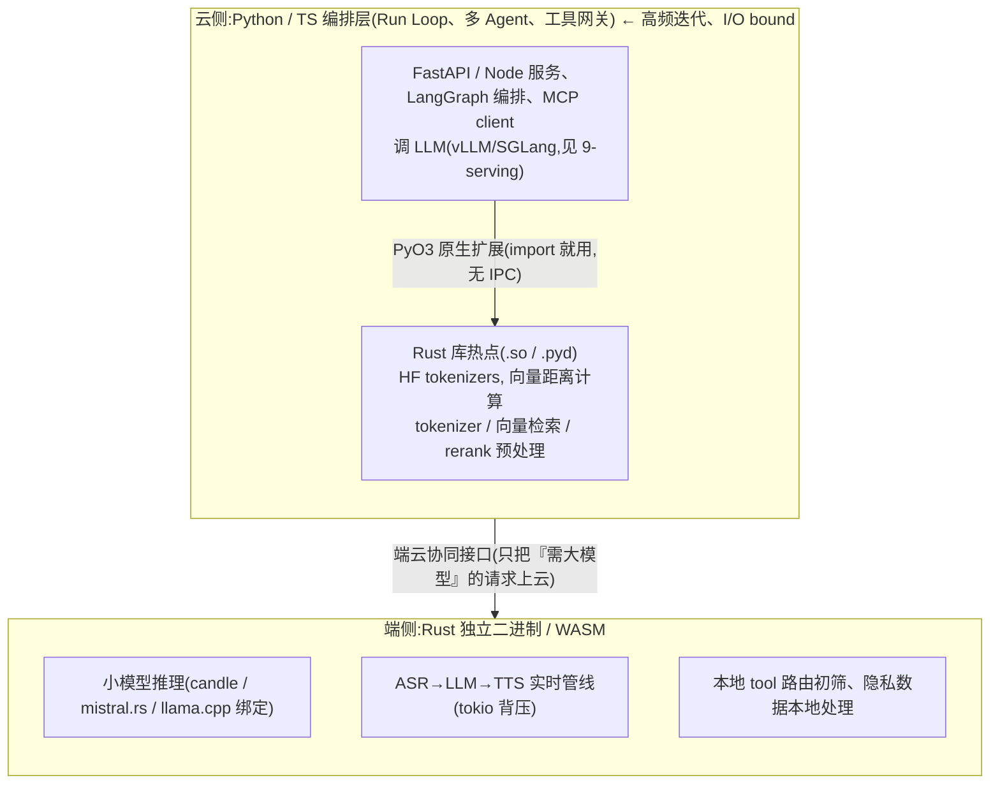
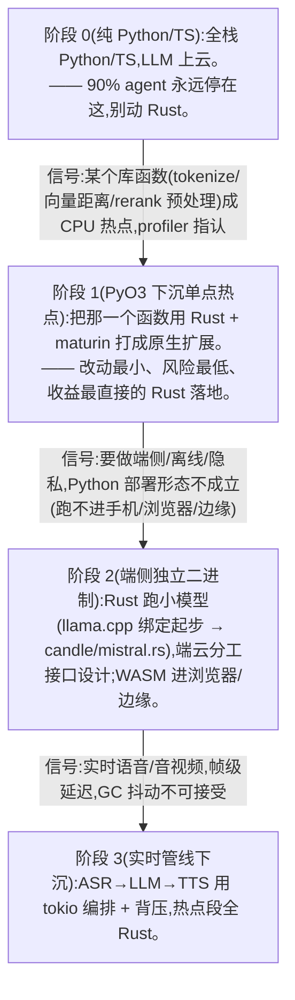

# 10 · Rust:端侧与实时链路(加分项)

> 不是「再学一门语言」,而是回答一个架构问题:**agent 栈里哪一段值得从 Python/TS 下沉到 Rust**——无 GC 停顿、可预测低延迟、内存安全、小二进制 + 易交叉编译/WASM 的地方(端侧推理、实时音视频/流式 token 管线、网关/tokenizer/向量检索这些热点)。
> 对应 JD:**加分项**(Rust 经验:端侧 / 实时链路)。它服务于 **职责 1**(Run Loop 的低延迟执行)、**职责 2**(工具调用网关 / MCP Gateway 的高并发代理)、**职责 3**(端云协同里端侧那一半)。
> **面试定位**:这是加分项,不是淘汰项。面试官想验的不是「你能手写推理引擎」,而是「你知道**为什么是 Rust、放在链路哪一段、和 Python/TS 怎么分工**」。本章按这个深度准备——讲清楚架构定位与取舍,远比背诵 crate 列表值钱。

> **最后核对:2026-06**。结论分级 ✅ 稳定经验 / ⚠️ 2026-06 快照(易变)/ ❓ 待验证。Rust ML 生态成熟度低、迭代快,**所有 crate 名、版本、benchmark 数字一律「(现查官网/GitHub)」**,不要在面试里把快照当定论。

---

## 1. 技术原理(为什么是 Rust,讲到机制层)

资深面试官会戳的是:**"快"不是理由,Python 调的也是 C++/CUDA**。Rust 的价值不在峰值吞吐(那是 GPU/kernel 的事),而在**延迟的可预测性 + 部署形态 + 安全边界**。把这三件讲透,才像架构师而不是粉丝。

### 1.1 无 GC → 尾延迟可预测(实时链路的真正命门)

实时管线(语音、流式 token)的体感不取决于**平均延迟**,取决于 **p99 / 抖动(jitter)**。带 GC 的运行时(Python 的 refcount + GIL、Go 的 STW、JVM)在负载高时会有**不可控的停顿尖刺**:GC 一停,正在 server→client 推的 token 流就卡一下,语音管线就爆音/丢帧。

- Rust 用**所有权 + RAII** 在编译期决定内存何时释放,**没有运行时 GC、没有 STW**,析构是确定性的(离开作用域即 drop)。✅
- 对实时链路的意义:**p99 延迟可预测**。不是更快,是**更稳**——音视频/流式管线要的就是"每 20ms 一帧不抖",而不是"平均很快但偶尔卡 200ms"。
- 对比锚点(量级感,非精确):Python 受 **GIL** 限制,CPU 密集逻辑无法真并行,且 GIL 切换 + refcount 本身是抖动源;实时音频的帧预算常在 **~10–20ms** 量级,一次 GC 尖刺就能吃掉整帧。⚠️(Python 3.13+ 的 free-threaded / no-GIL 在演进,现查官网)

> **面试官可能追问:Go 不也无 STW 化、协程也轻量,为什么不用 Go?**
> 答法:Go **有 GC**(虽是低延迟并发 GC,标记起止仍有 sub-ms 级 STW,且不可完全消除),且**没有 Rust 的零成本抽象与 no_std 能力**。WASM 上要说准:Go **能**编译到 WASM(`GOOS=js`/WASI),但产物**自带运行时 + GC、体积常达数 MB**,对浏览器/边缘 worker 这类体积敏感场景不划算;而 Rust WASM 可做到无 GC、几十 KB 级。Go 也**没有 no_std/裸机**路线。选 Rust 通常是因为要么**端侧/嵌入式**(no GC runtime、小二进制、交叉编译),要么**确定性尾延迟**(音视频帧级)。纯后端网关若团队是 Go 栈,Go 完全够用——别为了 Rust 而 Rust。⚠️(WASM 工具链现查官网)

### 1.2 内存安全 without GC → 编译期消灭一类崩溃

Rust 的**借用检查器(borrow checker)**在编译期保证:无 use-after-free、无 data race、无悬垂指针——**不靠运行时垃圾回收也内存安全**。这是它区别于 C/C++(快但不安全)和 Java/Go(安全但有 GC)的核心。

- 对**端侧/边缘 runtime** 的意义:跑在用户设备/边缘节点上,崩溃 = 用户可见、难复现、难热修。编译期把一类内存 bug 消灭,降低端侧运维成本。✅
- 对**网关/代理**的意义:网关是攻击面(处理不可信输入 + 鉴权 + 转发),Rust 的内存安全减少缓冲区溢出类 CVE。Cloudflare 用 Rust 写 Pingora 替代 nginx 就是这个逻辑(现查官网)。⚠️

### 1.3 小二进制 + 交叉编译 + WASM → 端侧/边缘的部署形态

这是 Python 在端侧**根本做不到**的部分,也是 Rust 在 agent 栈里最不可替代的一段:

- **静态链接、无运行时依赖**:Rust 编译出**单个自包含二进制**(可 `musl` 全静态),不需要在目标机装解释器/虚拟环境。端侧设备、容器 scratch 镜像、Lambda 自定义 runtime 都友好。✅
- **交叉编译一等公民**:`--target` 切平台(aarch64 手机/树莓派、x86 服务器、iOS/Android NDK),工具链成熟。端云同一份逻辑、两个 target。✅
- **WASM**:Rust 是**编译到 WASM 最成熟的语言之一**。意味着同一份 Rust 逻辑可跑在**浏览器 / 边缘 worker(Cloudflare Workers 等)/ 插件沙箱**里。candle 官方就有编译到 WASM 在浏览器内跑小模型的 demo(现查官网)。⚠️
  - 对 agent 的意义:**tokenizer、轻量预处理、甚至小模型推理可以下沉到浏览器/边缘**,数据不出端 → 隐私 + 离线 + 省一次网络往返。

### 1.4 端侧推理 = 把"小模型 + 隐私敏感 + 低延迟"那一段从云挪到端

端侧推理不是"在手机上跑 GPT-4",而是**端云分工**:

```
端侧(Rust runtime, 小模型/量化模型):
  - 隐私敏感:数据不出设备(健康、键盘输入、本地文件)
  - 低延迟/离线:无网络往返、断网可用
  - 高频/廉价:意图分类、ASR/TTS、补全、敏感词、tool 路由初筛
        │
        │  只把"需要大模型 + 可联网"的请求上云
        ▼
云侧(大模型, vLLM/SGLang 等, 见 9-serving):
  - 复杂规划、长 context、需要最新知识 / 重工具
```

端侧推理引擎要解决的机制问题:**模型加载(mmap 权重)、量化(int4/int8 降内存)、KV cache 管理、硬件后端(Metal/CUDA/CPU SIMD)**。这些恰好是 Rust 擅长的"贴着硬件还要内存安全"的活。✅

### 1.5 实时链路:把"首 token 延迟"与"端到端延迟"拆开

资深信号:**不要把延迟当一个数**。流式/语音管线至少拆两层,优化手段完全不同:

| 指标 | 定义 | 主要受什么决定 | 优化手段 |
|---|---|---|---|
| **TTFT**(首 token / 首帧延迟) | 用户发起 → 第一个 token/音频帧 | prefill 时间、排队、网络握手、prompt 长度 | prompt caching、prefix cache、就近接入、prefill 优化 |
| **端到端延迟** | 发起 → 完整结果/整句话说完 | TTFT + 生成长度 × **TPOT**(每 token 时间) | 流式边出边播、TPOT(吞吐)、并行/投机解码 |

- 语音管线尤其要拆:**ASR→LLM→TTS** 串行三段,任何一段不流式都会拖垮体感。正确做法是**全链路流式 + 重叠**:ASR 边出部分转写、LLM 边收边生成、TTS 边收文本边合成边播——三段**流水线重叠**而非串行等待。✅
- Rust 在这里的角色:**编排这条流式管线的"胶水 + 背压"**(tokio),保证三段速率不匹配时不爆内存、不抖动。

### 1.6 背压与并发:tokio 是 Rust 实时链路的发动机

`tokio` = Rust 的异步运行时(work-stealing 调度器 + 异步 I/O)。实时管线的核心不是"并发跑得多快",是**背压(backpressure):当下游(TTS/客户端网络)比上游(LLM 生成)慢时,怎么不爆内存、不丢帧**。

- 机制:用**有界 channel**(`tokio::sync::mpsc` 设容量上限)连接管线各段。下游慢 → channel 满 → 上游 `send().await` 自然挂起 → **背压逐级回传**到源头,而不是无限缓冲到 OOM。✅
- 这是流式系统最常见的生产事故来源:无界 buffer + 下游慢 = 内存涨爆。Rust 的有界 channel 把背压做成类型/await 层面的强制约束。

> **面试官可能追问:背压在 Python 里怎么做?**
> 答法:Python `asyncio` 也有 `Queue(maxsize=)`、`anyio` 的 memory stream 能做背压,机制类似。差别是 **Python 受 GIL,CPU 段无法真并行 + 抖动**,而 Rust 的 tokio 是多核真并行 + 无 GC 抖动。所以**纯 I/O 编排 Python 够用,带 CPU 热点(音频 DSP、tokenize、重采样)的实时段才下沉 Rust**。

---

## 2. 应用场景(什么时候必须用 / 什么时候是过度工程)

### 甜区(Rust 真正回本)

- **端侧/边缘推理**:小模型跑在手机/树莓派/边缘节点/浏览器(WASM),要隐私/离线/低延迟。Python 在这里部署形态根本不成立。✅
- **实时音视频/语音管线**:帧级确定性延迟,GC 抖动不可接受。✅
- **超高 QPS 的网关/代理热点**:MCP Gateway / 工具调用网关的转发层、鉴权层,连接数大、延迟敏感、是攻击面。⚠️
- **被亿万次调用的库级热点**:tokenizer、向量检索、rerank 预处理——调用频次极高,常数因子值钱。✅(HF `tokenizers` 本身就是 Rust 写、Python 调,这是最经典的范本)
- **嵌入式/IoT agent**:no_std、无 OS、内存以 KB 计的环境,只有 Rust/C 能上。

### 反模式(过度工程,别碰)

- **业务编排 / Run Loop 主逻辑用 Rust 写**:编排是 I/O bound + 高频迭代 + 重 prompt 实验,Rust 的编译期严格性 + 借用检查器**拖慢迭代**,而你根本不缺那点 CPU。这层就该 Python/TS。⚠️→❌
- **"为了简历/为了快"全栈 Rust 重写**:agent 90% 时间在等 LLM 网络 I/O,瓶颈是模型不是你的语言。重写 = 巨大机会成本。
- **团队没有 Rust 储备、招不到人**:Rust 学习曲线陡(借用检查器、生命周期、异步),团队没人 hold 得住 = 长期负债。
- **生态不成熟的部分硬上**:Rust 端侧 ML 生态(candle/burn/mistral.rs)仍在快速演进,**模型/算子覆盖、量化格式支持远不如 PyTorch/llama.cpp**——前沿模型刚出时 Rust 侧常滞后。❓

> **一句话判据**:`是端侧/边缘部署形态 OR 帧级确定性延迟 OR 亿级调用的库热点` → 考虑 Rust;否则 `Python/TS 编排` 默认胜出。

---

## 3. 具体实现方案(混合架构 + 关键代码)

### 3.1 主架构:Python/TS 编排 + Rust 写热点/端侧

**核心范式 = polyglot 混合架构,而非全 Rust。** 90% 的 agent 用 Rust 只在两处:① 作为 Python 的**原生扩展**(PyO3)加速库热点;② 作为**独立端侧/边缘二进制**跑推理。



### 3.2 端侧推理生态(⚠️ 2026-06 快照,现查 GitHub)

| crate / 项目 | 是什么 | 定位 / 取舍 |
|---|---|---|
| **candle**(HuggingFace) | 极简 Rust ML 框架,主打推理 | 轻量、易嵌入、支持 Metal/CUDA/CPU、**可编译 WASM 进浏览器**;算子/模型覆盖不如 PyTorch ⚠️ |
| **mistral.rs**(EricLBuehler) | Rust 写的 LLM 推理引擎,带量化/批处理/OpenAI 兼容 API | 比 candle 更"开箱即用的推理服务";迭代快、稳定性❓ |
| **burn**(tracel-ai) | 通用 Rust 深度学习框架(含训练),后端可插拔 | 想要"Rust 版 PyTorch"(含训练)选它;更重、学习曲线更陡 |
| **llama.cpp 绑定**(`llama-cpp-rs` / `llm` 等) | 给成熟 C++ 引擎套 Rust 壳 | **最务实**:复用 llama.cpp 久经考验的量化(GGUF)/算子,Rust 只做安全封装 ✅;但还是依赖 C++ |
| **ort**(ONNX Runtime 绑定) | Rust 调 ONNX Runtime | 模型先转 ONNX,跨框架部署成熟路线 |

> **架构师选法**:要**最稳/最快上线** → llama.cpp 绑定(蹭成熟 C++ 生态);要**纯 Rust + WASM/端侧极致轻量** → candle;要**现成推理服务** → mistral.rs;要**训练也在 Rust** → burn。前沿模型刚发布时,**优先看 llama.cpp/PyTorch 是否已支持**,Rust 原生框架常滞后。

### 3.3 关键代码 A:PyO3 把 Rust 热点暴露给 Python

最现实的 Rust 落地姿势——**不重写服务,只把一个被狂调的函数下沉成原生扩展**。用 `maturin` 打包,Python `import` 即用,无 IPC 开销。

```rust
// src/lib.rs —— Rust 侧:一个被高频调用的向量批量打分热点
use pyo3::prelude::*;

/// 批量算 query 与 N 个候选向量的余弦相似度(SIMD 友好、无 GIL 持有)
#[pyfunction]
fn batch_cosine(query: Vec<f32>, candidates: Vec<Vec<f32>>) -> PyResult<Vec<f32>> {
    let qn: f32 = query.iter().map(|x| x * x).sum::<f32>().sqrt();
    let scores = candidates
        .iter()
        .map(|c| {
            let dot: f32 = query.iter().zip(c).map(|(a, b)| a * b).sum();
            let cn: f32 = c.iter().map(|x| x * x).sum::<f32>().sqrt();
            dot / (qn * cn + 1e-8)
        })
        .collect();
    Ok(scores)
}

#[pymodule]
fn fast_retrieve(m: &Bound<'_, PyModule>) -> PyResult<()> {
    m.add_function(wrap_pyfunction!(batch_cosine, m)?)?;
    Ok(())
}
```

```python
# Python 侧:和普通包一样 import,零 IPC、零序列化跨进程
import fast_retrieve
scores = fast_retrieve.batch_cosine(query_vec, candidate_vecs)  # 热点已下沉到 Rust
```

> 真实计算密集时,Rust 内部可 `py.allow_threads(...)` **释放 GIL**,让 Python 主线程并行——这是 PyO3 加速的关键机制(字段/API 现查官网)。
> ⚠️ 隐藏成本:**跨边界传数据有序列化/拷贝开销**。只有"计算 >> 传参开销"才回本;把一个一行的小函数下沉到 Rust 是负优化。

### 3.4 关键代码 B:tokio 流式管线 + 有界背压(实时链路骨架)

语音/流式管线的最小骨架——**有界 channel 做背压**是重点,不是 LLM 推理本身。

```rust
use tokio::sync::mpsc;

// 上游:LLM 边生成边推 token(生产者)
// 下游:TTS 边收文本边合成边播(消费者,通常更慢)
async fn pipeline() {
    // 有界 channel:容量 32。下游慢 → 满 → 上游 send().await 挂起 → 背压回传
    let (tx, mut rx) = mpsc::channel::<String>(32);

    // 生产者:LLM 流式
    let producer = tokio::spawn(async move {
        let mut stream = llm_stream("讲个笑话").await; // 伪:返回 token 流
        while let Some(token) = stream.next().await {
            // 若 TTS 跟不上,这里自然阻塞,LLM 不会跑飞、内存不涨爆
            if tx.send(token).await.is_err() { break; } // 下游关了就停
        }
    });

    // 消费者:TTS,按句边界切分边合成边播
    let consumer = tokio::spawn(async move {
        let mut buf = String::new();
        while let Some(token) = rx.recv().await {
            buf.push_str(&token);
            if ends_sentence(&buf) {          // 攒到一句再合成,降 TTS 启停开销
                tts_speak(&buf).await;        // 边合成边播(本身也应是流式)
                buf.clear();
            }
        }
    });

    let _ = tokio::join!(producer, consumer);
}
```

机制要点:
- **有界**容量是背压开关——无界 = 下游慢就 OOM(生产最常见事故)。✅
- 按**句子边界**切给 TTS,而不是每 token 都合成——平衡 TTFT(越早出第一句越好)与 TTS 启停成本。
- 取消:用户打断(barge-in)时 drop 掉 `rx`,`tx.send` 报错 → 生产者自然停 → LLM 调用要能 cancel(`CancellationToken`)。语音 agent 的"插话打断"就是这条路径。

### 3.5 最轻起步 → 升级路径



---

## 4. 架构师取舍判断

### 4.1 选型轴

| 轴 | 问什么 | 倒向 Rust | 倒向 Python/TS |
|---|---|---|---|
| **部署形态** | 要不要跑进手机/浏览器/边缘/嵌入式 | 要(WASM/交叉编译/小二进制) | 云端服务,Python 够 |
| **延迟性质** | 要均值快还是**尾延迟稳/帧级确定** | 帧级确定、无 GC 抖动 | 秒级体感,GC 可接受 |
| **是 I/O 还是 CPU bound** | 瓶颈在等 LLM 还是在本地算 | 本地 CPU 热点(tokenize/DSP/向量) | 等 LLM 网络 I/O(绝大多数) |
| **调用频次** | 这段代码每秒被调多少次 | 亿级库热点,常数因子值钱 | 低频业务逻辑 |
| **迭代速度需求** | 这段要不要天天改 prompt/逻辑 | 稳定的底层(少改) | 高频实验的编排层 |
| **团队储备** | 有没有人 hold 得住 Rust | 有 Rust 工程师 | 没有 → 别赌 |
| **生态成熟度** | 这个模型/算子 Rust 支持了吗 | 成熟路径(tokenizer/检索/网关) | 前沿模型推理,先 PyTorch/llama.cpp |

### 4.2 主选 vs 备选 vs 代价

| 决策点 | 主选 | 备选 | 代价 / 何时翻盘 |
|---|---|---|---|
| **编排层语言** | Python/TS ✅ | —— | Rust 写编排 = 迭代慢、机会成本高,几乎总是错 |
| **库热点加速** | PyO3 下沉单函数 ✅ | C 扩展 / Cython / 纯 Python+numpy | numpy 向量化够用就别上 Rust;跨边界拷贝可能吃掉收益 |
| **端侧推理引擎** | llama.cpp 绑定(蹭成熟生态)✅ | candle(纯 Rust + WASM)/ mistral.rs / ort | 前沿模型 Rust 侧滞后;candle 算子覆盖不全 ⚠️ |
| **实时语音管线** | Rust + tokio(帧级稳)| Python asyncio(原型够快)/ 现成语音平台 | 团队无 Rust 时,先用托管语音 API 验证产品再说 |
| **MCP/工具网关** | 跟随团队主栈(Go/Node 常更划算)| Rust(Pingora 类,极致并发)| 没到极致 QPS,Rust 网关是过度工程 ⚠️ |

> **架构师心法**:Rust 在 agent 栈的正确位置是**"窄而深"**——只占链路里**部署形态特殊**或**CPU 热点 + 延迟敏感**的那一小段,被 Python/TS 编排层调用。**全栈 Rust 化几乎都是反模式**,因为 agent 的瓶颈是 LLM 网络 I/O,不是你的胶水语言。

---

## 5. 面试高频问答(重点)

**Q1:加分项写了 Rust,你 Rust 到什么程度?**
A(诚实定位,这是关键):
- 不假装是 Rust 推理引擎专家。如实说**会用 Rust 解决"端侧/实时/库热点"这三类问题**,能讲清架构定位与取舍。
- 给出**真实落地形态**:PyO3 把热点下沉、tokio 写流式背压管线、了解 candle/mistral.rs/llama.cpp 绑定的分工。
- 反问式收尾:"你们 Rust 是用在端侧推理、实时音视频、还是网关?这三段我准备的深度不一样。" —— 把"加分项"变成"对齐需求的对话"。

**Q2:为什么实时/端侧偏好 Rust 而不是 Python/Go?**
A:三个层次,**别只说"快"**:
1. **无 GC → 尾延迟可预测**:实时看 p99/抖动,GC 尖刺会卡 token 流/音频帧;Rust 确定性析构无 STW。
2. **部署形态**:小二进制 + 交叉编译 + WASM,能跑进手机/浏览器/边缘/嵌入式,这是 Python 做不到的。
3. **内存安全 without GC**:端侧崩溃难修、网关是攻击面,编译期消灭一类内存 bug。
- Go 的差异点:Go **有 GC**(虽低延迟,但标记起止仍有 sub-ms STW);Go **能**出 WASM,但产物自带运行时 + GC、体积数 MB,体积敏感的浏览器/边缘不划算,且**无 no_std/裸机**路线。纯后端 Go 够用,端侧/帧级延迟才必须 Rust。

> **面试官可能追问:Python 调的不也是 C++/CUDA,瓶颈在 GPU,Rust 快在哪?**
> 答法:对,**峰值吞吐看 GPU kernel,跟语言无关**。Rust 不赢吞吐,赢的是**①延迟可预测性(无 GC 抖动)②部署形态(端侧/WASM)③把 CPU 侧热点(tokenize/采样/DSP/背压编排)做稳**。如果你的瓶颈纯在 GPU 推理,那确实不该碰 Rust——这恰恰说明我知道边界在哪。

**Q3:首 token 延迟和端到端延迟怎么分开优化?**
A:必须拆成两个指标:
- **TTFT**(首 token/首帧):受 prefill、排队、prompt 长度、网络握手决定 → 优化靠 **prompt caching / prefix cache、就近接入、缩短 prompt、prefill 优化**。
- **端到端** = TTFT + 生成长度 × **TPOT** → 优化靠**流式边出边播、提升吞吐、并行/投机解码**。
- 语音管线再叠一层:**ASR→LLM→TTS 三段流水线重叠**,任一段不流式就拖垮体感。Rust+tokio 的活是**编排重叠 + 背压**,不是推理本身。

**Q4:Rust 在 agent 栈里现实放在哪几段?**
A:**窄而深**四个落点:
1. **tokenizer**(HF `tokenizers` 就是 Rust 写、Python 调,最经典范本)
2. **向量检索 / rerank 预处理**(Qdrant、LanceDB、tantivy 都是 Rust;量级:亿次调用常数因子值钱,⚠️现查)
3. **网关/代理**(高并发转发 + 鉴权,Pingora 类,⚠️)
4. **端侧 runtime**(小模型推理 + 实时管线)
- **编排层永远是 Python/TS**;Rust 是被它调用的热点/端侧组件。

**Q5:端云怎么分工?哪些放端侧?**
A:判据是**隐私 / 离线 / 低延迟 / 高频廉价**:
- **放端侧**:隐私敏感数据(键盘、健康、本地文件)、ASR/TTS、意图分类、补全、tool 路由初筛、敏感词——小模型量化版能扛的。
- **上云**:复杂规划、长 context、需最新知识、重工具调用。
- 接口设计:端侧先跑,**只把"需大模型 + 可联网"的请求上云**,省一次往返 + 保护隐私。这正好接 JD 职责 2 的"端云协同接口"。

**Q6:PyO3 下沉热点,怎么判断值不值?**
A:三条:
- profiler **指认了具体热点函数**(不是凭感觉),且它是 **CPU bound**(不是在等 I/O)。
- **计算量 >> 跨边界传参的序列化/拷贝开销**(否则负优化)。
- 计算密集段记得 `allow_threads` **释放 GIL** 才能真并行。
- 反面:一行小函数、低频调用、I/O bound 的别碰——上 Rust 是给自己加构建/招人负债。

**Q7:tokio 背压不做会怎样?**
A:**无界 buffer + 下游慢 = OOM**,流式系统最常见生产事故。正解:管线各段用**有界 channel**(`mpsc::channel(N)`),下游满 → 上游 `send().await` 挂起 → 背压逐级回传到源头。语音的"用户打断(barge-in)"靠 drop 接收端 + `CancellationToken` 取消上游 LLM 调用。

**Q8(陷阱题):要不要把整个 agent 用 Rust 重写以提性能?**
A:**不要,这几乎总是反模式。** agent 90% 时间在等 LLM 网络 I/O,瓶颈是模型不是语言;编排层高频迭代,Rust 的编译期严格性拖慢实验;团队招 Rust 难。正解是**混合架构**:Python/TS 编排 + Rust 只下沉"端侧/实时/库热点"那一小段。能说出这个边界,比说"我全 Rust"更像资深。

---

## 6. 踩坑 / 反模式

| 反模式 | 选错的信号 | 治法 |
|---|---|---|
| **全栈 Rust 重写 agent** | "为了性能/为了简历"全 Rust;编排层天天改还要过借用检查器 | 退回混合架构;Rust 只占端侧/实时/热点,编排回 Python/TS |
| **把 Rust 当"更快的 Python"用在 I/O 段** | 瓶颈在等 LLM,却去优化语言 | 先 profile:I/O bound 上 Rust 零收益,该优化的是缓存/并发/模型 |
| **无界 buffer 流式管线** | 高负载下内存缓涨直到 OOM | 有界 channel + 背压;按句切分给 TTS |
| **前沿模型硬上纯 Rust 框架** | candle/mistral.rs 还没支持新模型/量化格式 | 端侧优先 llama.cpp 绑定(蹭成熟 GGUF 生态);纯 Rust 框架等生态跟上 ❓ |
| **PyO3 下沉小函数** | 跨边界拷贝开销吃掉计算收益,甚至更慢 | 只下沉"计算 >> 传参"的真热点;批量化调用摊薄边界开销 |
| **团队无 Rust 储备硬上** | 只有一个人会写,他一走就没人维护 | 把 Rust 锁在**边界清晰、少改**的组件(库/端侧二进制),或先别上 |
| **用平均延迟评估实时链路** | 平均很好但用户抱怨卡顿/爆音 | 盯 **p99/抖动**;实时看尾延迟不看均值 |
| **语音管线串行不重叠** | ASR 等完→LLM 等完→TTS,体感巨慢 | 三段全流式 + 流水线重叠;TTFT 与端到端分开优化 |

> **最危险的信号**:在还没有 profiler 证据、也没有"端侧/实时部署形态"硬约束时,就有人提议"用 Rust 重写"。99% 是过度工程——agent 的延迟预算几乎全花在 LLM 上,先去 9-serving / 05-caching 那边找钱。

---

## 7. 回链已有资产 / 课程

- **Serving / 部署形态选型(云侧推理放哪、流式/异步)**:[`../../roadmap/agent-selection/9-serving-deployment.md`](../../roadmap/agent-selection/9-serving-deployment.md) —— 本章的"端云分工"里**云侧那一半**(vLLM/SGLang、SSE 流式、durable execution)归它;Rust 只补"端侧 + 实时热点"这一小段。
- **检索栈选型(向量库/rerank,Rust 写的 Qdrant/LanceDB/tantivy 出处)**:[`../../roadmap/agent-selection/3-retrieval.md`](../../roadmap/agent-selection/3-retrieval.md) —— §1.4 "Rust 库热点"里向量检索的母篇。
- **工具网关 / MCP Gateway(高并发代理那一段可下沉 Rust)**:[`./02-tool-gateway-auth-and-contract.md`](./02-tool-gateway-auth-and-contract.md)、[`./03-mcp-gateway-and-protocol.md`](./03-mcp-gateway-and-protocol.md) —— 本章 §1.2 网关定位、JD 职责 2 端云协同接口的对接处。
- **Context Editing / Prompt Caching 降本(TTFT 优化的主战场)**:[`./05-context-engineering-and-caching.md`](./05-context-engineering-and-caching.md) —— §1.5 TTFT 优化"靠 prompt caching"的落地在这里;**找延迟/成本应先看这章和 9-serving,而非 Rust**。
- **基本功:function calling / RAG(tokenizer 即 RAG/调用链的高频热点)**:[`./08-foundations-function-calling-and-rag.md`](./08-foundations-function-calling-and-rag.md)。
- **心智模型 · L5 部署 / 安全运行时**:[`../1.md`](../1.md) —— 运行形态、延迟作为事前设计约束;本章把"端侧/实时"作为该层的一个特殊分支。

> **最后核对:2026-06**。crate 名(candle / burn / mistral.rs / llama.cpp 绑定 / tokio / PyO3 / maturin)、它们的成熟度/算子覆盖/WASM 支持、Qdrant/LanceDB/Pingora 等是否 Rust、以及一切 benchmark 数字均属 **⚠️快照,且 Rust ML 生态迭代极快**,定方案前**现查官网/GitHub**。本章的稳定内核是:**为什么是 Rust(无 GC 尾延迟 / 部署形态 / 内存安全)、放链路哪一段(端侧 + 实时 + 库热点,窄而深)、和 Python/TS 怎么分工(编排归 Py/TS,热点/端侧归 Rust)**——这三点是面试要拿的分,不会过期。
