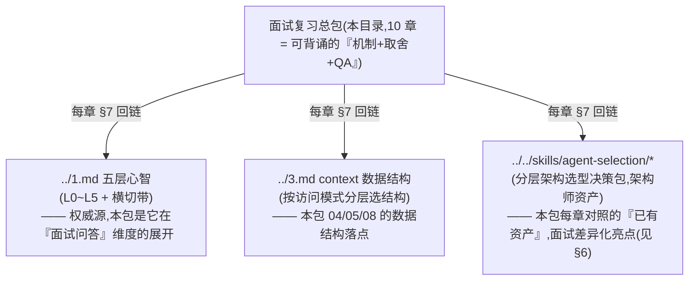

# 资深 Agent 工程师 / LLM 应用 · 面试复习总包

> 一句话用途:这是面向「**资深 Agent 工程师 / LLM 应用**」岗位的**面试复习总入口**——把 JD 的每条职责/要求/加分项,拆成 10 章可背诵的「机制 + 取舍 + 高频问答」,并对照到本仓库已沉淀的**分层选型矩阵资产**。目标不是「能跑通 demo」,而是面试时能讲清**每个方案的取舍 / 备选 / 代价**,拿到资深分。
>
> 用法:先看 §3 的「JD 逐条自检表」定位短板 → 按 §5 的复习节奏过章 → 用 §6 的面试策略做最后一轮模拟。
> 最后核对:2026-06。⚠️ 各章易变项(版本号 / 价格 / API 字段名)一律标「现查官网」,本包固化的是**机制与选型方法**,不固化产品快照。

---

## 1. 目标岗位 JD(原文,完整收录便于对照)

> 资深 Agent 工程师 / LLM 应用(BOSS 直聘 JD)
>
> **【岗位职责】**
> 1. 实现 Agent Run Loop(感知 → 规划 → 执行 → 验证)与多 Agent 编排(Orchestrator–Workers)。
> 2. 开发带鉴权的工具调用网关与工具契约、MCP Gateway,打通端云协同接口。
> 3. 实现多层 Memory + 全链路 trace 落库;接入 Context Editing、Memory Tool、Prompt Caching 降本。
> 4. 实现安全护栏:失败重试与 fallback、token 预算硬限、越权工具拦截、人审闸口。
>
> **【任职要求】**
> 1. 5 年以上软件工程 + 1 年以上 LLM Agent 实战;精通 Python / TS,强 API 与系统设计能力;做过 function calling / 工具调用 / RAG / 多 Agent。
>
> **【加分项】**
> - MCP server / client 开发经验。
> - 评测驱动开发(Promptfoo / DeepEval)经验。
> - Rust 经验(端侧 / 实时链路)。

---

## 2. 这个复习包怎么搭的(分层心智)

JD 看着是 4 条职责 + 1 条要求 + 3 个加分项,本质是**一套 agent 系统从「地基 → 核心机制 → 横切治理 → 加分深挖」的纵切**。本包按这个纵切组织成 10 章,并和仓库里更上游的两份心智模型、一套选型矩阵打通:



> 关键边界:**心智模型(../1.md)是「为什么」的权威源,选型矩阵(agent-selection)是「选什么」的决策包,本包是「面试怎么讲」的展开**。三者不重写、只交叉引用——这也是仓库「资产复用」原则的体现。

---

## 3. ⭐ JD 逐条 → 章节 + 已有资产 自检表(核心)

> 用法:这是**面试前的自检清单**。每行问自己一句「**这条我能不能不看稿讲清楚机制 + 至少一个取舍**?」——能,打 ✅;打磕巴,回对应章 §5 背问答。`已有资产`列是仓库里更深的选型决策,讲到「我为什么这么选」时引它做差异化(见 §6 自我介绍)。

| # | JD 条目 | 主章 | 交叉章 | 已有选型矩阵资产 | 一句话自检点(讲得清吗) |
|---|---|---|---|---|---|
| 职责 1 | Run Loop(感知→规划→执行→验证) | **01** | 08(执行环) | `../../skills/agent-selection/0-action-paradigm.md` | 四相为何「验证」最易漏又是命门?final answer 要不要验? |
| 职责 1 | 多 Agent 编排(Orchestrator–Workers) | **01** | — | `../../skills/agent-selection/2-framework/01-decision-tree.md`、`.../04-scenario-playbook.md` | 何时单 agent 够、何时才上多 agent?15x 成本比的是谁? |
| 职责 2 | 带鉴权的工具调用网关 + 工具契约 | **02** | 07(策略)、08(契约即 prompt) | `../../skills/agent-selection/4-tools.md`、`.../7-safety-guardrails.md` | 框架能调工具了为何还要网关?凭证为何绝不进 prompt? |
| 职责 2 | MCP Gateway | **03** | 02(鉴权本体) | `../../skills/agent-selection/2-framework/06-protocols.md` | MCP 解决 N×M 还是「能不能跑通」?三原语控制方差异? |
| 职责 2 | 打通端云协同接口 | **02 / 03** | 10(端侧) | `../../skills/agent-selection/9-serving-deployment.md` | 同一份契约两侧执行、outbox + 幂等对账怎么保一致? |
| 职责 3 | 多层 Memory + Memory Tool | **04** | 05(省窗口角度) | `../../skills/agent-selection/6-memory.md` | 短期/长期 vs semantic/episodic/procedural 两条正交轴? |
| 职责 3 | 全链路 trace 落库 | **06** | 09(回流 eval) | `../../skills/agent-selection/5-observability-eval.md` | trace≠log,一次提问=一棵 span 树;落库为何要分库? |
| 职责 3 | Context Editing / Prompt Caching 降本 | **05** | 04(Memory Tool)、06(token 记账) | `../../skills/agent-selection/8-cost-economics.md`、`.../1-model.md` | 缓存命中四要素?Editing≠Compaction?缓存×级联张力? |
| 职责 4 | 失败重试 & fallback / 断路器 | **07** | 02(网关执行点) | `../../skills/agent-selection/7-safety-guardrails.md` | 哪些错该重试?跨模型 fallback 为何不是 try/except? |
| 职责 4 | token 预算硬限 | **07** | 05(降本)、06(计量) | `../../skills/agent-selection/8-cost-economics.md` | 预估 gate + 真值 ledger + reserve/settle 防超卖? |
| 职责 4 | 越权工具拦截 + 人审闸口(HITL) | **07** | 02(挂闸点)、06(trace 断裂) | `../../skills/agent-selection/7-safety-guardrails.md` | 注入越权为何不能靠 system prompt 挡?HITL 为何 fail-closed? |
| 要求 | Python/TS + function calling / RAG / 多 Agent | **08** | 01(多 agent)、02 | `../../skills/agent-selection/3-retrieval.md`、`.../4-tools.md` | 模型到底执行没执行你的函数?RAG 幻觉是检索锅还是生成锅? |
| 加分 | MCP server / client 开发 | **03** | — | `../../skills/agent-selection/2-framework/06-protocols.md` | 握手 + 能力协商讲得透吗?四类 MCP 攻击面? |
| 加分 | 评测驱动开发(Promptfoo / DeepEval) | **09** | 06(数据飞轮上游) | `../../skills/agent-selection/5-observability-eval.md` | trajectory 层为何是 agent 特有?LLM-as-Judge 四要点? |
| 加分 | Rust(端侧 / 实时链路) | **10** | 02(网关)、05(TTFT) | `../../skills/agent-selection/9-serving-deployment.md`、`.../3-retrieval.md` | 为何是 Rust(无 GC 尾延迟/部署形态),放链路哪一段? |

> 自检统计法:把上表 15 行过一遍,标 ✅/⚠️/❓。**全 ✅ 才算「这个 JD 准备好了」**;⚠️/❓ 的行直接跳对应章 §5「面试高频问答」。

---

## 4. 章节索引(10 章,每章一句话)

| 章 | 标题 | 一句话 | 链接 |
|---|---|---|---|
| 01 | Agent Run Loop 与多 Agent 编排 | 把「自主性」关进有界状态机:四相 + 退出闸 + Orchestrator–Workers 取舍 | [01-agent-run-loop-and-orchestration.md](./01-agent-run-loop-and-orchestration.md) |
| 02 | 工具调用网关 · 契约 · 端云协同 | 在概率模型和确定性副作用之间插一层确定性边界(authN/Z、幂等、限流、审计) | [02-tool-gateway-auth-and-contract.md](./02-tool-gateway-auth-and-contract.md) |
| 03 | MCP Gateway 与协议 | MCP 把工具/资源/提示标准化接入(N×M→N+M);Gateway 聚合多 server 统一治理 | [03-mcp-gateway-and-protocol.md](./03-mcp-gateway-and-protocol.md) |
| 04 | 多层 Memory | 三条正交轴(作用域×内容类型×更新时机)叠出记忆能力;写入→巩固→召回→遗忘生命周期 | [04-multi-layer-memory.md](./04-multi-layer-memory.md) |
| 05 | Context 工程:Editing 与 Caching 降本 | 把 context 当稀缺资源经营:Caching 省前缀、Editing 砍膨胀、Memory Tool 外移 | [05-context-engineering-and-caching.md](./05-context-engineering-and-caching.md) |
| 06 | 全链路 trace 落库与可观测 | 一次提问=一棵 span 树;不只看,还要落库做分析/回归/数据飞轮 | [06-full-link-trace-and-observability.md](./06-full-link-trace-and-observability.md) |
| 07 | 安全护栏 | 在确定性边界上设四个闸:重试/fallback、token 预算硬限、越权拦截、人审闸口 | [07-safety-guardrails.md](./07-safety-guardrails.md) |
| 08 | 基本功:Function Calling 与 RAG | Agent 的两条腿:模型吐结构化意图(非执行)+ 检索把外部知识喂进 context | [08-foundations-function-calling-and-rag.md](./08-foundations-function-calling-and-rag.md) |
| 09 | 评测驱动开发(Promptfoo / DeepEval) | 像 TDD 一样先定「好」的可度量标准再迭代;eval 当回归门控 | [09-eval-driven-development.md](./09-eval-driven-development.md) |
| 10 | Rust:端侧与实时链路 | 哪一段值得从 Python/TS 下沉到 Rust:无 GC 尾延迟 / 部署形态 / 库热点,窄而深 | [10-rust-edge-and-realtime.md](./10-rust-edge-and-realtime.md) |

---

## 5. 复习顺序建议(2~3 天节奏)

总原则:**先地基(08)→ 再核心职责(01/02/03/04/05/06/07)→ 最后加分项(09/10)**。地基不牢,核心章里的「执行环 / 契约 / token 记账」都讲不实。按 JD 权重排:职责 1~4 是必答主战场,加分项是「锦上添花、对齐需求再深挖」。

```
Day 1 · 地基 + 主循环(把"骨架"立起来)
  ├─ 08 基本功 ★必先  function calling 协议(模型不执行函数)、并行回填坑、
  │                   RAG 八环 + 两类编码器 + RAG Triad —— 后面所有章的地基
  ├─ 01 Run Loop      四相(验证是命门)+ 退出闸 + 单 vs 多 agent(15x 成本)
  └─ 04 多层 Memory   两条正交轴 + 写入/巩固/召回/遗忘 + Memory vs RAG 切口
       自检:能白板手写「四相+退出闸的 agent_loop」和「三类记忆写策略」吗?

Day 2 · 工具治理 + 横切降本/护栏(把"边界"挂上去)
  ├─ 02 工具网关      契约 vs 网关分清、凭证不进 prompt、中间件链顺序语义
  ├─ 03 MCP          三原语控制方、握手+能力协商、Gateway 四件治理事、攻击面
  ├─ 05 Context 降本  Caching 命中四要素 + Editing≠Compaction + 缓存×级联张力
  └─ 07 安全护栏      四闸机制(重试分类/预算三件套/越权纵深防御/HITL fail-closed)
       自检:02/07 串起来讲「一次工具调用流经哪些确定性闸」,顺序为何这么排?

Day 3 · 可观测 + 加分项(把"飞轮"和"差异化"补上)
  ├─ 06 全链路 trace  span 树缝合(contextvars/traceparent)+ 落库分库 + 采样
  ├─ 09 评测驱动      EDD vs TDD、两类×两节奏、trajectory 层、judge 四要点、飞轮
  └─ 10 Rust(加分)  为何是 Rust(尾延迟/部署形态)+ 放哪段 + 端云分工(诚实定位)
       自检:06→09 的「失败 trace 回流成 eval 样本」数据飞轮能闭环讲吗?
```

> 时间紧只有 1 天:**08 → 01 → 02 → 07**(JD 职责 1/2/4 的硬骨头)+ 04/05 各扫一遍 §5 问答。03/06/09/10 视面试官栈临场补。
> 节奏建议:每章先读 §1 技术原理 + §4 取舍判断 + §5 面试问答(这三节是「机制 + 判断 + 背诵」三件套),§3 代码扫一眼记住要点注释即可,§6 踩坑表当 checklist 速过。

---

## 6. 面试策略

### ① 30 秒自我介绍切入点(把「已有学习资产」当差异化亮点)

普通候选人讲「我做过 X 项目」;**资深候选人讲「我有一套可复用的选型判断框架」**。本仓库的两份心智模型(../1.md 五层、../3.md 数据结构)+ 一套分层选型矩阵(agent-selection,已抽出 nfr-standard 等独立资产)就是这个框架的实证。话术骨架:

> 「我有 N 年软件工程 + 实战 LLM Agent 的经验,Python/TS 都在生产里写过 function calling、RAG 和多 Agent。我的差异化不只是『做过』,而是沉淀了一套**分层的 agent 架构选型框架**——从模型 / 框架 / 检索 / 工具 / 记忆 / 观测·eval 六层,每层都有『主选 / 备选 / 代价』的决策树和 ADR。比如多 Agent,我的默认答案是『先别上』:单 agent + 好工具 + 扎实 verify 是 80% 场景的正解,多 agent 相对裸 chat 约 15x token 成本,只在真有并行/隔离需求时才上。我习惯把每个方案的**取舍和隐藏成本**讲清楚,而不只是 happy path。」

要点:**别背技术名词堆砌,要露出「判断框架 + 取舍意识」**——这正是 JD「强系统设计能力」和「架构师视角」想验的。提一个具体取舍(如 15x、verify 是命门)立刻把抽象变可信。

### ② 可能的 System Design 大题清单(≥5 道,每题点出考点)

| # | 题目 | 核心考点(踩中哪几章) | 一定要主动说出的「取舍/代价」 |
|---|---|---|---|
| 1 | 设计一个带护栏与全链路 trace 的**多 Agent 客服系统** | 01 编排 + 07 四闸 + 06 span 树 + 04 记忆 | Orchestrator–Workers 的 15x 成本;HITL fail-closed;trace 落库分库;失败隔离 |
| 2 | 设计**带鉴权的工具调用网关**,支持 100+ 工具、端云混合、多租户 | 02 中间件链 + 03 MCP + 08 工具路由 + 07 越权 | 凭证不进 prompt(Token Exchange);独立网关 +1 跳/SPOF;工具检索两阶段;网关只做横切 |
| 3 | 给一个长跑 research agent **做降本**(token 账单失控) | 05 三杠杆 + 06 四类 token 记账 + 01 退出闸 | 缓存×级联张力(子 agent 保缓存);Editing 清太勤触发 rewrite;先量化再优化 |
| 4 | 设计一个**个人助理的多层记忆系统**(跨会话、多租户、合规) | 04 三轴 + 隐私 + 冲突解决 + 09 回归 | hot path vs background;semantic 冲突解决;per-user namespace 硬隔离 + TTL;遗忘运维 |
| 5 | 给现有 agent 搭一套 **eval + 回归门控**,支持安全护栏验收 | 09 两类×两节奏 + trajectory + 06 飞轮 | rule-based 守 commit / judge 守 release;judge 偏置;held-out 防过拟合;数据集进 git |
| 6 | 设计一个**实时语音 agent**(ASR→LLM→TTS),端侧 + 低延迟 | 10 尾延迟/背压 + 05 TTFT + 02 端云 | 拆 TTFT vs 端到端;三段流水线重叠;tokio 有界 channel 背压;barge-in 取消;别全栈 Rust |
| 7 | 设计一个**企业 RAG 问答**(私有知识、可溯源、答非所问要能归因) | 08 RAG 八环 + RAG Triad + 04 memory vs RAG | 解析/切分是真瓶颈;Bi→Cross 两阶段;换 embedding=重建索引;Triad 定位幻觉源头 |

> 答题套路(对齐本包风格):**先问清需求/约束 → 画一张 ASCII 架构图 → 标出每个关键决策的「主选/备选/代价」→ 给「最轻起步→升级路径」**。最忌只讲 happy path、不讲退化和成本。

### ③ 该反问面试官的好问题(3~5 个)

1. **「你们的 agent 现在卡在哪一层?」**——是 L0 模型能力、L1 工具契约、L3 context/成本,还是 L4 多 agent 协调?(露出五层心智,且把后续对话引到我准备最深的地方)
2. **「Rust / 端侧那块,是用在端侧推理、实时音视频,还是网关?这三段我准备的深度不一样。」**(把加分项从「我会 Rust」变成「对齐需求的对话」,同时诚实定位)
3. **「你们 eval / 可观测做到哪一步了?有没有 trajectory 层评测和失败 trace 回流的数据飞轮?」**(大多数团队停在 component+task 级,这个问题能探出团队成熟度)
4. **「工具调用的安全边界(越权/注入/人审)目前是放在网关确定性 enforce,还是还在靠 system prompt?」**(探团队的「确定性优先」意识,也展示我知道边界该在哪)
5. **「多 Agent 是真实的并行/隔离需求,还是历史上为了架构现代感上的?现在 token 成本/调试痛吗?」**(展示「加 agent 不是默认解」的判断,同时了解真实痛点)

> 反问的目的有二:**探团队工程成熟度**(决定这岗位值不值得去)+ **把对话引到自己准备最深的章节**。每个反问都要能自然接出一段自己的判断。

---

## 7. 与本仓库其它面试笔记的关系

本包不是孤立的,它是仓库既有心智模型在「这个具体 JD」维度的展开。三者分工:

| 资产 | 是什么 | 在本包里的角色 | 本包哪些章直接依赖 |
|---|---|---|---|
| **[../1.md](../1.md)** | 五层心智模型(L0 概率底座 / L1 契约 / L2 核心机制 / L3 context / L4 多 agent / L5 部署安全 + 横切带:协议、度量观测、HITL、确定性优先、成本) | **权威源**:本包每章「为什么」回链于此,不重写 | 01(L2 状态机/L4 多 agent)、02(L1 契约/HITL)、04(记忆三类)、07(L5 安全/确定性优先)、09(横切带 B 度量) |
| **[../3.md](../3.md)** | context 用什么数据结构(按访问模式分层:顺序选 list、随机 key 选 map、滑窗选 deque、语义检索选向量库、关系选图;运行时/持久化/拼 prompt 是三件事) | **数据结构落点**:本包讲记忆/context/trace 的存储结构时对照它 | 04(working/buffer/Store 选型)、05(context 分区布局)、06(trace 三种表示)、08(chunk metadata) |
| **[../../skills/agent-selection/](../../skills/agent-selection/README.md)** | 分层架构选型决策包(0~10:动作范式/模型/框架/检索/工具/观测·eval/记忆/护栏/成本/serving/UX),含决策树 + Spec-Kit prompt 块 | **决策包**:本包每章 §7 + 本 README §3 自检表「已有资产」列回链于此,作面试差异化 | 全部 10 章各自对照(见 §3 表「已有选型矩阵资产」列) |

> 心智坐标速记:**../1.md 答「为什么」,../3.md 答「用什么结构存」,agent-selection 答「选哪个方案」,本包答「面试怎么讲清楚 + 取舍」**。四者交叉引用、各司其职,这本身就是仓库「资产复用」原则(资产类型→形式→机制)的一个实例。

---

> 最后核对:2026-06。本 README 固化的是**包的结构与自检方法**;各章内易变项(模型 id / 价格 / TTL / beta header / SDK 字段 / 框架维护状态 / crate 成熟度)请就近现查官网,详见各章 §7 末尾的「最后核对」。
