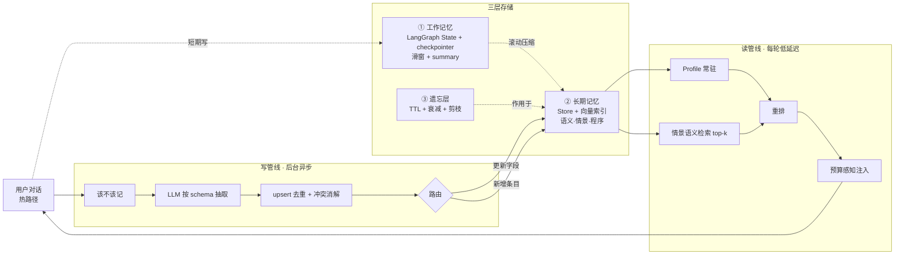

这个问题表面简单，但其实是个考察"分层思维"的开放题。面试官想看的不是你背一个标准答案，而是你能不能意识到 **context 根本不是单一结构,选什么取决于访问模式（access pattern）**。

下面我按这个思路给你拆，最后给你一段可以直接说出口的"标准答案"。

## 先点破关键：context 是分层的

很多人一听 "context" 就直接回答"用 list 存 messages"——这能拿基础分，但拿不到高分。强的回答会先反问或主动澄清：**你指的是哪一层 context？** 因为 agent 里至少有四类"上下文"，每类的读写模式不同，最优数据结构也不同。

**1. 对话历史 / 短期上下文（要喂进 LLM 窗口的那部分）**
本质是一个**有序、追加为主**的序列 → 用 **有序数组 / list**，元素是结构化的 message 对象 `{role, content, tool_calls, metadata...}`。
- 为什么是 list 而不是别的：顺序有语义（谁先说的影响理解），且主要操作是"在尾部追加"。
- 你熟悉的 LangGraph 里就是这个模式：State 是个 `TypedDict`，`messages` 字段配 `add_messages` reducer，本质是 append-only list，每个 node 返回增量、框架帮你 merge。

**2. 窗口管理（context 超长怎么办）**
当历史超过 token 预算，你需要"滑动窗口"或"摘要+近期"。这里数据结构会变：
- 滑动窗口 → **deque（双端队列）**，两端 O(1) 进出，天然适合"丢最老的、加最新的"。
- 摘要压缩 → 一个 running summary（string）+ 近期 message list，组合结构。

**3. 工作记忆 / 结构化状态（agent 的"草稿纸"）**
比如当前任务变量、已抽取的实体、中间计算结果、计划步骤的完成状态。这类是**按 key 随机读写**的 → 用 **dict / hash map（key-value）**。
- 这正是为什么 LangGraph 的 State 整体是个 dict 而不只是一个 list——`messages` 是其中一个 channel，其他 channel 存结构化状态。

**4. 长期记忆（跨会话、要语义检索）**
历史多到不可能全塞进窗口、且需要"按相关性"召回 → **向量库（embedding + metadata filter）**。如果记忆之间有**关系**（实体 A 关联实体 B、依赖链），再叠一层 **图结构 / knowledge graph**。

另外别忘了**持久化层**：运行时在内存里是 list/dict，但要做 checkpoint / 多轮恢复时，得**序列化落到 Redis / Postgres**——这是 LangGraph 的 checkpointer 在做的事。运行时表示、持久化表示、最终拼进 prompt 的表示，是三件事。

## 一段可以直接说的"标准答案"

> "Context 不是单一结构，我会按访问模式分层。**对话历史**是有序追加序列，用 list 存结构化 message；超窗口时用 deque 做滑动窗口或摘要压缩。**结构化工作状态**（变量、实体、计划进度）按 key 访问，用 dict / key-value。**长期记忆**需要语义召回，用向量库加 metadata 过滤，记忆间有关系就上知识图谱。运行时这些在内存里是 list/dict，但要支持多轮恢复就得序列化到 Redis 或 Postgres 做 checkpoint。所以我的选择标准是：**顺序敏感选 list，随机 key 访问选 map，滑窗选 deque,语义检索选向量库,关系选图**。"

这个回答的杀手锏是最后那句"选择标准"——它证明你不是记答案，而是有判断框架。

下面这张图帮你把这套映射记牢：一个补充提醒:如果面试官接着追问"那 LangGraph 里具体怎么落地",你可以顺势说——整个 State 是一个 `TypedDict`,`messages` 字段挂 `add_messages` reducer(append-only list),其余结构化字段就是 dict 的普通 channel,checkpointer 负责把这个 dict 序列化到 Redis/Postgres 实现多轮恢复。这样就把"数据结构选型"和"生产级落地"打通了,正好契合 agent 工程师的考察点。

需要的话我可以帮你写一段 LangGraph State 定义的示例代码,把这套结构落成可运行的骨架。

先把这三条反馈串起来看:它们其实是**同一个系统的三个切面**——Agent 模式是控制流(怎么决策),LangGraph 是承载控制流和状态的引擎,记忆是这套状态在时间维度上的延伸。面试官说的"不够深入",本质是你停在了**"能说出有哪些组件"**,但没到**"能解释为什么这么设计、什么场景用哪种、取舍是什么"**那一层。深度 = 设计判断,不是名词数量。

下面三块分别给你:被判不深的根因 → 体现深度的关键点 → 一段可以直接用的回答骨架。记忆那块给最重,因为那是你最弱的点。

---

## 一、LangGraph:缺的是"执行模型"那一层

**为什么被判不深**:大多数人讲 LangGraph 就是"节点、边、State 是 TypedDict、加条件边"。这是 API 使用者视角,不是设计者视角。能拉开差距的是讲清楚**它底层是个什么计算模型**。

体现深度的几个点:

**1. 为什么是"图"而不是"链"。** LangChain 的 LCEL 链本质是 DAG,没法干净地表达**循环**。而 Agent 的核心就是一个循环:think → act → observe → think。再加上**条件分支**(要不要调工具)和**可暂停/恢复**(等人类输入)。所以 LangGraph 把 Agent 建模成**状态机**,图是状态机的自然表达。一句话:"我选 LangGraph 不是因为它是图,而是因为 Agent 的控制流本身是带环的状态机。"

**2. 底层是 Pregel / BSP 超步模型(super-step)。** 这是最能体现深度的点。LangGraph 不是"跑完 A 跑 B",而是**批量同步并行**:每个超步里,所有被激活的节点(可能并行)各自从 channel 读、算、写更新 → 超步结束统一用 reducer 合并写入 channel → 根据边和"哪些 channel 被更新了"决定下一超步激活哪些节点。**节点是被它订阅的 channel 的更新"触发"的**,这就是它从 Google Pregel 借来的模型。能说出这个,面试官立刻知道你不是只会调 API。

**3. channel 类型不止 LastValue。** 你之前聊的"普通 channel 是覆盖"只是默认的 `LastValue`。还有累加型(`BinaryOperatorAggregate`,挂自定义 reducer)、`Topic`(pub-sub 累积)、`EphemeralValue`(每步清空)。**当多个节点在同一超步写同一个 channel**(fan-out 并行),reducer 必须是可结合的,否则结果不确定——这是并行场景的坑点,知道它说明你真踩过。

**4. Checkpointer 是一切的地基(最重要的串联点)。** 很多人把持久化、人在回路(HITL)、记忆当三件事,其实**它们都建立在 checkpointer 这一个机制上**:每个超步后把 State 快照存下,按 `thread_id` 索引。于是你"免费"得到:崩溃恢复(durability)、时间旅行回放(time-travel,调试神器)、`interrupt()` 暂停等人类输入再恢复(HITL,可以等几天)、以及线程级短期记忆。**把这四个东西归因到同一个机制,是强信号。**

**5. Checkpointer vs Store 两套记忆系统。** Checkpointer 是线程内、短期、整状态快照;Store(`BaseStore`)是跨线程、长期、命名空间 KV、可挂向量索引做语义检索。这俩的分工正好桥接到第三块的长期记忆。

**回答骨架**:
> "LangGraph 我会从执行模型讲。它底层是 Pregel 的超步模型——每个超步里激活的节点并行读写 channel,reducer 合并后再根据边触发下一批节点,所以它能干净地表达 Agent 那种带环、带条件分支的状态机控制流,这是 LCEL 链做不到的。State 是 TypedDict,每个字段是一个 channel,默认 LastValue 覆盖,`messages` 挂 `add_messages` 改成追加。最关键的是 checkpointer:它每个超步存一次状态快照,持久化、time-travel、人在回路的 `interrupt`、线程级记忆全是这一个机制衍生出来的。长期、跨线程的记忆则走 Store,可以挂向量索引做语义检索。"

---

## 二、Agent 模式:缺的是"何时用哪种"的判断

**为什么被判不深**:只答了 ReAct。Agent 模式的深度不在于多背几个名字,而在于**一个谱系 + 取舍判断**——尤其是知道**什么时候不该用 Agent**。

**1. 先有"工作流 vs Agent"光谱(Anthropic 自己的框架,你面 Anthropic FDE 必须会)。** 工作流是你**预先编排好**的 LLM 调用路径,可控可预测;Agent 是**让 LLM 自己决定**下一步、自己选工具,灵活但不可预测、难调试、更贵。核心判断:**大部分生产价值在结构良好的工作流里,别一上来就上 Agent。**

**2. 五种工作流模式**(能分清这五个=有体系):
- **Prompt chaining**:拆成顺序步骤,步骤间可加校验门(gate)。
- **Routing**:先分类,再分发到专门的下游。关注点分离。
- **Parallelization**:分片(独立子任务并行)或投票(同任务多跑取共识)。
- **Orchestrator-workers**:协调者**动态**拆解任务派给 worker 再汇总。和并行的区别是子任务**不是预定义的**。
- **Evaluator-optimizer**:一个生成、一个评估反馈,循环迭代。适合有清晰评估标准的场景。

**3. Agent loop 的变体**(不止 ReAct):
- **ReAct**:Thought→Action→Observation 交错,逐步走,自适应强但 LLM 调用多。
- **Plan-and-Execute**:先一次性规划全部步骤再执行。长任务连贯性更好、调用更少,但不够自适应。
- **Reflexion / 自我反思**:产出后自我批判再重试。
- 本质都是"带工具的 LLM 在循环里跑,直到停止条件(任务完成/达到上限/出错)"。

**4. 多 Agent 拓扑**:Supervisor(一个协调者路由到专家)、Network(任意互相 handoff)、Hierarchical(层级)、Swarm(交接控制权、当前 agent 持续)。设计要点是三个问题:**控制权怎么交接**(LangGraph 用 `Command` handoff)、**上下文怎么共享**(共享 State vs 消息传递)、**怎么避免"传话游戏"导致的上下文衰减**。

**5. 杀手锏——什么时候不用 Agent。** 直接引 Anthropic 的观点:从最简单的方案开始,只有当复杂度**可被度量地**改善了结果才加。多一层 agentic = 多一批失败模式 + 更难调 + 更贵。能主动说出这个取舍,比会画多 agent 架构图更值钱。

**回答骨架**:
> "我会先放在工作流到 Agent 的光谱上看。能用确定性工作流解决就别上 Agent——prompt chaining、routing、parallelization、orchestrator-workers、evaluator-optimizer 这五种工作流模式能覆盖很大一部分需求,可控、可预测、便宜。真正需要 Agent 的是任务路径无法预先确定、需要 LLM 自己决策的场景。Agent 本身我会区分 ReAct 这种逐步自适应的和 Plan-Execute 这种先规划后执行的,前者灵活后者长任务更连贯。多 Agent 我关注三件事:控制权交接、上下文共享方式、以及怎么防止多跳传递导致的上下文衰减。但我的默认立场是先上最简方案,复杂度要靠指标证明它值得。"

---

## 三、记忆扩展设计:给你一套完整"思路"(重点)

**为什么被判没思路**:记忆是 Agent 工程里最考验架构能力的部分,因为它全是**设计决策**,没有标准答案。你需要的不是"用向量库",而是一个**能逐层做取舍的框架**。

### 第一步:记忆分类(借认知科学,这是行业标准框架)

- **工作记忆 / 短期**:当前上下文窗口,线程内。LangGraph 里 = checkpointer + `messages`。
- **长期记忆**,再分三类:
  - **语义记忆(semantic)**:关于用户/世界的事实("用户偏好 Python""用户在香港")。通常存成一份 profile 或一组 fact。
  - **情景记忆(episodic)**:过去发生的事("上次调 X 的 bug,解法是 Y")。常作为 few-shot 范例。
  - **程序记忆(procedural)**:怎么做事——Agent 自己的指令/skill,有时能被自我编辑(根据反馈改 system prompt)。

光是能把长期记忆拆成这三类,就已经超过大多数候选人。

### 第二步:LangGraph 的两个存储面

- **Checkpointer**:线程内、短期、整状态快照。
- **Store**:跨线程、长期、命名空间 KV(`store.put(namespace, key, value)` / `store.search(namespace, query)`),可挂向量索引做语义检索。

### 第三步:核心设计决策(这才是"思路"——面试官想听你在这几个问题上做权衡)

1. **写什么 / 何时写(write policy)?** 不是什么都记。两条路:**热路径**(对话中实时抽取,可用性即时但每轮加延迟和成本)vs **后台**(会话后异步抽取,不拖慢 Agent 但记忆不即时可用)。生产里通常后台为主。

2. **怎么抽取?** LLM 按 schema 抽成结构化记忆(可查询、可去重)vs 直接存原始消息(保真但难管理)。结构 vs 召回的权衡。

3. **去重 / 更新还是插入(最容易暴露深度的点)。** 同一事实说两遍、前后矛盾怎么办?需要 **upsert + 冲突消解**。两种存储形态:**Profile 式**(单份不断演进的文档,有界、好注入,但有损、易合并冲突)vs **Collection 式**(很多离散记忆条目,可扩展,但读时必须检索对的子集)。注意这和 `add_messages` 按 id 去重是同一个思想,只是上升到语义层。

4. **怎么读(read policy)?** **永远注入**(小而稳的 profile 进 system prompt)/ **按需检索**(大集合用语义检索 top-k,本质是 RAG-over-memory)/ **混合**(profile 常驻 + 情景记忆检索)。

5. **窗口管理 / 压缩(扩展性核心)。** 历史增长后:截断/滑窗 → 摘要压缩(把旧轮次滚成 summary,LangGraph 有 `RemoveMessage`)→ **分层**:近期逐字 + 较旧摘要 + 最旧进向量库可检索。

6. **遗忘 / 衰减。** 记忆要会过期或降权:TTL、按新近度/频率打分、相关性剪枝。否则无限膨胀且充满陈旧事实。

7. **一致性与可信度。** 矛盾、来源(provenance)、置信分数。(这点正好能迁移你 Argus 里的"数据信任评分"思想。)

### 第四步:给出一套参考架构(能画出来=有思路)

- 工作记忆:LangGraph State,滑窗 + running summary。
- 长期(语义+情景):Store + 向量索引;**后台 LLM 抽取**写入,**upsert 去重**,**语义检索 top-k** 每轮注入。
- 程序记忆:版本化的 system prompt / skill,可选反思自改进。
- 遗忘:Store 上挂 TTL + 相关性衰减。
- 检索管线:query →(profile 常驻)+(情景语义检索)→ 重排 → **预算感知注入**(按 token 预算裁剪)。

### 第五步:生产关切(你的 FDE 强项,加这层直接拉满)

多租户**命名空间隔离**(per user/org);**隐私/PII**(存什么、被遗忘权 = 从 Store 硬删);**延迟预算**(后台抽取保热路径快);**怎么评估记忆质量**(检索 precision/recall + 记忆是否真的提升任务成功率,A/B);**成本**(每次读写都是 embedding/LLM 调用)。

**回答骨架**:
> "我会先把记忆分成工作记忆和长期记忆,长期再分语义、情景、程序三类。在 LangGraph 里短期靠 checkpointer,长期靠 Store 加向量索引。但记忆设计的难点不在存储选型,在几个策略决策:**写**——我倾向后台异步抽取,不拖慢热路径;**去重**——用 upsert 加冲突消解,profile 式还是 collection 式取决于记忆量级;**读**——稳定事实常驻 system prompt,大集合走语义检索 top-k;**扩展**——历史增长用滑窗加摘要再加向量库的三层结构,配 token 预算感知的注入;**遗忘**——TTL 加相关性衰减防膨胀。生产上我还会关注命名空间隔离、被遗忘权,以及用检索指标和任务成功率的 A/B 来评估记忆到底有没有用。"

### 深挖:Profile 式 vs Collection 式(去重那条的展开)

上面决策点 3 说"profile 还是 collection 取决于记忆量级"。再往下追,本质不是量级,而是 **这类记忆天然有界还是会无限增长**。

| | Profile 式 | Collection 式 |
|---|---|---|
| 形态 | **一份**持续演进的结构化档案(单个 schema/JSON) | **一堆**不断追加的记忆条目(文档列表) |
| 写入 | **upsert 覆盖**同一份文档的字段 | **append 新增**一条条目 |
| 读取 | 直接整份取出(无需检索) | **向量检索 top-k** 召回相关几条 |
| 大小 | **有界**,字段固定 | **无界**,只增不减 |
| 典型内容 | 用户画像:姓名、偏好、语言、口味 | 历史事件/事实:"上周说要去日本""提过花生过敏" |

**怎么选:**

- **有界 + 频繁覆盖 → Profile**:信息能装进字段固定的 schema、新信息主要是改旧值、量小到能整份进 prompt(用户设置、人设偏好、当前项目上下文)。优点是读取零检索、状态恒一致、去重天然;缺点是装不下会无限增长的东西。
- **无界 + 持续累积 → Collection**:条数会无限增长、每条将来都可能有用、没法整份进 prompt(长期对话记忆、知识积累、episodic)。优点是容量无上限、能精准召回;缺点是要向量库 + 检索、有去重/冲突消解成本。

一句话:**量级是表象,"会不会无限增长"才是判据**——不增长的塞 Profile 省检索,会增长的进 Collection 靠检索。

**混合分层(成熟 Agent 的常态)**:Profile 存稳定画像(总是注入 prompt)+ Collection 存历史事实(按需检索)。写入时先路由:这条是"更新画像字段"(走 Profile upsert)还是"新增一条事实"(走 Collection insert)——这步路由本身常用一个小 LLM 来做。对应第四步参考架构里 `(profile 常驻) +(情景语义检索)` 那条管线。

**去重差异(回到 upsert + 冲突消解那句)**:

- **Profile 式**靠 **upsert 同字段覆盖**,天然不重复,冲突就是"用新值还是旧值"。
- **Collection 式**难得多:新条目可能与旧条目**语义重复或矛盾**,需要 **检索相似项 → LLM 判断 合并/覆盖/丢弃**,否则记忆库越长越脏。这就是"冲突消解"真正的成本所在,也是 collection 式被追问时的深度点。

---

这套讲下来,三块的"深度"都补上了,而且彼此咬合(checkpointer 串起 LangGraph 和短期记忆,Store 串起长期记忆,工作流/Agent 光谱给出何时需要这套机制)。

我可以接着帮你做两件事里的任一个,你挑:一是把**记忆架构画成一张分层图**(读写管线 + 三层存储),面试时能照着讲;二是写一个**能跑的 LangGraph 最小骨架**,把 State + checkpointer + Store + 一次记忆读写实际演示出来。

---

## 记忆架构分层图(读写管线 + 三层存储)

面试时照着这张讲:**左侧写管线**(慢、后台)→ **中间三层存储** → **右侧读管线**(快、热路径)。核心一句:**写在后台慢慢做,读在热路径快快取**。

### Mermaid 版(GitHub 可渲染)

### 照图讲的脚本(30 秒)

> "记忆我分**三层存储**:工作记忆是 LangGraph State,靠 checkpointer 做线程内持久化和恢复;长期记忆放 Store 加向量索引,内部再分语义、情景、程序;最下面挂一个遗忘层做 TTL 和衰减。两条管线解耦:**写**走后台异步——抽取、upsert 去重消解、再路由到 Profile 或 Collection,不拖慢回复;**读**走热路径——Profile 常驻 system prompt,情景记忆按 query 语义检索 top-k,重排后做 token 预算感知注入。一句话:**写在后台慢慢做,读在热路径快快取**,中间用三层存储隔离冷热和增长。"

要点对应:工作记忆=`checkpointer`,长期=`Store + 向量`,Profile/Collection 选型见上节,遗忘层=TTL+衰减,注入=预算感知裁剪。
