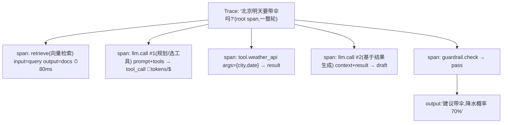
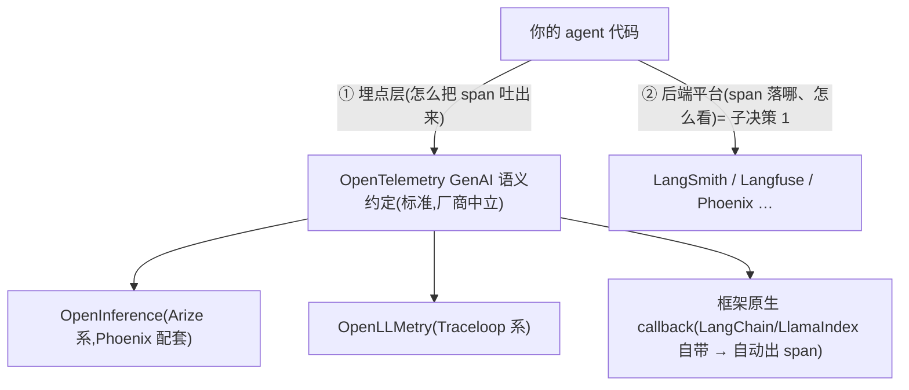
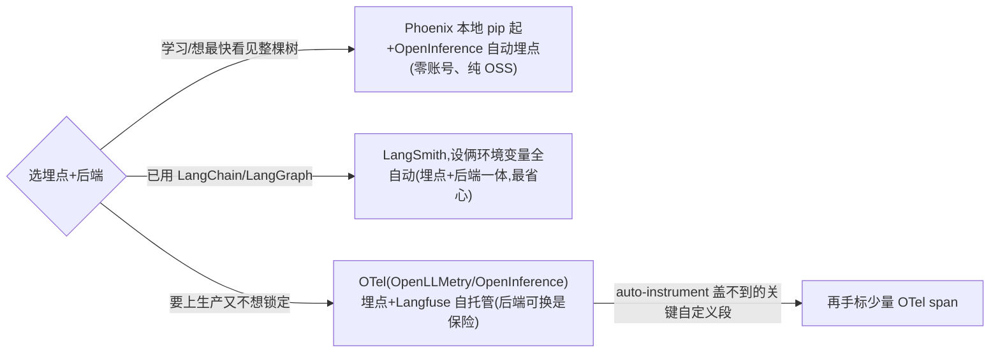
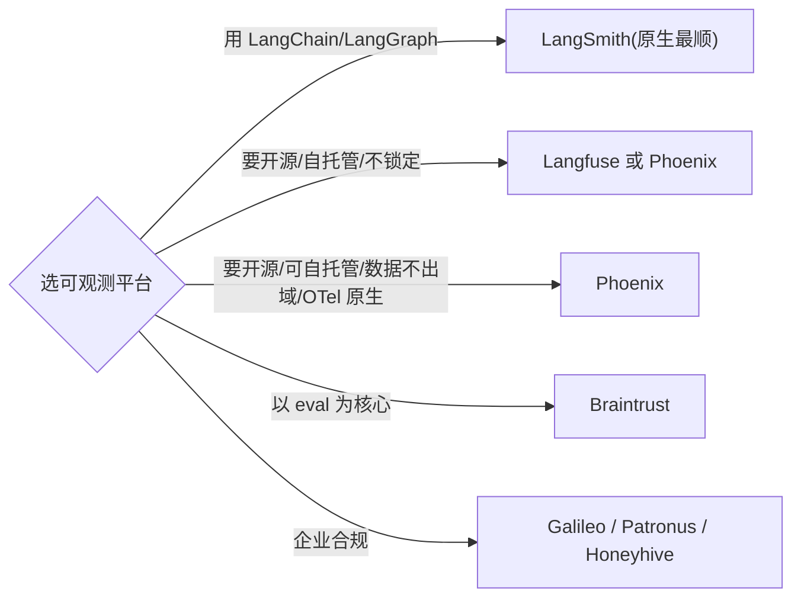
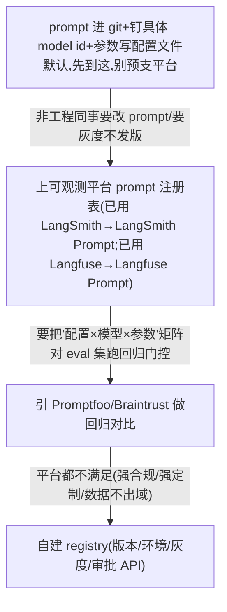

# 可观测性 + Eval 选型方案对比

> **用途**:为 Agent 选可观测性平台(tracing/监控)与评估方案(eval 框架+方法)。
> **适用**:Spec-Kit `/plan`;或由 `stack-selector` skill 路由进来。
> **最后核对:2026-06**。结论分级 ✅稳定 / ⚠️快照 / ❓待验证。
> **层定位**:这是**横切层**——和编排框架、模型、检索都正交,任何 Agent 上生产前都要做。

---

## 一、何时需要这层选型

- 任何要上生产/要持续迭代的 Agent(不能只靠 print 调试)。
- prompt/模型一改就怕回归,需要可重复的 eval。
- RAG 答非所问、agent 乱调工具,需要定位是哪一步出错。

> 👉 **一个前置 + 三个子决策**:**⓪ trace 如何产生**(埋点层/后端分层,先于选平台,见「子决策 0」)→ **① 可观测平台**(看运行时发生了什么)+ **② Eval 方案**(系统化判好坏)+ **③ 配置/版本化**(把 prompt·schema·模型版本当**代码资产**,保线上可复现,见下「子决策 3」)。常配套用,但分开选。

---

## 子决策 0:trace 如何产生(埋点层 vs 后端层)

> **触发时机**:在选"哪个平台"(子决策 1)**之前**先答的问题——"输入→回答"整条链路怎么变成可观测的数据。**选平台只决定 span 落哪、怎么看;这一节决定 span 怎么被吐出来**,且决定后端可不可换。
> **核心心智**:**trace 不是日志,是一棵 span 树**;**埋点(怎么产生 span)和后端(span 落哪)是两层、要分开选**——埋点走标准就能"埋一次、任意后端"。

### 一、trace 数据模型:一次提问 = 一棵 span 树

一次用户提问 = **一条 trace(root span)**,链路每一步是嵌套**子 span**:



**每个 span 至少记五样**:input / output / 耗时 / token·成本 / 状态(ok·error)。LLM span 加记 **model id、推理参数、prompt 版本**;tool span 加记 args 与返回。这棵树是 debug "RAG 答非所问 / agent 乱调工具"时**唯一能定位到具体哪一步**的东西(对应 §一的"定位是哪一步出错")。

### 二、关键分层:埋点层 ≠ 后端平台



| 埋点方式 | 原理 | 取舍 | 适合 |
|---|---|---|---|
| **框架原生 callback** ⭐起步 | LangChain/LlamaIndex 等内置,设环境变量即自动出 span | 零代码、认得 checkpoint/interrupt;**与后端绑死**(如 LangSmith) | 已用某框架 + 配它的官方后端,要最省心 |
| **OTel + OpenInference / OpenLLMetry** ⭐可换 | auto-instrument 包给 LLM/工具/向量库调用**自动织入** OTel span | **埋一次、后端任意换**(软锁最低);需懂一点 OTel exporter 配置 | 要 OSS/自托管/不锁定、可能换后端 |
| **手搓 OTel span** | 自己 `start_span` 标每段 | 完全可控;**起步别这么干**(易把一次人审切成两条断 trace) | auto-instrument 盖不到的自定义逻辑,少量补标 |

> **架构师要点**:只要埋点走 OTel(OpenInference/OpenLLMetry),后端就可换——今天 Phoenix 自托管、明天换 Langfuse,**agent 代码一行不改**。直接用某平台原生 callback 最省心,代价是埋点与后端绑死——这是 `2-framework/02-scorecard.md` "软锁"在观测层的同款取舍,写进 ADR。
> **落地默认**:**先 auto-instrument 拿 80%,不够再手标关键节点**。别一上来手搓 span。

### 三、agent 特有的三个坑(通用 APM 不教)

1. **整轮绑一条,别散成 N 条**:多轮/多次 invoke 用 **session_id / thread_id** 缝成一个会话——正是「子决策 1」⚠️ 里 **HITL × `interrupt()`** 那个坑(naive tracing 把一次人审切成两条断裂 trace、误标 ERROR)。**选后端看它对 session/thread 分组 + LangGraph checkpoint 的原生支持**。
2. **测轨迹不只测终点**:trace 让你看见 agent 走的**路径**(选对工具没、绕路没)——对应 §四 **Trajectory 评估**,组件级测不出。
3. **trace 要能回流成 eval 样本**:埋点时就把 **prompt 版本 / model id / 参数写进 span 属性**(对应「子决策 3:配置即代码」),否则指标一动归因不到、失败 trace 也喂不回下一版 prompt(§五数据飞轮)。

### 四、最轻起步 → 升级路径



> ⚠️ 具体包名/SDK API/价格变化快(OpenLLMetry、OpenInference、各平台 SDK),**用前现查官网**,别照搬过期快照。结论分级:分层心智 ✅ 稳定;具体工具版本 ⚠️ 快照(2026-06)。

---

## 二、子决策 1:可观测性平台

| 平台 | 形态 | 特点 | 适合 |
|---|---|---|---|
| **LangSmith** ⭐ | freemium SaaS | 框架中立 + OTel 原生;免费 Developer 档(5K traces/月);LangChain/LangGraph 原生,trace+dataset+eval+监控一体 | 用 LangChain 系、要省心 |
| **Langfuse** ⭐ | 开源(可自托管) | LangSmith 的 OSS 替代,功能全 | 要自托管/控成本/不锁定 |
| **Arize Phoenix** ⭐ | 开源 | OpenTelemetry 标准,框架中立 | 多框架、要标准化 trace |
| **Braintrust** | SaaS | eval-first,带版本控制 | 以 eval 为中心的团队 |
| **Galileo / Patronus / Honeyhive** | 企业 | 合规/护栏/企业治理 | 大企业、合规要求 |



> ⚠️ **HITL × tracing 的坑(选平台时要会处理)**:LangGraph 的 `interrupt()` 靠抛 `GraphInterrupt` + 两次 invoke 实现暂停,**naive tracing 会把一次人审切成两条断裂 trace**、把含 `interrupt()` 的节点/工具**误标 ERROR**(其实只是在等人),还会让人审耗时污染延迟、token/成本被劈成两半。治法:① 两次 invoke 带同一 `thread_id`/session,用平台的 **thread/session 分组**缝成一条逻辑 trace;② 把 `GraphInterrupt` 特判为 `paused` 而非 `ERROR`;③ 用**框架原生 tracing 集成**(它认得 checkpoint/interrupt),别手搓 OTel span——"naive" 才踩这个坑。**选平台的一个隐性加分项:看它对 LangGraph interrupt/checkpoint 的原生支持。**

## 三、子决策 2:Eval 框架/库

| 库 | 风格 | 强项 | 适合 |
|---|---|---|---|
| **Ragas** ⭐ | RAG 专用 | faithfulness/answer relevance/context precision | RAG 系统(标准选择) |
| **DeepEval** ⭐ | pytest 式 | G-Eval rubric,接 CI 顺 | 想把 eval 当单元测试跑 |
| **pydantic-evals** | 类型安全 | PydanticAI 原生 | 用 Pydantic AI 栈 |
| **OpenAI Evals** ⚠️ | rubric | 10+ grader 类型(非仅 A-E) | ⚠️平台弃用(10-31 转只读、11-30 下线);官方迁移指向 **Datasets**;独立/红队 eval 用 **Promptfoo**(2026-03 被 OpenAI 收购、保持开源,擅长 agentic 安全/red-team) |
| **Inspect AI** | agent+安全 | 英国 AISI,能力+安全评测 | agent 能力/安全评测 |
| **Promptfoo** | YAML/CLI | prompt 对比 | 快速横比多 prompt/模型 |
| **TruLens** ⚠️ | feedback functions | RAG Triad 实现 | ⚠️2026 已边缘化(归 Snowflake、feedback 类弃用、API 迁向 Metric),新项目优先 Ragas/DeepEval |

---

## 四、Eval 方法论(课程 21/24)

### 两种 eval 类型 + 两种节奏
| 类型 | 怎么判 | 速度/成本 | 节奏 |
|---|---|---|---|
| **Rule-based** | 正则/字符串/schema 校验 | 快、便宜 | **每次 commit**(CI gate) |
| **Model-graded(LLM-as-Judge)** | 另一个 LLM 评质量 | 慢、贵 | **发布前**(pre-release) |

### 4 层评估(从小到大)
1. **Component**:单次 LLM 调用/工具(准确率、JSON 合法性)
2. **Retrieval**:recall@k、faithfulness(RAG,见 `3-retrieval.md` 的 RAG Triad)
3. **Trajectory**:agent 步骤是否正确、路径是否最优、工具选对没——**agent 特有,组件级测不出**
4. **Task**:端到端目标完成率、满意度、成本/延迟

### LLM-as-Judge 要点
- **评委用更强的模型**(强评弱);**pairwise 对比比绝对打分更可靠**;带 CoT reasons 便于 debug。
- **offline + online 双轨**:dev 集做 CI gate,生产抽样做线上监控。
- eval 数据集**当代码管**(版本化),每次 prompt 变更跑回归;关键路径人工抽检(LLM eval 与人约 70-85% 一致)。

---

## 子决策 3:prompt / agent 版本化与配置管理(eval 的可复现底座)

> **触发时机**:prompt / 工具 schema / 模型版本 / 推理参数一改就怕线上行为变、又复现不出"上次那个好结果";或 §四的 eval 指标动了却**归因不到具体改动**;或想灰度 / 回滚某版 prompt。
> **核心心智:把 prompt、工具 schema、模型版本、推理参数(temperature/seed)当代码资产**——版本化 prompt 注册表 + 环境/灰度配置 + 与 eval 数据集联动的回归/回滚,避免 **prompt 漂移**、保证线上**可复现**。交叉引用 `agent/interview/1.md` 横切带 B «配置即代码»。
> **为什么单列**:§三/§四 解决"怎么判好坏",但判完要能锁定"**是哪一版配置产生的**"——否则指标变化归因不了、好结果复现不出、坏 prompt 回滚不掉。它是 eval 的**前置可复现性底座**,§四已点的"eval 数据集当代码管"在这里补齐另一半:**配置也当代码管**。

**📦 什么算"配置资产"(都要版本化、都要钉死)**

- prompt 模板(system / 各节点 / few-shot 示例)
- 工具 schema(name/description/params——描述就是 prompt,见 `agent/interview/1.md` L1)
- 模型版本(**钉具体 model id,别用会滚动的 alias**)
- 推理参数(temperature / top-p / seed / max_tokens / 思考预算)
- 检索配置(embedding 型号、chunk 参数、top-k、reranker——换 embedding 要重建索引,见 `3-retrieval.md` §三)

**🧰 方案对比表**

| 方案 | 原理/特点 | 取舍 | 适合场景 |
|---|---|---|---|
| **prompt 进 git + 钉模型版本** ⭐起步 | prompt/schema 作代码文件入库,model id 与参数写进配置文件,随代码一起 PR/review/tag | 零新依赖、天然 diff/review/回滚(`git revert`);无运行时热更、非工程同事改不了、与 eval run 的绑定要自己拼 | **最轻起步**、绝大多数项目、prompt 由工程维护 |
| **可观测平台自带 prompt 注册表**(LangSmith Prompt / Langfuse Prompt) | 注册表存 prompt + 版本/标签,SDK 运行时按 label(prod/staging)拉取,trace 自动回链到 prompt 版本 | 与 §二 tracing/eval 同栈、能灰度发布、改 prompt 不发版;锁定该平台、运行时多一次拉取、纪律不严易绕过版本化 | 已用 LangSmith/Langfuse、要非工程同事改 prompt / 要灰度 |
| **eval-first 平台**(Promptfoo / Braintrust) | 配置(prompt×模型×参数矩阵)即 YAML/代码,每次变更对 eval 数据集跑回归,**版本与 eval 结果天然绑定** | 回归/对比最强、CI 友好;偏 eval 工作流、运行时下发要另配 | 把 prompt 当实验、要矩阵横评 + 回归门控 |
| **自建 prompt registry** | 自己存(DB/对象存储)+ 版本/环境/灰度/审批 API | 完全可控、可塞进自有合规;自己造轮子 + 运维 | 平台都不满足的强定制/强合规/数据不出域 |

> 判据/选型轴:**谁改 prompt**(只工程→git 够;含产品/运营→要平台注册表)、**要不要运行时热更/灰度**(要→平台 label;不要→git+发版最简)、**是否已用某可观测平台**(用了就别再引第二个,直接用它的 prompt 模块)、**回归绑定强度**(要"配置↔eval 结果"强绑→eval-first)、**锁定与合规**(强合规/数据不出域→自建或自托管 Langfuse)。

**🔁 与 eval 联动(本层的真正价值)**

- **每个 eval / trace 绑定一份配置快照**(prompt 版本 + model id + 参数),指标一动就能归因到具体改动(见 `agent/interview/1.md` «配置即代码»)。
- **回归门控**:配置变更 → 对 eval 数据集跑回归(rule-based 每 commit、model-graded 发布前,见 §四)→ 过了才升 prod 标签。
- **回滚**:线上掉点 → 把 prod 指向上一个通过回归的版本(`git revert` 或平台改 label),而不是手忙脚乱改 prompt。
- **灰度**:新 prompt 先挂 staging/小流量,线上指标对齐再切 prod。
- 与**数据飞轮**接续:失败 trace 回流成 eval 样本,推动下一版 prompt——版本化让"这版到底比上版好没好"可判(见 §四、`agent/interview/1.md` 横切带 B)。

**🪜 最轻起步 → 升级路径**



> ⚠️ **别一上来自建 registry**:没有"非工程改 prompt / 灰度 / 强合规"任一真实需求前,prompt 进 git 已拿到 80% 收益(diff/review/回滚)。**最该先做、成本最低的两步:钉死 model id(别用滚动 alias)+ prompt 入库**——这两步就消掉大半"线上不可复现"。具体平台/价格变化快,**现查**官网。

**🧩 接入 Spec-Kit(可复制 prompt 块)**

```
请用 agent/roadmap/agent-selection/5-observability-eval.md「子决策 3:配置版本化」为本 Agent 定 prompt/配置管理方案。
- 谁改 prompt:<只工程 / 含产品·运营>;是否要运行时热更/灰度:<…>
- 现有栈:是否已用 LangSmith/Langfuse <…>;合规/数据是否出域 <…>
- 要版本化的配置:prompt / 工具 schema / model id / 推理参数(temperature·seed) / 检索配置 <列出>
请给:① 版本化方案 推荐+备选+理由+代价(默认 prompt 进 git + 钉 model id);
② 与 eval 数据集联动的回归/回滚/灰度做法(每个 eval 绑定配置快照,见本文 §四);③ 升级触发条件。
具体平台/价格现查官网,别写死过期版本。
```

> 最后核对:2026-06

---

## 五、组合决策树

```
可观测:用 LangChain 系→LangSmith;要 OSS→Langfuse/Phoenix;企业合规→Galileo 类
Eval 库:RAG→Ragas;想进 CI→DeepEval;PydanticAI→pydantic-evals;agent 轨迹→Inspect/trajectory eval
Eval 节奏:每 commit 跑 rule-based;发布前跑 model-graded
Agent 系统:别只测最终输出,必须加 trajectory 级(路由/工具/路径)
```

---

## 六、场景推荐

| 场景 | 可观测 | Eval |
|---|---|---|
| LangGraph 生产 agent | LangSmith | DeepEval(CI)+ trajectory eval(发布前) |
| 开源/自托管栈 | Langfuse 或 Phoenix | Ragas(RAG)/ DeepEval |
| RAG 系统 | Phoenix/Langfuse | Ragas + RAG Triad |
| PydanticAI 栈 | Phoenix(OTel) | pydantic-evals |
| 快速横比 prompt/模型 | — | Promptfoo |

---

## 七、接入 Spec-Kit(可复制 prompt 块)

```
请用 agent/roadmap/agent-selection/5-observability-eval.md 为本 Agent 选可观测平台 + eval 方案。
- 现有栈:<LangChain/LlamaIndex/PydanticAI/裸SDK…>
- 是否要自托管/OSS:<…>  是否 RAG:<…>  是否多步 agent(需轨迹评估):<…>  合规要求:<…>
请分别给:① 可观测平台 推荐+备选+理由；② eval 库+方法(类型/节奏/层级)推荐+备选+理由+代价。
```

---

## 八、课程回溯 + 相关资产

- 回溯:`courses/21-Evaluating AI Agents/notes/`、`courses/24-Automated Testing for LLMOps/notes/{L03-规则评估, L04-模型评分评估, L05-综合测试与幻觉检测}.md`、`courses/05`(RAG Triad)、`courses/eval/agent-eval-landscape.md`。
- 相关层:`agent/roadmap/agent-selection/3-retrieval.md`(RAG Triad)、`agent/roadmap/agent-selection/2-framework/`(评分卡里 D5/D6 即观测/eval 维度)。
- 总览:`agent/roadmap/agent-selection/README.md`。沉淀:`agent/skills/adr-writer`。
