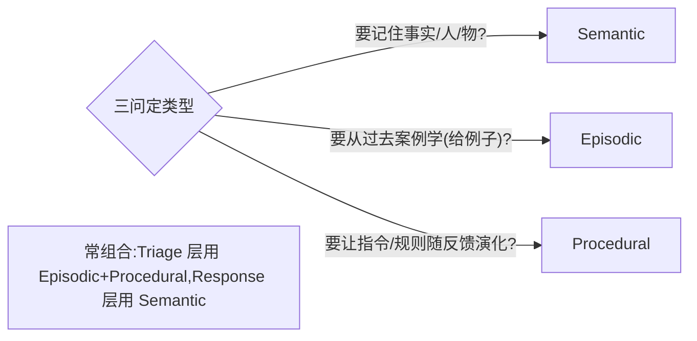
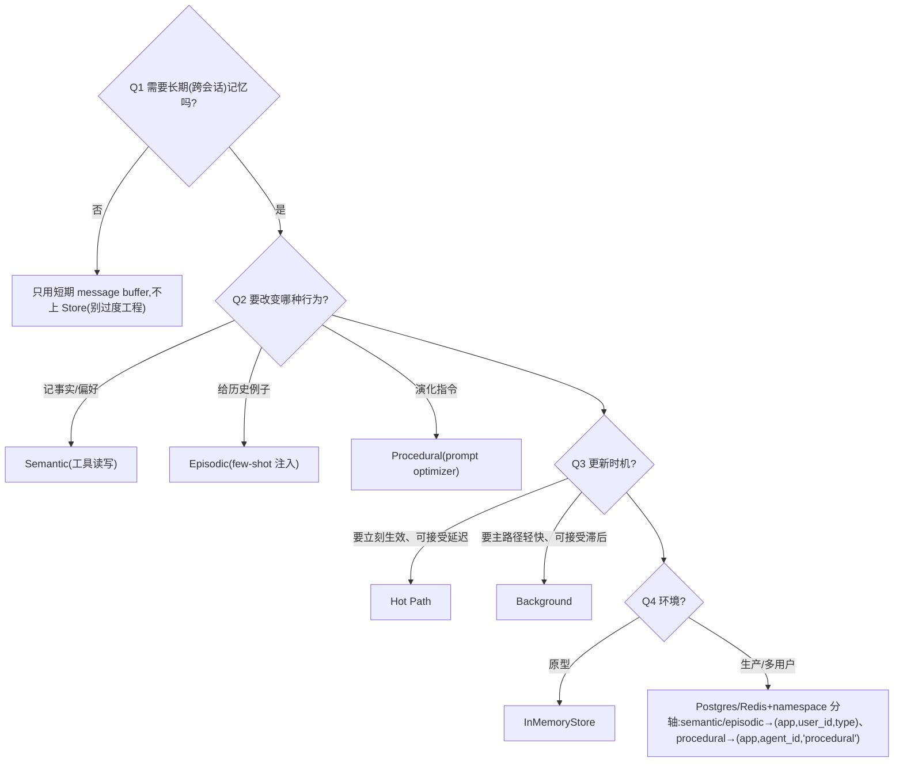

# 记忆方案选型方案对比(记忆类型 / 存储 / 更新模式)

> **用途**:为 Agent 选记忆方案——记什么、存哪里、何时更新。
> **适用**:Spec-Kit `/plan`;或由 `stack-selector` skill 路由进来。
> **最后核对:2026-06**。结论分级 ✅稳定 / ⚠️快照 / ❓待验证。
> **层定位**:记忆是「能力层」,常依附于编排框架(LangGraph 内建 Store/Checkpointer 最成熟)。

---

## 一、何时需要这层选型

- Agent 要跨轮/跨会话记住用户、事实、偏好。
- 想让 Agent 从历史案例学习,或让其指令随反馈演化。
- 多用户/多租户,记忆要隔离。

> 👉 **核心原则:记忆是行为设计,不是存储设计。**(课程 12)三种记忆都可放同一个 Store(靠 namespace 隔离),区别在于**它们如何改变 Agent 行为**。先问"要改哪种行为",再选类型。

> ⚠️ 先分清**短期 vs 长期**:短期 = 单次对话的 message buffer(会话内);长期 = 跨会话的 Store(本包重点)。

---

## 二、子决策 1:记忆类型(先定这个)

| 类型 | 记什么 | 怎么改变行为 | 更新模式 | 存储 |
|---|---|---|---|---|
| **Semantic** 语义 ⭐ | 事实/知识("Jim 是我朋友") | Agent 主动调工具读写,影响工具使用 | 增删改(矛盾事实主动删)· Hot Path | 向量索引 Store |
| **Episodic** 情景 | 过往案例(输入+期望输出) | few-shot 注入,让 agent 模仿历史决策 | 纯追加(发生过不改)· Background | Store 里的 examples namespace |
| **Procedural** 程序 | 规则/指令(系统 prompt 本身) | 重写 prompt,让 agent 行为演化 | 整体重写 + version bump · Background | Store 里的自然语言规则 |

> ⚠️ **「更新模式」列 = 写策略(怎么写),不含「读取期把记忆注入 context」**:读取注入属「怎么改变行为」列(Semantic 工具读 / Episodic few-shot 注入),别混进"更新写入"。

**三问定类型:**


## 三、子决策 2:更新模式

| 模式 | 时机 | 优点 | 代价 |
|---|---|---|---|
| **Hot Path** ⭐ | 即时(主循环里读写) | 立刻生效 | 增加 Agent 响应延迟 |
| **Background** | 异步 | 主路径干净、快 | 反馈延迟(下次才生效) |

> 这是**延迟 vs 复杂度**的取舍:即时更新拖慢响应;后台异步保持主 agent 轻快但反馈滞后。

## 四、子决策 3:存储后端

| 存储 | 适合 |
|---|---|
| `InMemoryStore` ⭐ | 原型/教学(零依赖) |
| Postgres / Redis | 生产(持久化、可扩展) |

- **接口一致,迁移只换实例**:`InMemoryStore(index={"embed": "openai:text-embedding-3-small"})` → 生产换 Postgres/Redis。
- **多租户从第一天就上,但 namespace 主轴按记忆类型分**:semantic/episodic 是 per-user → `(app, user_id, type)`;**procedural 默认 per-agent → `(app, agent_id, 'procedural')`**——「怎么做」是 agent 的能力、不随用户走,仅当它编码用户专属偏好时才退化 per-user。这是一条取舍轴(与 `agent/interview/1.md` §4 对齐)。靠 `config` 注入 `langgraph_user_id` / `agent_id`。
- **lazy-init**:`store.get()` 返回 None → 首次会话播种默认值。

## 五、工具/API(LangGraph / LangMem)

- `create_manage_memory_tool` / `create_search_memory_tool`:把 Semantic 记忆暴露为 agent 可调工具。
- `create_multi_prompt_optimizer(..., kind="prompt_memory")`:吃轨迹+反馈,输出改写后的 prompt(Procedural)。
- 节点签名 `node(state, config, store)`:运行时经 `configurable` 注入用户身份。

---

## 六、决策树



---

## 七、场景推荐

| 场景 | 推荐 |
|---|---|
| 个人助理记住用户偏好 | Semantic + Hot Path + 生产 Store |
| 客服 agent 学习优质对话案例 | Episodic + Background |
| Agent 行为随用户反馈自调 | Procedural + Background + prompt optimizer |
| 多租户 SaaS | 上述任意 + namespace 分轴隔离:semantic/episodic `(app,user_id,type)`、procedural `(app,agent_id,'procedural')` |
| 只是单次多轮对话 | 短期 buffer 即可,不上长期记忆 |

---

## 八、接入 Spec-Kit(可复制 prompt 块)

```
请用 agent/roadmap/agent-selection/6-memory.md 为本 Agent 选记忆方案。
- 要记住什么/改变什么行为:<事实? 案例? 指令演化?>
- 跨会话/多用户吗:<…>  延迟敏感吗:<…>  原型还是生产:<…>
请给:记忆类型(可组合)+ 更新模式(hot/background)+ 存储后端 + 多租户隔离方式,
每项:推荐 + 备选 + 理由 + 代价。
```

---

## 九、课程回溯 + 相关资产

- 回溯:`courses/12-Long-Term Agentic Memory With LangGraph/notes/00-总结回顾.md`(及 L2-L5 code)。
- 相关层:`agent/roadmap/agent-selection/2-framework/`(LangGraph 的 Checkpointer/Store 是记忆基础设施)、`agent/roadmap/agent-selection/3-retrieval.md`(Semantic 记忆用向量检索)。
- 总览:`agent/roadmap/agent-selection/README.md`。沉淀:`agent/skills/adr-writer`。
