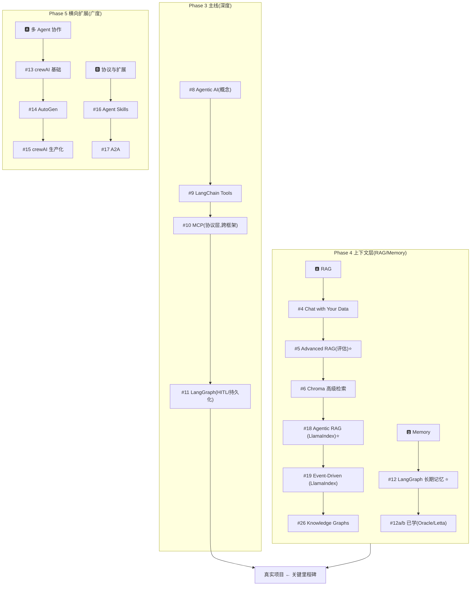

# DeepLearning.AI 课程学习顺序与状态总览（AI Agent 方向）

> 目标：AI Agent 开发工程师 → AI Agent 开发架构师
> 更新日期:2026-07-04(合并原 `deeplearning-ai-学习清单-按状态分类-2026-07.md`,顺序结构 + 需要/可选/已学状态标记二合一;完整 124 门课分类见 `deeplearning-ai-全量课程目录-2026-07.md`)
> **学习理念:T 型学习——主线深挖 LangChain/LangGraph + MCP,其他框架做横向对比**
> **状态标记说明**:✅ 已学(`agent/courses/` 已有笔记) / 🎯 需要(未学,填补当前面试目标真实缺口) / ⏸️ 可选(未学,与已学内容重叠或偏垂类demo,优先级低)

---

## Phase 1:基础构建

| 序号 | 课程 | 状态 |
| --- | --- | --- |
| 1 | ChatGPT Prompt Engineering for Developers | ✅ 已学 |
| 2 | Building Systems with the ChatGPT API | ✅ 已学 |

---

## Phase 2:LLM 应用工程核心

| 序号 | 课程 | 核心内容 | 状态 |
| --- | --- | --- | --- |
| 3 | LangChain for LLM Application Development | Chain、Memory、RAG 基础(LangChain 入门) | ✅ 已学 |
| 7 | Pydantic for LLM Workflows | 结构化输出、类型安全 Tool Schema、Agent 工作流数据建模 | ✅ 已学 |
| 7a | Getting Structured LLM Output | 结构化输出技巧——约束解码、JSON schema 强制 | ✅ 已学 |
| 7b | Function-calling and data extraction with LLMs | Function Calling 与数据抽取,Tool Use 的底层支撑技能 | ✅ 已学 |

---

## Phase 3:Agent 主线(深度优先,按序完成)

> **目标**:学完这 4 门,能独立用 LangGraph 做一个真实生产项目

| 序号 | 课程 | 核心内容 | 原序号 | 状态 |
| --- | --- | --- | --- | --- |
| 8 | Agentic AI(Andrew Ng) | **概念基石**——框架无关的 Agent 思维(planning / reflection / tool use)⭐ | #8 | ✅ 已学 |
| 9 | Functions, Tools and Agents with LangChain | Tool Use、ReAct、OpenAI Function Calling | #9 | ✅ 已学 |
| 10 | MCP: Build Rich-Context AI Apps with Anthropic | **工具层协议**——2026 事实标准,跨框架通用 ⭐ | #13 | ✅ 已学 |
| 11 | AI Agents in LangGraph | 状态机、多步推理、条件路由、HITL、持久化 ⭐ | #10 | ✅ 已学 |

### 💡 主线学习建议

- **#8** 概念奠基,后面所有框架都能对上号
- **#10 MCP** 提前到主线中段——它是协议层,学完 Tool 概念马上接 MCP 效果最佳
- **#11 学完后**,先进入 Phase 4 给 Agent 装上"长期上下文",再做真实项目

---

## Phase 4:RAG 与 Memory(Agent 上下文层)

> **为什么单独成阶段**:RAG 和 Memory 是 Agent 实现中**两类最常见的"非参数化知识"解决方案**——前者解决"读外部资料",后者解决"记住交互历史"。它们独立于具体 Agent 框架,但几乎所有生产 Agent 都要做这两件事。
>
> **学习策略**:先 RAG 后 Memory;RAG 内部走"基础 → Agent 化 → 生产框架 → 结构化"四步;Memory 主线一门 + 前沿对比。

### 🅰 RAG:检索增强

| 序号 | 课程 | 价值 | 原序号 | 状态 |
| --- | --- | --- | --- | --- |
| 4 | LangChain: Chat with Your Data | 向量检索、Document Loader——RAG 起手式 | #4 | ✅ 已学 |
| 5 | Building and Evaluating Advanced RAG | RAG 评估与优化(如何度量 RAG 好坏)⭐ | #5 | ✅ 已学 |
| 6 | Advanced Retrieval for AI with Chroma | 高级检索技巧(query expansion、reranking 等) | #6 | ✅ 已学 |
| 18 | Building Agentic RAG with LlamaIndex | RAG + Agent 结合(让 Agent 主动调度检索)⭐ **主线框架** | #14 | ✅ 已学 |
| 19 | Event-Driven Agentic Document Workflows with LlamaIndex | 事件驱动的文档处理 Agent(LlamaIndex 进阶)⭐ | #15 | ✅ 已学 |
| 26 | Knowledge Graphs for RAG | 结构化知识检索——图谱 RAG 是前沿方向 | #26 | ⏸️ 可选 |

### 🅱 Memory:长期记忆

| 序号 | 课程 | 价值 | 原序号 | 状态 |
| --- | --- | --- | --- | --- |
| 12 | Long-Term Agentic Memory With LangGraph | 语义/情景/程序记忆、邮件助手实战 ⭐ **主线核心** | #17 | ✅ 已学 |
| 12a | Agent Memory: Building Memory-Aware Agents(Oracle) | Agent 记忆机制(与 #12 横向对比)——记忆工程五模式、Toolbox、上下文压实 | — | ✅ 已学 |
| 12b | LLMs as Operating Systems: Agent Memory(Letta / MemGPT) | Agent 自主管理记忆(OS 视角)——heartbeat、core/recall/archival、共享记忆块 | — | ✅ 已学 |

### 💡 本阶段学习建议

- **#5 Advanced RAG** 是 RAG 阶段的"地基"——先学会评估,后面再玩花样才不会盲调。
- **RAG 主线框架选 LlamaIndex**(#18 → #19):相比通用编排框架,LlamaIndex 在文档处理、索引结构、Agentic 检索上的抽象更深,作为 RAG 主线性价比最高。
- **#6 Chroma 高级检索** 与 **#18 Agentic RAG** 是分叉点:偏检索深度选 #6,偏 Agent 调度选 #18。两者都做,能完整覆盖 RAG 的"内部优化"与"外部编排"两层。
- **#12 LangGraph Memory** 必学;**#12a/12b 均已学**——两者构成同一问题的两种架构答案:12a 工程确定性路线(代码控制记忆操作),12b agent 自治路线(LLM 自管上下文),对比复盘见 12b notes L7。
- **决定上图谱 RAG(#26)前**,先看 #5 评估出来的 baseline RAG 还有多少优化空间——图谱 RAG 维护成本高,不是默认选项。

---

## Phase 5:横向扩展(按需选学)

> **学习策略**:有了主线 + RAG/Memory 参照系,学这些会**快且透**。按兴趣/业务需要选学即可。

### 🅰 多 Agent 协作方向

| 序号 | 课程 | 价值 | 原序号 | 状态 |
| --- | --- | --- | --- | --- |
| 13 | Multi AI Agent Systems with crewAI | 多 Agent 协作**心智模型**(管理者思维、6 要素)⭐ | #11 | ✅ 已学 |
| 14 | AI Agentic Design Patterns with AutoGen | Agent **设计模式**总览 ⭐ | #12 | ✅ 已学 |
| 15 | Design, Develop, and Deploy Multi-Agent Systems with CrewAI | 生产级 crewAI(只在真用 crewAI 时再看)。2025-11 新课,取代旧课 Practical Multi AI Agents(2024-10) | — | 🔄 学习中(Module 1 已有笔记,`../courses/Design, Develop, and Deploy Multi-Agent Systems with CrewAI/`) |

### 🅱 协议与扩展能力

| 序号 | 课程 | 价值 | 原序号 | 状态 |
| --- | --- | --- | --- | --- |
| 16 | Agent Skills with Anthropic | Skills + MCP + Subagents 组合 ⭐ 2026 新 | #18 | ✅ 已学 |
| 17 | A2A: The Agent2Agent Protocol | 多 Agent 协作协议(Google Cloud + IBM)⭐ 2026 新 | #19 | ✅ 已学 |

---

## Phase 6:生产化与架构(架构师方向)

| 序号 | 课程 | 核心内容 | 状态 |
| --- | --- | --- | --- |
| 21 | Evaluating AI Agents | Agent 指标、评测场景、测试方法 ⭐ | ✅ 已学 |
| 24 | Automated Testing for LLMOps | CI/CD for LLM | ✅ 已学 |

---

## Phase 7:前沿方向(按兴趣选修)

| 序号 | 课程 | 方向 | 状态 |
| --- | --- | --- | --- |
| 28 | Building Coding Agents with Tool Execution(E2B) | 沙箱化代码执行——理解 Coding Agent 底层如何安全运行 LLM 生成的代码 ⭐ 2026 新 | ✅ 已学 |

> ~~#27 Serverless LLM Apps with Amazon Bedrock~~ 已于 2026-07 确认从官网目录下架,移除。

---

## 学习节奏建议

### 时间投入

- 每门课约 1~2 小时视频 + 1~2 天实践
- **Phase 1~3 是核心主线**,优先完成
- **Phase 4(RAG/Memory)建议在 Phase 3 之后立刻进入**,因为它给 Agent 装"长期上下文"
- Phase 5~6 根据工作需要按需取用

### 关键节点

- **Pydantic for LLM Workflows(#7)** 建议在 Phase 3 之前掌握,后续 LangChain / LangGraph / crewAI 的 tool schema、state 定义都依赖它
- **Phase 3 主线学完 + Phase 4 选学完 RAG 基础 + Memory 主线后,开始第一个真实项目**——这是从"看过" → "会用"的关键跃迁
- **Evaluating AI Agents(#21)** 建议在开始做第一个真项目之前就过一遍,能少踩很多坑
- **#5 Building and Evaluating Advanced RAG** 是 Phase 4 的"地基课",必须在其它 RAG 课之前完成

### Phase 5 选学优先级参考

1. 如果做**企业级 Agent**:先学 🅱 协议与扩展(#16 #17)
2. 如果想拓宽**架构思路**:先学 🅰 多 Agent(#13 #14)
3. #15(crewAI 生产化新课)是**业务驱动型**课程——有真实场景再学

---

## 平台对比备注

DataCamp — Associate AI Engineer for Developers Track 更偏向数据科学工程师基础,Agent 系统设计内容较浅。如果时间有限,优先完成 DeepLearning.AI 的 Agent 系列(Phase 3);如需工程基础补课或认证背书,可并行学习 DataCamp。

---

## 🗺 主线 vs 上下文层 vs 横向扩展:一图看懂

---

## 📦 未排入 Phase 的课程(按状态分类)

> 从完整 124 门目录中筛出、与当前"资深 Agent 工程师/架构师面试"目标相关、但尚未排入上述 Phase 的课程。判定标准同上;完整 124 门分类见 `deeplearning-ai-全量课程目录-2026-07.md`。

### 🎯 需要学习(8 门)

| 课程 | 合作方 | 一句话价值 |
| --- | --- | --- |
| [Nvidia's NeMo Agent Toolkit: Making Agents Reliable](https://www.deeplearning.ai/courses/nvidia-nat-making-agents-reliable) | Nvidia | Agent 可观测性/评测/部署工具链,概念验证转生产级 |
| [Semantic Caching for AI Agents](https://www.deeplearning.ai/courses/semantic-caching-for-ai-agents) | Redis | 语义缓存降本提速,对口面试包 `05-context-engineering-and-caching` |
| [Governing AI Agents](https://www.deeplearning.ai/courses/governing-ai-agents) | Databricks | Agent 数据治理与安全,对口面试包 `07-safety-guardrails` |
| [DSPy: Build and Optimize Agentic Apps](https://www.deeplearning.ai/courses/dspy-build-optimize-agentic-apps) | Databricks | Prompt/流程自动优化,选型矩阵里的真缺口 |
| [Building toward Computer Use with Anthropic](https://www.deeplearning.ai/courses/building-toward-computer-use-with-anthropic) | Anthropic | Anthropic 官方 Run Loop 范式,对口面试包 `01-agent-run-loop-and-orchestration` |
| [Retrieval Augmented Generation (RAG)](https://www.deeplearning.ai/courses/retrieval-augmented-generation) | DeepLearning.AI | 2025 新版 RAG 生产级总览(架构/部署/评测全流程) |
| [Safe and reliable AI via guardrails](https://www.deeplearning.ai/courses/safe-and-reliable-ai-via-guardrails) | GuardrailsAI | 生产护栏,直接对口 JD 职责 4「安全护栏」 |
| [Red Teaming LLM Applications](https://www.deeplearning.ai/courses/red-teaming-llm-applications) | Giskard | LLM 应用红队测试,安全性面试差异化素材 |

### ⏸️ 可选(18 门,时间充裕再学)

| 课程 | 合作方 | 备注 |
| --- | --- | --- |
| [Voice for AI Agents and Applications](https://www.deeplearning.ai/courses/voice-for-ai-agents-and-applications) | Vocal Bridge | 语音 Agent 三部曲之一 |
| [Building Live Voice Agents with Google's ADK](https://www.deeplearning.ai/courses/building-live-voice-agents-with-googles-adk) | Google | 语音 Agent 三部曲之二 |
| [Building AI Voice Agents for Production](https://www.deeplearning.ai/courses/building-ai-voice-agents-for-production) | LiveKit,RealAvatar | 语音 Agent 三部曲之三 |
| [AI Agents for Image and Video Generation](https://www.deeplearning.ai/courses/ai-agents-for-image-and-video-generation) | Google | 图像/视频生成 Agent,垂类 demo |
| [Build Interactive Agents with Generative UI](https://www.deeplearning.ai/courses/build-interactive-agents-with-generative-ui) | CopilotKit | Agent 生成式 UI,对口选型矩阵 `10-agent-ux` |
| [Document AI: From OCR to Agentic Doc Extraction](https://www.deeplearning.ai/courses/document-ai-from-ocr-to-agentic-doc-extraction) | LandingAI | 文档抽取 Agent,垂类 demo |
| [Building and Evaluating Data Agents](https://www.deeplearning.ai/courses/building-and-evaluating-data-agents) | Snowflake | 多 Agent 规划 + 评测一体,与已学 #21 有重叠 |
| [Build AI Apps with MCP Server: Working with Box Files](https://www.deeplearning.ai/courses/build-ai-apps-with-mcp-server-working-with-box-files) | Box | MCP 实战 demo,与已学 MCP 课(#10)重叠 |
| [Agentic Knowledge Graph Construction](https://www.deeplearning.ai/courses/agentic-knowledge-graph-construction) | Neo4j | 多 Agent 构建知识图谱,偏垂类 |
| [Building Code Agents with Hugging Face smolagents](https://www.deeplearning.ai/courses/building-code-agents-with-hugging-face-smolagents) | Hugging Face | CodeAct 范式,可与 #28 对照 |
| [Building AI Browser Agents](https://www.deeplearning.ai/courses/building-ai-browser-agents) | AGI Inc | 浏览器操作 Agent,偏垂类 |
| [Building Your Own Database Agent](https://www.deeplearning.ai/courses/building-your-own-database-agent) | Microsoft | 自然语言查数据库,偏垂类 |
| [Multi-vector Image Retrieval](https://www.deeplearning.ai/courses/multi-vector-image-retrieval) | Qdrant | 多向量图像检索,检索层细分方向 |
| [Retrieval Optimization: Tokenization to Vector Quantization](https://www.deeplearning.ai/courses/retrieval-optimization-from-tokenization-to-vector-quantization) | Qdrant | 检索基础设施优化,偏工程底层 |
| [Improving Accuracy of LLM Applications](https://www.deeplearning.ai/courses/improving-accuracy-of-llm-applications) | AMD/Lamini,Meta | 评测/提示/记忆调优,与已学评测课重叠 |
| [Prompt Compression and Query Optimization](https://www.deeplearning.ai/courses/prompt-compression-and-query-optimization) | MongoDB | RAG 成本/延迟优化,与语义缓存(需要清单)有交集 |
| [Preprocessing Unstructured Data for LLM Applications](https://www.deeplearning.ai/courses/preprocessing-unstructured-data-for-llm-applications) | Unstructured | RAG 数据预处理,偏工程细节 |
| [Building Applications with Vector Databases](https://www.deeplearning.ai/courses/building-applications-vector-databases) | Pinecone | 向量数据库应用六例,检索层基础 |

---

## ✅ 已学笔记速查(27 门,对应 `agent/courses/`)

| 课程 | 笔记路径 |
| --- | --- |
| ChatGPT Prompt Engineering for Developers | `../courses/01-ChatGPT Prompt Engineering for Developers/` |
| Building Systems with the ChatGPT API | `../courses/02-Building Systems with the ChatGPT API/` |
| LangChain for LLM Application Development | `../courses/03-LangChain for LLM Application Development/` |
| LangChain: Chat with Your Data | `../courses/RAG/04-LangChain: Chat with Your Data/` |
| Building and Evaluating Advanced RAG | `../courses/RAG/05-Building and Evaluating Advanced RAG/` |
| Advanced Retrieval for AI with Chroma | `../courses/RAG/06-Advanced Retrieval for AI with Chroma/` |
| Pydantic for LLM Workflows | `../courses/07-Pydantic for LLM Workflows/` |
| Getting Structured LLM Output | `../courses/07a-Getting Structured LLM Output/` |
| Function-calling and data extraction with LLMs | `../courses/07b-Function-calling and data extraction with LLMs/` |
| Agentic AI(Andrew Ng) | `../courses/08-Agentic AI（Andrew Ng）/` |
| Functions, Tools and Agents with LangChain | `../courses/09-Functions, Tools and Agents with LangChain/` |
| MCP: Build Rich-Context AI Apps with Anthropic | `../courses/10-MCP: Build Rich-Context AI Apps with Anthropic/` |
| AI Agents in LangGraph | `../courses/11-AI Agents in LangGraph/` |
| Long-Term Agentic Memory With LangGraph | `../courses/memory/12-Long-Term Agentic Memory With LangGraph/` |
| Agent Memory: Building Memory-Aware Agents(Oracle) | `../courses/memory/12a-Agent Memory Building Memory-Aware Agents/` |
| LLMs as Operating Systems: Agent Memory(Letta / MemGPT) | `../courses/memory/12b-LLMs as Operating Systems Agent Memory/` |
| Multi AI Agent Systems with crewAI | `../courses/13-Multi AI Agent Systems with crewAI/` |
| Agent Skills with Anthropic | `../courses/16-Agent Skills with Anthropic/` |
| Building Agentic RAG with LlamaIndex | `../courses/RAG/18-Building Agentic RAG with LlamaIndex/` |
| Event-Driven Agentic Document Workflows with LlamaIndex | `../courses/19-Event-Driven Agentic Document Workflows with LlamaIndex/` |
| Evaluating AI Agents | `../courses/eval/21-Evaluating AI Agents/` |
| Automated Testing for LLMOps | `../courses/eval/24-Automated Testing for LLMOps/` |
| Building AI Applications with Haystack | `../courses/25-Building AI Applications with Haystack/` |
| Knowledge Graphs for AI Agent API Discovery(SAP) | `../courses/Knowledge Graphs for AI Agent API Discovery/` |
| AI Agentic Design Patterns with AutoGen(Microsoft) | `../courses/AI Agentic Design Patterns with AutoGen/` |
| A2A: The Agent2Agent Protocol(Google Cloud,IBM) | `../courses/A2A: The Agent2Agent Protocol/` |
| Building Coding Agents with Tool Execution(E2B) | `../courses/Building Coding Agents with Tool Execution/` |
