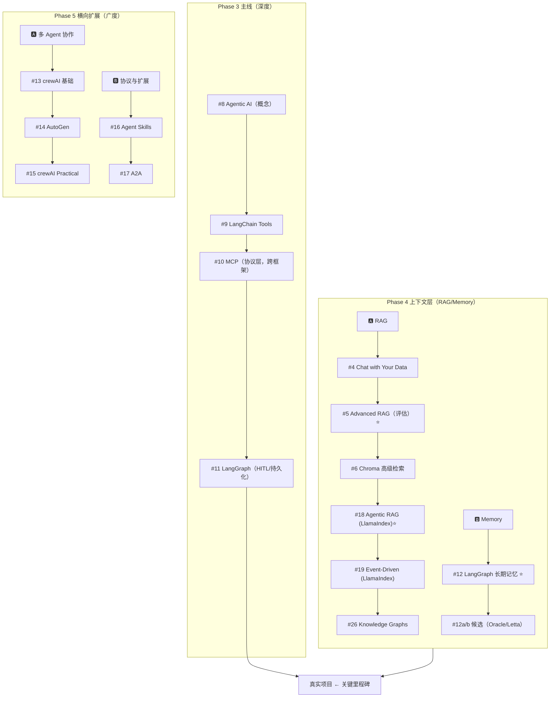

# DeepLearning.AI 课程学习顺序（AI Agent 方向）

> 目标：AI Agent 开发工程师 → AI Agent 开发架构师
> 更新日期：2026-05-15
> **学习理念：T 型学习——主线深挖 LangChain/LangGraph + MCP，其他框架做横向对比**

---

## Phase 1：基础构建

| 序号  | 课程                                        | 状态    |
| --- | ----------------------------------------- | ----- |
| 1   | ChatGPT Prompt Engineering for Developers | ✅ 已完成 |
| 2   | Building Systems with the ChatGPT API     | ✅ 已完成 |

---

## Phase 2：LLM 应用工程核心

| 序号  | 课程                                             | 核心内容                                             |
| --- | ---------------------------------------------- | ------------------------------------------------ |
| 3   | LangChain for LLM Application Development      | Chain、Memory、RAG 基础（LangChain 入门）                |
| 7   | Pydantic for LLM Workflows                     | 结构化输出、类型安全 Tool Schema、Agent 工作流数据建模 🆕          |
| 7a  | Getting Structured LLM Output                  | 结构化输出技巧——约束解码、JSON schema 强制                     |
| 7b  | Function-calling and data extraction with LLMs | Function Calling 与数据抽取，Tool Use 的底层支撑技能          |

---

## Phase 3：Agent 主线（深度优先，按序完成）

> **目标**：学完这 4 门，能独立用 LangGraph 做一个真实生产项目

| 序号  | 课程                                             | 核心内容                                                        | 原序号 |
| --- | ---------------------------------------------- | ----------------------------------------------------------- | --- |
| 8   | Agentic AI（Andrew Ng）                          | **概念基石**——框架无关的 Agent 思维（planning / reflection / tool use）⭐ | #8  |
| 9   | Functions, Tools and Agents with LangChain     | Tool Use、ReAct、OpenAI Function Calling                      | #9  |
| 10  | MCP: Build Rich-Context AI Apps with Anthropic | **工具层协议**——2026 事实标准，跨框架通用 ⭐                                | #13 |
| 11  | AI Agents in LangGraph                         | 状态机、多步推理、条件路由、HITL、持久化 ⭐                                    | #10 |

### 💡 主线学习建议

- **#8** 概念奠基，后面所有框架都能对上号
- **#10 MCP** 提前到主线中段——它是协议层，学完 Tool 概念马上接 MCP 效果最佳
- **#11 学完后**，先进入 Phase 4 给 Agent 装上"长期上下文"，再做真实项目

---

## Phase 4：RAG 与 Memory（Agent 上下文层）

> **为什么单独成阶段**：RAG 和 Memory 是 Agent 实现中**两类最常见的"非参数化知识"解决方案**——前者解决"读外部资料"，后者解决"记住交互历史"。它们独立于具体 Agent 框架，但几乎所有生产 Agent 都要做这两件事。
>
> **学习策略**：先 RAG 后 Memory；RAG 内部走"基础 → Agent 化 → 生产框架 → 结构化"四步；Memory 主线一门 + 前沿对比。

### 🅰 RAG：检索增强

| 序号  | 课程                                                      | 价值                                              | 原序号 |
| --- | ------------------------------------------------------- | ----------------------------------------------- | --- |
| 4   | LangChain: Chat with Your Data                          | 向量检索、Document Loader——RAG 起手式                   | #4  |
| 5   | Building and Evaluating Advanced RAG                    | RAG 评估与优化（如何度量 RAG 好坏）⭐                         | #5  |
| 6   | Advanced Retrieval for AI with Chroma                   | 高级检索技巧（query expansion、reranking 等）🆕           | #6  |
| 18  | Building Agentic RAG with LlamaIndex                    | RAG + Agent 结合（让 Agent 主动调度检索）⭐ **主线框架**         | #14 |
| 19  | Event-Driven Agentic Document Workflows with LlamaIndex | 事件驱动的文档处理 Agent（LlamaIndex 进阶）⭐                  | #15 |
| 26  | Knowledge Graphs for RAG                                | 结构化知识检索——图谱 RAG 是前沿方向                           | #26 |

### 🅱 Memory：长期记忆

| 序号  | 课程                                              | 价值                                       | 原序号 |
| --- | ----------------------------------------------- | ---------------------------------------- | --- |
| 12  | Long-Term Agentic Memory With LangGraph         | 语义/情景/程序记忆、邮件助手实战 ⭐ **主线核心**             | #17 |
| 12a | Agent Memory: Building Memory-Aware Agents（Oracle） | Agent 记忆机制（与 #12 横向对比，候选）                | —   |
| 12b | LLMs as Operating Systems: Agent Memory（Letta / MemGPT） | Agent 自主管理记忆（OS 视角，候选）                   | —   |

### 💡 本阶段学习建议

- **#5 Advanced RAG** 是 RAG 阶段的"地基"——先学会评估，后面再玩花样才不会盲调。
- **RAG 主线框架选 LlamaIndex**（#18 → #19）：相比通用编排框架，LlamaIndex 在文档处理、索引结构、Agentic 检索上的抽象更深，作为 RAG 主线性价比最高。
- **#6 Chroma 高级检索** 与 **#18 Agentic RAG** 是分叉点：偏检索深度选 #6，偏 Agent 调度选 #18。两者都做，能完整覆盖 RAG 的"内部优化"与"外部编排"两层。
- **#12 LangGraph Memory** 必学；**#12a/12b 是候选**，看 Memory 是不是业务重点再决定是否加入。
- **决定上图谱 RAG（#26）前**，先看 #5 评估出来的 baseline RAG 还有多少优化空间——图谱 RAG 维护成本高，不是默认选项。

---

## Phase 5：横向扩展（按需选学）

> **学习策略**：有了主线 + RAG/Memory 参照系，学这些会**快且透**。按兴趣/业务需要选学即可。

### 🅰 多 Agent 协作方向

| 序号  | 课程                                                           | 价值                              | 原序号 |
| --- | ------------------------------------------------------------ | ------------------------------- | --- |
| 13  | Multi AI Agent Systems with crewAI                           | 多 Agent 协作**心智模型**（管理者思维、6 要素）⭐ | #11 |
| 14  | AI Agentic Design Patterns with AutoGen                      | Agent **设计模式**总览 ⭐              | #12 |
| 15  | Practical Multi AI Agents and Advanced Use Cases with crewAI | 生产级 crewAI（只在真用 crewAI 时再看）     | #20 |

### 🅱 协议与扩展能力

| 序号  | 课程                            | 价值                                       | 原序号 |
| --- | ----------------------------- | ---------------------------------------- | --- |
| 16  | Agent Skills with Anthropic   | Skills + MCP + Subagents 组合 ⭐ 2026 新     | #18 |
| 17  | A2A: The Agent2Agent Protocol | 多 Agent 协作协议（Google Cloud + IBM）⭐ 2026 新 | #19 |

---

## Phase 6：生产化与架构（架构师方向）

| 序号  | 课程                                     | 核心内容                 |
| --- | -------------------------------------- | -------------------- |
| 21  | Evaluating AI Agents                   | Agent 指标、评测场景、测试方法 ⭐ |
| 24  | Automated Testing for LLMOps           | CI/CD for LLM        |

---

## Phase 7：前沿方向（按兴趣选修）

| 序号  | 课程                                              | 方向                                                   |
| --- | ----------------------------------------------- | ---------------------------------------------------- |
| 27  | Serverless LLM Apps with Amazon Bedrock         | 云端部署                                                 |
| 28  | Building Coding Agents with Tool Execution（E2B） | 沙箱化代码执行——理解 Coding Agent 底层如何安全运行 LLM 生成的代码 ⭐ 2026 新 |

---

## 学习节奏建议

### 时间投入

- 每门课约 1~2 小时视频 + 1~2 天实践
- **Phase 1~3 是核心主线**，优先完成
- **Phase 4（RAG/Memory）建议在 Phase 3 之后立刻进入**，因为它给 Agent 装"长期上下文"
- Phase 5~6 根据工作需要按需取用

### 关键节点

- **Pydantic for LLM Workflows（#7）** 建议在 Phase 3 之前掌握，后续 LangChain / LangGraph / crewAI 的 tool schema、state 定义都依赖它
- **Phase 3 主线学完 + Phase 4 选学完 RAG 基础 + Memory 主线后，开始第一个真实项目**——这是从"看过" → "会用"的关键跃迁
- **Evaluating AI Agents（#21）** 建议在开始做第一个真项目之前就过一遍，能少踩很多坑
- **#5 Building and Evaluating Advanced RAG** 是 Phase 4 的"地基课"，必须在其它 RAG 课之前完成

### Phase 5 选学优先级参考

1. 如果做**企业级 Agent**：先学 🅱 协议与扩展（#16 #17）
2. 如果想拓宽**架构思路**：先学 🅰 多 Agent（#13 #14）
3. #15（crewAI Practical）是**业务驱动型**课程——有真实场景再学

---

## 平台对比备注

DataCamp — Associate AI Engineer for Developers Track 更偏向数据科学工程师基础，Agent 系统设计内容较浅。如果时间有限，优先完成 DeepLearning.AI 的 Agent 系列（Phase 3）；如需工程基础补课或认证背书，可并行学习 DataCamp。

---

## 🗺 主线 vs 上下文层 vs 横向扩展：一图看懂

---

## 📦 候选扩展课程（待评估，不在主线）

> 从 DeepLearning.AI 完整目录中筛出、**实质属于 AI Agent 开发**的课程。暂存于此，后续按需排入对应 Phase。

### Agent 工程能力

- **DSPy: Build and Optimize Agentic Apps**（Databricks）— Agent 提示/流程自动优化
- **NeMo Agent Toolkit: Making Agents Reliable**（Nvidia）— Agent 可观测/评测/部署，生产化
- **Building toward Computer Use with Anthropic**（Anthropic）— 构建操作电脑的 Agent

> Memory 方向的候选课已合入 Phase 4 🅱（#12a #12b）。
