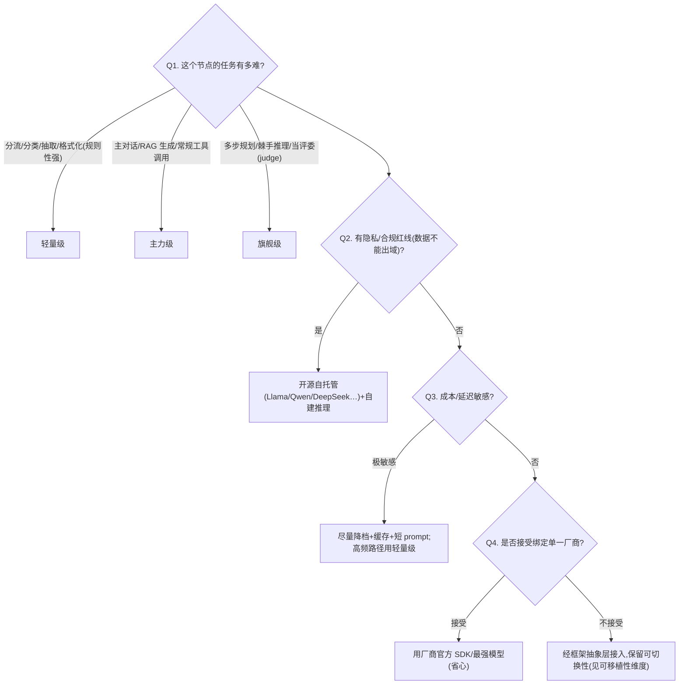
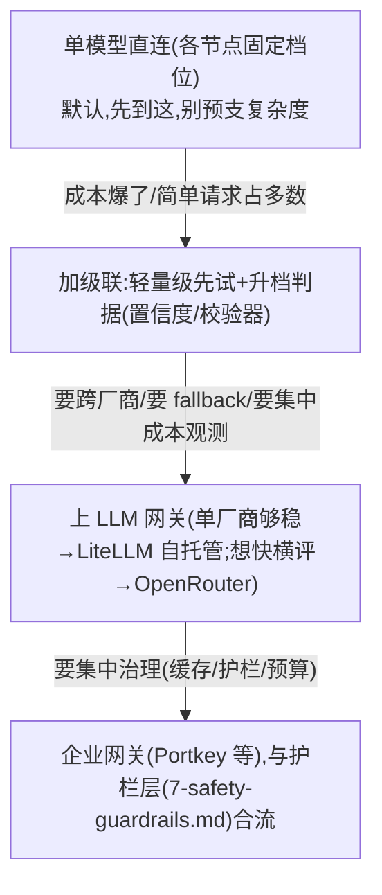

# 模型选型方案对比(选哪个 LLM)

> **用途**:为 Agent 的某个节点/角色选用合适的 LLM(能力、成本、延迟、上下文、厂商)。
> **适用**:Spec-Kit `/plan` 阶段;或由 `stack-selector` skill 路由进来。
> **最后核对:2026-06**。⚠️ 具体模型 ID 与价格变化极快——本包给**选型方法**,具体型号/定价请查 `claude-api` skill 或厂商官网,不在此固化。
> **层定位**:这是「模型层」,与编排框架层(`2-framework/`)正交——一个 Agent 里不同节点可以用不同模型。

---

## 一、何时需要这层选型

- 新建任何 LLM 节点时(每个节点都该问"这一步用哪个档位的模型")。
- 成本/延迟超预期,想给部分节点降档。
- 有隐私/合规红线,要评估自托管/开源模型。
- 要换厂商或评估多模型混用。

> 👉 **核心原则:按"任务角色"选模型,而不是全程一个模型。**(课程 02)triage/分类用小而便宜的,主推理用强的,judge/eval 用同等或更强的。

---

## 二、方案一览表(按"档位/角色"而非具体型号)

| 档位 | 角色 | 能力 | 成本 | 延迟 | 典型用途 |
|---|---|---|---|---|---|
| **轻量级**(mini / haiku 级) | 分流/分类/抽取 | 中 | 很低 | 很低 | triage 路由、格式化、简单工具选择、大批量 |
| **主力级**(sonnet / gpt 主力档,工作马) | 主推理/对话 | 高 | 中 | 中 | Agent 主循环、RAG 生成、复杂工具调用 |
| **旗舰级**(opus / 顶配级) | 难推理/规划/judge | 很高 | 高 | 高 | 多步规划、棘手推理、LLM-as-Judge |
| **开源自托管**(Llama/Qwen/DeepSeek 等) | 隐私/成本/可控 | 中-高 | 自托管成本 | 取决于部署 | 数据不能出域、超高吞吐、要微调 |
| **专用嵌入/重排模型** | 检索 | — | 低 | 低 | 见 `3-retrieval.md` |

> 说明:同一厂商内"轻量/主力/旗舰"三档是稳定的**心智分层**,具体名字会换;选型先定档位,再去查当下该档的型号。

---

## 三、快速决策树



---

## 四、选型维度(给候选打分用)

| 维度 | 含义 | 怎么权衡 |
|---|---|---|
| **推理能力** | 复杂任务质量 | 难任务别为省钱降档,会反复重试更贵 |
| **token 成本** | 输入+输出单价 | 高频节点优先压成本;注意输出 token 通常更贵 |
| **延迟 (TTFT/端到端)** | 首 token / 总耗时 | 交互式场景看 TTFT;批处理看吞吐 |
| **上下文窗口** | 能塞多少 | RAG/长文档要够大;但塞满≠效果好,且更贵更慢 |
| **工具调用质量** | function calling 可靠度 | Agent 核心能力,弱模型会乱调/漏调 |
| **结构化输出可靠度** | 出 JSON/schema 的稳定性 | 见 `07-Pydantic`;弱模型需更强约束 |
| **多模态** | 图/表/音 | 有需求才作硬指标 |
| **厂商锁定/可移植** | 换模型代价 | 官方 SDK 省心但锁定;框架抽象层更自由 |
| **隐私/自托管** | 数据出域 | 合规红线优先级最高,可一票否决 |
| **可微调** | 能否蒸馏/微调 | 高吞吐+稳定任务可微调小模型降本 |

---

## 五、概念基础(课程 02)

- **Base vs Instruction-Tuned**:base 模型只续写文本;instruction-tuned 经 RLHF 能听指令——**Agent 一律用 instruction-tuned/chat 模型**。
- **关键参数**:`temperature`(0=确定性,适合抽取/分类/judge;高=创造性);`max_tokens`(控成本与截断)。
- **token 预算**:检索上下文大小要相对模型窗口规划,别让 context 把预算吃光。

---

## 六、场景推荐

| 场景 | 推荐 |
|---|---|
| Agent 主循环(对话+工具) | 主力级;难子任务临时升旗舰级 |
| triage/路由节点(高频) | 轻量级 + 低 temperature |
| LLM-as-Judge / eval | 旗舰级(评委要比被评的强,见 `5-observability-eval.md`) |
| 大批量抽取/打标 | 轻量级 + 结构化输出约束;稳定后考虑微调小模型 |
| 数据不能出域 | 开源自托管 |
| 多模型混用降本 | 轻量级分流 → 必要时升档,经框架抽象层接入 |

---

## 七、子决策:模型路由 / 级联 / 网关(运行时,与"选哪个模型"分两道)

> **触发时机**:档位已在上面(二~六)定好,但运行时想**动态选模型降本**,或要**跨厂商接入/防锁定**时。**"选模型"是设计期决策,"运行时把每个请求送到哪个模型"是运行期决策——两道分开。**

下面两类手段正交:1)级联/语义路由 = 管道里的**策略**(省钱);2)LLM 网关 = **管道与可观测**(防锁定、统一接入)。

### 1)级联 / 语义路由(降本不降质的主杠杆)

| 方案 | 原理/特点 | 取舍 | 适合场景 |
|---|---|---|---|
| **不做(单模型直连)** ⭐起步 | 每个节点固定一个档位,直连厂商 SDK | 零额外复杂度;省不下"简单请求本可用更便宜模型"的钱 | 流量小、成本未爆、原型期 |
| **级联(便宜先试 → 难再升档)** | 轻量级先答,置信度低/校验不过/判 too-hard 再升主力/旗舰 | 降本主杠杆;要设"升档判据",判错会多花一次(先试+再试) | 请求难度分布不均、简单占多数 |
| **语义路由(按 query 分类选模型)** | 嵌入分类/小模型分流,把不同意图路由到不同档位或专用模型 | 比级联省掉"先试"那一次;路由器自身要 eval、会漂移 | 意图清晰可分类、流量大 |
| **投机/草稿(speculative)** | 小模型出草稿、大模型校验加速 | 多为推理栈优化而非选型,自托管才好控 | 自托管、追极致延迟 |

> 判据/选型轴:**升档触发信号**(置信度阈值 / 输出校验器 / 显式 too-hard 标记)、**路由器自身成本与可 eval 性**、**误路由代价**(升错档 = 白花一次 + 加延迟)。先量化"简单请求占比",占比高、级联才划算。

### 2)LLM 网关 / 代理层(统一接入、防锁定)

| 方案 | 原理/特点 | 取舍 | 适合场景 |
|---|---|---|---|
| **不做(各厂商官方 SDK 直连)** ⭐起步 | 直接用 Anthropic/OpenAI 等官方 SDK | 最省心、零中间层延迟;多厂商时代码各写一套、换厂商要改码 | 单厂商、流量小 |
| **自托管网关(LiteLLM)** | 统一 OpenAI 兼容入口:多厂商、fallback、限流、key 管理、用量统计 | 开源可控、能进自有 VPC;自己多运维一层 | 多厂商、要成本归集/团队配额 |
| **托管路由(OpenRouter)** | 一个 key 接几百模型、按量计费、自动 fallback | 上手最快、覆盖广;经第三方转发(隐私/加价/SLA 风险) | 想快速横评多模型、流量中等 |
| **企业网关(Portkey / Cloudflare AI Gateway / Kong AI 等,现查)** | 在网关层做缓存、护栏、可观测、预算控制 | 一处统管;又一个平台依赖 | 中大型、要集中治理 |

> 判据/选型轴:**是否跨厂商**(单厂商基本不需要)、**要不要 fallback/限流/配额**、**成本观测是否要集中**(见 `8-cost-economics.md`)、**数据能否过第三方**(隐私红线优先 → 自托管 LiteLLM 或直连)、**能否接受多一跳延迟 + 一个依赖**。

> 👉 **两者关系**:很多网关(LiteLLM/Portkey/OpenRouter)自带 fallback 和简单路由,但**质量敏感的级联判据通常要自己写**——别指望网关默认策略替代评估。

**最轻起步 → 升级路径**:



> ⚠️ **别过早上网关/路由**:没有"跨厂商 / fallback / 降本"任一真实需求前,网关只是徒增一跳延迟与一个依赖。路由/网关的收益和成本都要用 `5-observability-eval.md` 的**成本 + 质量**指标量化后再决定——**降本动作必须同时盯住质量不掉**(级联升档判据错了会偷偷降质)。具体网关产品/价格变化快,选型先定"自托管 vs 托管 vs 企业",**具体产品现查**官网。

---

## 八、接入 Spec-Kit(可复制 prompt 块)

```
请用 agent/skills/agent-selection/1-model.md 为本 feature 的各 LLM 节点选模型 + 决定运行时路由方式。
- 节点清单 + 每个节点的任务难度:<…>
- 约束:成本上限 <…> / 延迟要求 <…> / 隐私合规 <…> / 是否接受厂商锁定 <…>
- 跨厂商/降本诉求:是否需要 fallback / 限流 / 集中成本观测 <…>;简单请求占比 <…>
请按"任务角色"分档(轻量/主力/旗舰/自托管),给每个节点:推荐档位 + 备选 + 理由 + 已知代价;
再判断运行时是否需要级联/语义路由与 LLM 网关(默认单模型直连,跨厂商或要降本才上,见 8-cost-economics.md / 5-observability-eval.md)。
具体型号/网关产品请按当下情况查 claude-api skill / 官方,不要写死过期型号。
```

---

## 九、课程回溯 + 相关资产

- 回溯:`courses/02-Building Systems with the ChatGPT API/notes/ep02-language-models.md`;`courses/专业名词解释/`。
- 具体型号/定价:`skills/claude-api`(Claude 系)/ 厂商官网。
- 相关层:`agent/skills/agent-selection/2-framework/`(编排框架)、`agent/skills/agent-selection/3-retrieval.md`(嵌入/重排模型在那边)、`agent/skills/agent-selection/8-cost-economics.md`(路由/网关的降本账)、`agent/skills/agent-selection/5-observability-eval.md`(成本 + 质量度量,路由是否值得用它量化)。
- 总览:`agent/skills/agent-selection/README.md`。
- 沉淀:定下后用 `agent/skills/sdd/adr-writer` 写 ADR。

> **最后核对:2026-06**
