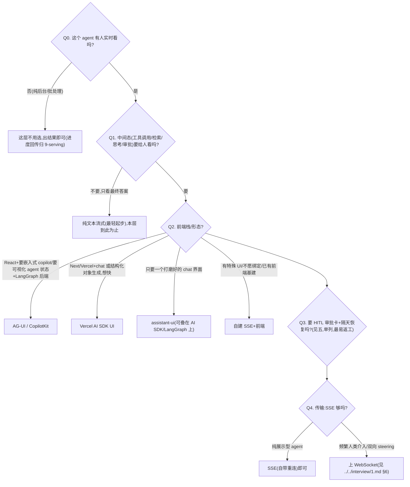
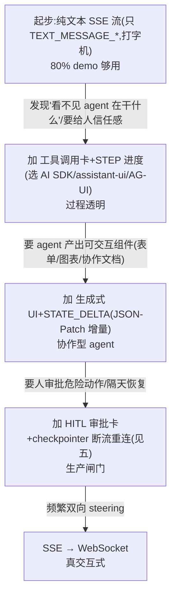

# Agent-UX 呈现层选型方案对比(agent 在前端怎么"被看见")

> **用途**:为 Agent 选**前端呈现方案**——token 流怎么渲染、中间态/工具调用要不要可视化、HITL 审批与中断恢复怎么呈现给人。
> **适用**:Spec-Kit `/plan` 阶段;或由 `stack-selector` skill 路由进来。
> **最后核对:2026-06**。⚠️ 候选库的具体能力/组件名迭代极快,凡标「**现查**」的请核当下官方文档,别认死本快照。
> **层定位**:这是「**呈现层**」——和 `9-serving-deployment.md`(serving 形态)**强耦合**,且会**反向约束编排框架**(选了某套 UX 协议,后端框架最好有对应适配)。所以**plan 期就要定,别留到前端返工**。
> **边界**:呈现层(前端怎么渲染)≠ 传输层(SSE/WebSocket)≠ 协议层(AG-UI 事件 schema,在 `2-framework/06-protocols.md`)。三段流的全景见 `../../interview/1.md` «前后端 Stream 流的事件模型」。

---

## 一、🎯 何时需要这层选型 / 为什么不能拖到前端

- 任何**有人看**的 Agent(对话/copilot/协作工具)——只要不是纯后台批处理。
- demo 阶段往往一个 `text` delta 打字机就糊弄过去了;一旦要"**看得见 agent 在干什么**"(工具调用、检索、思考、审批),就必须重新设计事件流。
- **反向约束**:呈现方案决定后端要 emit 什么粒度的流。选了 AG-UI/CopilotKit ⇒ 后端最好用有 AG-UI 适配的框架;走自建 ⇒ 后端要能吐细粒度 stream(如 LangGraph `stream_mode=["updates","messages"]`)。**先定了 serving 形态(9-)和框架(2-),UX 才能定;但 UX 又会回头约束框架——所以三者在 plan 期一起拍。**

> 👉 **核心问题:这个 agent 的"中间态"要不要给人看?** 不看 → 纯文本流式即可,这层几乎不用选;要看(工具调用卡/检索来源/审批卡/生成式组件)→ 才需要在下面的候选里挑。

---

## 二、🧭 三个选型维度(决策轴)

| 维度 | 在问什么 | 最轻档(先不做) | 加重档 |
|---|---|---|---|
| **① token 呈现** | 正文怎么出 | 一次性返回(不流式) | SSE 逐 token 打字机(`TEXT_MESSAGE_*` triad) |
| **② 生成式/交互式 UI** | agent 产出能不能交互 | 纯 Markdown 文本 | 流式渲染组件(表单/图表/画布/实时协作文档,`STATE_SNAPSHOT`+`STATE_DELTA` JSON-Patch) |
| **③ 中间态 / 工具调用可视化** | 过程要不要透明 | 只出最终答案 | 工具调用卡(args 流式预填→结果卡)、检索来源、`REASONING_*` 思考流、`STEP_*` 节点进度 |
| **④ HITL 审批与中断恢复** | 人怎么介入 | 退化成"agent 问一句、人答一句"(同普通 chatbot) | 专门审批卡(待批动作→批准/拒绝/编辑→`Command(resume)`)+ 断流重连对齐(单列见五) |

> 这四个维度**逐档加重**;不是全有全无。每多点一档,前端复杂度和后端要 emit 的事件粒度都同步上升——**按需点亮,别默认全开**。

---

## 三、📊 候选方案对比表

| 方案 | 原理 / 特点 | 取舍 | 适合场景 |
|---|---|---|---|
| **纯文本流式 / 无 UI**(最轻起步)⭐ | 后端 SSE 只推 `text` delta,前端打字机渲染 | 极简、零抽象;但**看不见**工具调用/状态/审批——做不出"过程透明" | 内部工具、单轮问答、demo、中间态无需展示 |
| **AG-UI 协议 / CopilotKit** | AG-UI=标准化 agent↔前端**事件协议**(约 16 事件、5 类:文本/工具/状态/生命周期/特殊;由 CopilotKit 发起)。CopilotKit=其上的 React runtime + 组件(侧边栏 copilot、generative UI / CoAgents,**现查**) | 开箱可视化工具调用/状态/审批卡,与 **LangGraph 有官方集成**;代价是引入协议+runtime 抽象、绑定其事件模型、整体偏重 | 要"看得见 agent 在干什么"的协作型/agentic 前端;尤其 LangGraph 栈、要嵌入式 copilot |
| **Vercel AI SDK UI** | provider 中立的前端 hooks(`useChat`/`useCompletion`/`useObject`,**现查**)+ 后端 `streamText`/`streamObject`;支持 data parts / RSC 流式生成式 UI | DX 极好、上手最快、Next/Vercel 生态最顺;但偏 **chat/补全范式**,复杂 agent 中间态/审批要自己拼,绑定其 SDK 抽象 | Next/Vercel 栈;chat 或"表单式/结构化对象"生成;想快速出活 |
| **assistant-ui** | 专注 **chat 线程 UI** 的 React 组件库(消息流、工具 UI、附件、分支编辑等 primitives,**现查**),可接 AI SDK / LangGraph 后端 | 聊天形态开箱即用、tool UI 可定制、主题打磨好;但本质是 **chat-thread 形态**,画布/协作类非 chat 形态帮不上 | 就是要一个打磨好的对话界面,不想自己写消息流渲染 |
| **自建 SSE + 前端** | 后端直接 SSE 推**自定义事件**,前端自己写 reducer(可照 AG-UI 五类事件的形状定 schema) | 零抽象绑定、完全可控;但 token 流/工具增量/状态 diff/断流重连/HITL 环路**全要自己实现**,易退化成"只推 text delta" | 有特殊 UI、不愿被框架约束、或团队已有成熟前端基建 |

> 取舍主轴:**抽象省力(AG-UI/CopilotKit、AI SDK、assistant-ui)↔ 完全可控(自建)**。前三者把"可视化中间态/审批卡"做成现成件,代价是绑定其事件模型;自建反之。
> 现查提醒:CopilotKit 的 generative UI / CoAgents、AI SDK 的 RSC/data parts、assistant-ui 的 primitives 名称与能力**每季度都在动**,定型号前核官方。

---

## 四、🌳 判据 / 决策树



> ⚠️ **每个分支都有"最轻起步"**:能纯文本流式解决就别上协议;能 SSE 就别上 WebSocket;能复用现成组件库就别自建。**复杂度真到了(中间态要可视化、要审批卡、要生成式 UI)再升级**——过早上 AG-UI/CopilotKit 全家桶是这层最常见的过度工程。

---

## 五、🛡️ HITL 审批与中断恢复的呈现(单列,因为最容易返工)

呈现层最硬的一块——也是**最容易被低估、上线才发现要返工**的地方。

- **现实的坑**:AG-UI **没有专门的"暂停等批准"原语**,很多实现里 HITL 退化成"agent 文本问一句、用户回一句",和普通 chatbot 同 pattern。**事件只是传输,审批状态机还得自己写。**(出处:`../../interview/1.md` §7「工程要点」)
- **完整环路**:后端 `interrupt()` 暂停 → 推 `INTERRUPT`(或一条 text 提问)→ 前端渲染**审批卡**(把待批准的动作可视化)→ 人**批准/拒绝/编辑** → 上行 approval 事件 → 后端 `Command(resume=...)` 继续。
- **中断恢复的呈现 = 断流重连接得回去**:SSE 自带重连,但"从哪接"是你的活——靠 **checkpointer**(`thread_id` 定位快照),前端用 `last-event-id` 或重新拉一次 `STATE_SNAPSHOT` 对齐。**隔几小时/几天回来也能续**的前提是 checkpointer 持久化(详见 `9-serving-deployment.md` 持久执行/可恢复)。
- **HITL 是横切设计模式,不只是 interrupt API**:UX 经 AG-UI 推前端,恢复经 `interrupt + Command`/checkpoint,介入结果须可审计并回流(人既是安全闸,也是数据飞轮的标注源)。见 `../../interview/1.md` «HITL 横切线」。

> 选型落点:**要不要专门审批卡 = 选 AG-UI/CopilotKit(有现成 HITL 组件)还是自建退化为文本问答** 的分水岭。危险动作/低置信度才需要审批卡;低风险全自动的别为它上重组件。

---

## 六、🔗 与 serving 形态的耦合(反向约束,plan 期一起拍)

呈现方案必须**匹配 serving 运行形态**(`9-serving-deployment.md` 的第一道分流):

| serving 形态 | 对呈现的要求 | 合适的呈现档 |
|---|---|---|
| **同步请求-响应** | 不必流式,出整段即可 | 纯文本 / 一次性渲染 |
| **流式(SSE,token 边出边回)** | token 打字机 + 可选工具卡/状态 | AI SDK / assistant-ui / AG-UI |
| **异步后台长时 agent**(分钟到小时) | **不是 chat UI 能扛的**:要任务列表/进度视图、完成通知(webhook/push)、用户发起的中断/取消通道 | 自建任务面板 + AG-UI `ACTIVITY_*`/`STEP_*`;chat 框只是入口 |

> 反向约束的本质:**选了呈现档,就限定了后端要 emit 的事件粒度和 serving 形态**。比如"要可视化工具调用增量预填表单" ⇒ 后端必须流式吐 tool args ⇒ 框架要支持(LangGraph `messages`/`events` 模式)。所以 **plan 期把 9-(serving)、2-(框架)、本页(UX)三者一起定**,别让前端最后才发现后端吐不出它要的事件。

---

## 七、🪜 最轻起步 & 升级路径



> 反过来:**没到那一步就别加**。每升一档,前端 reducer、后端事件、serving 复杂度同步上去。

---

## 八、🎬 场景推荐

| 场景 | 推荐呈现方案 |
|---|---|
| 内部工具 / 单轮问答 / demo | 纯文本流式(最轻) |
| Next/Vercel 上的 chat 或结构化生成 | Vercel AI SDK UI |
| 要一个打磨好的对话界面、不想自己写消息流 | assistant-ui(可叠 AI SDK / LangGraph) |
| LangGraph 栈 + 要嵌入式 copilot / 可视化 agent 状态 / HITL 审批 | AG-UI / CopilotKit(官方集成) |
| 有特殊 UI(画布/特定协作)/ 不愿绑定 | 自建 SSE + 前端(照 AG-UI 五类事件定 schema) |
| 异步后台长时 agent(coding/research) | 任务面板 + 进度/完成通知(`ACTIVITY_*`/webhook),chat 框仅入口(见 9-) |

---

## 九、📋 接入 Spec-Kit(可复制 prompt 块)

```
请用 agent/skills/agent-selection/10-agent-ux.md 为本 feature 选 Agent-UX 呈现方案。
- serving 形态(同步/流式/异步后台,见 9-serving):<…>
- 前端栈:<React/Next/Vue/无前端…>  既有 UI 基建:<…>
- 中间态要不要给人看(工具调用/检索来源/思考/节点进度):<…>
- 要不要生成式/交互式 UI(表单/图表/协作文档):<…>
- 要不要 HITL 审批卡 + 隔天恢复:<…>(若要,确认后端有 checkpointer)
请给:① 推荐方案 + 备选 + 理由 + 代价;② 起步档位(默认纯文本流式)+ 升级触发条件;
③ 它对后端框架/serving 的反向约束(要 emit 什么粒度事件、是否需 WebSocket)。
候选库的具体能力请按当下查官方,别用过期组件名。
```

---

## 十、🔁 交叉引用 + 核对戳

- **心智模型**:`../../interview/1.md` «前后端 Stream 流的事件模型」(三段流:provider→框架→AG-UI,5 类事件全景)、«正交横切带 A·协议 → Agent↔UI/客户端 AG-UI」、«HITL 是横切设计模式」(L5 + 横切线)。
- **相邻层**:`9-serving-deployment.md`(serving 形态决定呈现下限:流式/异步后台/持久执行/断流重连)、`2-framework/06-protocols.md`(AG-UI 作为协议的集中决策,以及与 MCP/A2A 的正交关系)。
- **总览**:`README.md`。沉淀:定下后用 `agent/skills/sdd/adr-writer` 写 ADR。

> **最后核对:2026-06**
