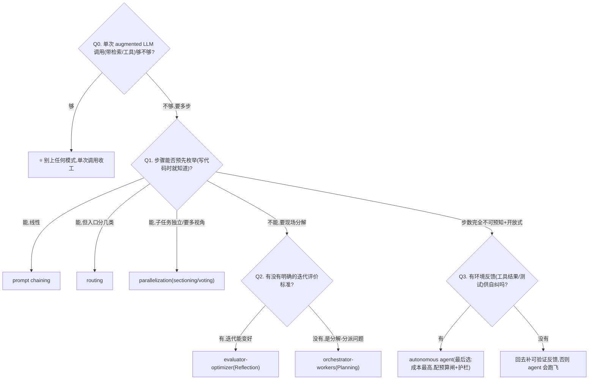
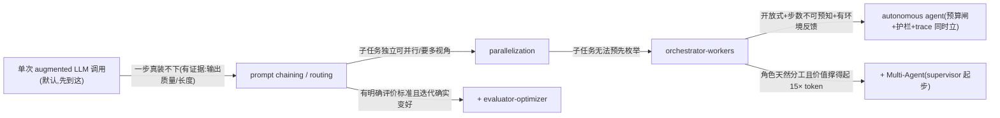

# 设计模式选型(业务形状 → 控制流形态)

> **用途**:在定编排框架**之前**,先定"多步任务的控制流长什么形状"——Anthropic workflow 谱选哪一档,要不要叠加 Reflection / Planning / Multi-Agent 能力模式。
> **适用**:Spec-Kit `/plan` 阶段,在 `0-action-paradigm.md` 之后、`2-framework/` 之前;或由 `stack-selector` skill 路由进来。
> **最后核对:2026-06**。结论分级:形态谱与判据 ✅稳定(方法) / 具体框架适配 ⚠️快照(以 `2-framework/03` 画像为准)。
> **层定位与边界(三层别混)**:
> ① [`0-action-paradigm.md`](0-action-paradigm.md) = **动作原语**(单步动作怎么"表示":function-calling / CodeAct / GUI);
> ② **本包** = **控制流形态**(多步怎么"组织":chain / route / parallel / orchestrate / evaluate / autonomous);
> ③ [`2-framework/`](2-framework/) = **实现载体**(形态用什么框架"落地")。
> Ng 四大模式里的 **Tool Use 属动作原语层**(→ 0 号包 / `4-tools.md`),本包不重复;其余三个(Reflection / Planning / Multi-Agent)在本包作为**叠加维度**处理。

---

## 一、两套谱系与对应关系

业界两套常被并提的"设计模式",是**一纵一横**,不冲突:

- **Anthropic workflow 谱**(Building Effective Agents):一条**从确定性到自主性**的复杂度轴——公共底座是 augmented LLM(单次调用 + 检索/工具/记忆),往上依次 prompt chaining → routing → parallelization → orchestrator-workers → evaluator-optimizer → autonomous agent。**前五档是 workflow(代码定控制流),最后一档是 agent(模型定控制流)**。
- **Andrew Ng 四大模式**(Agentic Design Patterns):Reflection / Tool Use / Planning / Multi-Agent——四种**能力模式**,描述"给系统叠什么能力",不构成一条轴。

映射关系:

| Ng 四大模式 | 在 workflow 谱上的落点 | 说明 |
|---|---|---|
| **Tool Use** | 不占形态,属 augmented LLM 底座 | 单步动作原语 → [`0-action-paradigm.md`](0-action-paradigm.md)、[`4-tools.md`](4-tools.md) |
| **Reflection** | ≈ evaluator-optimizer | 生成者↔批评者循环;**外部反馈(跑代码看报错)> 纯自评** |
| **Planning** | ≈ orchestrator-workers / plan-and-execute | LLM 自主定步骤序列,而非开发者硬编码 |
| **Multi-Agent** | ≈ orchestrator-workers 的推广(多角色化) | supervisor / 层级 / 网状拓扑;成本最高 |

> **成熟度立场**(课程 08 W1-L8):Reflection 和 Tool Use 最成熟可靠、应优先;Planning 和 Multi-Agent 更强但可控性差,**复杂度证明值得了再上**。

---

## 二、形态一览(6 档)

| 形态 | 业务形状信号 | 复杂度/成本 | 典型失败模式 | 框架落地(→`2-framework/`) |
|---|---|---|---|---|
| **prompt chaining** ⭐默认 | 步骤可预先枚举、线性依赖(生成→翻译→摘要) | 最低 | 链太长误差累积;中间步骤缺校验 | 裸 SDK / 任意框架皆可,别为它上重框架 |
| **routing** | 输入分几类,各类处理路径不同 | 低 | 分类错则全错;类别边界模糊 | 裸 SDK + structured output 分类;或框架 conditional edge |
| **parallelization** | 子任务互相独立可并行;或要多视角投票(sectioning / voting) | 低-中 | 聚合逻辑粗糙;并行分支结果冲突没人裁 | asyncio / 框架并行分支(LangGraph `Send` 扇出扇入) |
| **orchestrator-workers**(≈Planning) | 子任务**不可预先枚举**,要 LLM 现场分解、分派、汇总 | 中-高 | 分解质量不稳;worker 结果聚合难;调试要看全轨迹 | LangGraph / crewAI hierarchical / 自建 plan-and-execute |
| **evaluator-optimizer**(≈Reflection) | 有**明确评价标准**、迭代能变好(代码跑测试、文案对 rubric) | 中(轮数×token) | 评价标准模糊时原地打转;自评不可靠 | 生成↔批评双节点循环;LangGraph cycle 最顺 |
| **autonomous agent** | 开放式问题、步数不可预知、**有环境反馈**(工具结果/测试)可自纠 | 最高 | 跑飞、死循环、成本失控;必须配预算闸+护栏 | LangGraph / 各家 Agent SDK;必须同时立 `5-observability` + `7-safety` |

**叠加维度:Multi-Agent**(不是第七档,而是把上面任一形态的节点"多角色化"):

| 拓扑 | 说明 | 何时用 |
|---|---|---|
| **supervisor / orchestrator-worker** | 中心 agent 路由给专家 | 最常用、可控;不知道选哪个就先用它 |
| 层级(hierarchical) | supervisor 套 supervisor | 团队规模再大一层 |
| 网状(network) | agent 互相直连 | 少用,难调试 |

> ⚠️ **成本红线**(Anthropic 多 agent research 经验,`agent/interview/1.md`):orchestrator-worker 并行子 agent 有效,但 **token 成本约为单 agent 的 15 倍**——只在任务价值撑得起时才用。设计时想清:工作怎么分解(orchestrator 决定 vs 预定义)、结果怎么聚合(map-reduce / 扇出扇入)、**谁拥有跟人的对话**(通信模式见课程 08 5-Patterns L5)。

---

## 三、快速决策树



**叠加三问**(选完主形态后再问):

| 问 | 是 → 叠加 | 代价 |
|---|---|---|
| 输出质量 > 延迟/成本,且有可靠批评信号? | **+ Reflection**(外部反馈优先:跑代码/测试,别纯自评) | 轮数 × token;标准模糊会打转 |
| 要先拆解成计划再执行、且计划值得让人审? | **+ Planning**(plan-and-execute,plan 节点可加 HITL) | 计划质量不稳,要 eval 计划本身 |
| 领域/职责天然分工(研究员→写手→编辑)? | **+ Multi-Agent**(默认 supervisor 拓扑) | ⚠️ token ≈ 单 agent 15 倍 |

---

## 四、逐个深挖

### 1. prompt chaining(链)
把任务拆成固定序列,每步一次 LLM 调用,中间可插程序化校验(gate)。**甜区**:步骤清晰、每步换 prompt/模型档位(如便宜模型抽取→贵模型综合,配 [`1-model.md`](1-model.md) 级联)。**反模式**:为"看起来专业"把一次调用能做的事拆成五步——链越长误差越累积。

### 2. routing(路由)
先分类,再分发到各自的处理链/prompt/模型。**甜区**:客服分流(退款/技术/闲聊)、难易分档(简单问题走 Haiku 档、难题走旗舰档,配模型路由)。**反模式**:类别边界模糊还硬路由——先让分类器输出置信度,低置信走兜底。

### 3. parallelization(并行)
两种用法:**sectioning**(独立子任务并行再聚合)与 **voting**(同一任务多视角跑 N 次投票/裁决)。**甜区**:批量处理、评审类任务(多个 judge 视角)、降延迟。**反模式**:子任务有依赖还硬并行;聚合只做简单拼接没人裁冲突。

### 4. orchestrator-workers(编排者-工人,≈Planning)
中心 LLM 现场分解任务、分派给 worker、汇总结果。与 parallelization 的区别:**子任务不可预先枚举**。**甜区**:多文件代码修改、多源研究综合。**反模式**:任务其实可枚举却用它(该用 chaining/parallelization);orchestrator 与 worker 用同档贵模型(worker 常可降档)。课程回溯:`courses/08.../5-Patterns.../L1-规划工作流.md`、`L3-用代码做规划.md`。

### 5. evaluator-optimizer(评估-优化循环,≈Reflection)
生成者产出 → 评估者批评 → 生成者修订,循环到过标准或到轮数上限。**甜区**:有清晰 rubric 的写作/代码(能跑测试 = 最好的评估者)。**要点**(课程 08 W2):**外部确定性反馈(运行代码、查引用)> LLM 自评**;自评容易"自我表扬"。**反模式**:评价标准说不清就上循环——先把 rubric 写出来,写不出来说明不适合这档。课程回溯:`courses/08.../2-Reflection Design Pattern/notes/`。

### 6. autonomous agent(自主 agent)
模型在循环里自定步骤:观察→决策→动作→观察,直到完成或触发停止条件。**前提三件套**:有环境反馈可自纠、有预算/轮数闸、有 trace(出错能定位)。**甜区**:SWE agent(测试就是反馈)、开放式研究。**反模式**:流程本可确定却上 agent(可预测性/成本双输,见 `pydantic-ai-agent` skill「何时不要用 Agent」)。课程回溯:`courses/11-.../L09-高级Agent架构.md`。

### +Multi-Agent(叠加维度)
拓扑三型见 §二表。设计三问:分解谁定、结果怎么聚、**谁拥有对话主权**。通信模式(共享消息列表 vs 移交 handoff)见 `courses/08.../5-Patterns.../L4-多智能体工作流.md`、`L5-通信模式.md`。框架:crewAI(角色协作最顺)、LangGraph(supervisor/自定义拓扑)——对照 [`2-framework/03-framework-profiles.md`](2-framework/03-framework-profiles.md)。

---

## 五、场景推荐

| 业务一句话 | 形态组合 | 框架方向(→`2-framework/`) |
|---|---|---|
| 文档抽取→转换→输出(步骤固定) | prompt chaining | 裸 SDK 够 |
| 客服/工单分流,各类处理不同 | routing(+ 难易分档配模型路由) | 裸 SDK + structured output |
| 一批简历/合同并行审,汇总报告 | parallelization(sectioning) | asyncio / LangGraph Send |
| 代码评审要多视角(安全/性能/风格) | parallelization(voting)+ 裁决节点 | LangGraph |
| 写作/代码生成,有明确质量标准 | chaining + evaluator-optimizer | LangGraph cycle / 自建双节点循环 |
| 多源调研综合报告,子任务现场定 | orchestrator-workers(+ 可并行) | LangGraph / crewAI hierarchical |
| 内容生产流水线,角色天然分工 | chaining + Multi-Agent(研究→写→编) | crewAI(线性角色协作甜区) |
| 开放式修 bug / SWE 任务 | autonomous agent(测试为反馈)+ Reflection | LangGraph / Agent SDK + 沙箱护栏 |

---

## 六、最轻起步 → 升级路径



> ⚠️ **每往右一步都要"复杂度已到"的证据**:单次调用不够的证据、链不够的证据、workflow 不够的证据。**workflow 优先、agent 兜底**(Anthropic 原则:能用 workflow 就别上 agent——可预测性、可调试性、成本三赢)。反过来的信号也要认:如果你在 chaining 里塞了七八个 if-else 补丁,说明形状已经变了,该升 routing/orchestrator 了。

---

## 七、接入 Spec-Kit(可复制 prompt 块)

```
请用 agent/skills/agent-selection/11-design-patterns.md 为本 feature 定控制流形态(在动作范式之后、框架选型之前)。
- 业务一句话:<…>
- 步骤能否预先枚举:<能-线性/能-分类/能-可并行/不能-要现场分解/步数不可预知>
- 有无明确迭代评价标准(rubric/测试):<…>  有无环境反馈供自纠:<…>
- 角色是否天然分工:<…>  单任务价值/预算:<…>(Multi-Agent ≈ 15× token)
请按决策树给:主形态(默认最轻:单次调用→chaining)+ 叠加模式(Reflection/Planning/Multi-Agent,各给触发证据)
+ 备选 + 代价 + 升级触发条件;并说明该形态对框架选型(2-framework/01 的"系统形状")的输入。
```

定下后接力:形态 = 本包结论 → 进 [`2-framework/01-decision-tree.md`](2-framework/01-decision-tree.md)(形态就是它 Q0"系统形状"的答案);
形态含 autonomous agent / Multi-Agent → 同时看 [`8-cost-economics.md`](8-cost-economics.md)(成本闸)与 [`7-safety-guardrails.md`](7-safety-guardrails.md)(护栏)。

---

## 八、课程回溯 + 相关资产

- 回溯:`courses/08-Agentic AI（Andrew Ng）/1-*/notes/W1-L8-智能体设计模式.md`(四大模式总纲)、`2-Reflection Design Pattern/notes/`(反思)、`5-Patterns for Highly Autonomous Agents/notes/`(规划/多智能体/通信模式)、`courses/11-AI Agents in LangGraph/notes/L09-高级Agent架构.md`;Anthropic《Building Effective Agents》(workflow 谱原始出处)。
- 心智模型:`agent/interview/1.md`(Orchestrator-Workers、多 agent 15× token 成本、通信模式)。
- 上游:[`0-action-paradigm.md`](0-action-paradigm.md)(动作原语,先于本包)。下游:[`2-framework/01-decision-tree.md`](2-framework/01-decision-tree.md)(形态 → 框架)。
- 相邻:[`1-model.md`](1-model.md)(chaining/routing 配模型级联路由)、[`8-cost-economics.md`](8-cost-economics.md)(Multi-Agent/agent 的成本闸)、[`7-safety-guardrails.md`](7-safety-guardrails.md)(autonomous agent 必配护栏)。
- 总览:[`README.md`](README.md)。沉淀:`agent/skills/sdd/adr-writer`。

> **最后核对:2026-06**
