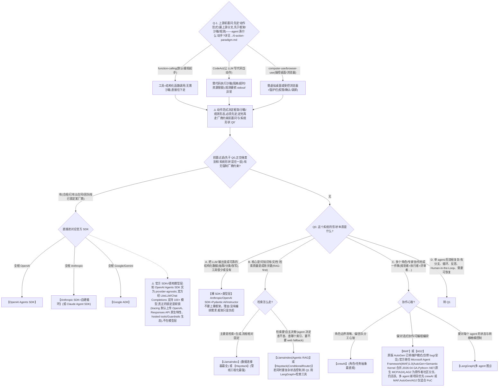

# 01 · 决策树:1 分钟快速排除

> 目的:用最少的问题把候选从"全市场"收敛到 **2-3 个**。决策树负责**排除**,不负责给最终答案——最终答案交给评分卡(`02`)。
> 用法:从 Q0 开始,顺着回答往下走。每个叶子给出"候选集",再去 `03` 画像里深挖。
> **最后核对:2026-06**。

---

## 前置:先分清"协议层"和"框架层"

很多人把 **MCP** 和 LangGraph 放一起比,这是错的——它们不是同一层:

| 层 | 是什么 | 例子 | 选型关系 |
|---|---|---|---|
| **协议层** | Agent 如何接入工具/上下文的标准 | **MCP**(接工具/数据)+ **A2A**(接 agent) | 与框架**正交**,可叠加 |
| **框架/SDK 层** | Agent 的编排、状态、循环 | LangGraph、crewAI、LlamaIndex、裸 SDK | 决策树选的是这一层 |

> 👉 **MCP 几乎总是"加分项而非替代项"**:无论选哪个框架,只要要对接外部工具/数据源,都可以让它们以 MCP server 形式暴露。所以决策树不在 MCP 和框架之间二选一。

> ⚠️ **协议消歧(2026 参考架构两层)**:**MCP 接工具/数据 + A2A 接 agent**。"ACP" 是两个**毫无关系**的同名缩写:① **Agent Communication Protocol**(IBM/BeeAI,agent↔agent)已于 **2025-08 并入 A2A**(归 Linux Foundation/AAIF);② **Agent Client Protocol**(Zed,编辑器/IDE↔编程 agent,≈LSP)独立活跃。协议与各层正交、**不单列选型**——详见 `/Users/ming/Documents/ai-agent-learn/agent/interview/1.md` «正交横切带 A·协议»。

---

## 主决策树



---

## Q1. 复杂单 agent / 状态控制分支

```
Q1. 你需要下面哪些"运行时能力"?(勾得越多越偏 LangGraph)
│
├─ [ ] 显式状态(state)跨步骤累积、可读可改
├─ [ ] 条件分支 / 循环 / 自反思(reflection)
├─ [ ] 持久化(checkpointer):可中断、可恢复、多会话
├─ [ ] Human-in-the-Loop:中途暂停等人审批
├─ [ ] 时间旅行(time-travel)/ 回放调试
│
├─ 勾选 ≥2  → 【LangGraph】 ✅(状态机式编排,这正是它的甜区)
├─ 勾选 =1 且只是"加个循环"  → 【Haystack(ConditionalRouter 控制循环 + max_runs_per_component 兜底)】 或 【裸 SDK 手写循环】
└─ 勾选 =0  → 回到主树,你可能不需要状态图,选更轻的
```

---

## Q2. 横切约束(每个候选都要过一遍)

无论上面落到哪,以下约束可能**直接否决**某个候选:

| 约束 | 触发的取舍 |
|---|---|
| **团队不熟 / 要快速出 MVP** | 偏成熟生态(LangChain/LlamaIndex 文档多)或官方 SDK;避开小众框架 |
| **强可观测性要求(tracing 必须)** | 优先原生支持 LangSmith / Phoenix / Langfuse 的(LangGraph、LlamaIndex 友好) |
| **Eval 必须接现有框架** | 选 eval 友好的(见 `03` 各画像的 Eval 行) |
| **极致控制 / 怕黑盒 / token 敏感** | 偏裸 SDK 或轻框架(Pydantic AI),避开重抽象 |
| **怕 Vendor lock-in** | 避开绑死单一厂商的官方 SDK;选框架抽象层(可换底层模型) |
| **生产 serving / 部署** | 看是否有官方部署方案(LangGraph Platform、Haystack REST) |
| **合规 / 数据出域** | 影响模型与托管选择,通常与框架正交但要在 plan 里单列 |

---

## 决策树速记卡

| 你的场景一句话 | 首选候选 |
|---|---|
| 「我就要个可靠 JSON」 | 裸 SDK + Pydantic AI / Instructor |
| 「问我的文档/知识库」 | LlamaIndex / Haystack |
| 「让 AI 自己决定查不查资料」 | Agentic RAG(LlamaIndex)/ Haystack 路由 |
| 「几个角色分工干活」 | crewAI(首推)/ MAF;AutoGen 已转维护模式(继任 MAF),AG2 为社区分叉,仅适合 PoC |
| 「流程要分支+循环+能暂停恢复」 | LangGraph |
| 「就用 OpenAI/Gemini 官方最短路」 | OpenAI Agents SDK / Google ADK |
| 「要接一堆外部工具(任何框架下)」 | 叠加 MCP |

> ✅ 决策树给的是**候选集**。两个及以上候选时,务必进 `02-scorecard.md` 做加权量化,别凭手感拍板。
