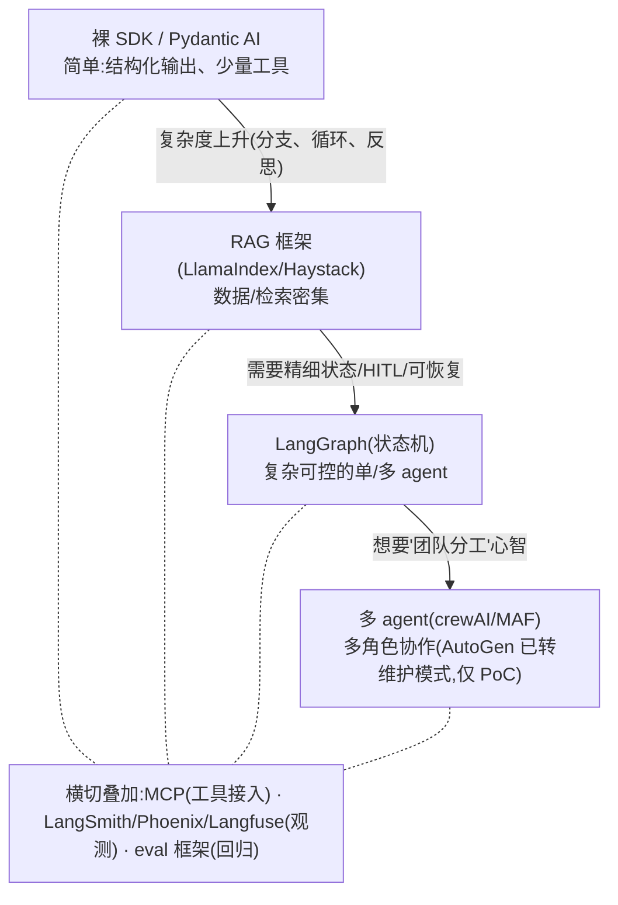

# 04 · 场景速查手册:业务/数据形态 → 推荐栈

> 目的:决策树+评分卡之后的**交叉验证**——看看"和我形状相似的场景"通常怎么选,避免漏掉更成熟的方案。
> 读法:先按"数据特征"和"业务形态"两张索引定位,再看对应场景卡。

---

## 索引 A:按数据特征

| 数据特征 | 关键约束 | 默认推荐 | 备选 |
|---|---|---|---|
| 大量非结构化文档(PDF/网页/知识库) | 检索质量 | LlamaIndex / Haystack | LangGraph+检索工具 |
| 结构化数据(DB/API/表格) | 准确性、可解析 | 裸 SDK + Pydantic AI(工具查询) | LangGraph |
| 实时/流式数据(日志、行情、事件) | 低延迟、事件触发 | 事件驱动(LlamaIndex Workflows)/ 裸 SDK | LangGraph |
| 100+ 工具/API 要路由 | 选对工具 | 见 `agent/skills/agent-selection/4-tools.md` + MCP | LangGraph 工具层 |
| 多模态(图/表/截图) | 模型能力 | 裸 SDK(强多模态模型)+ 框架编排 | LlamaIndex 多模态 |
| 私有/敏感数据 | 合规、出域 | 框架正交;重点选模型与托管 | 本地模型 + 任意框架 |
| 无 API 的 GUI/桌面系统(遗留软件、第三方后台) | 无接口、要操作界面 | computer-use 框架 + 沙箱 + 强护栏(见 `../0-action-paradigm.md`、`../7-safety-guardrails.md`) | RPA 录制脚本(更脆) |
| 代码库(多文件、要跑测试) | 跨文件一致性、长时 | SWE agent:Claude Agent SDK / OpenAI Agents SDK + 异步后台(见 `../9-serving-deployment.md`) | IDE 内联补全(只够小改) |
| 实时音频流(双向语音) | 低延迟、可打断 | 实时/流式框架(realtime)+ 实时呈现(见 `../10-agent-ux.md`) | 串行 ASR→LLM→TTS(非真实时) |

---

## 索引 B:按业务形态

| 业务形态 | 形状 | 默认推荐 |
|---|---|---|
| 文档问答 / 客服知识库 | 线性 RAG | LlamaIndex / Haystack |
| 研究/报告生成(规划→检索→写作→评审) | 多步+反思 | LangGraph / crewAI |
| 数据抽取/分类/打标流水线 | 结构化输出 | 裸 SDK + Pydantic AI |
| 自动化运维/诊断 agent | 工具+循环+HITL | LangGraph |
| 多专家协作(模拟团队) | 多 agent | crewAI / MAF(AutoGen 已转维护模式,仅 PoC) |
| 单厂商快速产品化 | 官方最短路 | OpenAI Agents SDK / Google ADK / Claude Agent SDK |
| 操作 GUI / 无 API 系统(填表、点选、RPA 类) | 截图→操作闭环 | computer-use agent(强护栏 + 沙箱) |
| 代码库多文件改动(改 bug / 实现 feature / 重构) | 长时、CodeAct | SWE agent(Claude Agent SDK / OpenAI Agents SDK,异步后台) |
| 低延迟双向语音对话 | 实时双向、可打断 | 语音/实时 agent(realtime 框架 + WebSocket) |

---

## 场景卡

### 场景 1 · 企业知识库问答(RAG-first)
- **数据**:大量内部文档,定期更新,可能多语言。
- **形状**:检索 → 生成,流程相对固定;后续可能加"自主决定查哪个库"。
- **推荐**:**LlamaIndex**(连接器最全)或 **Haystack**(要工程化/REST 部署)。
- **演进路径**:固定 RAG →(加路由/fallback)Agentic RAG →(加复杂状态/HITL)迁 LangGraph + 检索工具。
- **别做**:一上来就 LangGraph 画状态图——检索质量才是成败,先把 RAG 做扎实。
- 对应学习:`04`、`05`、`06`、`18`、`25`。

### 场景 2 · 自动化诊断 / 运维 Agent(贴合你的生产调试经历)
- **数据**:日志、配置、监控指标(流式 + 权限受限,常为只读)。
- **形状**:取数据 → 推理根因 → 提出/执行修复 → 验证;需要循环、可能需要人审批、要能恢复。
- **推荐**:**LangGraph**(状态+循环+HITL+Checkpointer 正中甜区)。
- **工具层**:日志/数据库以 **MCP server** 暴露,跨项目复用;只读账号的命令直接给人执行(见环境约束)。
- **别做**:用无状态管线——中断丢上下文,排查到一半要重来。
- 对应学习:`11`、`12` + 你的生产调试实践。

### 场景 3 · 结构化数据抽取 / 打标流水线
- **数据**:半结构化/结构化,要稳定 schema 输出。
- **形状**:单次或批量 LLM 调用 + 严格校验,几乎无编排。
- **推荐**:**裸 SDK + Pydantic AI / Instructor**;批量时自己写并发循环。
- **加分**:用真实数据 fixture 早测(fixtures 容易掩盖时区/空值/schema 不匹配等真实 bug)。
- **别做**:上 LangChain/LangGraph——纯负担。
- 对应学习:`07`、`02`。

### 场景 4 · 多角色协作内容生产(规划+研究+写作+评审)
- **数据**:外部检索 + 生成。
- **形状**:多个角色分工,产物互相批评迭代。
- **推荐**:**crewAI**(角色/任务直观、最快验证协作价值);需精细控制时下沉 **LangGraph 多 agent**。
- **别做**:裸 SDK 硬写调度——重复造多 agent 轮子。
- 对应学习:`08`(五大设计模式)、`13`。

### 场景 5 · 交易/行情数据 Agent(贴合你的 crypto pipeline)
- **数据**:实时行情、链上信号、异常 token(流式、低延迟、对接多交易所 API)。
- **形状**:取数 → 计算/判定 → (可选)LLM 解释/决策 → 落库/告警;大量是确定性管线 + 少量 LLM 节点。
- **推荐**:**裸 SDK 为主**(LLM 只在需要语义判断的节点),运行时编排自己写轻量管线(Spec-Kit 是开发期 spec→plan→tasks 流程工具,不是运行时 agent 编排框架,别混为一谈);工具/数据源用 **MCP**(直连 DB/行情 API,省掉脆弱的解析)。
- **若 LLM 决策链变复杂**(多步、要回溯/可恢复)→ 引入 **LangGraph**。
- **关键**:对接真实交易所早做 live 验证,别让 fixture 掩盖真实 bug。
- 对应:你的 Hyperliquid / anomaly / meme 模块经验。

### 场景 6 · 单厂商快速产品化
- **形状**:要尽快上线,团队接受绑定一家模型厂商。
- **推荐**:**OpenAI Agents SDK**(全程 OpenAI)/ **Google ADK**(全程 Gemini)/ **Claude Agent SDK**(全程 Anthropic)。
- **代价**:可移植性最低 → **务必在 ADR 写清 lock-in 风险与退出成本**。

> 下面三张是 2026 已成主流的「原生 agent 场景」——共同点:**动作范式不再默认是 JSON function-calling**,要先在 `../0-action-paradigm.md` 定范式,再倒推框架/沙箱/部署/呈现。

### 场景 7 · 浏览器 / computer-use Agent(操作无 API 的 GUI 系统)
- **数据**:目标是**没有 API 的系统**——遗留桌面软件、第三方 SaaS 后台、网页表单;agent 的"输入"是**截图**,"输出"是点击/键入/滚动。
- **形状**:观察(截图)→ 决策 → GUI 操作 → 再观察的闭环;**慢、对 UI 变更脆弱、blast radius 大**。
- **动作范式(先定,见 `../0-action-paradigm.md`)**:**computer-use / browser-use**——选型轴是"目标系统有没有 API + 要不要多模态看界面";**只有真的没有 API 才选它**。
- **推荐**:框架要带 **computer-use 能力**(现查:Anthropic computer use、OpenAI Operator / Computer-Using Agent;浏览器侧 Browser-Use、Playwright-MCP 等)。强制配 **沙箱**(独立虚拟桌面 / 受控浏览器容器)+ **强护栏**(见 `../7-safety-guardrails.md`):最小权限、危险动作走 HITL 审批、录屏可审计、防 prompt 注入(页面内容是数据不是指令)。
- **呈现层**:操作过程经 `../10-agent-ux.md` 实时回放(截图流 / 操作高亮),让人看得见 agent 在点什么、能随时叫停。
- **最轻起步 / 别做**:**先穷尽 API / RPA 录制脚本 / function-calling**——能用接口解决的绝不上 computer-use(慢、贵、脆)。把 GUI 操作只当**兜底通道**,关键路径仍走确定性接口。
- 对应:`../0-action-paradigm.md`、`../7-safety-guardrails.md`、`../10-agent-ux.md`;interview《L1 action 范式谱》《L5 安全·护栏》。

### 场景 8 · 编码 / SWE Agent(代码库内多文件改动)
- **数据**:整个代码库(多文件、多语言);agent 要读仓库、跨文件改动、跑测试/构建、提 PR。
- **形状**:理解需求 → 定位文件 → 多文件编辑 → 跑测试 → 迭代修复 → 交付 diff/PR;**长时任务**(分钟到小时)。
- **动作范式(见 `../0-action-paradigm.md`)**:**CodeAct + 文件/shell 工具**为主——读写文件、跑测试天然是"代码即动作";代码执行**必须沙箱**(隔离/超时/资源限额)。
- **推荐**:**Claude Agent SDK**(带文件 / bash / 子 agent 等内建工具)或 **OpenAI Agents SDK**(均现查官方最新能力);要 IDE 内集成,走 **ACP(Zed)** 接口(编辑器 ↔ 编程 agent,≈LSP,见 interview 协议横切带)。
- **部署形态(关键)**:多文件 + 跑测试是典型**异步后台长时 agent**,见 `../9-serving-deployment.md`——任务队列 + durable execution,要进度回传、用户中断/取消通道、完成通知(webhook/push)。**别用同步请求-响应硬扛**(超时即丢状态)。
- **最轻起步 / 别做**:单文件小改 / 补全用 **IDE 内联补全或一次性 function-calling** 就够;只有真到"跨文件 + 要跑测试回环"才升级为后台 SWE agent。别把长任务跑在同步 HTTP 里。
- 对应:`../0-action-paradigm.md`、`../9-serving-deployment.md`;interview《L5 部署·运行形态》《横切带 A 协议·ACP(Zed)》。

### 场景 9 · 语音 / 实时 Agent(低延迟双向对话)
- **数据**:实时音频流(麦克风进、TTS 出),双向、要支持打断(barge-in);可能叠工具调用。
- **形状**:语音输入 →(ASR / 原生语音模型)→ 推理/工具 → 语音输出;**端到端延迟预算是硬约束**(目标百毫秒级 TTFT)。
- **动作范式 / 模型(先定,见 `../0-action-paradigm.md`)**:动作范式**仍是 function-calling**——在 `../0-action-paradigm.md` 确认"无需 computer-use/CodeAct"本身就是一次自觉决策(别因为"是新型 agent"就默认上重范式);但**模型层走低延迟档**(见 `../1-model.md`,看 TTFT 而非吞吐),优先**原生语音-语音模型**,省掉 ASR→LLM→TTS 的串行延迟。
- **推荐**:**实时 / 流式框架**——现查厂商 realtime 接口(OpenAI Realtime API、Gemini Live 等)或 LiveKit Agents / Pipecat 这类实时编排。
- **呈现层(关键)**:走 `../10-agent-ux.md` 的**实时呈现**——双向流式、可打断、部分结果即时显示;传输用 **WebSocket**(双向 steering)而非纯 SSE(见 interview《前后端 Stream 事件模型·传输层》)。
- **最轻起步 / 别做**:不是真双向实时(如"录一段 → 转写 → 回答")就**别上 realtime 栈**——串行 ASR→LLM→TTS 三段式更简单可控;只有"要边说边打断、延迟敏感"才值得上实时双向。
- 对应:`../0-action-paradigm.md`(确认范式)、`../1-model.md`(延迟档)、`../10-agent-ux.md`;interview《前后端 Stream 事件模型》。

---

## 演进路线总图(从轻到重)

> **黄金法则:从能解决问题的最轻方案起步,复杂度真的到了再升级。**过早上重框架是 Agent 项目最常见的过度工程。

---

> 最后核对:2026-06。⚠️ 场景 7-9 涉及的具体产品名(computer-use / SWE / realtime 框架、模型 ID)变化极快——本文给**场景→栈的映射方法**,具体型号/能力请就近"现查"官方或 `claude-api` skill,别认死快照。
