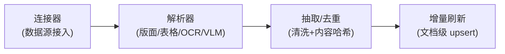
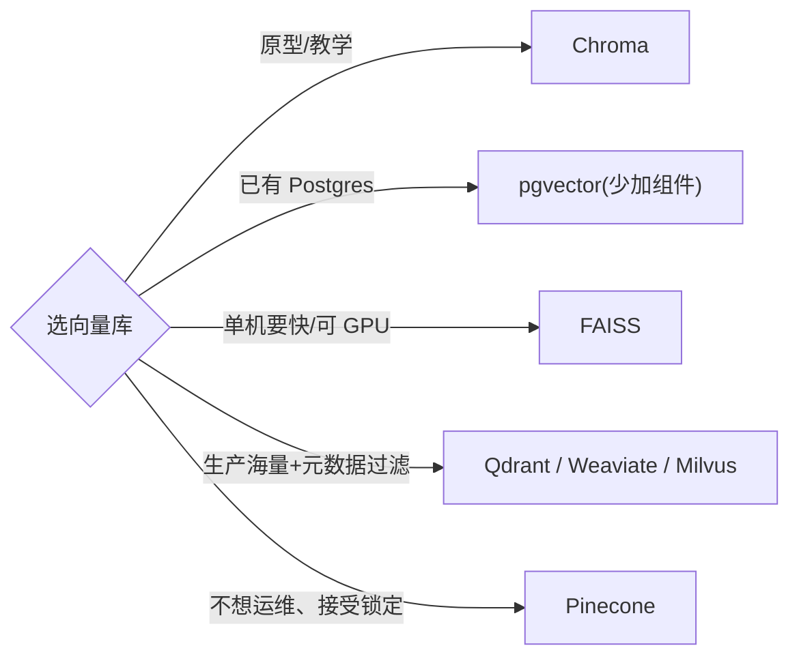
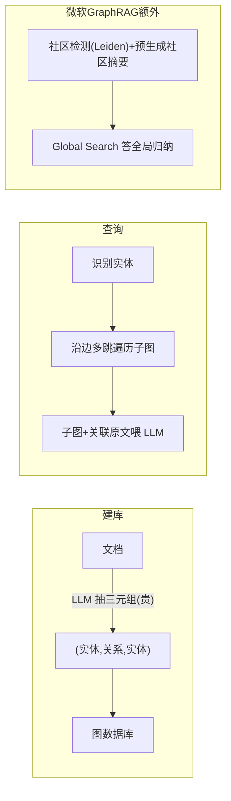
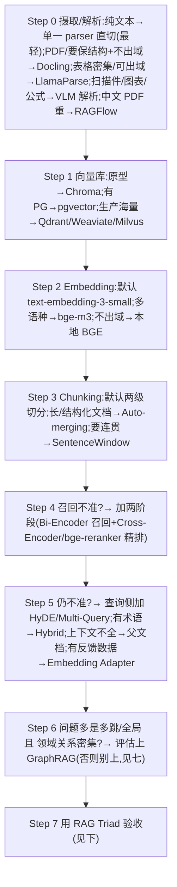

# 检索栈选型方案对比(向量库 / Embedding / Chunking / Retriever / Reranker)

> **用途**:为 RAG / 知识检索类 Agent 选整条检索栈的各个环节。
> **适用**:Spec-Kit `/plan`;或由 `stack-selector` skill 路由进来。
> **最后核对:2026-06**。结论分级 ✅稳定 / ⚠️快照 / ❓待验证。
> **边界**:本包是「**知识检索**」(检索文档喂给 LLM);`agent/skills/agent-selection/4-tools.md` 是「**工具检索**」(在 100+ 工具里选对工具)——两层不同,别混。

---

## 一、何时需要这层选型

- 业务是"问知识库/文档"(RAG-first),检索质量决定成败。
- 朴素 RAG 召回不准、答非所问、或 LLM 拿自有知识硬答。
- 数据规模/更新频率/语言变化,需要重选向量库或 embedding。

> 👉 **核心问题:"Similarity ≠ Relevance"**(课程 06)。通用 embedding 缺任务感知;三类修法分别作用于不同阶段——**检索前**(Query Expansion)、**检索后**(Cross-Encoder 重排)、**嵌入空间**(Embedding Adapter)。

检索栈有 7 个**子决策**:**子决策 0 数据摄取/解析**(最上游、最大质量风险,见下)+ 向量库 / embedding / chunking / retriever 架构 / 进阶方法 / 是否上 GraphRAG,外加一张「RAG 框架地图」,逐节给方案。

---

## 子决策 0:数据摄取 / 解析(检索质量的真正瓶颈)

> **触发**:RAG 召回不准、且数据里有 PDF/Word/扫描件/表格/图表时——先查这层。多数"检索差"其实是"**摄取差**":解析丢了表格/版面,后面再强的 embedding/reranker 也救不回。
> **为什么单列**:本文件 §八 已点破"生产里 RAG 质量瓶颈几乎都在**解析/切分/检索+重排/评估**",却一直没给摄取的决策页——本节补上。摄取是**最上游、最大的质量风险**,排在所有零件之前。

**摄取四步管线**(任一步偷工,下游全栈受拖累):



**🧩 选型轴(看四点)**

- **文档形态**:纯文本/HTML → 通用 parser 即可;**扫描件/图表/公式/表格密集** → 版面感知或 VLM 解析(决定性变量)。
- **是否出域**:不出域 → Docling/unstructured 本地;可出域 → LlamaParse 等托管高精。
- **版面复杂度**:多栏/嵌套表格/跨页表 → 普通 OCR 会乱序,要版面感知解析。
- **成本**:VLM 逐页解析最贵最慢,按量评估,别全量上。

**📑 解析器候选(现查,工具迭代快)**

| 方案 | 原理/特点 | 取舍 | 适合场景 |
|---|---|---|---|
| **单一通用 parser 直切**(unstructured / 框架内置 loader)⭐ | 一个库把 PDF/Word/HTML 统一转元素再切 | 起步零成本;扫描件/复杂表格会丢结构 | **最轻起步**、纯文本为主 |
| **版面感知解析**(Docling) | 开源,保留标题/表格/阅读顺序,出结构化 md/JSON | 本地可控、表格/版面强;极端排版仍有限 | 报告/手册/PDF,要保结构且不出域 |
| **托管高精解析**(LlamaParse) | API,复杂表格/版面/多语种精度高,接 LlamaIndex | 按页计费、数据出域 | 表格密集、版面复杂、不想自己调 |
| **深度解析平台**(RAGFlow) | 模板化解析 + OCR,中文/PDF 强,端到端 RAG | 偏平台、较重 | 中文/PDF 重场景、想端到端(亦见 §八) |
| **VLM 解析**(视觉模型读整页) | 把页面当图像,让 VLM 直接输出文字+结构 | 最贵最慢;但扫描/图表/手写最稳 | 扫描 PDF、图表/公式密集、传统 OCR 失败 |

> 🖼 **多模态 = 摄取 × 模型 联合决策**(不再只是模型层一个"可选维度"):文档含扫描页/图表/公式时,先在**摄取层**决定走 OCR/版面解析还是直接交 VLM 解析——这一步同时决定下游**要不要多模态主模型**(见 `agent/skills/agent-selection/1-model.md` 多模态维度)。两层一起定,别只在模型层勾一下"多模态"。

> 🔁 **增量刷新**:**最轻 = 全量重建索引**(数据小/低频,直接重跑);量大或频更再升级 → **文档级 upsert**(按 source id)+ **内容哈希去重**(跳过未变文档)+ **删除传播**(源删了要清掉对应向量)。注意:换 parser 或 embedding 都要**重建索引**,属高成本变更,早定(呼应 §三)。

> 👉 **最轻方案起步**:别一上来搭"分类型路由 + VLM"的重摄取栈。先用**单一 parser 直切**(unstructured 或框架自带 loader)跑通,用 RAG Triad(§十)看 **Context Relevance**;等"表格读错 / 扫描件读空 / 图表丢失"真的成为失败主因,再按文档形态升级到 Docling / LlamaParse / VLM 解析。

回溯:本文件 §八(框架地图·反直觉提醒)、§三(embedding 换则重建);相关层 `agent/skills/agent-selection/2-framework/`(RAGFlow/LlamaIndex 作为框架在那边)、`agent/skills/agent-selection/1-model.md`(多模态主模型)、`agent/skills/agent-selection/8-cost-economics.md`(VLM 逐页解析的成本账,定"全量上 vs 按需上")。

---

## 二、子决策 1:向量数据库

| 向量库 | 形态 | 规模 | 部署 | 适合 |
|---|---|---|---|---|
| **Chroma** ⭐ | 轻量/内存 | 小-中 | 零依赖 | 原型、教学、单机小项目 |
| **FAISS** | 库(非服务) | 中 | 单机/可 GPU | 单机高性能、自己管持久化 |
| **pgvector** ⭐ | Postgres 扩展 | 中 | 已有 PG 时 | 已用 Postgres、想少加组件 |
| **Qdrant / Weaviate / Milvus** | 分布式服务 | 大 | 独立服务/集群 | 生产、海量、需过滤+水平扩展 |
| **Pinecone** | 托管 SaaS | 大 | 全托管 | 不想运维、快速上生产(锁定+成本) |


回溯:`courses/04`、`courses/专业名词解释/向量数据库-FAISS与Milvus.md`。

## 三、子决策 2:Embedding 模型

| 模型 | 类型 | 特点 | 适合 |
|---|---|---|---|
| **— 2026 头部(现查 MTEB)—** | | | |
| Gemini Embedding 001 | API | 英文/综合榜领先 | 质量优先(英文为主) |
| Qwen3-Embedding | 本地/API | 开源多语种领跑 | 多语种、想自托管求最优 |
| Cohere embed-v4 | API | 多语种、长文档/多模态强 | 多语种商用 |
| Voyage-3.x / Jina v4 | API/本地 | 主流备选,各有所长 | 横向对比备选 |
| **— 够用基线 —** | | | |
| OpenAI `text-embedding-3-small` ⭐ | API | 便宜、够用 | 便宜默认起步 |
| OpenAI `text-embedding-3-large` | API | 稳定但已非最优 | 够用基线 |
| BGE `bge-small/large-en-v1.5` | 本地 | 开源、可自托管 | 数据不出域、控成本 |
| BGE `bge-m3` ⭐ | 本地 | 跨语言、多粒度 | 多语种基线 |

> 选 embedding 看:**语言**(多语种→Qwen3-Embedding/bge-m3)、**是否出域**(不出域→本地 BGE/Qwen3)、**成本**(高频→小模型或本地)、**榜单时效**(头部每季度翻盘,定型号前**现查 MTEB**、别认死分数)。换 embedding 必须**重建索引**——属高成本变更,早定。
回溯:`courses/04/notes/04-vectorstores-and-embeddings.md`、`courses/专业名词解释/向量相似度与归一化.md`。

## 四、子决策 3:Chunking 策略

| 策略 | 做法 | 适合 |
|---|---|---|
| **两级切分** ⭐ | `RecursiveCharacterTextSplitter`(语义边界)+ token splitter(`tokens_per_chunk≈256` 兜底) | 通用默认 |
| **SentenceWindow** | 按句嵌入,合成时带前后窗口(`MetadataReplacementPostProcessor`) | 嵌入精度与上下文连贯解耦 |
| **Auto-merging 层级** | 父子分块,命中子块自动合并父块 | 长文档、结构化文档 |
| **Contextual Retrieval**(2026) | Anthropic 方案:embed 前让 LLM 给每个 chunk 拼上整文上下文再嵌入 | 块脱离原文易歧义、要补全局语境 |
| **Late Chunking**(2026) | 先用长上下文模型整文 embed,再切块池化——保留跨 chunk 上下文 | 长文档、跨块指代/共指多 |

> chunking 常被低估:**先按语义边界切,再用 token 上限兜底**;SentenceWindow 把"嵌入粒度"和"喂给 LLM 的粒度"分开。
回溯:`courses/05`、`courses/18`。

## 五、子决策 4:Retriever 架构(三层谱)

| 架构 | 原理 | 速度 | 精度 | 用在哪 |
|---|---|---|---|---|
| **Bi-Encoder**(双塔)⭐ | 查询/文档各自编码,可离线建索引 | 快 | 中 | 召回/粗排(Stage 1) |
| **Cross-Encoder** | 查询+文档拼接进 attention,逐对打分 | 慢 | 高 | 精排/重排(Stage 2) |
| **ColBERT** | token 级向量 + late-interaction(MaxSim) | 中 | 高 | 精度与可索引折中(存储贵) |

> **生产标准 = 两阶段**:Bi-Encoder 宽召回(top 50-200)→ Cross-Encoder 精排(top 8-12)。
回溯:`courses/专业名词解释/检索器架构-BiEncoder-CrossEncoder-ColBERT.md`、`courses/06`。

## 六、子决策 5:进阶检索方法(按"作用阶段"分层)

朴素「Bi-Encoder 召回」不准时,修法按**作用在管线哪个阶段**分四类——对症下药,别一上来堆全部:

| 阶段 | 方法 | 作用 | 何时加 |
|---|---|---|---|
| **① 改查询(检索前)** | **HyDE** | 先让 LLM 生成"假想答案",用它的向量去检索(答案比问题更像文档) | 查询与文档措辞差距大 |
| | **Multi-Query / Query Expansion** | LLM 把一个查询改写成多条,并集召回 | 查询太短/口语化/多义 |
| **② 改索引结构** | **父文档检索(Parent-Document / Small-to-Big)** | 用小块做嵌入命中,返回时换成其所在大块/父文档喂 LLM | 嵌入要精、上下文要全,二者解耦 |
| | **Auto-merging 层级** | 父子分块,命中多个子块自动合并回父块(见四) | 长/结构化文档 |
| | **知识图谱增强(GraphRAG)** | 把文档抽成实体-关系图,沿关系多跳检索(见七) | 多跳推理/全局归纳 |
| **③ 改检索后(精排)** | **Reranker** ⭐(开源默认 `bge-reranker-v2-m3`;API:Cohere Rerank 3.5 / Voyage rerank-2.5;另开源 Qwen3-Reranker) | Cross-Encoder 两阶段精排 | 召回有了但 top 不准 |
| **④ 混合召回** | **Hybrid(BM25 + 向量)** | 关键词+语义并用,RRF 融合 | 有专有名词/术语精确匹配 |
| **⑤ 改嵌入空间** | **Embedding Adapter** | 嵌入后线性变换到任务空间(±1 标注,MSE) | 有反馈数据、想低成本提质 |

> 加法优先级(性价比从高到低):**Hybrid / Reranker → HyDE / Multi-Query → 父文档 → Embedding Adapter → GraphRAG**。GraphRAG 最重,放最后(单独见七)。
回溯:`courses/06`、`courses/18`。

---

## 七、子决策 6:知识图谱增强检索(GraphRAG)——重武器,单列

普通 RAG 检索**孤立文本块**(靠相似度);GraphRAG 先把文档抽成**实体-关系图**,检索时沿关系链路多跳遍历,专治向量 RAG 的两个死角:**多跳推理**(答案分散在多个块需串联)和**全局归纳**("这份报告主题有哪些"答案不在任一块里)。



**框架选型(按用途三选一)**:

| 用途 | 选择 |
|---|---|
| 学原理 / 验证 | **nano-graphrag**(读源码)、**LightRAG**(跑 demo,低成本/可增量) |
| 已有 RAG 栈加图能力 | **LlamaIndex `PropertyGraphIndex`**(最不破坏现有结构) |
| 上生产、要稳定存储 | **Neo4j + `neo4j-graphrag`**(生态/人才最成熟) |
| 做有记忆的 Agent | **Graphiti**(时序知识图谱,非纯文档问答) |

> ⚠️ **取舍**:建图烧大量 token、查询延迟高、增量更新难。**只在"领域关系密集(医疗/金融/法律)+ 问题多是多跳/全局 + 数据稳定"时才值得**;简单 FAQ/单点事实/数据频变 → 向量 RAG + reranker 性价比高得多。选框架的真实分水岭是"**建图多贵、能否增量更新**",不是检索算法。
回溯:`courses/专业名词解释/知识图谱增强检索-GraphRAG.md`。

---

## 八、RAG 框架地图(组装层)——别和编排框架层混

上面是检索栈的**零件**;把零件组装起来的**框架**按抽象层分三档。注意:通用编排框架(LangGraph/Haystack 等)的选型在 `agent/skills/agent-selection/2-framework/`,这里只给 RAG 视角的速查:

| 档位 | 代表 | 何时用 |
|---|---|---|
| **RAG 专精框架** | **LlamaIndex**⭐(数据接入+检索最专)、**Haystack**(生产 pipeline)、**RAGFlow**(深度文档解析,中文/PDF强)、**txtai**(轻量) | 要灵活又少造轮子,核心是 RAG |
| **通用编排(含 RAG)** | **LangChain/LangGraph**(生态最大,RAG 只是一环)、**DSPy**(编译优化 pipeline) | RAG 是大 Agent 系统的一环 |
| **低代码平台** | **Dify**⭐、**FastGPT / AnythingLLM**(自带界面知识库)、**Flowise** | 快速验证/交付,几乎不写代码 |

> **反直觉提醒**:框架降低起步成本,但生产里 RAG 的质量瓶颈几乎都在**解析/切分/检索+重排/评估**——这些恰恰是框架帮不上、要自己打磨的环节。所以**框架选型权重往往低于预期**;成熟团队常最终走"裸向量库 + reranker + 自写 retrieval"以摆脱抽象束缚。
回溯:`courses/RAG/RAG.md`、`agent/skills/agent-selection/2-framework/03-framework-profiles.md`。

---

## 九、组合决策树(整条栈)



---

## 十、验收指标:RAG Triad(课程 05)

| 指标 | 查什么 | 失败信号 |
|---|---|---|
| **Context Relevance** | 检索到的是否相关 | 低 → 检索环节出问题 |
| **Groundedness** | 答案是否基于检索内容 | 低 → LLM 在用自有知识硬答 |
| **Answer Relevance** | 答案是否回应问题 | 低 → 端到端跑偏 |

> 选型不是拍脑袋:每改一个环节,用 Triad 跑一遍看哪个指标动了。详见 `agent/skills/agent-selection/5-observability-eval.md`。

---

## 十一、场景推荐

| 场景 | 推荐栈 |
|---|---|
| 原型/demo | Chroma + 3-small + 两级切分 |
| 已有 Postgres 的生产 | pgvector + 3-small/large + 两阶段重排 |
| 多语种知识库 | Qdrant + bge-m3 + Hybrid + reranker |
| 数据不能出域 | 本地 BGE + FAISS/Qdrant 自托管 |
| 长文档/合同/手册 | Auto-merging + SentenceWindow + 父文档 + reranker |
| 多跳/全局归纳(关系密集领域) | GraphRAG(Neo4j+neo4j-graphrag / LightRAG)+ 向量 RAG 兜底 |

---

## 十二、接入 Spec-Kit(可复制 prompt 块)

```
请用 agent/skills/agent-selection/3-retrieval.md 为本 RAG feature 选检索栈。
- 数据:规模 <…> / 文档形态(纯文本/扫描件/表格/图表)<…> / 结构 <…> / 更新频率 <…> / 语言 <…>
- 约束:是否出域 <…> / 延迟 <…> / 已有基础设施(有无 Postgres 等)<…>
请逐子决策给方案(数据摄取·解析/向量库/embedding/chunking/retriever架构/进阶方法/是否上GraphRAG/RAG框架),
每项:推荐 + 备选 + 理由 + 代价,并给出用 RAG Triad 验收的方式。
```

---

## 十三、课程回溯 + 相关资产

- 回溯:`courses/04`、`courses/05`、`courses/06`、`courses/18`、`courses/RAG/RAG.md`、`courses/专业名词解释/{向量数据库-FAISS与Milvus, 检索器架构-BiEncoder-CrossEncoder-ColBERT, 向量相似度与归一化, 知识图谱增强检索-GraphRAG}.md`。
- 相关层:`agent/skills/agent-selection/2-framework/`(LlamaIndex/Haystack 作为编排框架在那边)、`agent/skills/agent-selection/5-observability-eval.md`(RAG Triad 评估)、`agent/skills/agent-selection/4-tools.md`(工具检索,不同层)。
- 总览:`agent/skills/agent-selection/README.md`。沉淀:`agent/skills/sdd/adr-writer`。

> **最后核对:2026-06**
