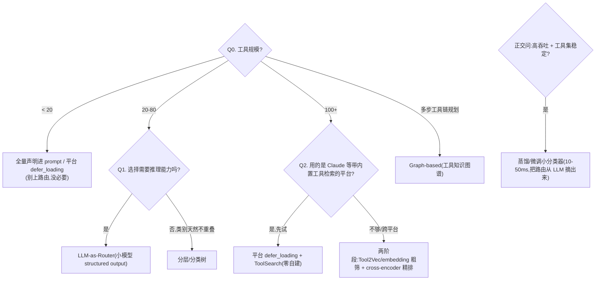

# 工具层选型(100+ 工具规模下的工具路由/检索)

> **用途**:工具**已经接进来之后**,规模到 100+ 时"怎么选对"(路由/检索方案选型)。
> **适用**:Spec-Kit `/plan` 阶段工具规模大时;或由 `stack-selector` skill 路由进来。
> **最后核对:2026-06**。结论分级:路由分层方法 ✅稳定 / 具体模型名·数字 ⚠️快照(现查)。
> **层定位与边界(两条别混)**:
> ① 工具"从哪来、怎么标准化接入"是**协议层(MCP)**的事,与本篇正交——见 [`2-framework/06-protocols.md`](2-framework/06-protocols.md);
> ② "检索文档"是检索栈层(`3-retrieval.md`),本篇是"**检索工具**"——语料是工具描述而非知识文档,两者技术同源但选型判据不同(工具描述短、结构化、语义重叠大)。

---

## 一、前提:MCP 接入(与本篇正交)

⛓️ 接入用 MCP:选定框架后用 MCP Server 暴露工具,换框架时工具不重写。画像见 [`2-framework/03-framework-profiles.md` §11](2-framework/03-framework-profiles.md)。

👉 完整链路:**MCP 接入工具** →(规模大时)**本篇做路由** → LLM 最终选择。

---

## 二、方案一览(7 方案)

| 方案 | 原理 | 延迟 | 准确率 | 实现成本 | 适合场景 |
|---|---|---|---|---|---|
| **Embedding 检索** | 向量相似度 top-K | ~5ms | 中 | 2-3 天 | 第一阶段粗筛 |
| **Tool2Vec** ⭐ | 为每个工具生成合成查询再 embed | ~5ms | 中高 | 1-2 周 | 粗筛(比纯 embedding 好,最高 +27.3% Recall@K(ToolBench)/+30.5%(ToolBank)) |
| **Embedding + Reranker** ⭐⭐ | 两阶段:embedding 粗筛 → cross-encoder 精排 | ~50-100ms | 高 | 2-3 周 | 100+ 工具、语义相近工具多 |
| **LLM-as-Router** | 小模型 structured output 选工具 | 200-800ms | 高 | 2-3 天 | 40-80 工具,需推理能力 |
| **Fine-tuned 小模型** | 蒸馏/微调 7B 或 DeBERTa 分类器 | 10-50ms | 很高 | 3-6 周 | 高吞吐、工具集稳定 |
| **分层/分类树** | 先选类别再选工具 | ~10ms | 中 | 1-2 天 | 类别不重叠的场景 |
| **Graph-based** | 工具知识图谱 + 图遍历 | 50-200ms | 高 | 3-6 周 | 多步工具链规划 |

---

## 三、逐个深挖

### 1. Embedding 检索(Tool RAG 基础版)

把工具描述 embed 成向量,查询时 cosine 相似度取 top-K。

- **关键发现**(ACL 2025 ToolRet 论文):通用 embedding 模型在工具检索上表现显著差于文档检索,因为工具描述短、结构化、语义重叠大。
- 推荐模型:BGE-M3 或 Qwen3-Embedding(天然支持中英跨语言)。
- 缺点:纯 embedding 无法区分 "token-price" 和 "token-kline" 这种高度重叠的工具。

### 2. Tool2Vec(Embedding 增强版)⭐

不 embed 工具描述本身,而是为每个工具**生成合成查询**("什么问题会用到这个工具?"),然后 embed 这些合成查询取平均。

- 效果:比纯描述 embedding 最高 +27.3% Recall@K(ToolBench)/ +30.5%(论文自建 ToolBank)。
- 原理:捕获"什么问题能用这个工具"而非"工具描述说了什么"。
- 论文:arXiv:2409.02141。

### 3. Embedding + Cross-Encoder Reranker(两阶段)⭐⭐

```
查询 → Stage 1: Embedding 取 top 20-30 → Stage 2: Cross-encoder 精排 top 8-12
```

- **为什么比纯 embedding 好**:cross-encoder 同时看到查询和所有候选工具,能理解工具间的区别("这个查询是衍生品,不是 K 线")。
- 推荐 reranker:BGE-reranker-v2-m3(中英跨语言)。
- 业界原型:Red Hat Emerging Tech 研究原型(2025-12,基于 MCP proxy 适配 ToolBench,博客自述 still in development、非受支持产品):Tool2Vec + DeBERTa 分类器并行作为 Stage 1,ToolRefiner 作为 Stage 2。论文:arXiv:2409.02141(ToolRefiner)。

### 4. LLM-as-Router

用小模型(Haiku / GPT-4o-mini 档)+ structured output 直接选工具。LangChain 已有 `LLMToolSelectorMiddleware`。

- 优点:能推理,能理解"Uniswap 基本面"不需要 crypto-market-rank。
- 缺点:100+ 工具描述(约 8-10K tokens)虽塞得进 200K+ 窗口,但真正代价是 **token 浪费、注意力稀释、选择准确率下降、破坏 prompt cache**——需要先粗筛(参见 §3.6 defer_loading 的数据)。

### 5. Fine-tuned 小模型

在领域数据上微调:

- **Gorilla**(NeurIPS 2024,arXiv:2305.15334):微调 LLaMA-7B,API 调用准确率超 GPT-4 20%。
- **NexusRaven-V2**(13B):开源 function-calling 模型,超 GPT-4 7%。
- 轻量路线:用 Claude 生成训练数据 → 蒸馏到 DeBERTa 多标签分类器,推理 10-50ms。

### 6. 平台内置:Anthropic Tool Search Tool

把工具标记为 `defer_loading`,Claude 内置 ToolSearch 按需加载——不用自建路由 pipeline 就能拿到大头收益:省 ~85% token,把 Opus 工具选择准确率 49%→74%(Anthropic 官方数据,⚠️快照现查)。Claude 栈上这是**最轻起步的首选**。

---

## 四、快速决策树



---

## 五、场景推荐

| 场景 | 推荐方案 |
|---|---|
| 工具 < 20 的常规 Agent | 全量声明 / defer_loading,不做路由 |
| 40-80 工具、查询需要推理 | LLM-as-Router(+ 必要时前置粗筛) |
| 100+ 工具(示例:约 200 个金融数据工具,中文查询、英文工具描述、枚举展开) | 三阶段 pipeline(见下) |
| 多步工具链(先查 A 才能调 B) | Graph-based 图遍历 |
| 高吞吐生产、工具集月级才变 | 蒸馏 DeBERTa 分类器 |

**100+ 规模的参考架构:三阶段 Pipeline**

```
用户查询(中文/英文)
        │
  [Stage 1] Tool2Vec + FAISS        ~5ms
  合成查询 embedding,BGE-M3 跨语言 → top 20-30 候选
        │
  [Stage 2] Cross-Encoder Rerank    ~50-100ms
  BGE-reranker-v2-m3 精排 → top 8-12 工具
        │
  [Stage 3] LLM 最终选择
  主模型结构化输出选 3-5 个工具 + 参数
```

核心收益:Stage 1 解决"关键词匹配漏召回"(不需要维护 synonym 表),Stage 2 解决"语义相近工具区分"(token-price vs token-kline),Stage 3 保留 LLM 推理能力。

实施节奏参考:第 1 周 Tool2Vec embedding 生成 + FAISS 索引;第 2 周 cross-encoder reranker 集成;第 3 周用 benchmark 对比评测。

---

## 六、最轻起步 → 升级路径


> ⚠️ **别一上来自建三阶段 pipeline**:工具少时路由是负资产(多一层延迟和维护);Claude 栈先试 defer_loading,拿完平台内置的 85% token 收益再考虑自建。**升级要有"选择错误率/token 成本已到阈值"的证据**。

---

## 七、接入 Spec-Kit(可复制 prompt 块)

```
请用 agent/skills/agent-selection/4-tools.md 为本 Agent 选工具路由方案。
- 工具规模:<当前数量;预期增速>
- 查询语言 × 工具描述语言:<中/英/混合>
- 语义重叠度:<有没有 "token-price vs token-kline" 这类高度相近的工具>
- 是否多步工具链(先 A 后 B):<…>  吞吐/延迟要求:<…>  所在平台:<Claude/OpenAI/自托管…>
请给:① 推荐方案 + 备选 + 理由 + 代价(默认最轻起步:全量声明/defer_loading);
② 升级触发条件(什么证据出现才上路由 pipeline);③ 具体模型名/数字现查,别写死过期快照。
```

定下后接力:工具接入标准化 → [`2-framework/06-protocols.md`](2-framework/06-protocols.md)(MCP);动作范式与工具的关系(CodeAct 弱化路由)→ [`0-action-paradigm.md`](0-action-paradigm.md) §五。

---

## 八、课程回溯 + 相关资产

- 回溯:`courses/09`、`courses/10`(function calling / 工具使用);`courses/08-Agentic AI（Andrew Ng）/3-Tool use/notes/`。
- 相邻层:[`0-action-paradigm.md`](0-action-paradigm.md)(动作范式,CodeAct 档用 `import` 缓解工具爆炸、弱化路由)、[`2-framework/06-protocols.md`](2-framework/06-protocols.md)(MCP 接入,与本篇正交)、[`3-retrieval.md`](3-retrieval.md)(检索文档 vs 检索工具的分界)、[`1-model.md`](1-model.md)(Router 用什么档位模型)。
- 总览:[`README.md`](README.md)。沉淀:`agent/skills/sdd/adr-writer`。

> **最后核对:2026-06**
