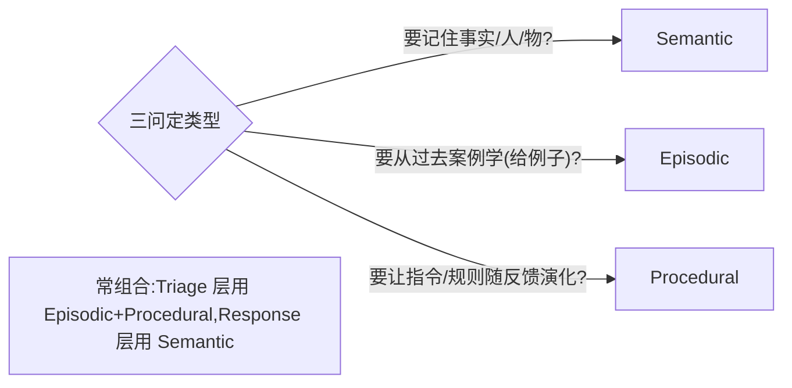
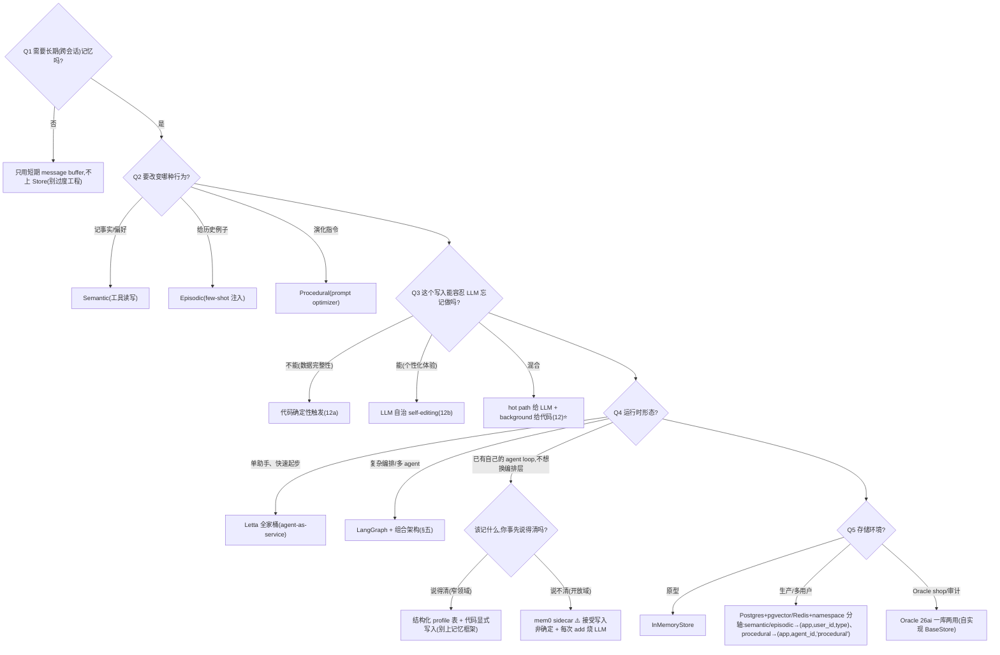

# 记忆方案选型方案对比(记忆类型 / 更新模式 / 控制权 / 存储)

> **用途**:为 Agent 选记忆方案——记什么、谁触发写、存哪里、何时更新。
> **适用**:Spec-Kit `/plan`;或由 `stack-selector` skill 路由进来。
> **最后核对:2026-07**。结论分级 ✅稳定 / ⚠️快照 / ❓待验证。
> **层定位**:记忆是「能力层」,常依附于编排框架(LangGraph 内建 Store/Checkpointer 最成熟);但存储可下沉到独立数据库(Oracle 26ai 派),上下文管理可借 Letta 模式,整层也可外挂成不绑编排框架的独立服务(mem0 派)。四派关系见 §四/§五。

---

## 一、何时需要这层选型

- Agent 要跨轮/跨会话记住用户、事实、偏好。
- 想让 Agent 从历史案例学习,或让其指令随反馈演化。
- 多用户/多租户,记忆要隔离。

> 👉 **核心原则:记忆是行为设计,不是存储设计。**(课程 12)三种记忆都可放同一个 Store(靠 namespace 隔离),区别在于**它们如何改变 Agent 行为**。先问"要改哪种行为",再选类型。

> ⚠️ 先分清**短期 vs 长期**:短期 = 单次对话的 message buffer(会话内);长期 = 跨会话的 Store(本包重点)。

---

## 二、子决策 1:记忆类型(先定这个)

| 类型 | 记什么 | 怎么改变行为 | 更新模式 | 存储 |
|---|---|---|---|---|
| **Semantic** 语义 ⭐ | 事实/知识("Jim 是我朋友") | Agent 主动调工具读写,影响工具使用 | 增删改(矛盾事实主动删)· Hot Path | 向量索引 Store |
| **Episodic** 情景 | 过往案例(输入+期望输出) | few-shot 注入,让 agent 模仿历史决策 | 纯追加(发生过不改)· Background | Store 里的 examples namespace |
| **Procedural** 程序 | 规则/指令(系统 prompt 本身) | 重写 prompt,让 agent 行为演化 | 整体重写 + version bump · Background | Store 里的自然语言规则 |

> ⚠️ **「更新模式」列 = 写策略(怎么写),不含「读取期把记忆注入 context」**:读取注入属「怎么改变行为」列(Semantic 工具读 / Episodic few-shot 注入),别混进"更新写入"。

**三问定类型:**


## 三、子决策 2:更新模式

| 模式 | 时机 | 优点 | 代价 |
|---|---|---|---|
| **Hot Path** ⭐ | 即时(主循环里读写) | 立刻生效 | 增加 Agent 响应延迟 |
| **Background** | 异步 | 主路径干净、快 | 反馈延迟(下次才生效) |

> 这是**延迟 vs 复杂度**的取舍:即时更新拖慢响应;后台异步保持主 agent 轻快但反馈滞后。

## 四、子决策 3:控制权(谁触发记忆写入)——四派光谱

同一个记忆问题,几条路线给出不同立场,本质是**对"LLM 可靠性"的信任程度不同**:

| 路线 | 代表 | 立场 | 记忆架构特征 | 适合 |
|---|---|---|---|---|
| **工程确定性** | Oracle 26ai(课程 12a) | 代码触发:80% 阈值压实、收尾必写回,**不指望 LLM 自觉** | 记忆=一等基础设施;SQL 管对话/日志(精确/时序/审计),向量管知识/实体/工具箱;归档回填可恢复 | 数据完整性/合规审计敏感 |
| **混合** ⭐ | LangGraph/LangMem(课程 12) | hot path 交 LLM(工具读写),background 交代码(优化器) | Store+namespace;三类记忆行为设计 | 大多数生产场景 |
| **LLM 自治** | Letta/MemGPT(课程 12b) | agent self-editing 自管上下文("LLM 是 OS",heartbeat 自控循环) | Core Memory Blocks(label/limit/配额可见)+ 递归摘要 + Recall/Archival 换页 + 外部记忆统计 | 个性化助手类;错了不致命的体验型记忆 |
| **服务化/自动抽取** ⚠️ | mem0(无课程背书,见 §十一) | **你确定性地调 `add(messages)`,但记什么由 LLM 流水线定**:抽取事实 → 检索相似旧记忆 → LLM 判 ADD/UPDATE/DELETE/NOOP | 记忆层从 agent 里剥出来做 sidecar,**不绑编排框架**;user_id/agent_id/run_id 三级 scope;向量库(默认 Qdrant)+ 可选图库 | 已有自己的 agent loop、不想被 LangGraph/Letta 绑架;开放域"事先不知道该记什么" |

> 👉 **一句话判据:这个写入能不能容忍 LLM 偶尔忘记做?** 不能容忍(数据完整性)→ 代码确定性;错了不致命(个性化体验)→ 自治;介于两者 → 混合。
> ⚠️ 前三派在**编排层互斥**:Letta 是完整 agent server(agent 本体活在它的 DB 里),不能和 LangGraph 同时当运行时。组合方式见 §五。mem0 不互斥——它是外挂层,可以贴在任意运行时旁边。

**⚠️ mem0 暴露了这根轴的一个盲点:「谁触发写」和「谁决定写什么内容」是两件事**,上表把它们压成了一维。拆开看更准:

| | 触发时机由谁定 | 写入内容由谁定 |
|---|---|---|
| Oracle 26ai(12a) | 代码(阈值/生命周期钩子) | 代码规则 + LLM 抽取 |
| LangMem(12) | hot path 给 LLM / background 给代码 | LLM |
| Letta(12b) | **LLM**(agent 自己决定何时调 `core_memory_replace`) | LLM |
| **mem0** | **代码**(你在应用里显式 `add()`) | **LLM**(两阶段抽取+消解流水线) |

> 这也是 mem0 的主要风险面:触发是确定的,但**"记成什么样"是一次非确定的 LLM 判断**——事实可能被静默改错/误删,而你的代码看不出来。选它就要接受"记忆写入不可复现"。

**记忆层产品:绑定关系对照**(选型时最容易被忽略的一栏是"绑不绑编排框架")

| 产品 | 绑编排框架吗 | 特色 | 主要代价 |
|---|---|---|---|
| **LangMem** | 绑 LangGraph(靠 `BaseStore`) | 三类记忆的行为设计最完整 | 出了 LangGraph 生态就得自己重写 |
| **Letta** | **它自己就是运行时** | 上下文管理模式最成熟(Blocks/换页/统计) | agent 本体活在它 DB 里,迁移成本高 |
| **mem0** ⚠️ | **不绑**(纯 sidecar) | 自动抽取+冲突消解,接入最快 | 每次 `add()` 烧 1–2 次 LLM 调用;写入非确定 |
| **Zep/Graphiti** | 不绑 | 唯一有**事实时效**(valid-at/invalid-at) | 建图开销;查询模型更复杂 |

## 五、组合参考架构:三派各取所长(骨架/地基/模式)

**不是三个产品堆叠**:LangGraph 做骨架(运行时),Oracle 做地基(存储),**Letta 只取模式不取产品**。

```
┌─ 行为设计层 ── 课程12"三问"(存什么、改变什么行为)
├─ 编排运行时 ── LangGraph(StateGraph + Checkpointer 短期记忆)
├─ 上下文装配 ── Letta 模式:Memory Blocks / 递归摘要 / 外部记忆统计 / self-editing 工具
├─ 写入决策层 ── 控制权分流(§四判据):确定性兜底 + LLM 自治 + 后台优化器
└─ 存储层    ── Oracle 26ai(或 Postgres+pgvector):SQL+向量一库两用,实现 BaseStore 接口
```

**三个胶水点:**

1. **存储接入**:LangGraph 的 `BaseStore` 是接口不是实现——用 Oracle/Postgres 实现 `put/get/search`,LangMem 工具零改动跑在其上;SQL 表管对话史/工具日志,向量管知识库/实体/工具箱。
2. **上下文装配抄 Letta 四个模式**(在 LangGraph 节点里自己实现,不引 Letta server):
   - **Memory Blocks**:system prompt 划带 `label`+`limit` 的保留区,渲染时带 `字符数/配额`(agent 看得见该腾位了);
   - **外部记忆统计**:上下文常驻"archival N 条、历史 M 轮"——**没有它 agent 不知道自己不知道**;
   - **递归摘要 + 永不删消息**:溢出消息进 DB(recall),窗口换摘要,配 `expand_summary`/`conversation_search` 拉回;
   - **self-editing 工具**:`core_memory_replace` 类工具即时纠错。
3. **写入分流**(按 §四判据):

| 记忆操作 | 触发方式 | 来源 |
|---|---|---|
| 用户偏好/事实即时读写 | LLM 调 LangMem 工具(hot path) | 课程 12 + 12b 自治 |
| 上下文超阈值压实、会话收尾写回 | 代码确定性触发,不商量 | 12a |
| Episodic 案例提取、Procedural prompt 改写 | 后台异步(LangMem optimizer) | 课程 12 |
| 核心记忆块纠错 | LLM self-editing | 12b |

> 原则:**个性化体验交给自治(错了不致命),数据完整性交给代码(不指望 LLM 自觉)。**

**⚠️ 什么时候不该组合(反过度工程):**
- 单个助手类 agent、无复杂多 agent 工作流 → **直接用 Letta 全家桶**(agent-as-service,上面第 2、3 点它都做好了,自己搭是重复造轮子)。
- **已经有自己的 agent loop(裸 SDK / 自研编排),只是缺一层跨会话记忆** → 挂个 **mem0 sidecar** 最省事:`add()`/`search()` 两个调用接进去,不用为了记忆把编排层换成 LangGraph 或 Letta。这是它相对前三派唯一的结构性优势。
- 没有企业库存量/审计需求 → Oracle 换 **Postgres+pgvector** 更务实;Oracle 26ai 的价值前提是"已是 Oracle shop + 合规审计"。
- 组合架构的适用前提 = 复杂编排(需要 LangGraph)+ 企业级存储/审计/多租户(独立 DB 有意义)。

**⚠️ 反过来,什么时候不该上 mem0:领域够窄的时候。** 只要"该记哪些字段"你事先说得清(用户偏好 5 个字段、账号状态 3 个字段),一张结构化 profile 表 + 代码显式写入几乎总是更优:确定、可复现、零 LLM 成本、好审计。**自动抽取的价值只在"开放域、事先不知道该记什么"时才兑现**——别为了"记忆层"这个名词付两次 LLM 调用。

**❓ 各派共同盲区:事实时效管理。** 12 靠优化器改 prompt、12a 靠提示词冲突优先级(当前问题>最新对话>知识库>旧摘要)、12b 只有即时 replace、**mem0 只有 UPDATE/DELETE 的"就地覆盖"——旧事实直接消失,不留时间轴,无法追溯"他当时在哪家公司"**——都没有系统性失效机制。若场景里"事实随时间失效且需追溯"(用户换公司、政策更新),补 **Zep/Graphiti temporal knowledge graph**(valid-at/invalid-at 边失效)。

## 六、子决策 4:存储后端

| 存储 | 适合 |
|---|---|
| `InMemoryStore` ⭐原型 | 原型/教学(零依赖) |
| Postgres(+pgvector)/ Redis ⭐生产默认 | 生产(持久化、可扩展、务实) |
| Oracle 26ai | 已是 Oracle shop;SQL+向量一库两用;审计/合规(归档回填、可恢复) |
| Letta server 内建 DB | 直接用 Letta 全家桶时(agent 本体持久在服务端,免手写 checkpoint) |
| mem0 托管版(Mem0 Platform) | 不想自己运维向量库;⚠️记忆数据出本地,合规敏感慎选 |

> ⚠️ **mem0 不是存储后端,是存储之上的一层**:它自己也要落到 Qdrant(默认)/Chroma/pgvector。所以"选 mem0"和"选 Postgres"不是同一个决策——你仍然要给它挑底座。

- **接口一致,迁移只换实例**:`InMemoryStore(index={"embed": "openai:text-embedding-3-small"})` → 生产换 Postgres/Redis/自实现 BaseStore(Oracle)。
- **SQL vs 向量分工**(12a):精确/结构化/时序检索(对话史、工具日志)用 SQL,模糊/语义检索(知识、实体、工具箱)用向量——**反对无脑全上向量库**。
- **多租户从第一天就上,但 namespace 主轴按记忆类型分**:semantic/episodic 是 per-user → `(app, user_id, type)`;**procedural 默认 per-agent → `(app, agent_id, 'procedural')`**——「怎么做」是 agent 的能力、不随用户走,仅当它编码用户专属偏好时才退化 per-user。这是一条取舍轴(与 `agent/interview/1.md` §4 对齐)。靠 `config` 注入 `langgraph_user_id` / `agent_id`。
- **lazy-init**:`store.get()` 返回 None → 首次会话播种默认值。

## 七、工具/API(LangGraph / LangMem)

- `create_manage_memory_tool` / `create_search_memory_tool`:把 Semantic 记忆暴露为 agent 可调工具。
- `create_multi_prompt_optimizer(..., kind="prompt_memory")`:吃轨迹+反馈,输出改写后的 prompt(Procedural)。
- 节点签名 `node(state, config, store)`:运行时经 `configurable` 注入用户身份。
- Letta 模式对应默认工具 6 件套(自实现时参照):`core_memory_append/replace`、`archival_memory_insert/search`、`conversation_search`、`send_message`。
- **mem0**(`pip install mem0ai`):面极小——`add(messages, user_id=…)` / `search(query, user_id=…)` / `get_all` / `update` / `delete`。scope 靠 `user_id`(跨会话用户记忆)、`agent_id`(agent 自身记忆)、`run_id`(单次会话);LLM/embedder/向量库都可换。图记忆变体存实体+关系(Neo4j/Kuzu),用于"谁和谁什么关系"类查询。

---

## 八、决策树



---

## 九、场景推荐

| 场景 | 推荐 |
|---|---|
| 个人助理记住用户偏好 | Semantic + Hot Path + 生产 Store |
| 客服 agent 学习优质对话案例 | Episodic + Background |
| Agent 行为随用户反馈自调 | Procedural + Background + prompt optimizer |
| 单 agent 助手、不想自建记忆栈 | 直接 Letta 全家桶(agent-as-service) |
| 复杂多 agent + 企业存储/审计 | §五组合架构(LangGraph 骨架 + Oracle/PG 地基 + Letta 模式) |
| **已有自研 agent loop,只缺跨会话记忆** | **mem0 sidecar**(不绑编排层,`add`/`search` 两个调用接进去)⚠️ |
| **该记什么字段事先说得清(窄领域)** | **结构化 profile 表 + 代码显式写入**——别上任何记忆框架(确定/可复现/零 LLM 成本) |
| 事实随时间失效且需追溯 | 四派均弱(mem0 只有 UPDATE/DELETE,无时间轴)→ 补 Zep/Graphiti temporal KG |
| 多租户 SaaS | 上述任意 + namespace 分轴隔离:semantic/episodic `(app,user_id,type)`、procedural `(app,agent_id,'procedural')` |
| 只是单次多轮对话 | 短期 buffer 即可,不上长期记忆 |

---

## 十、接入 Spec-Kit(可复制 prompt 块)

```
请用 agent/skills/agent-selection/6-memory.md 为本 Agent 选记忆方案。
- 要记住什么/改变什么行为:<事实? 案例? 指令演化?>
- 各写入操作能否容忍 LLM 忘记做:<数据完整性? 个性化体验?>
- 跨会话/多用户吗:<…>  延迟敏感吗:<…>  原型还是生产:<…>
- 运行时形态:<单助手(Letta 全家桶)? 复杂编排(LangGraph+组合架构)? 已有自研 loop(mem0 sidecar)?>
- 该记什么字段事先说得清吗:<说得清→profile 表; 说不清(开放域)→自动抽取>
请给:记忆类型(可组合)+ 更新模式(hot/background)+ 控制权分流(确定性/自治/混合/服务化抽取)+ 存储后端 + 多租户隔离方式,
每项:推荐 + 备选 + 理由 + 代价。
```

---

## 十一、课程回溯 + 相关资产

- 回溯:
  - 课程 12(LangGraph/LangMem,混合派):`courses/memory/12-Long-Term Agentic Memory With LangGraph/notes/00-总结回顾.md`(及 L2-L5 code)。
  - 课程 12a(Oracle 26ai,确定性派):`courses/memory/12a-Agent Memory Building Memory-Aware Agents/notes/`(L0-L6;五模式:Modeling→Retrieval→Extraction→Consolidation→Write-back;2×2 触发矩阵)。
  - 课程 12b(Letta/MemGPT,自治派):`courses/memory/12b-LLMs as Operating Systems Agent Memory/notes/`(L0-L7;L7 有 12a vs 12b 完整对比复盘)。
- ⚠️ **mem0 无课程背书、无本地复现**(2026-07 补入,依据是官方文档与其架构定位,非实测)。选它之前至少验两件事:(1) `add()` 的抽取/消解在你的领域上错得多不多——**造 10 条会互相矛盾的对话喂进去,看它 UPDATE/DELETE 判对几条**;(2) 每轮多出的 1–2 次 LLM 调用在你的延迟/成本预算内。它自称在 LOCOMO 上比 OpenAI Memory 准 26%、省 90% token——**自跑评测 + 单一长对话 benchmark,不足以当选型依据**。
- 相关层:`agent/skills/agent-selection/2-framework/`(LangGraph 的 Checkpointer/Store 是记忆基础设施)、`agent/skills/agent-selection/3-retrieval.md`(Semantic 记忆用向量检索;RAG ⊂ Agent Memory——RAG 只是"只读语义记忆"子集)。
- 总览:`agent/skills/agent-selection/README.md`。沉淀:`agent/skills/sdd/adr-writer`。

> **最后核对:2026-07**
