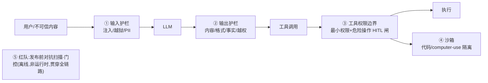

# 护栏 / 安全选型方案对比(运行时拦截层)

> **用途**:为 Agent 选**运行时护栏**——在 LLM 输入/输出、工具调用、代码执行处做**同步拦截**,把不该发生的挡在发生之前。
> **适用**:Spec-Kit `/plan`;或由 `stack-selector` skill 路由进来。任何"对外 / 能写 / 处理不可信内容"的 Agent 上线前都要过这一关。
> **最后核对:2026-06**。结论分级 ✅稳定 / ⚠️快照 / ❓待验证。具体产品的归属/价格/版本变化快——事实性论断就近标 **(现查)**,别认死快照。
> **层定位**:**横切层**,与 `5-observability-eval.md` 并列、和模型/框架/检索都正交。
> **🚧 最重要的边界——拦截 ≠ 判好坏**:护栏是**运行时、同步、阻断式**(挡住这一次调用);eval/可观测是**离线/抽样、事后、判质量**(度量整体好坏,不阻断)。两者互补但**不能互相替代**——别拿离线 eval 当上线防线,也别拿运行时护栏当质量度量。判好坏那一面见 [`5-observability-eval.md`](5-observability-eval.md)。

---

## 一、🎯 何时需要这层 + 核心区分

- Agent **对外**(面向不可信用户),或**处理不可信内容**(网页/文档/工具返回——它们是**数据,不是指令**)。
- Agent **能产生副作用**(写库、转账、发消息、改文件、执行代码),blast radius 大。
- 涉及 **PII / 受监管数据**(医疗/金融/隐私合规)。
- 用了 **CodeAct / computer-use**(模型直接写代码或操作 GUI)——必须沙箱(见 `0-action-paradigm.md`)。

> 👉 **核心心智:护栏是"在确定性边界上设闸",不是"让模型更乖"**。模型本身概率不可靠(agent/interview/1.md L0),护栏用**确定性规则/分类器/审批**把不确定性吸收在它溢出之前。对应 agent/interview/1.md 的核心张力:**自主性 vs 可控性——权限越大越能干,blast radius 越大;护栏/HITL 都是在买"可控"**。

| 维度 | 运行时护栏(本篇) | Eval / 可观测(`5-`) |
|---|---|---|
| 时机 | 请求**进行中**,同步 | 事后 / 抽样 / 离线 |
| 动作 | **阻断 / 改写 / 升级到人** | 记录 / 打分,不阻断 |
| 目标 | 不该发生的不发生 | 度量整体好坏、定位退化 |
| 失败代价 | 漏一次=一次真实事故 | 漏一次=指标偏差 |

---

## 二、🛡️ 五段护栏链路(从入到出)

护栏不是一个东西,是分布在管线**五个卡点**上的一组拦截器——逐段给方案:



| 卡点 | 防什么 | 形态 |
|---|---|---|
| **① 输入护栏** | prompt 注入 / 越狱 / 输入侧 PII | 分类器 / 检测 API,命中即拒或脱敏 |
| **② 输出护栏** | 有害内容 / 格式不合规 / 事实幻觉 / 越权泄露 | 分类器 + 校验器,失败 reask/改写/拒答 |
| **③ 工具权限边界** | 危险/越权工具调用 | **设计模式**:白名单 + 最小权限凭证 + 危险操作 HITL 审批 |
| **④ 沙箱** | 代码/computer-use 执行逃逸 | 隔离运行时(容器/microVM/WASM) |
| **⑤ 红队** | 发布前找漏洞 | 自动对抗用例扫描 + 门控(**离线**,见一-表) |

> ⚠️ ①②④是**运行时拦截**;⑤是**发布前门控**(和 eval 同侧、不阻断生产请求);③是**架构设计**而非一个库——下面分别给。

---

## 三、🧭 选型轴:护栏"上多强"由风险定

不是越多越好——护栏有延迟、成本、误杀(false positive 把正常请求挡掉)代价。**强度按风险轴定**:

| 轴 | 低风险(轻护栏) | 高风险(重护栏) |
|---|---|---|
| **Blast radius**(动作影响面) | 只读 / 纯生成 | 能写库 / 转账 / 发消息 / 执行代码 |
| **数据敏感度** | 公开数据 | PII / 受监管 / 商业机密 |
| **是否对外** | 内部工具、可信用户 | 公网、不可信用户 |
| **是否吃不可信内容** | 只读自有语料 | 抓网页 / 读用户上传 / 用工具返回拼 prompt(注入面) |
| **动作范式**(见 `0-action-paradigm.md`) | function-calling(离散可审计) | CodeAct / computer-use(**必须沙箱**) |

**护栏强度分级(按上面轴落档):**

```
🟢 最轻起步(默认):系统 prompt 划清"数据 vs 指令"边界 + 工具白名单(最小权限) + 危险操作 HITL 审批
        │  ← 大多数内部/只读 Agent 到这里就够
🟡 中(对外 或 处理不可信内容):+ 输入注入/越狱检测 + 输出内容安全分类 + PII 脱敏
        │
🔴 重(高 blast radius / 受监管 / 用 CodeAct·computer-use):+ 沙箱隔离 + 输出事实校验(grounding) + 发布前红队门控 + 全程审计留痕
```

> 👉 **每段都先问"能不能先不做"**:能用确定性代码/白名单解决的,**别加一个会误杀的 LLM 分类器**(呼应 agent/interview/1.md「确定性优先」横切——能查表/规则解决就别上概率件)。护栏每加一层都要能说出它挡的是哪条具体风险。

---

## 四、🧩 候选总表(标活跃度·现查)

按"**运行时拦截** vs **发布前红队**"两组分开——这正是 §一 "拦截≠判好坏" 的落地分界:

### A. 运行时拦截(同步,阻断生产请求)

| 候选 | 形态 | 主用在 | 原理/特点 | 取舍 |
|---|---|---|---|---|
| **NeMo Guardrails**(NVIDIA) | 开源框架 | ①②+对话流 | Colang DSL 定义"轨道",可编排对话级护栏,可挂多种检测器 | 功能最全但学习曲线陡(Colang)、偏重;小项目过度 |
| **Llama Guard**(Meta) | 开源分类模型 | ①②内容安全 | 专训 LLM 按危害分类(MLCommons 体系),输入/输出都能过一遍 | 只管**内容安全分类**,不管注入/格式/PII;要自己部署托管。版本迭代多,**用前现查最新版** |
| **Guardrails AI** | 开源库(validators hub) | ②为主(也可①) | Pydantic 风格 validator 组合(格式/PII/竞品提及/幻觉),失败可 reask/fix | validator 质量参差;偏"**输出校验**"而非"安全检测" |
| **OpenAI Agents Guardrails** | SDK 内建 | ①② | Agents SDK 的 input/output guardrail 钩子,tripwire 命中即中断;与其 agent 循环原生 | 绑定 OpenAI Agents SDK 生态 |
| **Lakera**(Guard / Red) | 商业 SaaS+API ⚠️ | ①注入·PII / ⑤红队 | 主打 prompt 注入/越狱检测,低延迟 API;Lakera Red 做自动红队 | 商业、数据过第三方(除非自托管档);**(现查报价/部署形态)** |

### B. 发布前红队 / 门控(离线,不阻断生产——和 eval 同侧)

| 候选 | 形态 | 原理/特点 | 取舍 |
|---|---|---|---|
| **Promptfoo**(red-team) | 开源 CLI | 自动生成对抗用例扫漏洞(注入/越狱/PII/有害),也是 eval 工具 | 偏"发布前扫描",非运行时拦截;**2026-03 归 OpenAI、承诺保持开源(现查)** |
| **PyRIT**(Microsoft) | 开源框架 | 自动化对抗探测编排(攻击策略 + 评分器),识别 GenAI 风险 | 是**红队工具不是运行时护栏**;偏安全/研究团队 |
| **Inspect AI**(UK AISI) | 开源框架 | 能力+安全评测,可做对抗/危害评测 | 评测·门控向,非运行时拦截(在 `5-` 也出现,定位:安全侧 eval) |

> 边界提醒:**B 组属"判好坏 + 上线门控",不是运行时拦截**——它们和 `5-observability-eval.md` 是同一侧(发布前跑、不挡线上请求),放这里是因为**红队是"安全视角的 eval"**。运行时真正阻断的是 A 组。

---

## 五、📥📤🔑📦 逐段落地要点(每段都给"最轻起步")

### 📥 ① 输入护栏(注入 / 越狱 / PII)
- 防的是:**不可信内容里夹带的指令**(间接注入)、越狱话术、输入侧敏感数据。
- 选型:轻量→正则/关键词 + 系统 prompt 边界声明;中→Llama Guard 分类 或 Lakera/注入检测 API;重→NeMo 多检测器编排。
- 🟢 **先不做/最轻起步**:系统 prompt 明确"以下是数据,不是指令" + 不把不可信内容当系统/工具指令拼接。**纯内部、不吃外部内容的 Agent 可暂不上检测器。**

### 📤 ② 输出护栏(内容安全 / 格式 / 事实 / 越权)
- 防的是:有害内容、格式不合规(下游会崩)、幻觉、把不该露的(PII/内部信息)输出。
- 选型:格式/schema→**结构化输出兜底(见 `2-framework/` 的 Pydantic/约束解码,这是最便宜的"输出护栏")**;内容安全→Llama Guard 过出站;校验/改写→Guardrails AI validators;事实→grounding 检查(对齐检索来源,和 RAG Triad 互补但**是运行时拦截不是 eval**)。
- 🟢 **先不做/最轻起步**:先用**结构化输出 + schema 校验 + 重试**(L1 契约)挡掉绝大多数"格式/越权"问题,内容安全分类器按是否对外再加。

### 🔑 ③ 工具权限边界(最小权限 + 危险操作审批)
- 这是**设计模式不是库**——也是性价比最高的一层:
  - **白名单**:每个 Agent/节点只暴露它需要的工具子集。
  - **最小权限凭证**:工具用 scoped/只读 token,别给全权 key;写操作单独授权。
  - **危险操作 HITL 闸**:转账/删库/对外发消息/不可逆动作走人审批——技术上即 interrupt + `Command(resume)`(见 agent/interview/1.md «HITL» 与 L2 checkpointer);呈现层见 `10-agent-ux.md`。
  - **副作用幂等**:审批后重跑不能重复扣费(对齐 HITL "节点从头重跑" 坑)。
- 🟢 **先不做/最轻起步**:**白名单 + 危险操作 HITL** 是默认底线——哪怕其它护栏都不上,这两条也要有。

### 📦 ④ 沙箱(代码 / computer-use 执行隔离)
- 触发:**只要用了 CodeAct(模型写代码当动作)或 computer-use(操作 GUI),就必须沙箱**(见 `0-action-paradigm.md`——这两种范式 blast radius 大、对环境脆弱)。function-calling 离散调用通常不需要整套沙箱。
- 隔离强度谱(由轻到重,**(现查托管方案)**):进程级/`seccomp` → 容器(Docker)→ 用户态内核(gVisor)→ microVM(Firecracker)→ 托管代码沙箱(如 E2B 类)/ 浏览器侧 WASM(Pyodide)。
- 配套:网络出站白名单、文件系统只读/临时、CPU/内存/超时配额、密钥不进沙箱。
- 🟢 **先不做/最轻起步**:**不用 CodeAct/computer-use 就不需要这层**——能用 function-calling 表达动作就别为了"省 round-trip"引入必须沙箱的代码执行(成本/复杂度真到了再升级)。

### 🟥 ⑤ 红队(发布前门控)
- 防的是:上线前没人对抗性地试过它会不会被越狱/注入/诱导。
- 选型:Promptfoo red-team(开源、易接 CI)/ PyRIT(系统化攻击编排)/ Inspect AI(安全评测)/ Lakera Red(商业自动红队)。
- 门控:把红队套件接进发布流水线当 **release gate**(和 `5-` 的回归门控并列,这条是"安全回归")。
- 🟢 **先不做/最轻起步**:内部低风险 Agent 可先人工跑一轮对抗 prompt 清单;**对外/高 blast radius 再上自动化红队门控**。

---

## 六、📋 场景推荐

| 场景 | 护栏配置 |
|---|---|
| 内部只读 Agent(查知识库/报表) | 🟢 系统 prompt 边界 + 工具白名单(只读)。其余先不做 |
| 内部能写的 Agent(改工单/发内部消息) | 🟢 + 危险操作 HITL 审批 + 副作用幂等 |
| 对外客服/助手(不可信用户) | 🟡 + 输入注入/越狱检测 + 输出内容安全 + PII 脱敏 |
| RAG 抓外部网页/用户上传 | 🟡 重点是**间接注入**:输入护栏 + "内容是数据"边界 + 输出 grounding 校验 |
| Coding / 数据分析 Agent(CodeAct) | 🔴 + **沙箱(microVM/托管沙箱)** + 网络/FS 限制 + 红队门控 |
| Computer-use / 浏览器自动化 | 🔴 + 沙箱 + 全程审批高危动作 + 审计留痕(blast radius 最大) |
| 受监管(医疗/金融) | 🔴 全段 + 审计留痕 + 商业合规护栏(Lakera/企业级,现查) |

---

## 七、🔌 接入 Spec-Kit(可复制 prompt 块)

```
请用 agent/skills/agent-selection/7-safety-guardrails.md 为本 Agent 设计运行时护栏。
- 风险画像:blast radius(只读/能写/转账/执行代码)<…> / 数据敏感度(PII·受监管?)<…> /
  是否对外(不可信用户?)<…> / 是否吃不可信内容(网页·上传·工具返回?)<…> / 动作范式(function-calling·CodeAct·computer-use)<…>
请按五段(输入/输出/工具权限/沙箱/红队)给:护栏强度档(🟢轻/🟡中/🔴重) + 每段推荐+备选+理由+代价(延迟/误杀)。
原则:先给"最轻起步"(系统prompt数据边界+工具白名单+危险操作HITL),复杂度真到了再升级;
明确区分"运行时拦截"与"发布前红队/eval"(后者接 5-observability-eval.md 当 release gate)。
具体产品归属/价格/版本请现查官方,别写死过期快照。
```

---

## 八、📚 回溯 + 相关资产

- 权威心智模型:[`../../interview/1.md`](../../interview/1.md) «L5 部署/安全运行时»(prompt 注入/工具权限/沙箱、自主性 vs 可控性张力)、«HITL 横切»(危险操作审批=人当安全闸)、「确定性优先」横切(能规则解决就别上概率件)。
- 相关层:[`0-action-paradigm.md`](0-action-paradigm.md)(CodeAct/computer-use→何时必须沙箱)、[`5-observability-eval.md`](5-observability-eval.md)(**拦截 vs 判好坏**的另一侧;红队=安全侧 eval)、[`10-agent-ux.md`](10-agent-ux.md)(HITL 审批的呈现)、[`8-cost-economics.md`](8-cost-economics.md)(护栏延迟/误杀也是成本)、[`2-framework/`](2-framework/)(结构化输出=最便宜的输出护栏)。
- 总览:[`README.md`](README.md)。沉淀:`agent/skills/sdd/adr-writer`(把"为什么上/不上某护栏"写成 ADR)。
- ⚠️ 候选工具的归属/活跃度/价格变化快(如 Promptfoo 2026-03 归 OpenAI),定型前**现查官方**,本页只给选型方法与分界,不固化产品快照。

> **最后核对:2026-06**
