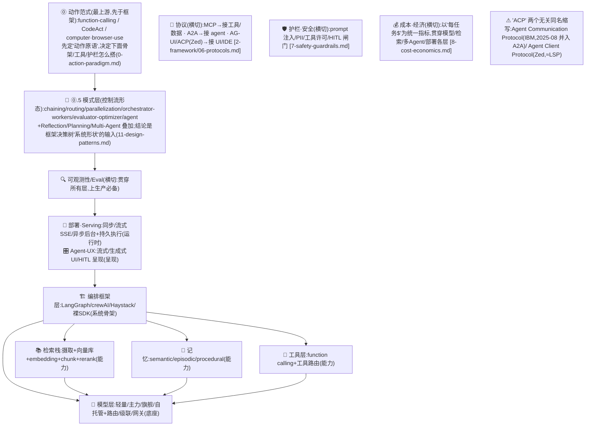
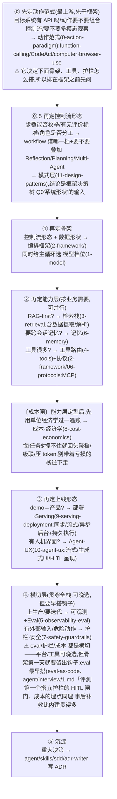

# AI Agent 架构选型矩阵(总览)

> **用途**:一张总图,把所有"选型决策资产"按**层**串起来。做 Agent 架构设计时,从这里出发,按需进对应的层级决策包。
> **适用**:Spec-Kit `/plan` 阶段的总入口;或直接调 `stack-selector` skill 由它路由。**全流程(idea→上线,constitution→implement)见姊妹篇 [`spec-kit-workflow.md`](spec-kit-workflow.md)**,或调 `sdd-architect` skill 按阶段驱动。
> **最后核对:2026-06**。
> **核心理念**:"AI Agent 架构选型"不是一个决策,而是**横跨多层的一组平行决策**。每层独立选、各有备选,最后拼成完整技术栈。

---

## 一、选型地图(核心六层 + ⓪上游动作范式 + 运行时 + 横切带)

> **⓪ 上游(先于本表):动作范式** —— [`0-action-paradigm.md`](0-action-paradigm.md)。最上游分叉,**先于编排框架定"动作原语"**(function-calling / CodeAct / computer·browser-use)。它决定下面骨架、工具、护栏怎么搭,所以放在选型地图之前先问。

| 层 | 决策什么 | 决策资产 | 触发时机 | 课程 |
|---|---|---|---|---|
| 🧠 **模型层** | 用哪个 LLM(每个节点)+ **路由/级联/网关** | [`1-model.md`](1-model.md) | 新建任何 LLM 节点 | 02 |
| 🧬 **模式层(控制流形态)** | 多步任务怎么组织:workflow 谱哪一档 + Reflection/Planning/Multi-Agent 叠加 | [`11-design-patterns.md`](11-design-patterns.md) | 定骨架前(⓪之后、框架前) | 08,11 |
| 🏗️ **编排框架层** | 用哪个框架/SDK 编排 | [`2-framework/`](2-framework/) | 定系统骨架时 | 11,13,25,07,09 |
| 📚 **检索栈层** | **数据摄取/解析** + 向量库/embedding/chunking/retriever/进阶方法/GraphRAG/RAG框架 | [`3-retrieval.md`](3-retrieval.md) | RAG/知识检索类 | 04,05,06,18 |
| 🔧 **工具层** | 100+ 工具如何路由选对 | [`4-tools.md`](4-tools.md) | 工具规模大时 | 09,10 |
| 🔍 **可观测/Eval 层** | **trace 怎么产生(埋点层/后端分层)** + tracing 平台 + eval 方案 + **prompt/agent 版本化** | [`5-observability-eval.md`](5-observability-eval.md) | 上生产/要迭代(横切) | 21,24,05 |
| 🧩 **记忆层** | 记忆类型/更新模式/控制权(三派光谱)/存储 + 组合参考架构 | [`6-memory.md`](6-memory.md) | 要跨会话记忆时 | 12,12a,12b |
| 🚀 **部署·Serving 层** | 运行形态(同步/流式/异步后台)+ 持久执行 | [`9-serving-deployment.md`](9-serving-deployment.md) | demo→产品、上线时 | — |
| 🎛️ **Agent-UX 层** | 呈现层(流式 / 生成式 UI / HITL 呈现) | [`10-agent-ux.md`](10-agent-ux.md) | 有人机界面时 | — |

> **正交横切带(不占某一层,贯穿所有层)——可晚选,但要早搭:**
> - 🔌 **协议**:与上面所有层正交,作为加分项叠加、不单列选型。2026 参考架构两层:**MCP 接工具/数据 + A2A 接 agent**。⚠️ "ACP" 是两个**毫无关系**的同名缩写——① **Agent Communication Protocol**(IBM/BeeAI,agent↔agent)已于 **2025-08 并入 A2A**(归 Linux Foundation/AAIF);② **Agent Client Protocol**(Zed,编辑器/IDE↔编程 agent,≈LSP)独立活跃。集中决策页见 [`2-framework/06-protocols.md`](2-framework/06-protocols.md)。
> - 🔍 **可观测/Eval**(即上表行,本质横切):tracing + eval,见 [`5-observability-eval.md`](5-observability-eval.md)。
> - 🛡️ **护栏·安全**:prompt 注入 / PII / 工具许可 / HITL 闸门(运行时拦这一次),见 [`7-safety-guardrails.md`](7-safety-guardrails.md)。
> - 🏛️ **治理·Governance**:两件套 = 控制面(访问/血缘/审计/编目,如 Unity Catalog)+ 生命周期(资产出身/版本,如 MLflow),与运行时护栏正交。见 [`7-safety-guardrails.md#七`](7-safety-guardrails.md)(存根,待扩 `12-governance.md`;深层归属 nfr-standard)。
> - 💰 **成本·单位经济学**:以"每任务美元成本"为统一指标贯穿各层,见 [`8-cost-economics.md`](8-cost-economics.md)。
>
> 三条横切带与 [`../../interview/1.md`](../../interview/1.md) «正交横切带 A·协议 / B·度量观测 / 成本·HITL·确定性 横切线» 对齐。

---

## 二、架构分层图

> **图注**:本图与 [`../../interview/1.md`](../../interview/1.md) «Agent 开发全栈五层 + L0 模型底座 + 横切带 A/B» **同构**——⓪动作范式 ≈ L1 的 action 范式谱;🚀部署/🎛️Agent-UX ≈ L5 部署·安全运行时;🔌协议/🛡️护栏/💰成本三条横切带 ≈ 横切带 A·协议 + 「成本·HITL·确定性」横切关注点。两套是"选什么(本矩阵)"与"怎么想(五层心智模型)"两种切法,不矛盾。

---

## 三、一次完整选型的推荐顺序

不是所有层一起拍,有先后依赖:

> ⚠️ **每层都要有备选**(哪怕是"先不做/裸 SDK 起步")。**从最轻方案起步,复杂度真的到了再升级**——过早上重栈是 Agent 项目最常见的过度工程。

---

## 四、怎么用

- **全流程(新项目 kickoff)**:按 [`spec-kit-workflow.md`](spec-kit-workflow.md) 走 constitution→specify→plan→tasks→implement 全生命周期;或调 `sdd-architect` skill 由它定位阶段、按段驱动。
- **快速、交互式**:调 `stack-selector` skill —— 它识别你要选哪几层,逐层跑决策流,最后汇总成一份带备选+理由的选型小结。
- **手动 / 在 plan 里**:按本表进对应层的决策包,每个包都有"接入 Spec-Kit"的可复制 prompt 块。
- **沉淀**:定下后用 `agent/skills/sdd/adr-writer` 把"为什么选 X 不选 Y"写成 ADR。

---

## 五、资产清单

| 资产 | 层 | 形态 |
|---|---|---|
| `agent/skills/agent-selection/0-action-paradigm.md` | ⓪ 动作范式(上游) | 单文件包 |
| `agent/skills/agent-selection/1-model.md` | 模型(含路由/网关) | 单文件包 |
| `agent/skills/agent-selection/2-framework/` | 编排框架 | 多文件包(决策树/评分卡/画像/场景/集成/协议) |
| `agent/skills/agent-selection/2-framework/06-protocols.md` | 协议(横切) | 子页(MCP/A2A + 两个 ACP 消歧) |
| `agent/skills/agent-selection/3-retrieval.md` | 检索栈(含数据摄取) | 单文件包 |
| `agent/skills/agent-selection/4-tools.md` | 工具 | 单文件包 |
| `agent/skills/agent-selection/5-observability-eval.md` | 可观测/Eval(横切) | 单文件包 |
| `agent/skills/agent-selection/6-memory.md` | 记忆 | 单文件包 |
| `agent/skills/agent-selection/7-safety-guardrails.md` | 护栏·安全(横切) | 单文件包 |
| `agent/skills/agent-selection/8-cost-economics.md` | 成本·单位经济学(横切) | 单文件包 |
| `agent/skills/agent-selection/9-serving-deployment.md` | 部署·Serving | 单文件包 |
| `agent/skills/agent-selection/10-agent-ux.md` | Agent-UX 呈现 | 单文件包 |
| `agent/skills/agent-selection/11-design-patterns.md` | 🧬 模式(控制流形态) | 单文件包 |
| `agent/skills/agent-selection/spec-kit-workflow.md` | 全流程总纲(时间轴,README 姊妹篇) | 流程文档 |
| `agent/skills/sdd/sdd-architect/` | 全流程编排 | skill(kickoff 入口) |
| `agent/skills/sdd/stack-selector/` | 路由 | skill(plan 阶段总入口) |
| `agent/skills/sdd/framework-selector/` | 编排框架 | skill |
| `agent/skills/sdd/adr-writer/` | 沉淀 | skill |

> 维护:各包结论为 2026-06 快照,Agent 生态迭代快,建议 6 个月复核;新增层时回填本表。
