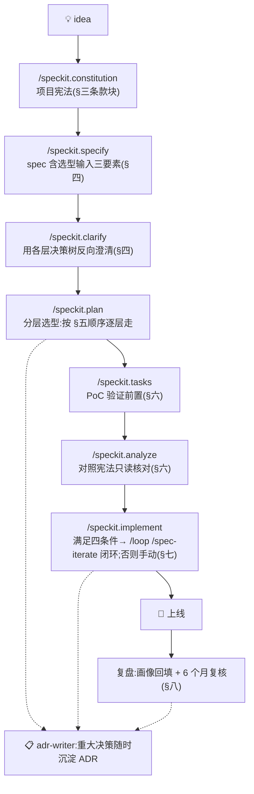

# Spec-Kit 驱动 Agent 项目研发总纲(idea → 上线全流程)

> **用途**:一个新项目从 idea 到上线,`constitution → specify → clarify → plan → tasks → analyze → implement` 每一步用哪个决策包 / skill / 命令。**README 是"选型地图"(空间:选什么),本文是"研发流程"(时间:什么时候选)**。
> **适用**:新项目 kickoff;或由 `sdd-architect` skill 交互式驱动(它以本文为唯一地图)。
> **最后核对:2026-06**。Spec-Kit 命令名(`/speckit.*`)以官方为准,变了以官方为准。
> **关系**:框架层的 Spec-Kit 接入专文是 [`2-framework/05-spec-kit-integration.md`](2-framework/05-spec-kit-integration.md)(本文引用不复制);执行循环机制详见 `loop-engineering/README.md`(手搓同构沙盒);各层决策包自带的"接入 Spec-Kit prompt 块"是零件,本文是装配线。

---

## 一、全景图



---

## 二、阶段 × 资产映射表(本文核心)

| 阶段 | 命令 | 用什么资产 / skill | 产出 |
|---|---|---|---|
| 项目落地 | `specify init . --ai claude` | [`projects/README.md`](../../../projects/README.md) 约定(仓库根 `projects/<name>/`) | 项目骨架 + `.specify/` |
| 宪法 | `/speckit.constitution` | 本文 §三条款块;框架层专属条款 → [`2-framework/05`](2-framework/05-spec-kit-integration.md) §二 | `constitution.md` |
| 规格 | `/speckit.specify` | 选型输入三要素写进 spec(§四) | `spec.md` |
| 澄清 | `/speckit.clarify` | 各层决策包的决策树关键问题反向澄清(§四) | 补齐约束的 spec |
| 计划 | `/speckit.plan` | **按 §五顺序逐层选型**;交互式走 `stack-selector` skill | `plan.md`「技术选型」小节 |
| 任务 | `/speckit.tasks` | §六:PoC 验证选型列前置任务 | `tasks.md` |
| 质量门 | `/speckit.analyze` | §六:对照宪法条款只读核对 | 一致性报告 |
| 实现 | `/speckit.implement` | §七:Loop Engineering 四件套 + `/spec-iterate` | 代码 + 勾掉的 tasks |
| 沉淀 | (随时) | `agent/skills/sdd/adr-writer`;新框架画像回填 [`2-framework/03`](2-framework/03-framework-profiles.md) | ADR / 更新的画像 |

---

## 三、constitution:项目宪法条款块(可粘贴)

把下面这段放进项目 `constitution.md`(全层通用版;框架层专属 6 条见 [`2-framework/05`](2-framework/05-spec-kit-integration.md) §二,两者可并用):

```markdown
## Agent 架构原则(全层)

1. **选型不拍脑袋**:每层选型走 agent/skills/agent-selection/ 对应决策包的决策流,
   顺序按其 README §三(⓪动作范式 → ⓪.5 控制流模式 → ①框架+模型 → ②能力层 → 成本闸 → ③上线形态 → ④横切)。
2. **每层 ≥1 个备选**(备选可以是"先不做 / 裸 SDK 起步");没有备选的选型不是选型,是默认。
3. **最轻起步**:从能解决问题的最轻方案起步;每次升级(上框架/上多 agent/上循环)需给出"复杂度已到"的证据。
4. **eval 钩子第一天留**:骨架里从第一天起给 eval 留位(eval-as-code);护栏的 HITL 闸门、成本埋点同理——
   平台可晚选,钩子要早搭,事后补建比内建贵得多。
5. **成本闸**:能力层定型后先用"每任务 $"过账(8-cost-economics);撑不住就降档/级联/压 token,不带亏损栈往下走。
6. **重大决策必 ADR**:跨 feature / 影响架构的选型用 adr-writer 沉淀,含"为什么不选 X"与复核触发条件。
7. **MCP 优先**:工具/数据接入优先走 MCP,与编排框架解耦。
8. **自动循环红线**:架构决策、支付、密钥/权限变更不进自动 implement 循环;独立验收不自评。
```

---

## 四、specify + clarify:把选型输入写进 spec

**specify**:spec 里必须含**选型输入三要素**——后面每层决策包都吃这三样:

1. **业务一句话**:这个 Agent/系统要干什么;
2. **数据特征**:形态(非结构化/结构化/流式/多模态)、规模、更新频率、语言;
3. **关键约束**:成本上限、延迟要求、团队熟悉度、合规/数据出域红线、是否接受绑定厂商。

**clarify**:约束写不清时,用各层决策树的关键问题**反向澄清**——例如:
"目标系统有没有 API?"(→ [`0-action-paradigm.md`](0-action-paradigm.md))、"步骤能否预先枚举?"(→ [`11-design-patterns.md`](11-design-patterns.md))、"要不要跨会话记忆?"(→ [`6-memory.md`](6-memory.md))、"谁改 prompt、要不要灰度?"(→ [`5-observability-eval.md`](5-observability-eval.md) 子决策 3)。答不上来的问题就是 spec 的缺口。

### rubric 方法论:验收标准怎么写才可判定

> **为什么在这里**:整条流水线的质量上限卡在这一步——spec 里的验收标准(rubric)写得不可判定,后面 implement 循环的"独立验收"就形同虚设。**验收标准在 specify 阶段一次写清,plan/tasks 阶段只引用、不新发明**(否则标准漂移,analyze 门就核不住)。

**每条验收标准必须能回答三问:谁来判、怎么判、判据是什么。** 按可判定性分三档,写的时候给每条标上档位:

| 档 | 谁判 | 形式 | 去处 |
|---|---|---|---|
| **机器判** ⭐能这档就这档 | 测试/脚本 | pytest 断言、schema 校验、正则、`验收: <命令>` | 进 `gate.sh` / 验收测试,可入自动循环 |
| **LLM 判** | 独立验收 agent | 一段可执行的 rubric 文本(给全新上下文的 judge,只回 PASS/FAIL) | 进 `/spec-iterate` 的独立验收,可入循环 |
| **人判** | 用户本人 | 写清**具体检查动作**("打开 X 页面,输入 Y,应看到 Z") | **不进自动循环**,列为 HITL 检查项 |

**写法模板**(每条一行,输入→期望输出,别写形容词):

```markdown
- [机器判] 输入 <具体输入> → 输出满足 <断言/schema>。验收: `pytest tests/test_x.py::test_y`
- [LLM 判] 给定 <场景>,输出应 <可核对的性质,如"引用了检索到的至少 2 篇文档且无编造 URL">
- [人判]   打开 <页面/命令>,执行 <动作>,应看到 <具体现象>
```

**质检四条**(写完 spec 自查):
1. **无形容词红线**:出现"正确/优雅/良好/提升体验"即打回——改写成具体输入→期望输出("P95 < 800ms"而不是"响应快")。
2. **每个 task 至少 1 条机器判**;一条机器判都提不出来的 task,先怀疑 task 拆得不对,再怀疑它是否该进自动循环。
3. **Agent 类 feature 别只写终点**:除 task 级(端到端完成率)外,给关键路径加 trajectory 级标准(选对工具没/绕路没),分层见 [`5-observability-eval.md`](5-observability-eval.md) §四"4 层评估"。
4. **LLM 判的 rubric 要能独立执行**:把 rubric 单独发给一个没有上下文的人/模型,他能仅凭 rubric + 产出物给出 PASS/FAIL,才算合格(这正是 `/spec-iterate` 独立验收的运行方式——验收者看不到实现过程)。

> 与 eval 的接续:这些 rubric 就是第一批 golden case 的雏形——上生产后按 [`5-observability-eval.md`](5-observability-eval.md) 把它们演化成 eval 数据集(当代码管、版本化),失败 trace 回流补充。specify 写 rubric ≈ 在给未来的 eval 体系打地基。

---

## 五、plan:按推荐顺序逐层选型

顺序与 [`README.md`](README.md) §三一致(有先后依赖,不是全层一起拍):

| 步 | 选什么 | 决策包 | skill |
|---|---|---|---|
| ⓪ | 动作范式(动作原语) | [`0-action-paradigm.md`](0-action-paradigm.md) | stack-selector |
| ⓪.5 | 控制流形态(+Reflection/Planning/Multi-Agent 叠加) | [`11-design-patterns.md`](11-design-patterns.md) | stack-selector |
| ① | 编排框架(形态是其决策树 Q0 的输入)+ 主循环模型档位 | [`2-framework/`](2-framework/)、[`1-model.md`](1-model.md) | **framework-selector**(框架)/ stack-selector(模型) |
| ② | 能力层按需:RAG → 检索栈;跨会话 → 记忆;工具多 → 工具路由 + MCP | [`3-retrieval.md`](3-retrieval.md)、[`6-memory.md`](6-memory.md)、[`4-tools.md`](4-tools.md) + [`2-framework/06`](2-framework/06-protocols.md) | stack-selector |
| 〔闸〕 | 单位经济学过账:"每任务 $"撑不住就回头降档 | [`8-cost-economics.md`](8-cost-economics.md) | stack-selector |
| ③ | 上线形态:同步/流式/异步后台;有人机界面 → UX | [`9-serving-deployment.md`](9-serving-deployment.md)、[`10-agent-ux.md`](10-agent-ux.md) | stack-selector |
| ④ | 横切钩子:可观测+eval;有外部输入/危险动作 → 护栏 | [`5-observability-eval.md`](5-observability-eval.md)、[`7-safety-guardrails.md`](7-safety-guardrails.md) | stack-selector |

**可复制的 plan 阶段总 prompt 块**:

```
请按 agent/skills/agent-selection/spec-kit-workflow.md §五 的顺序,为本项目做分层技术选型。
输入(来自 spec.md):业务一句话 <…> | 数据特征 <…> | 关键约束 <…>
要求:
1. 只覆盖本项目实际需要的层(别强行全层来一遍);每层给 首选+备选+理由+已知代价+复核触发条件。
2. 框架层用 2-framework/ 的 3 步流程(决策树→评分卡→场景验证),或直接调 framework-selector skill。
3. 能力层定型后按 8-cost-economics 过一遍"每任务 $"账。
4. 结论写进本 feature plan.md 的「技术选型」小节(长表进文件不刷屏);项目级重大决策提示用 adr-writer。
```

> 交互式替代:直接说「使用 stack-selector 帮我做整体选型」,它会路由各层并汇总。

---

## 六、tasks + analyze:验证前置与质量门

- **tasks**:把"**PoC 验证选型**"列为实现前置任务——选型结论里任何 ⚠️快照级判断(框架能力、平台限额、延迟数字)都值得一个小 PoC 任务先验证,再往下铺代码。
- **analyze**:只读质量门。对照 §三宪法条款逐条核对 spec/plan/tasks:每层选型有没有备选?升级有没有证据?eval/护栏钩子留了没?"每任务 $"过账了没?**验收标准过 §四 rubric 质检四条了没(无形容词/每 task 至少 1 条机器判/agent 类有 trajectory 级/LLM rubric 可独立执行)?**

---

## 七、implement:接 Loop Engineering 执行闭环

四件套(机制详见 `loop-engineering/README.md`,手搓同构沙盒可先练手):

| 件 | 是什么 |
|---|---|
| 状态文件 | `specs/<feature>/tasks.md`——任务队列(`[ ]` 未做 / `[x]` 已验收 / `[!]` 阻塞交人) |
| 门控 | `gate.sh` + 验收测试(客观 pass/fail) |
| 执行器 | `/spec-iterate <特性目录>`——单步:实现 → 门控 → **独立验收子 agent**(全新上下文,禁止自评)→ 回写勾选 + commit |
| 自动化 | `/loop /spec-iterate <特性目录>`(交互式)或 `loop_runner.py`(Claude Agent SDK,可部署) |

**上循环四条件**(缺任一条,循环成本 > 收益,改为手动 `/spec-iterate` 单步推进或直接实现):
① 任务每周重复;② 有自动门控;③ token 预算扛得住;④ Agent 有日志和可跑环境。

**红线**(同宪法第 8 条):架构决策、支付、密钥/权限变更不进自动循环;独立验收不自评;attempted ≥ 4 且接受率 < 0.5 → 停下来交人。

---

## 八、沉淀与复盘

- **重大决策 → ADR**:`agent/skills/sdd/adr-writer`(跨项目放 `agent/roadmap/adr/`,项目内放 `projects/<name>/docs/adr/`)。
- **经验回填**:实践中发现的新框架/新坑,回填 [`2-framework/03-framework-profiles.md`](2-framework/03-framework-profiles.md) 画像与各包场景表。
- **时效复核**:各决策包结论为带日期快照,超 6 个月复核;implement 中发现选型失效即触发"复核触发条件",回 plan 重走对应层。

---

## 九、项目落地位置约定

真实项目放仓库根 `projects/<name>/`,用官方 `specify init . --ai claude` 初始化(不要手搓 `.specify/`,沙盒除外)。项目级 ADR 放 `projects/<name>/docs/adr/`。详见 [`projects/README.md`](../../../projects/README.md)。

---

## 十、相关资产清单

- 空间地图:[`README.md`](README.md)(选型矩阵总览,本文的姊妹篇)
- 交互式入口:`agent/skills/sdd/sdd-architect/`(全流程编排 skill,以本文为地图)、`agent/skills/sdd/stack-selector/`(plan 阶段跨层选型)、`agent/skills/sdd/framework-selector/`(框架层)
- 层级专文:[`2-framework/05-spec-kit-integration.md`](2-framework/05-spec-kit-integration.md)(框架层 × Spec-Kit)
- 执行闭环:`loop-engineering/README.md`(四件套沙盒)、`.claude/commands/spec-iterate.md`(单步执行器)
- 沉淀:`agent/skills/sdd/adr-writer/`
- 课程回溯:`agent/courses/00-Agentic Coding 工作流实战/module-2-spec-driven/`(SDD 方法论)

> **最后核对:2026-06**
