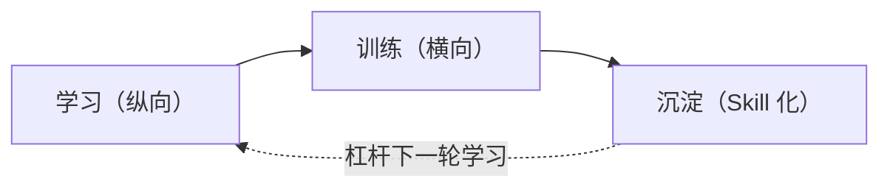

# 把架构师能力蒸馏成 Skill —— 可行性分析与落地策略

> **作者构想**：Ming
> **整理时间**：2026-05-09
> **背景**：在 24 周 AI Agent 学习路线图推进中，提出 "把架构师能力封装为 skill，由 LLM 调用以复现架构能力" 的设想，本文整理该想法的可行性分析与落地路径。

---

## 一、原始想法

> **"如果把架构师的所有能力都做成 skill，那 LLM 通过调用 skill 不就具备架构师的能力了吗？"**

这个想法的本质是：**用"知识的外置 + LLM 的通用推理"组合，复现一个由人脑承载的复杂角色能力**。

类比：
- 程序员 + IDE + Linter + LSP = 比裸写代码更强
- 架构师 + Skill 库 + LLM = 是否能复现/超越架构师本身？

这是一个值得严肃论证的问题，不能简单用 "AI 不能替代人" 一句话打发。

---

## 二、可行性分级：能力的"可蒸馏度"

不是所有架构师能力都同质。按 "能否用 skill + LLM 复现" 拆为三档：

| 档位 | 能力类型 | 蒸馏度 | 例子 |
| --- | --- | --- | --- |
| 🟢 **高** | **程序性知识 / 模板 / SOP** | 80-95% | ADR 写作、Eval 管道搭建、Prompt Cache 配置、OWASP LLM 自查、设计文档骨架、成本测算公式 |
| 🟡 **中** | **决策框架（需要上下文输入）** | 50-70% | "Agent vs Workflow"、"Fine-tune vs RAG"、"框架选型"——skill 提问→用户回答→输出推荐 |
| 🔴 **低** | **品味 / 横切整合 / 创新设计** | 10-30% | "这个设计是否过度工程"、"Eval 严苛与 Cost 预算的取舍"、前所未见的业务建模 |

### 关键观察

架构师日常工作中：
- 🟢 绿档约占 **60%**
- 🟡 黄档约占 **30%**
- 🔴 红档约占 **10%**

→ **"用 skill 库覆盖架构师 70-80% 的日常工作"在技术上可行**。
→ 剩余 20-30% 才是真正区分初/中/高架构师的部分（也是架构师不可被完全替代的护城河）。

---

## 三、四个失效模式（Skill 化会"破"在哪里）

不是抽象的"AI 替代不了人"，而是具体的工程难题：

### ① Skill 冲突仲裁问题
- Eval skill 说："加 50 条测试集才算合格"
- Cost skill 说："预算只够 100 美元/月，砍 token"
- **冲突时谁赢？取决于业务场景，但 skill 本身不知道场景**

→ 需要"上下文层"传入业务参数；但参数本身的定义又是架构师工作。

### ② Skill 路由问题
- 用户问："我这个 RAG 系统该不该接 fine-tuning？"
- 应该调哪个 skill？`fine-tuning-vs-rag` / `rag-architecture` / `cost-analyzer`？
- LLM 能做路由但准确率有上限（实测约 70-85%）
- 路由错了，答案就跑偏

### ③ Skill 的知识时效问题
- 2026-05 的 best practice，到 2026-11 可能就变（LangGraph 升 2.0、MCP Apps 替代 MCP-UI）
- **谁负责更新？版本化？回归测试？**
- 这是工程问题，不是 LLM 问题——但被很多人低估

### ④ 鸡生蛋 / 蛋生鸡
**写出高质量 skill 的人，本身就得是架构师。**
- 不是架构师 → 写出的 skill 质量低 → LLM + 烂 skill ≠ 架构师
- 已经是架构师 → 写 skill 是知识沉淀，不是"获得能力"

---

## 四、那这条路的真正价值在哪？

**不是 "造一个全能架构师 AI"**——那条路在当前 LLM 能力下走不通。
**而是三个被验证可行的真实价值**：

### 💎 价值 A：个人知识复利器
- 学每个 Project 时，把可复用模式提炼成 skill
- **半年后："你 + 你的 skill 库" > "半年前没有 skill 库的你"**
- 这是 24 周学习的**最佳产出形式**：比博客更结构化、可执行
- 副作用：你被迫结构化隐性知识，反过来加速你成长为真正的架构师

### 💎 价值 B：团队能力放大器
- 组里的高级架构师写 skill
- 初级工程师 + skill 库 ≈ 中级工程师产出（在熟悉场景下）
- **这正是企业 AI 平台的真实商业价值**
- 参考：Cursor、Devin、Anthropic Agent SDK 都是这个逻辑

### 💎 价值 C：领域特化的架构 Copilot
- 通用"架构师 AI"做不出来
- 但 **垂直领域 Copilot 完全可行**：
  - "金融行业 RAG 架构 Copilot"
  - "医疗合规 Agent 设计 Copilot"
- 因为垂直领域有：**模式收敛 + 约束明确 + 红线清楚**

---

## 五、可执行落地路径

⚠️ **不要陷入"造一个全能架构师 skill 库"的陷阱**。建议反过来：从模板类做起，逐步上升到元能力。

### Phase 1（第 1-8 周）：沉淀 P0 模板类 Skill（8-10 个）

| Skill | 作用 | 难度 |
| --- | --- | --- |
| `adr-writer` | 生成 Architecture Decision Record | ⭐ |
| `design-doc-writer` | 生成系统设计文档骨架（仿 Google 风格） | ⭐⭐ |
| `eval-pipeline-bootstrap` | 给项目快速搭 eval 管道 | ⭐⭐ |
| `rag-eval-setup` | RAG 专属 eval（RAGAS 三指标） | ⭐⭐ |
| `cost-estimator` | 给定流量/模型/Prompt 估算月成本 | ⭐ |
| `owasp-llm-checklist` | OWASP LLM Top 10 自查 | ⭐⭐ |
| `prompt-cache-auditor` | 分析 Prompt 是否能命中 Cache，给优化建议 | ⭐⭐ |
| `tech-stack-comparator` | 给业务场景，对比 LangGraph / CrewAI / 自研 | ⭐⭐ |

**评估标准**：每个 skill 写完后必须用 ≥ 3 个真实场景验证。

### Phase 2（第 9-16 周）：加 P1 决策框架类 Skill（3-5 个）

| Skill | 作用 |
| --- | --- |
| `agent-vs-workflow-advisor` | 提问→答→推荐架构形态 |
| `model-router-designer` | 设计大小模型混用策略 |
| `framework-selector` | 多维度对比框架并推荐 |
| `rag-vs-finetune-advisor` | 给场景判断该用 RAG 还是微调 |

**特点**：这层 skill 必须**主动向用户提问**收集上下文，不能直接给答案。

### Phase 3（第 17-24 周）：实验 P2 元能力（1-2 个）

| Skill | 作用 |
| --- | --- |
| `trade-off-analyzer` | 给一份设计稿，列出隐含取舍与未答之问 |
| `architect-reviewer` | 跑四条横切线（Eval/Cost/Security/Observability）做架构 Review |

**特点**：这层是 skill 的"meta 层"——不是给方案，而是检查方案。

### 🧪 验证实验（第 24 周毕业）

> **设计一个对照实验**，把这个想法落到实证：

让 Claude 用你的完整 skill 库，在**一个全新场景**下做完整架构设计：

| 对照组 | 输入 | 产出 |
| --- | --- | --- |
| A. Claude 裸跑 | 业务需求 | 设计文档 + 架构图 |
| B. Claude + 你的 skill 库 | 同样需求 | 设计文档 + 架构图 |
| C. 你自己做 | 同样需求 | 设计文档 + 架构图 |

**评估**：让 1-2 位真实架构师盲评打分。
**输出**：一篇博客《我用 Skill 蒸馏架构师能力的实证报告》——这本身就是顶级求职作品。

---

## 六、反直觉结论：过程比产物更值钱

> **蒸馏 skill 的过程本身，比 skill 的最终产物更有价值。**

因为这个过程强制你做三件事：

1. **结构化隐性知识**——这是高级工程师 → 架构师的必经之路
2. **定义边界、接口、输入输出**——这就是架构师思维
3. **把"我觉得"翻译成"判定规则"**——这就是工程师到架构师的认知升级

所以这个想法不仅**可行**，而且**应该做**——但要换一个心智模型：

> ❌ "用 skill 替代我成为架构师"
> ✅ "用 skill 训练我 + 杠杆我，让我成为更高维度的架构师"

---

## 七、与现有学习路线图的关系

| 文件 | 角色 |
| --- | --- |
| `roadmap/AI-Agent-学习路线图-完整版.md` | **纵向**：技术栈分阶段（带横切 Checklist） |
| `roadmap/AI-Agent-架构师专项路线图.md` | **横向**：四条横切线 + 架构师交付物 |
| `架构师能力Skill化-可行性与策略.md`（本文） | **元层**：把上面两条路线产出的能力，沉淀为可复用 Skill 库 |

**三者关系**：

每完成一个 Project，按以下顺序产出：
1. 代码 + 测试（主 Roadmap）
2. 横切 Checklist（架构师 Roadmap）
3. **可复用 Skill ≥ 1 个**（本策略）
4. 博客或 ADR（架构师交付物）

---

## 八、立即可做的第一步

**今天就启动**：从最有杠杆的一个 skill 开始。

推荐**二选一**：

### 🥇 选项 A：`adr-writer`（推荐新手）
- **原因**：这是元能力——后面所有项目都用它产出 ADR
- **复杂度**：低，1-2 小时可完成 v1
- **复利效应**：高，立即被后续 10 个项目复用

### 🥈 选项 B：`eval-pipeline-bootstrap`
- **原因**：横切线 ① Eval 的实操起点，所有项目验收 Checklist 都依赖它
- **复杂度**：中，4-6 小时完成 v1
- **复利效应**：极高，是后续 RAG / Agent / Multi-Agent 项目的基础设施

**建议**：选 A 先跑通 skill 写作流程，再用 B 验证横切线落地。

---

## 九、风险与边界（自我提醒）

写在最后，作为对自己的警示：

| 风险 | 应对 |
| --- | --- |
| **过度沉迷造工具，不做项目** | 强约束：每写一个 skill，必须立刻在一个真实项目里用过 |
| **Skill 越写越多，自己却没成长** | 每月复盘：哪些 skill 是"沉淀"，哪些是"逃避思考"？ |
| **Skill 过期失效** | 每个 skill 标版本号 + 最后验证日期，> 6 个月未验证则强制 review |
| **以为 LLM + Skill = 架构师** | 持续做"裸跑测试"——定期不用 skill 做一次架构设计，确认自己仍在成长 |

---

## 十、给未来自己的话

> 当你回看这份文档时，你应该已经至少：
> - 沉淀了 ≥ 10 个 skill
> - 在 ≥ 3 个真实项目里验证过它们
> - 跑过至少一次"裸跑 vs Skill 增强 vs 自己做"的对照实验
>
> 如果你做到了——你不只是个会用 LLM 的工程师，
> 你是**正在用第一性原理重新定义"架构师能力"承载形式**的探索者。
>
> 这件事的终极价值，不在于产出多少 skill，
> 而在于：**当你回头看，你看到的是一个完全不同认知层级的自己。**
